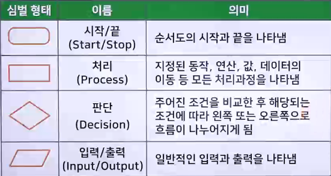
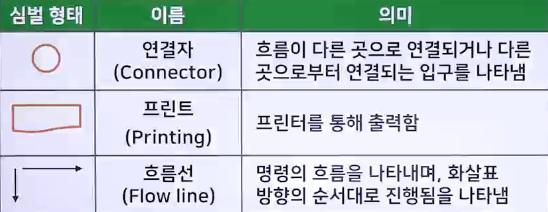
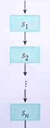
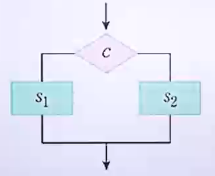
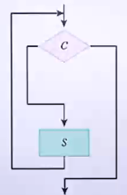

# 알고리즘의 표현방법

## 소프트웨어 개발

- 소프트웨어 개발 : 소프트웨어 기능 정의(요구사항 분석), 설계, 프로그래밍, 테스트, 유지보수
- 프로그램 개발 : 기능을 만들기 위한 개발, 설계(알고리즘), 코딩
- 코딩 : 컴퓨터가 실행할 수 있도록 절차와 규칙에 맞게 코드를 작성

## 알고리즘의 표현 방법

1. 자연어
   - 인간의 언어로 표현하며 가장 표현하기 쉬운 방법
2. 순서도
   - 컴퓨터로 처리해야 할 작업 과정을 약속된 기호를 사용하여 순서대로 그림으로 표현
   - 표준 기호로 박스와 연결선으로 표현한 도표는 프로그래밍 과정에서 프로그램의 설계도의 역할을 담당
   - 순서도를 바탕으로 명확하고 논리적인 프로그램을 작성할 수 있음
   - 알고리즘의 이해와 추적이 쉬움
   - 문제 처리의 과정의 논리적 파악이나 에러 검색이 쉬움
   - 작업의 흐름을 도표로 표시하므로 이해하기 쉬움
   - 심벌의 형태, 이름, 의미를 이용하여 표현하며, 국제 표준이 있음
   - 
   - 
   - 순서도의 3가지 표현방법
     1. 순차형 : 동작을 순서에 따라 차례로 실행
        - 
     2. 선택형 : 조건에 맞는 동작 하나를 선택하여 실행
        - 
     3. 반복형 : 정해진 조건에 도달할 때까지 반복적인 동작을 수행(loop)
        - 
3. 의사코드 (수도코드 - Pseudo Code)
   - 컴퓨터 공학에서 알고리즘이나 자료구조를 표현할 때 사용
   - 정형화된 문법적 측면을 배제하고 사고의 흐름을 간결하고 효과적으로 전달하는 표현 방법
   - 특정 프로그래밍 언어와 관계없이 논리의 명시를 위해 작성
   - 일반적인 언어로 코드를 흉내 내어 알고리즘을 표현
4. 프로그래밍 언어
   - 컴퓨터가 수행할 수 있는 명령어들의 집합
   - 각 언어마다 문법적 특징과 사용법이 다름
   - 전문적 지식이 필요함

### 응용프로그램 추천

1. Flowgorithm
   - 순서도 제작 응용 프로그램
   - www.flowgorithm.org
2. Oven
   - 프로토타입 제작 응용 프로그램
   - ovenapp.io
