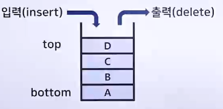
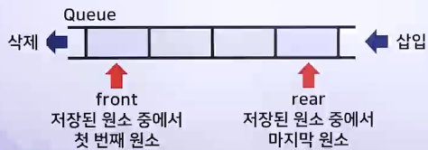
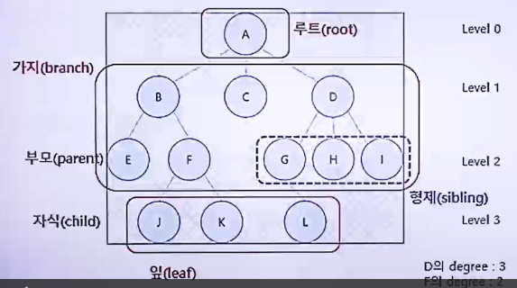

# 자료구조와 알고리즘

## 자료구조의 종류와 특징

> 자료구조 : 컴퓨터 과학에서 효율적인 접근 및 수정을 효과적으로 하기 위한 자료의 조직, 관리, 저장

- 테이터 값의 모임, 데이터간의 관계, 데이터에 적용할 수 있는 함수나 명령을 의미
- 메모리를 효율적으로 사용하기 위해 데이터에 맞는 자료구조의 선택이 중요
- 프로그램 설계 시 가장 먼저 고려되어야 함
- 프로그램의 성능에 직접적인 영향을 미침

### 자료구조의 종류

- 자료구조
  - 물리적
    - 단순구조
      - 정수
      - 실수
      - 문자
      - 문자열
  - 논리적
    - 선형구조
      - 순차 리스트
      - 연결 리스트
      - 단순 연결 리스트
      - 이중 연결 리스트
      - 원형 연결 리스트
      - 스택
      - 큐
      - 덱
    - 비선형구조
      - 트리
      - 일반 트리
      - 이진 트리
      - 그래프
      - 방향 그래프
      - 무방향 그래프
    - 파일구조
      - 순차 파일
      - 색인 파일
      - 직접 파일

1. 데이터 표현을 위한 자료구조
   - 단순구조
     - 정수, 실수, 문자, 문자열
2. 데이터 저장을 위한 자료구조
   - 선형구조
     - 한 종류의 데이터가 선처럼 길게 나열된 자료구조
   - 비선형구조
     - 선형 자료구조가 아닌 모든 자료구조
     - i번째 값을 탐색한 뒤의 i+1이 정해지지 않은 구조
3. 파일 저장을 위한 자료구조
   - 순차/색인/직접 파일

### 기본 자료구조

- 선형 자료구조

  - 배열
    - 각 원소들이 모두 같은 데이터 타입을 가짐
    - 각 원소의 물리적 순서(메모리 주소)가 논리적 순서(인덱스 번호)와 동일함
    - 첫 번째 원소의 메모리 주소로 다른 원소의 주소를 계산할 수 있음
    - 인덱스를 통해 직접 접근함 (어디로 접근하든 접근시간은 동일)
    - 삽입/삭제 시 많은 양의 데이터 이동이 필요
  - 연결 리스트
    - 데이터와 링크를 갖는 노드로 구성됨
    - 논리적 순서와 물리적 순서가 동일하지 않음
    - 데이터 삽입/삭제가 쉬움
    - 연결 리스트의 종류
      - 단일 연결 리스트
      - 단일 원형 연결 리스트
      - 이중 원형 연결 리스트
  - 스택(Stack)

    - 삽입/삭제가 한 쪽에서만 발생
    - LIFO(Last In First Out)
    - 
    - 배열로 구현하는 스택

      - 스택의 구조체
        - 용량
        - 최상위 노드의 위치
        - 노드 배열
      - ```c
          Typedef struct 스택_배열
          {
              int 용량; // 용량
              int 최상; // 최상위 노드의 위치
              Node* 노드 // 노드의 배열, Nodes 포인터는 자유 저장소에 할당한 배열의 첫 번째 요솔소를 가리킴
          }
        ```

    - 연결 리스트로 구현하는 스택
      - 스택의 구조체
        - 헤드노드의 위치
        - 최상위 노드의 위치
        - ```c
            Typedef struct 스택_연결리스트
            {
                 // 용량, 최상위 노드의 위치 인덱스가 필요 없음
                 Node* 리스트; // 자유 저장소에 존재하는 헤드 노드의 주소
                 Node* 최상위; // 자유 저장소에 존재하는 테일 노드의 주소
            } 스택_연결리스트
          ```
    - 큐(Queue)
      - 삽입과 삭제가 다른 쪽에서 발생
      - FIFO(Fist In Fist Out)
      - 선형 큐의 문제점(삭제 후 데이터의 위치이동 또는 삭제 후 공간 재사용 불가)으로 순환 큐로 구현함
      - 
      - 배열로 구현한 큐(순환 큐)
        - 큐의 구조체
          - 용량
          - 전단위치
          - 후단위치
          - 순환 큐 요소 배열에 대한 포인터
          - ```c
              Typedef struct 순환큐_배열
              {
                  int 용량; // 용량
                  int 전단; // 전단의 인덱스
                  int 후단; // 후단의 인덱스
                  Node* 노드; // 자유 저장소에 할당한 배열의 첫 번째 요소를 가리킴
              } 순환큐_배열
            ```

- 비선형 자료구조 (트리(Tree) & 그래프(Graph))
  - 노드(Node)와 간선(Edhe)으로 표현
  - 
  - 트리
    - 배열로 구현한 트리
      - 1차원 배열에 자신의 부모 노드만 저장
        - 트리는 부모 노드를 0개 또는 1개를 가지기 때문
        - 부모 노드가 0개 -> 루트 노드
      - 이진 트리의 경우, 2차원 배열에 자식 노드를 저장
        - 이진 트리는 각 노드가 최대 2개의 자식을 갖는 트리이기 때문
          - A[i][0] : 왼쪽 자식 노드
          - A[i][1] : 오른쪽 자식 노드
    - 연결 리스트로 구현한 트리
      - 이진 트리의 구조체
        - 왼쪽 자식을 가리키는 포인터
        - 오른쪽 자식을 가리키는 포인터
        - 저장 데이터 형식
        - ```c
            Typedef struct 트리_연결리스트
            {
                SBTNode* 왼쪽; // 왼쪽 자식
                SBTNode* 오른쪽; // 큐의 끝을 가리키는 포인터
                char data // 저장 데이터
            } 트리_연결리스트
          ```
  - 그래프

|   구분    |                           그래프                           |                   트리                   |
| :-------: | :--------------------------------------------------------: | :--------------------------------------: |
|   정의    | 노드와 그 노드를 연결하는 간선을 하나로 모아 놓은 자료구조 |             그래프의 한 종류             |
|  방향성   |                방향/무방향 그래프 모두 존재                |               방향 그래프                |
|  사이클   |         사이클 가능, 순환/비순환 그래프 모두 가능          |       사이클 불가능, 비순환 그래프       |
| 루트 노드 |                    루트 노드 개념 없음                     |           한 개의 노드만 존재            |
| 부모-자식 |                    부모-자식 개념 업음                     |              부모-자식 관계              |
|   모델    |                       네트워크 모델                        |                계층 모델                 |
| 간선의 수 |   그래프에 따라 간선의 수가 다름, 간선이 없을 수도 있음    | 노드가 N인 트리는 항상 N-1의 간선을 가짐 |

> 효율적인 알고리즘을 위해 알고리즘의 특징에 따라 자료구조를 선택하는 것이 중요하다.
