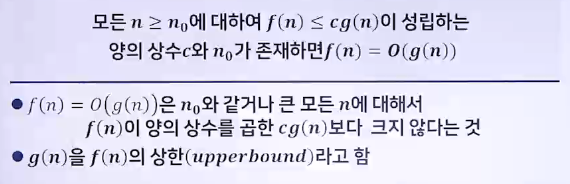
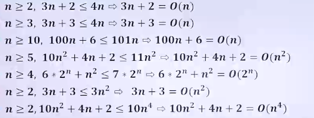
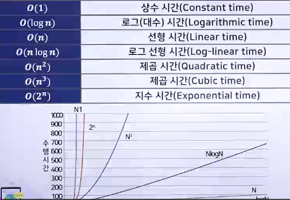
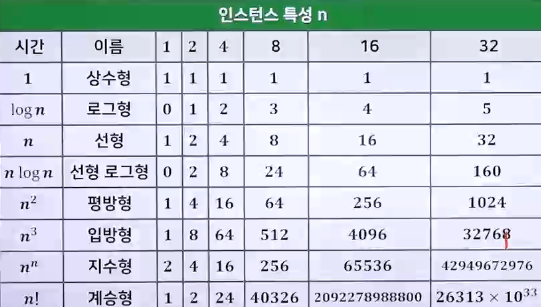

# 알고리즘 성능 분석 1

## 알고리즘 성능과 효율성

### 알고리즘의 요건 - 유한성

> 일정 시간 내에 반드시 종료되어야 함

- 최적화 문제의 해결 요선
  - 다항식 시간에 해를 찾을 것
  - 모든 입력에 대해 해를 찾는 것
  - 최적 해를 찾는 것

### 알고리즘의 생성단계 - 효율성 분석

- 설계
  - 하향식 설계
  - 상향식 설계
- 표현
  - 자연어
  - 순서도
  - 의사코드
  - 프로그래밍 언어
- 정확성 검증
  - 수학적 검증
- 효율석 분석
  - 공간 복잡도
  - 시간 복잡도

### 알고리즘의 성능과 효율성

> 알고리즘의 성능을 측정할 수 있는 기준 5가지

- 정확성
  - 정확한 동작, 입력에 대해서 몇 번을 수행해도 동일한 결과를 정확하게 출력
- 작업량
  - 적은 연산 수행, 수행해야 하는 작업의 양
- 메모리 사용량
  - 적은 메모리를 사용, 작업을 수행하는 데 필요한 메모리의 양
- 단순성
  - 알고리즘이 단순하게 정의되어 있는가
  - 컴퓨터가 이해하기에 복잡하지 않고 단순한가
- 최적성
  - 알고리즘이 최적화 되어있는가
  - 컴퓨터가 이해하는데 최적화 되어있는가

#### 알고리즘의 효율성

- 시간 복잡도(Time Complexity)
  - 알고리즘의 수행시간
  - 입력 값의 개수와 처리시간과의 관계
  - 입력 데이터의 양이 많아짐에 따라 처리 속도가 어떻게 변화하는지를 수학의 기호를 빌려 표현하는 방식
- 공간 복잡도(Space Complexity)
  - 알고리즘이 수행하는 동안 사용되는 메모리 공간의 크기
  - 입력 값의 개수와 메모리 증가량의 관계
  - 입력 데이터의 양이 많아짐에 따라 메모리 사용량이 어떻게 변화하는지를 수학의 기호를 빌려 표현하는 방식

## 알고리즘의 시간 복잡도

### 알고리즘 시간 복잡도의 의미

> 알고리즘이 실행되는 동안에 사용된 기본적인 연산의 횟수를 입력크기의 함수로 나타냄

- 기본 연산(Elementary Operation)
  - 데이터간의 크기 비교, 데이터 읽기 및 갱신, 숫자 계산 등 단순한 연산을 의미
- 알고리즘을 구성하는 명령어들의 실행 횟수(Frequency count)와 각 명령어의 실행시간(Execution time)을 함께 고려
- 각 명령어의 실행시간은 프로그래밍 언어나 하드웨어에 따라 달라질 수 있으므로 명령어의 횟수만을 고려함

### 알고리즘의 복잡도 표현 방법

- 최악의 경우 분석(Worst-case Analysis)
  > 빅오(Big(o)) 알고리즘 실행시간의 상한을 나타냄
  - 가장 안 좋은 경우에 걸리는 수행시간
  - 입력 데이터가 무한히 많아질 경우
  - 어떤 입력이 주어지더라도 알고리즘의 수행시간이 얼마 이상은 넘지 않는다는 의미
- 평균 경우 분석(Average-case Analysis)
  > 세타(θ) 최악과 최선 안에서 걸리는 수행 시간
  - 입력의 확률 분포를 가정하여 분석, 일반적으로 균등분포를 가정함
- 최선의 경우 분석(Best-case Analysis)
  > 오메가(Ω) 알고리즘 실행시간의 하한을 나타냄
  - 가장 좋은 경우에 걸리는 수행시간
    - 가장 운이 좋았을 때 또는 최적의 입력데이터일 경우

## 점근 표기법

### O(Big-O) 표기

- 
- 
- 자주 사용하는 O 표기 예
  - 
  - 

### 효율적인 알고리즘의 필ㄹ요성

> 효율적인 알고리즘은 슈퍼컴퓨터보다 더 큰 가치가 있다.

- 값 비싼 하드웨어 기술 개발보다 효율적인 알고리즘 개발이 더욱 경제적임
