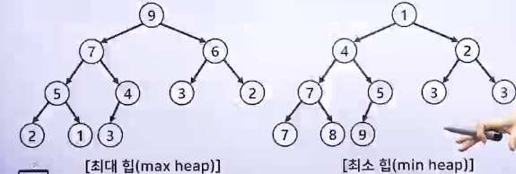
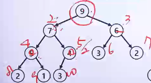
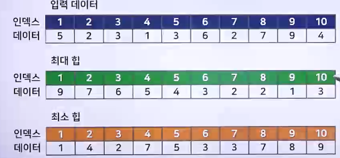
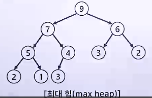
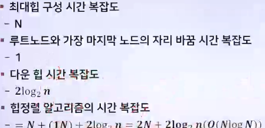

# 알고리즘 성능 분석 2

## 순차 탐색 알고리즘의 시간 복잡도

### 순서대로 탐색을 진행하는 알고리즘

- 배열 자료구조를 사용한 예
  - ```c
      for(i=0;i<len;i++){
          if(arr[i] == target)
                  return i // 찾은 대상의 인덱스 값 반환
      }
    ```
  - 연산횟수를 세어서 평가
    - <, ++, ==
  - 중심 연산자
    - == (<와 ++ 연산자는 == 연산자에 의존적임)
  - 최선의 경우 시간 복잡도 : 시간복잡도 1
    - 찾고자 하는 값이 배열의 맨 앞인 경우
  - 최악의 경우 시간 복잡도 : 시간 복잡도 n (O(n))
    - 최악의 경우는 데이터의 수가 n 개일 때 연산횟수는 n

## 이진 탐색 알고리즘의 시간 복잡도

> 이진 탐색을 하기 위해서는 반드시 정렬이 되어 있어야 함

- 배열 자료구조를 사용한 예
  - ```c
      while(first <= last) {
          mid = (first+last) / 2 ;
          if(target == arr[mid]) {
              return mid;
          } else {
              ...
          }
      }
    ```
  - 중심 연산자 : ==
  - 최선의 경우 시간 복잡도
    - 찾고자 하는 값이 배열의 중간에 있는 경우는 시간 복잡도 1
  - 최악의 경우 : 데이터의 수와 연산횟수의 관계
    - n 개의 데이터 - 1번 수행
    - 1/2\*n개의 데이터 - 1번 수행
    - 1/2\*1/2\*n 개의 데이터 - 1번 수행
    - (1/2)\*_k _ n 개의 데이터 - 1번 수행
  - k 번의 시행 후에는 (1/2)\*_k _ n 개의 데이터가 남는다는 의미
  - 자료가 1개 남아 있다는 의미
    - (1/2)\*_k _ n = 1 성립
    - k = log2n
      - 

## 힙 정렬 알고리즘의 시간 복잡도

### 힙 자료구조

> 힙 자료구조를 이용한 정렬 알고리즘
>
> > 힙 자료구조 : 완전 이진 트리 자료구조의 일종으로 우선순위 큐를 위하여 만들어진 자료구조

- 여러 개의 값들 중에서 최대값이나 최소값을 빠르게 찾아내도록 만들어진 자료구조
- 모든 정점은 자신의 자식들 보다 우선순위가 높음
- 힙을 저장하는 표준적인 자료구조는 배열
- 치ㅗ대힙/최소힙(모든 정점은 자신의 자식들의 값보다 크다 / 작다)

#### 힙에서 부모 노드와 자식 노드의 관계

- 
- 왼쪽 자신의 인덱스 = 부모의 인덱스 \* 2
- 오른쪽 자신의 인덱스 = 부모의 인덱스 \* 2 + 1
- 부모의 인덱스 = 자신의 인덱스 / 2
- 
- 

### 최대 힙 트리나 최소 힙 트리를 구성해 정렬하는 방법

> 내림차순 정렬 - 최대 힙, 오름차순 정렬 - 최소 힙

- 최대 힙 또는 최소 힙을 구성함
- 루트노드와 가장 마지막 노드의 자리를 바꾸어 줌
- 현재 루트노드에 대해 다운 힙을 진행함
- 

### 힙 정렬 알고리즘의 시간 복잡도

- 
