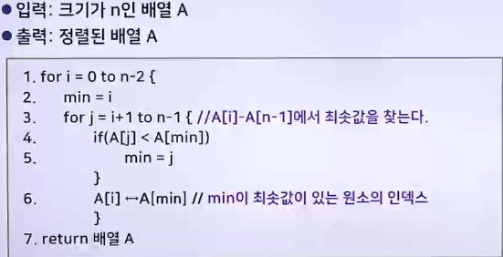
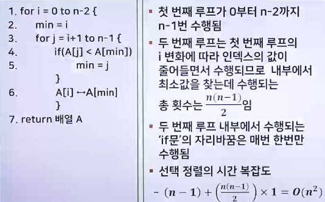
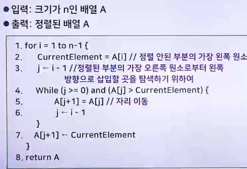
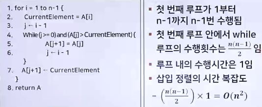
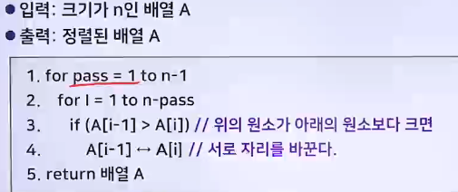
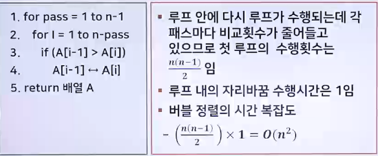

# 유용한 알고리즘 - 정렬 알고리즘 1

## 정렬 알고리즘의 개요

### 정렬 알고리즘의 개념

> N개의 숫자가 입력으로 주어졌을 때, 사용자가 지정한 기준에 맞게 정렬하여 출력하는 알고리즘

- 정렬 알고리즘은 컴퓨터 분야에서 가장 깊이 연구된 분야 중의 하나
- 정렬 알고리즘은 다양하며, 각각 시간 복잡도도 다양함

### 정렬 알고리즘의 특징

1. 내부정렬과 외부정렬로 분류
   - 내부정렬
     - 입력의 크기가 주기억장치의 공간보다 크지 않은 경우에 수행되는 정렬
   - 외부정렬
     - 입력의 크기가 주기억장치 공간보다 큰 경우에 수행되는 정렬
     - 이때에는 보조기억 장치에 있는 입력을 여러 번에 나누어 주기억장치에 읽어들인 후, 정렬하여 보조기억 장치에 다시 저장하는 과정을 반복해야 함
2. 비교정렬 알고리즘
   - 원소들의 순서에만 의존하는 알고리즘
   - 비교정렬 알고리즘은 시간의 복잡도가 O(Nlog2 N)보다 나은 성능을 낼 수 없음
   - 삽입정렬, 선택정렬, 버블정렬, 쉘 정렬, 합병 정렬, 퀵 정렬
3. 비교정렬이 아닌 알고리즘
   - 비교정렬이 아닌 알고리즘들은 시간의 복잡도에 대한 제약이 없음
   - 하지만 원소들의 특성이나 종류에 따라 일반 비교정렬보다 느릴 수 있음
   - 기수정렬
4. 정렬 알고리즘의 기초연산
   - 판별 및 비교
   - 교환

## 선택 정렬 알고리즘

### 선택 정렬 알고리즘의 동작

1. 입력 배열 전체에서 최소값을 '선택'하여 배열의 0번 원소와 자리를 바꿈
2. 다음엔 0번 원소를 제외한 나머지 원소에서 최소값을 선택하여 배열의 1번 원소와 자리를 바꿈
3. 반복하여 마지막 2개의 원소 중 최소값을 선택하여 자리를 바꿈으로써 오름차순의 정렬을 마침

- 

### 선택 정렬 알고리즘의 시간 복잡도

- 

### 선택 정렬 알고리즘의 특징

- 입력의 상태(정렬도가 높은 경우, 역정렬일 경우, 랜덤한 경우)에 상관없이 항상 일정한 시간 복잡도를 나타냄

## 삽입 정렬 알고리즘

### 삽입 정렬 알고리즘의 동작

- 삽입 정렬 알고리즘
  - 배열을 정렬된 부분과 정렬이 되지 않은 부분으로 나눔
  - 정렬이 되지 않은 부분의 가장 왼쪽 원소를 정렬된 부분의 원소들과 비교하여 적절한 위치에 삽입하여 정렬함
- 정렬이 되지 않은 부분의 원소 하나가 정렬된 부분에 삽입됨
  - 정렬된 부분의 원소 수가 1개 늘어남
  - 동시에 정렬이 되지 않은 부분의 원소의 수는 1개 줄어듦
  - 반복하면, 마지막엔 정렬이 되지 않은 부분엔 아무 원소도 남지 않고, 정렬된 부분에 모든 원소가 있음
  - 처음 시작 시 배열의 첫 번째 원소만 정렬된 부분이 됨
- 

### 삽입 정렬 알고리즘의 시간 복잡도

- 

### 삽입 정렬 알고리즘의 특징

- 입력의 상태에 따라 수행시간이 달라질 수 있음
- 정렬도가 높은 경우엔 원소의 이동이 적어서 시간 복잡도가 O(n)임
- 삽입 정렬은 거의 정렬된 입력에 대해서 다른 정렬 알고리즘보다 빠름

## 버블 정렬 알고리즘

### 버블 정렬 알고리즘의 동작

> 이웃하는 숫자를 비교하여 작은 수를 앞쪽으로 이동시키는 과정을 반복하여 정렬하는 알고리즘

- 오름차순으로 정렬한다면, 작은 수는 배열의 앞부분으로 이동하는데, 배열을 상하의 형태인 그림으로 표현하면 정렬하는 과정에서 작은 수가 마치 '거품'처럼 위로 올라가는 것처럼 보여서 버블 정렬 알고리즘이라고 함
- 입력을 전체적으로 한 번 처리하는 것을 패스(pass) 라고 함
- 

### 버블 정렬 알고리즘의 시간 복잡도

- 
