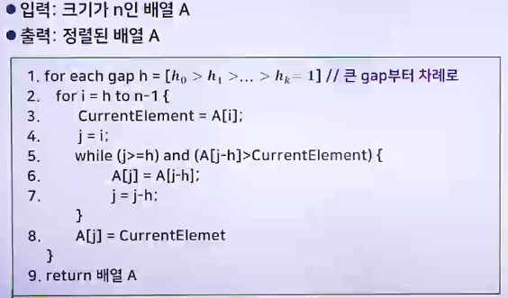

# 유용한 알고리즘 - 정렬 알고리즘 2

## 쉘 정렬 알고리즘

### 쉘 정렬 알고리즘의 동작

- 버블 정렬 : 작은 수가 배열의 앞부분으로 이동이 느림
- 삽입 정렬 : 가장 작은 숫자가 배열의 마지막 원소일 때 마지막에 모든 원소들이 모두 오른쪽으로 이동해야 함

> 쉘 정렬 : 버블 정렬 알고리즘과 삽입 정렬 알고리즘의 단점을 보완한 알고리즘

- 배열의 뒷부분의 작은 숫자를 앞부분으로 빠르게 이동시키고, 앞부분의 큰 숫자를 뒷부분으로 빠르게 이동시키는 알고리즘
- 전체 원소들을 일정한 크기로 나누고 각각에 삽입 정렬을 수행함
- 원소들을 나누는 크기를 조절하면서 전체 원소들의 정렬이 이루어짐
- 마지막에는 반드시 크기를 1로 하여 전체 삽입 정렬을 수행하도록 함
- 

 
 

- 쉘 정렬은 원소를 나누는 크기 h가 미리 정해져야 함
- 가장 큰 h부터 h가 1이 될 때까지 크기를 조절하면서 수행함
- 마지막에는 반드시 크기를 1로 하여 전체 삽입 정렬을 수행하도록 함

### 쉘 정렬 알고리즘의 시간 복잡도

- 

### 쉘 정렬 알고리즘의 특징

- 쉘 정렬은 입력의 크기가 매우 크지 않을 경우에 좋은 성능을 보임
- 쉘 정렬은 임베디드(Embedded) 시스템에서 주로 사용됨
  - 쉘 정렬의 특징인 간격에 따른 그룹 별 정렬 방식이 하드웨어로 정렬 알고리즘을 구현하는데 매우 적합하기 때문

## 기수 정렬 알고리즘

### 기수 정렬 알고리즘의 개념

> 비교정렬 알고리즘 : 삽입 정렬, 선택 정렬, 버블 정렬, 쉘 정렬, 합병 정렬, 퀵 정렬
>
> > 시간의 복잡도가 O(N log N)보다 나은 성능을 낼 수 없음
> >
> > > 기수 정렬 알고리즘 : 전체 값에 대한 비교정렬이 아니고, 숫자를 부분적으로 비교하는 정렬 방법

- 기(radix)는 특정 진수를 나타내는 숫자들임
  - 10진수의 기 : 0-9
  - 2진수의 기 : 0-1
  - 16진수의 기 : 0-15
- 기수 정렬은 제한적인 범위 내에 있는 숫자에 대해서 각 자릿수 별로 정렬하는 알고리즘
- 기수 정렬은 어느 비교 정렬 알고리즘보다 빠름

### 기수 정렬 알고리즘의 동작

- 반드시 지켜야 하는 순서
  - 31과 35처럼 10의 자리는 같지만 1의 자리 정렬을 유지해야 함
- 정렬 알고리즘의 안정성
  - 입력에 중복된 숫자가 있을 때 정렬된 후에도 중복된 숫자의 순서와 동일해야 함
- 

### 기수 정렬 알고리즘의 시간 복잡도

- 루프는 입력 숫자의 최대 자릿수인 k번 반복함
- 한 번 루프가 수행될 때 n개의 숫자가 i자리 수를 읽으며, r개로 분류하여 개수를 세고, 그 결과에 따라 숫자가 이동하므로(n+r) 시간이 걸림
- 기수정렬 시간 복잡도는 O(k(n+r))이며, k나 r이 입력 크기인 n보다 크지 않으면 시간 복잡도는 O(n)이 됨

### 기수 정렬 알고리즘의 특징

- LSD (Least Significant Digit) (RL : Right-to-Left) 기수정렬
- MSD (Most Significant Digit) (LR : Left-to-Right) 기수정렬
- 기수 정렬은 계좌번호, 날짜, 주민등록번호 등으로 대용량의 상용 데이터베이스 정렬, 랜덤 128비트 숫자로 된 초대형 파일(인터넷 주소)의 정렬, 지역번호를 기반한 대용량 전화번호 정렬에 적절함

## 외부 정렬 알고리즘

- 내부 정렬 : 입력이 주기억장치에 있는 상태에서 정렬이 수행되는 정렬
- 외부 정렬 : 입력의 크기가 매우 커서 읽고 쓰는 시간이 오래 걸리는 보조기억 장치에 입력을 저장할 수 밖에 없는 상태에서 수행되는 정렬

### 외부 정렬 알고리즘의 동작

- 외부정렬은 입력을 분할하여 주기억장치에 수용할 만큼의 데이터에 대해서만 내부정렬을 수행하고, 그 결과를 보조기억 장치에 다시 저장함
- 정렬된 블록들을 하나의 정렬된 거대한 블록으로 만듦(합병)
- 블록들을 부분적으로 주기억장치에 읽어들여서 합병을 수행하여 부분적으로 보조 기억 장치에 쓰는 과정을 반복함

 

> 외부정렬 알고리즘은 보조기억장치에서의 읽고 쓰기를 최소화 하는 것이 중요함

 

- 외부정렬 알고리즘은 입력이 저장된 보조기억장치 외에 별도의 보조기억장치를 사용함
- 주기억장치의 용량을 M, 보조기억장치는 HDD로 표현함

 

- 

#### 128GB 입력과 1GB의 주기억장치에 대한 외부정렬 수행과정

- 

### 외부 정렬의 시간 복잡도

- 
