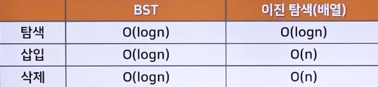
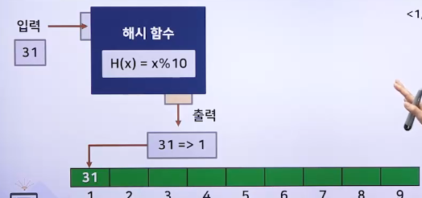

# 유용한 알고리즘 - 탐색 알고리즘

## 탐색 알고리즘의 개요

### 탐색 알고리즘의 개념

> 탐색 알고리즘 : 방대한 데이터에서 목적에 맞는 데이터를 찾아내기 위한 알고리즘

- 컴퓨터에서 탐색은 빈번히 이루어지므로 효율적인 방식으로 수행하는 것이 중요함
- 정렬은 탐색을 수행할 수 있는 방법 중의 하나임
  - 하지만 정렬이 아니더라도 탐색을 수행할 수 있는 방법이 있음
- 탐색 알고리즘은 탐색 뿐만 아니라, 데이터의 삽입, 삭제 연산 기능을 위해서도 사용됨
  - 탐색 뿐만 아니라 빈번히 이루어지는 삽입과 삭제 동작의 성능에도 영향을 미침

### 탐색 알고리즘의 종류

- 순차 탐색 알고리즘
  - 선형 탐색이라고도 불리는 순차 탐색은 가장 간단한 탐색 방법
  - 정렬되지 않은 초기 리스트를 처음부터 끝까지 차례로 검사함
  - 순차 탐색 알고리즘은 평균적으로 (n+1)/2의 비교로 원하는 데이터를 찾아낼 수 있음
  - 시간 복잡도: O(n)
- 이진 탐색 알고리즘
  - 이분 탐색이라고도 불리며, 정렬된 리스트에 적용하기 좋은 탐색 방법
  - 정렬 후 이진 탐색을 이용하게 되면 여러 번 낮은 시간 복잡도로 데이터를 탐색할 수 있음
  - 정렬의 시간복잡도가 추가되지만, 한 번의 정렬로 여러 번의 탐색이 이루어진다면 이진 탐색 방법이 더 좋을 수 있음
  - 탐색 이후에 삽입과 삭제 연산에 효율적이지 않음
  - 시간 복잡도: O(log n)
- 이진 탐색 트리 알고리즘
  - BST(Binary Search Tree) 라고 불리는 이진탐색 트리는 트리의 한 종류이며, 이진 탐색을 위한 방법 중의 하나
  - 이진 탐색 트리는 효율적인 이진 탐색 알고리즘에 트리 자료구조의 특징을 더한 방법임
  - 이진 탐색 트리는 탐색 이후에 삽입과 삭제 연산에 효율적임
  - 시간 복잡도: O(log n)
  - 
- 해시 탐색 알고리즘
  - 해시함수를 이용한 탐색 방법
  - 해시 함수란?
    - 임의의 길이의 데이터를 고정된 길이의 데이터로 매핑하는 함수
    - 즉, 다양한 형태의 데이터를 구분하기 쉽게 분류하는 함수
  - 데이터의 값과 인덱스를 미리 연결해 탐색시간을 줄이는 알고리즘
  - 해시함수를 통해서 데이터의 인덱스 값을 생성해서 데이터를 저장하고, 데이터를 접근할 때 데이터가 저장된 인덱스 값을 해시함수를 통해 얻어 바로 접근할 수 있음
  - 해시 탐색은 해시함수를 사용해 입력들은 분류/저장하는 작업이 선행된 후 탐색할 때 찾고자 하는 요소의 해시값을 통해 빠르게 탐색할 수 있음
  - 시간 복잡도: O(1)
    - 그러나 해시 충돌이 일어날 경우 시간 복잡도는 O(n)이 될 수 있음
  - 해시함수의 질에 따라 성능이 달라질 수 있고, 공간 복잡도는 그 성능이 떨어질 수 있음
  - 
