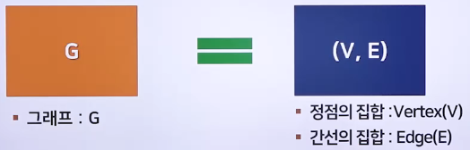
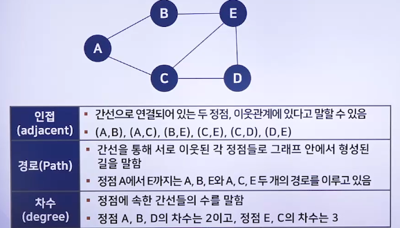
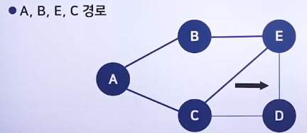
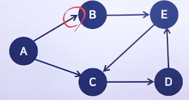
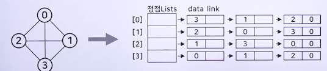
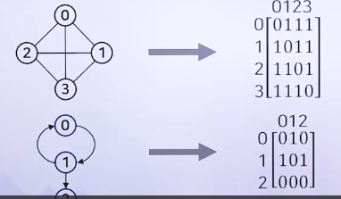
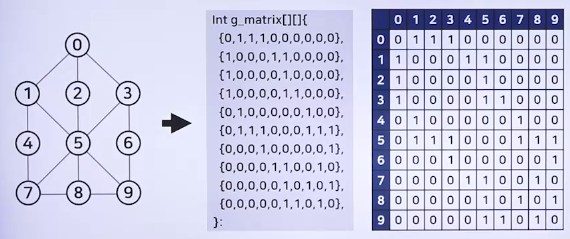
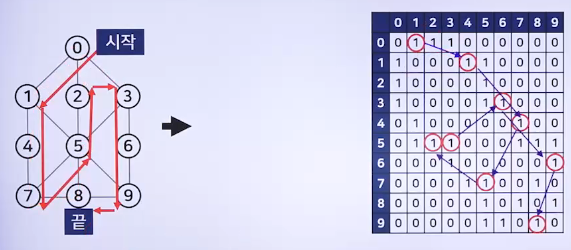
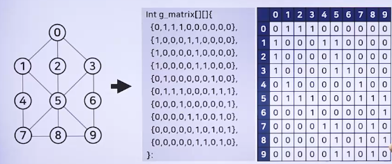
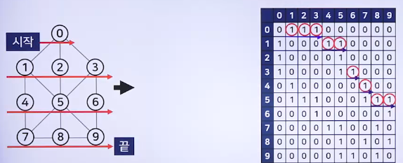

# 유용한 알고리즘 - 그래프 1

## 그래프 알고리즘의 개요

### 그래프 이론

> 쾨니히스베르크의 다리 문제는 그래프 이론에서 최초의 연구로 알려져 있음

- 7개의 다리는 한 번씩만 건너서 쾨니히스테르크의 모든 지역을 돌아 제자리로 돌아올 수 있을까?
  - 1725년 레온하르트 오일러가 모든 다리를 한 번만 거치고 첫 시작 위치로 돌아오는 길은 없다고 증명함
  - 오일러의 경로(Euler path)라고 하고 한붓그리기 문제라고 함
- 오일러의 증명
  - 그림을 단순화하고 육지를 정점(vertex)로 하고 각 육지를 잇는 다리를 간선(edge)로 표현했음
    - 4개의 정점과 7개의 간선
  - 한붓그리기 규칙은 연결되어 있는 선이 홀수개인 점이 없거나 두 개만 있는 도형에서만 가능함
    - 쾨니히스테르크 문제에서 각 정점 4개 모두 간선이 홀수개이므로 한붓그리기가 불가능하며, 따라서 모든 다리를 한 번만 거치고 첫 시작 위치로 돌아오는 방법은 없음
  - 그래프는 수백 년 동안 수학, 과학, 공학, 사회, 경제학에 이르기까지 폭넓은 분야에서 응용되고 있음
  - 컴퓨터 분야에서도 그래프 이론을 토대로 한 알고리즘이 많음

### 그래프의 정의

> 그래프 : 정점과 간선의 모음들의 결합

- 

### 그래프의 용어

- 
- 연결(Connected)
  - 무방향 그래프 내에서 두 정점 사이의 경로가 존재하면 두 정점이 연결되었다고 말함
  - 그래프 내의 모든 정점들이 모두 연결되어 있으면 그래프가 연결되었다고 말함
- 사이클(Cycle)
  - 어느 경로가 정점 하나를 두 번이 이상 거치도록 되어 있는 경로, 처음과 마지막 정점이 같은 단순경로를 말함
  - 
- 무방향 그래프(Undirected graph)
  - 간선에 방향성이 없는 그래프
  - 간선을 나타내는 정점의 쌍에 순서가 없음
  - (A,B)와 (B,A)는 동일한 간선을 표현
- 방향 그래프(Directed graph)
  - 간선에 방향성이 있는 그래프
  - 간선을 나타내는 정점의 쌍에 순서가 있음
  - A, B, E, C 경로
    - 
- 인접 리스트
  - 적은 메모리 공간을 요구하지만, 인접행렬보다 접근이 느림
  - 연결 리스트 자료구조를 통하여 그래프를 표현함
  - 그래프의 각 정점마다 헤드 노드를 두어 각 정점을 할당함
  - 각 정점과의 사이에 정점이 존재하는 정점이 존재하는 정점들을 헤드노드 뒤에 연결
  - 무방향 그래프일 경우 헤드노드 뒤에 연결된 노드의 개수가 그 노드의 차수임
  - n개의 정점과 e개의 간선을 갖는 무방향 그래프의 경우 n개의 배열과 2e개의 체인노드가 필요함
  - 
- 인접 행렬
  - 많은 메모리 공간을 요구하지만, 인접 리스트보다 접근이 빠름
  - 정점 수만큼의 행과 열을 가진 행렬을 이용하여 표현함
  - 정점 i와 j사이에 간선이 존재하면
    - i번째 행과 j번째 열의 원소가 1으로 표현
  - 정점 i와 j사이에 간선이 존재하지 않으면
    - i번째 행과 j번째 열의 원소가 0으로 표현
  - n개의 정점을 가진 무방향 그래프의 인접 행렬에서 진입 차수는 행의 합임
  - n개의 정점을 가진 방향 그래프의 인접 행렬에서 진출 차수는 행의 합이고, 진입 차수는 열의 합임
  - 

## 그래프 알고리즘의 2가지 순회방법

### 그래프의 모든 정점을 순차적으로 방문하는 것

- 무방향 그래프에서 정점 하나가 주어졌을 때 주어진 정점으로부터 시작하여 도달할 수 있는 모든 정점을 방문하는 것임
  - 깊이 우선 탐색(DFS: Depth First Search)
    - 방문하지 않은 정점이 존재할 때 까지만 방문함
    - 인접 정점 중 더 이상 방문하지 않은 인접 정점이 존재하지 않으면 방문했던 경로를 되돌아 감
    - 방문하지 않은 정점이 존재하는 인접 정점으로 가서 방문하지 않은 정점을 방문함
    - 방문하지 않은 정점이 더 이상 존재하지 않으면 종료함
    - 
    - 
  - 너비 우선 탐색(BFS: Breadth First Search)
    - 인접한 꼭지점을 바로 방문하는 방식
    - 인접한 정점을 모두 방문함
    - 방문한 정점에 인접한 정점을 모두 방문함
    - 이 과정을 반복함
    - 
    - 
