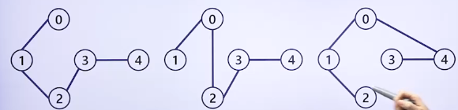

# 유용한 알고리즘 - 그래프 2

## 최소신장 트리

### 신장 트리

- 신장 트리(Spanning Tree): 그래프 내의 모든 정점을 포함하는 트리
- 신장 트리는 그래프의 최소 연결(간선의 수가 가장 적은) 부분 그래프
- 하나의 그래프에는 많은 신장 트리가 존재할 수 있음
- 신장 트리는 사이클을 포함해서는 안됨
- 그래프의 점의 수가 n이면 신장 트리에는 반드시 n-1개의 선분이 있음
- 트리에 선분을 추가시키면 반드시 사이클이 만들어짐
- N개의 위치를 연결하는 통신 네트워크를 최소의 링크를 이용해서 구축해야 하는 경우 사용됨
- 연결 그래프
  - 정점: 5개
  - 간선: 6개
  - 
- 신장 트리 중의 일부
  - 정점: 5개
  - 간선: 4개
  - 

### 최소신장 트리(MST: Minimum Spanning Tree)

> 최소 신장 트리: 주어진 가중치 그래프에서 신장 트리(사이클이 없이 모든 점들을 연결 시킨 트리)들 중 선분들의 가중치 합이 최소인 트리

- 최소신장 트리는 각 간선의 가중치가 동일하지 않을 때 단순히 가장 적은 간선을 사용한다고 해서 최소 비용이 얻어지는 것은 아님
- 최소신장 트리는 간선에 가중치를 고려하여 최소비용의 신장 트리를 선택하는 것을 말함
  - 즉, 가장 적은 수의 간선과 비용으로 연결하는 것임
- 최소신장 트리를 찾는 대표적인 알고리즘
  - 크러스컬 최소신장 트리 알고리즘
  - 프림 최소신장 트리 알고리즘
- 최소신장 트리 알고리즘의 응용
  - 최소비용으로 선로 또는 파이프 네트워크(인터넷 광 케이블 선로, 케이블 TV 선로, 전화선로, 송유관로, 가스관로, 배수로 등)를 설치하는데 활용함

## 크러스컬(Kruskal) 알고리즘

> 최소신장 트리를 찾는 대표적인 알고리즘

- 크러스컬 알고리즘은 가중치가 가장 작은 선분이 사이클을 만들지 않을 때 탐욕적인 방법을 이용하여 그 선분을 추가시킴
- 간선 선택을 기반으로 하는 알고리즘임
- 이전 단계에서 만들어진 신장 트리와는 상관없이 무조건 최소 간선만을 선택하는 방법
- 입력은 가중치 그래프임
- 크러스컬 최소신장트리
  - 

### 크러스컬 알고리즘의 동작

- 1
  - 모든 선분들을 가중치의 오름차순으로 정렬함
- 2
  - T를 초기화시킴(T는 최소신장 트리)
- 3-8
  - while 루프는 T의 선분수가(n-1)이 될 때까지 수행됨
  - 1번 수행될 때 마다 L에서 가중치가 가장 작은 선분 e를 가져옴
  - 이때, 가져온 선분 e는 L에서 삭제됨
- 5-8
  - 가져온 선분 e를 T에 추가하여 사이클을 만들지 않으면 e를 T에 추가함
  - 이때 사이클을 만들면 선분 e를 버림
    - 모든 노드들이 사이클이 연결된 그래프가 신장 트리임
- 

### 크러스컬 알고리즘의 시간 복잡도

- 1
  - 정렬시간 : n log n(n은 입력 그래프의 선분의 수)
- 2
  - T 초기화 시간: 1
- 3-8
  - while 루프는 최악의 경우 n번 수행
    - 모든 선분이 while 루프에서 수행되는 경우
  - 사이클 검사시간: 상수시간
- 5-8
  - 가져온 선분 e를 T에 추가하여 사이클을 만들지 않으면 e에 T를 추가함
  - 이때 사이클을 만들면 선분 e를 버림
    - 모든 노드들이 사이클이 연결된 그래프가 신장 트리임
- 

## 프림(Prim) 알고리즘

> 시작 정점에서부터 출발하여 신장 트리 집합을 단계적으로 확장해 나가는 방법

- 정점 선택을 기반으로 하는 알고리즘
- 이전 단계에서 만들어진 신장 트리를 확장하는 방법
- 추가되는 선분은 현재까지 만들어진 트리에 연결시킬 때 탐욕적인 방법으로 항상 최소의 가중치로 연결되는 선분
- 입력은 가중치 그래프임

### 프림 최소신장 트리

- 
- 

### 프림 알고리즘의 동작

- 입력으로 주어지는 가중치 그래프는 점과 선, 가중치로 주어짐
  - 이때 점의 수는 n, 선의 수는 m임
- 최소신장 트리 T를 출력으로 함
- 1
  - 임의의 시작 점 P를 선택함
    - 각 점의 값 D[p]는 점에 연결된 가중치중의 최소값임
- 2-6
  - 시작점 P와 선분으로 연결된 점들에 대해서 각각의 점들의 가중치 값을 저장함
  - 시작점 P와 선분으로 연결되지 않은 점들에 대해서는 ∞(가장 큰 값)로 놓음
- 7
  - 출력할 최소신장 트리인 T를 초기화함
- 8-12
  - 출력될 최소신장 트리에 포함될 점의 수가 n개가 될 때까지 수행함
  - 즉, T에 속한 점의 수가 n개이면 T는 최소신장 트리임
- 9
  - T에 속하지 않은 점에 대해서 각 점의 가중치 값이 가장 작은 점을 T에 추가함
- 10-12
  - 새롭게 추가된 점에 연결된 점들 중에서 T에 속해 있지 않은 점들에 대해 가중치 값을 갱신함
- 13
  - 최소신장 트리 T를 리턴함
- 프림 알고리즘은 항상 T에 속하지 않은 점들 중에서 가중치 값이 적은 점들을 추가하므로 사이클이 만들어지지 않음
- 

### 프림 알고리즘의 시간 복잡도

- 

### 크러스컬 알고리즘과 프림 알고리즘의 수행과정 비교

- 크러스컬 알고리즘 : n개의 트리들이 합쳐져서 1개의 신장 트리가 만들어짐
- 프림 알고리즘 : 1개의 트리가 자라나서 최종 신장 트리가 만들어짐
