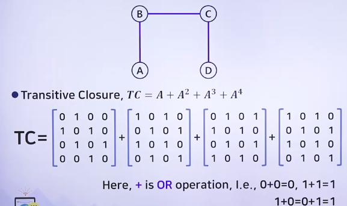
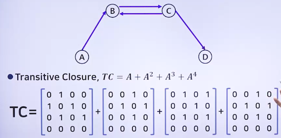

# 유용한 알고리즘 - 그래프 3

## 최단거리 찾기 문제

### 최단거리 찾기 문제

> 정점 A와 정점 B를 연결하는 경로 중 간선들의 가중치 합이 최소가 되는 경로를 찾는 문제

- 간선의 가중치는 경우에 따라 비용, 거리, 시간 등으로 해설될 수 있음
- 
- 위의 그래프에서 정점 0에서 3으로 가는 최단경로
  - 0 -> 4 -> 1 -> 2 -> 3
  - 이때의 비용(거리) : 3+2+4+2=11
- 여러 가지 경로가 있지만 최소비용으로 갈 수 있는 방법은 이 방법 뿐

> 가중치는 가중치 인접 행렬(2차원 배열)에 저장됨

- 기존의 인접 행렬에서는 간선이 없는 구간에는 행렬의 값을 0으로 했었지만, 가중치 인접 행렬에서는 간선의 가중치 자체가 0이 될 수 있기 때문에 간선이 없음을 나타낼 때 ∞ 값을 저장함
  - 이때 컴퓨터는 무한대를 구현할 수 없으므로 실제로는 상당히 큰 값이나 상당히 작은 값을 무한대라고 생각하고 초기화 해 주어야 함
- 

### 최단거리 찾기 대표적인 알고리즘

- 다익스트라 알고리즘
- 워셜-플로이드 알고리즘

### 다익스트라 알고리즘

> 최단경로를 찾는 가장 대표적인 알고리즘

- 출발점으로부터 최단거리가 확정되지 않은 점들 중에서 출발점에서 가장 가까운 점을 탐욕적인 방법으로 선택하고, 그 점의 최단거리로 확정함
- 프림 최소신장트리 알고리즘과 거의 비슷한 수행과정을 거침

### 프림 최소신장트리 알고리즘과 차이점

1. 시작점이 주어짐
2. 신장 트리에 추가시킬 때 프림 최소신장트리 알고리즘은 현재 상태의 트리에서 가장 가까운(가중치 값이 가장 적은) 점을 선택하지만 다익스트라 알고리즘은 출발점으로부터 가장 가까운 점을 추가하고 확정함

### 다익스트라 알고리즘의 동작

- 
- 배열D는 출발점으로부터 각 지점까지의 최단거리를 저장함
- 출발점의 배열의 값을 0, 나머지 지점에 대한 배열의 값을 ∞(가장 큰 값)로 초기화함
- 2-4
  - while 루프는 n-1회 수행됨(시작점 제외)
  - 확정된 점들의 집합을 T라고 하면, 확정되지 않은 점들을 V-T라고 할 수 있음
    - V-T에 속한 점들에 대해서 최소인 점을 선택하여 확정되면 T에 포함을 시키고, 최단거리는 변하지 않음
- 4
  - V-T에 속하면서 인접한 점들의 가중치 값들에 대해 '최소값 + 새로운 선분의 가중치'인 값이 기존의 값보다 작으면 새로운 값으로 갱신함
  - 배열 D(최단거리를 저장한)를 리턴함

### 다익스트라 알고리즘의 시간 복잡도

- while 루프가(n-1)번 반복됨
  - 루프가 수행될 때마다 최단거리 값을 갖는 점을 찾는 시간이 O(n) 시간 걸림
  - 각 지점의 최단거리를 갱신하는 데 걸리는 시간 O(n)임
- 시간 복잡도
  - 

## 이행적 폐쇄 문제

### 이행적 폐쇄(Transitive Closure)

> 이행적 폐쇄 : 가중치가 부여되지 않은 방향 그래프에서 모든 정점들에 대해서 한 지점에서 다른 지점으로 경로가 존재하는지 결정하는 문제

- 이행적 폐쇄 행렬 (A+)은 가중치 없는 방향 그래프에서 임의의 정점을 a, b라고 하면 정점 a에서 b까지의 경로 a-->b의 경로가 존재하면 1로, 존재하지 않으면 0으로 표시하는 행렬임
  - 그래프를 표현한 행렬을 A라고 가정할 때
    - 
- 예제
  - 
  - 
  - 
