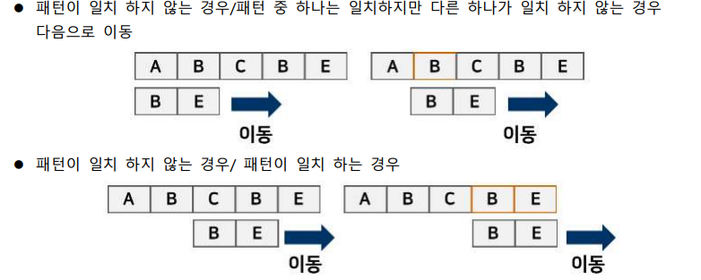
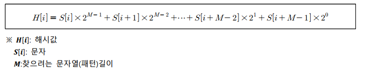
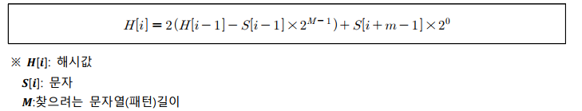
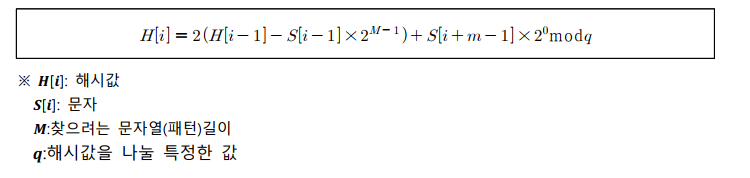
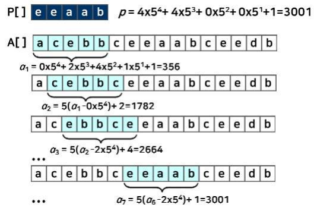
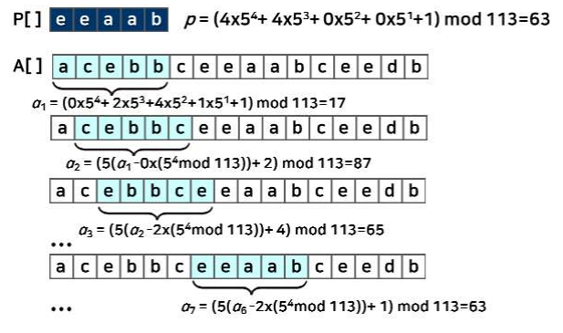

# 유용한 알고리즘 - 문자열 검색 1

## 문자열 검색의 개요

### 문자열 검색(string-searching algorithm, string-matching algorithm)

- 문자열 검색 알고리즘은 문자열을 다루는 알고리즘의 하나로, 특정 문자 또는 문자열을 더 큰 문자열이나 글에서 찾아내는 수법임
- 문자열 검색 : 텍스트 내(본문)에서 특정 문자열, 패턴을 찾는 것

### 가장 단순한 문자열 검색

- 패턴과 본문의 내용을 하나씩 맞는지 처음부터 끝까지 확인하는 방식
- 패턴의 첫 번째부터 맞춰보고, 첫 번째가 맞으면 두 번째를 확인함
- 주어진 패턴과 모두 맞는 문자열을 찾음
  - 고지식한 검색(Naive Search), 무식한 검색(Brute Force Search) 라고 함
- 패턴이 일치하지 않는 경우/패턴 중 하나는 일치하지만 다른 하나가 일치하지 않는 경우 다음으로 이동
- 

## 검색 알고리즘

> 문자열 검색은 활용도가 아주 높아 그 효율성을 높이기 위해 많은 종류의 검색 알고리즘들이 개발되어 왔다.

### 카프-라빈(Karp-Rabin) 알고리즘

- 카프-라빈 알고리즘 : 해시값을 활용한 문자열 검색
- 문자열 검색을 위해 해시 함수를 이용
- 텍스트(본문) 내의 문자들을 모두 비교하는 것이 아니라 패턴의 해시값과 본문 안에 있는 하위 문자열의 해시 값만을 비교함

#### 카프-라빈의 해시함수

- 해시함수를 이용해서 찾으려는 문자열의 해시값을 구하고, 텍스트 내의 모든 문자열도 해시함수를 통해서 해시값을 구한 뒤 그 값을 비교하여 문자열을 찾음
- 해시값을 찾는 계산량의 증가로 성능이 저하될 수 잇음
- 해시함수를 간소화하여 계산량을 줄여 성능을 향상시켰음

 
 

- 최초의 해시값과 찾고자 하는 패턴의 해시값을 구할때는 최초의 함수를 이용하여 구함
- 해시함수에 의해 문자열의 길이가 늘어나면 해시값도 함께 커지는 문제가 발생할 수 있음
- 해시값을 특정한 값으로 나눈 나머지 값으로 사용하도록 해시함수에 추가함

 
 

- q의 값은 충분히 큰 소수로 설정함(단 레지스터에 수용될 수 있도록 잡음)
- 최초의 해시값과 찾고자 하는 패턴의 해시값을 구할때도 q값을 이용하여 나머지 값으로 해시값을 설정함

### 카프-라빈 알고리즘의 동작

- 수치화를 이용한 탐색
  - 
- 나머지 연산을 이용한 탐색
  - 

### 카프-라빈 알고리즘의 시간 복잡도

- 문자열을 정수들의 집합으로 변경시키는 데 O(n) 시간 걸림
- 최악의 경우(수치화를 이용한 탐색)는 O(mn) 시간 걸림
