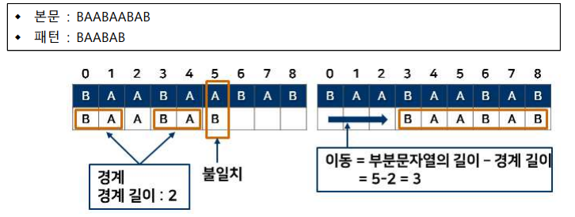

# 유용한 알고리즘 - 문자열 검색 2

## KMP (Knuth-Morris-Pratt) 알고리즘

### KMP 알고리즘

- 고지식한 알고리즘처럼 검색의 위치를 텍스트(본문)의 왼쪽부터 시작해서 오른쪽으로 옮겨 가며 문자를 직접 비교하는 방식으로 동작함
- KMP 알고리즘은 비교하지 않아도 되는 부분은 무시하고, 비교가 필요한 부분만 비교를 수행함
- 알고리즘의 아이디어
  - 패턴과 본문 내의 문자열을 한 번 비교하고 나면, 다음 단계의 검색에서 사용할 수 있는 '어떤 정보'가 생기고, 이 정보를 이용하면 불필요한 비교를 줄일 수 있음
  - 이때 생기는 정보를 정의하고, 그 정보의 활용 방법을 정의함
- 접두부, 접미부, 경계, 경계의 길이
  - 접두부: 문자열의 머리 부분
  - 접미부: 문자열의 꼬리 부분
  - 경계: 문자열에서 일치하는 접두부와 접미부 쌍
  - 경계 길이: 문자열에서 일치하는 접두부와 접미부 쌍의 크기
  - 
- 접두부, 접미부, 경계, 경계의 길이에 대한 정의를 함
  - 
- 이동 거리
  - 경계에 대한 정보를 미리 계산해서 활용함
  - 이동거리 = 일치한 접두부의 길이 - 경계길이
    - 
- KMP 알고리즘의 시간 복잡도
  - 경계에 대한 정보를 미리 계산하는데 O(n)의 시간이 걸림
  - 패턴을 탐색하는데 O(m)시간이 걸림
  - KMP 알고리즘의 시간 복잡도: O(n+m)임

### 보이어-무어(Boyer-Moore) 알고리즘

- 보이어 무어 알고리즘
  - 문자열을 오른쪽에서 왼쪽으로 비교함
  - 이동은 문자열의 왼쪽에서 오른쪽으로 함
  - 일반적으로 사용하는 거의 대부분의 문자열 검색에 사용되는 알고리즘임
  - KMP 알고리즘처럼 불필요한 것은 건너뛰고, 검색을 빠르게 하는 것이 주요 목적임
  - 패턴의 오른쪽 끝에 있는 문자가 불일치하고 이 문자가 패턴 내에 존재하지 않을 경우 패턴의 길이만큼 이동함
    - 
  - 아이디어 : 일반적으로 문자열은 앞부분보다 뒷부분에서 불일치가 일어날 확률이 높음

### 보이어-무어 알고리즘의 동작

- 준비 작업: 이동 수 저장을 위한 배열(각 문자마다 이동 거리를 미리 저장함)
  - 
- ex. nature라는 패턴을 찾을 경우
  - 패턴의 오른쪽 끝과 본문을 비교한 뒤 본문이 e였다면
    - 0칸 이동(패턴의 오른쪽 끝에서 두 번째와 본문을 재 비교 -> ...)
  - 패턴의 오른쪽 끝과 본문을 비교한 뒤 본문이 r이었다면 -> 패턴을 1칸 이동
  - 패턴의 오른쪽 끝과 본문을 비교한 뒤 본문이 u였다면 -> 패턴을 2칸 이동
  - ...
  - 패턴의 오른쪽 끝과 본문을 비교한 뒤 본문이 n이었다면 -> 패턴을 6칸 이동
  - 

### 이외 보이어-무어 알고리즘의 동작

- 보이어-무어 알고리즘의 2가지 이동 방법
  - 나쁜 문자 이동(Bad Character Shift)
  - 착한 접미부 이동(Good Suffix Shift)
- 패턴과 본문에 불일치가 일어났을 때 2가지 이동 방법 중 더 멀리 이동하는 이동방법을 수행함

#### 나쁜 문자 이동

- 나쁜 문자란 패턴의 마지막 문자부터 본문과 일치하지 않는 문자를 말함
- 나쁜 문자가 패턴 안에 있는지 찾음. 이 때 두 개 이상 찾을 경우 가장 뒤에(오른쪽에) 있는 것을 본문의 나쁜 문자에 맞추도록 이동함
  - 
- 나쁜 문자 이동의 문제점 : 나쁜 문자가 일치된 패턴의 뒤쪽에 포함되어 있을 때 패턴이 반대로 이동할 수 있음
  - 

#### 착한 접미부 이동

- 착한 접미부란 패턴의 오른쪽부터 비교할 때 본문과 일치하는 접미부를 말함
- 착한 접미부 이동은 두 가지 경우가 있음
  - 첫 번째 경우 : 착한 접미부가 패턴 안에 존재할 때
  - 두 번째 경우 : 착한 접미부의 접미부가 패턴의 접두부와 일치할 때
- 두 가지 경우에 속하지 않을 경우에는 패턴의 길이만큼 검색 위치를 오른쪽으로 이동함
  - 

### 보이어-무어 알고리즘의 시간 복잡도

- 모든 문자를 보지 않아도 되므로 O(n) 시간이 걸림
- 최악의 경우에 보이어-무어 알고리즘의 시간 복잡도는 O(n+m)임
