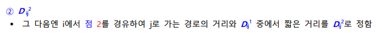
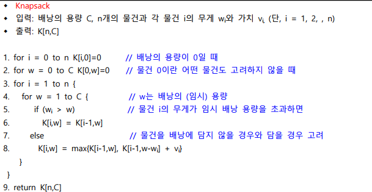

# 문제의 정의

## 문제 정의

- 알고리즘은 어떠한 문제를 해결하기 위한 일련의 절차를 공식화한 형태로 표현한 것
- 컴퓨터 알고리즘은 어떠한 문제를 컴퓨터를 이용하여 해결하기 위한 절차를 공식화한 형태로 표현하는 것
- 컴퓨터로 문제를 해결하기 위해서는 알고리즘을 찾고, 그 알고리즘을 확인하고, 알고리즘대로 작동할 소프트웨어를 만듦
- 컴퓨터로 해결할 수 있는 모든 문제는 문제를 해결하는 알고리즘의 시간 복잡도에 따라 분류될 수 있음

## 문제 분류

### P(Polynominal) 문제

- 다항식 시간 복잡도를 가진 알고리즘으로 해결되는 문제 집합을 말함
- 입력크기에 대해 상수 승(O(log n), O(n), O(n log n), O(n²), O(n³))을 가지는 알고리즘으로 해결되는 문제 집합을 말함

### NP(Nondeterministic Polynominal) 문제

- 다항식보다 큰 시간 복잡도를 가진 알고리즘으로 해결되는 문제 집합을 말함
- 비결정적 다항식 시간 복잡도를 가진 알고리즘으로 해결되는 문제 집합을 말함
- 휴리스틱(Heuristic)한 방법을 이용하면 P 문제가 될 수 있는 문제 집합을 말함
- 알려진 NP 문제
  - 헤밀턴 경로 문제, TSP(Traveling Salesman Problem) 문제, SAT(Satisfiability) 문제, 인수분해 문제
- P ≠ NP or P = NP

### NP-Complete(NP-완전문제)

- NP-완전문제라고 하며, NP문제들 중에서 지수시간(Exponential time) 복잡도를 가진 알고리즘으로 해결되는 문제 집합을 말함
- 어느 하나의 NP-Complete 문제에 대해서 다항시간의 알고리즘을 찾아내면 (다항시간에 해를 구할 수 있으면) 문제의 변환(problem reduction)을 통하여 모든 NP 문제들도 다항시간에 해를 구할 수 있는 문제 집합을 말함
- 1971년 스테픈 쿡(Stephen Cook)이 SAT 문제가 NP-완전문제임을 증명함

### NP-Hard (Nondeterministic Polynominal - Hard 문제 (NP-하드문제))

- NP-하드문제라고 하며, NP-완전문제가 될 수 있는 문제 집합을 말함
- 하드란 적어도 어떤 NP 문제보다 해결하기 어렵다는 뜻임
- 모든 NP문제가 NP-하드 문제로 다항식 시간에 변환 가능하여야 함에도 불구하고, NP-하드 문제는 반드시 NP문제일 필요는 없음

## NP-완전문제

- NP-완전문제의 특성을 알기 위해서는 먼저 어떤 문제를 다른 문제로 변환(reduction)하는 과정을 이해하여야 함
- 문제의 변환은 문제 A를 해결하기 위하여 문제 B를 해결하는 알고리즘을 이용하는 것을 의미함

### 문제의 변환과정

- 먼저 문제 A의 입력을 문제 B의 입력 형태로 변환시킴
- 변환된 입력으로 문제 B를 해결하는 알고리즘을 수행함
- 수행결과인 해를 문제 A의 해로 변환시킴

### 문제의 변환 과정의 시간 복잡도

- 문제 A의 입력을 문제 B의 입력으로 변환하는 시간
- 문제 B를 위한 알고리즘이 수행되는 시간
- 문제 B의 해를 문제 A의 해로 변환하는 시간
- 첫 단계와 세 번째 단계의 수행시간은 단순한 입출력 변환이므로 다항식 시간에 수행됨
- 두 번째 단계에서 문제 B를 해결하는데 다항식 시간이 걸리면 문제 A도 다항식 시간에 해결됨

### 문제의 추이(transitive) 관계

- 문제 A와 문제 B 사이에 다항식 시간 변환 관계가 성립하면, 문제 A가 문제 B로 다항식 시간에 변환 가능하다고 함
- 만일 문제 B가 문제 C로 다항식 시간에 변환 가능하면, 결국 문제 A가 문제 C로 다항식 시간에 변환 가능함
- 이러한 추이 관계로 NP-완전 문제들이 서로 관계를 갖고, NP-완전문제들 중에서 어느 한 문제만 다항식 시간에 해결되면 모든 다른 NP 문제들이 다항식 시간에 해결됨

## NP-완전문제 활용

### 최장 경로(Longest Path), 여행자(Traveling Salesman) 문제, 헤밀토니안 사이클(Hamiltonian Cycle) 문제

- 운송 및 택배 사업에서의 차량 운행(Vehicle Routing)
- 가전 수리 및 케이블 회사에서의 서비스 공의 스케줄링
- 회로 기판에 구멍을 뚫기 위한 기계의 스케줄링
- 회로 기판에서의 배선(Wiring)
- 논리 회로 테스트
- 건축 시공에서의 배관 및 전선 배치
- 데이터의 군집화 (Clustering)

### SAT(Satisfiability) 문제

- 반도체 칩(Chip)을 디자인하는 전자 디자인 자동화(Electronic Design Automation)
- 소프트웨어에 핵심적인 부분인 형식 동치 관계 검사(Formal Equivalence Checking)
- 모델 검사(Model Chceking)
- 형식 검증(Formal Verification)
- 자동 테스트 패턴 생성(Automatic Test Pattern Generation)
- 인공지능에서의 계획(Planning)과 명제 모델을 컴파일하는 지식 컴파일(Knowledge Compliation)
- 생물정보공학 분야에서 염색체로부터 질병 인자를 추출 또는 염색체의 진화를 연구하는데 사용되는 단상형 추론(Haplotype Inference) 연구
- 소프트웨어 검증(Software Verification)
- 자동 정리 증명(Automatic Theorem Proving) 등

### 통 채우기 문제

- 다중 처리 장치(Multiprocessor) 스케줄링
- 멀티미디어 저장 장치 시스템
- Video-on-Demand 서버의 비디오 데이터 배치 등의 자원 할당 (Resource Allocation)
- 생산 조립 라인에서의 최적화
- 산업 공학, 경영 공학의 주요 분야인 공급망 경영(Supply Chain Management)
- 트럭, 컨테이너에 화물 채우기
- 재료 절단(Cutting Stock) 문제
- 작업의 부하 균등화(Load Balancing)
- 스케줄링 (Scheduling)
- 프로젝트 경영(Project Management)
- 재무 예산 집행 계획(Financial Budgeting)

### 작업 스케줄링 (Job Scheduling) 문제

- 컴퓨터 운영 체제의 작업 스케줄링
- 다중 프로세서(Multiprocessor) 스케줄링
- 웹 서버(Web Server)에서 사용자 질의 처리
- 주파수 대역 스케줄링 (Bandwidth Scheduling)
- 시간표 작성(Timetable Design)
- 항공 산업에서 공항 게이트(Gate) 스케줄링
- 조정사 스케줄링
- 정비사 스케줄링

> NP 문제를 다항 시간안에 해결하기 위해서는 : '정답'이 아닌 '가능한 답'을 찾고, 모든 경우의 수에 대한 해결이 아닌 '현실적으로 필요한' 수에 대해 직관적 선택 방법(heuristic)을 이용하여 해결함

# 문제 해결 방식 알고리즘 - 분할정복 알고리즘 1

## 분할정복 알고리즘의 개요

- 분할정복 알고리즘 : 주어진 문제의 입력을 분할하여 문제를 해결(정복)하는 방식의 알고리즘임
- 분할한 입력에 대하여 동일한 알고리즘을 적용하여 해를 계산함
- 이들의 해를 취합하여 원래 문제의 해를 얻음

### 부분문제와 부분해

- 분할된 입력에 대한 문제를 부분문제(subproblem)라고 함
- 부분문제의 해를 부분해라고 함
- 부분문제는 더 이상 분할할 수 없을 때까지 계속 분할함

### 분할 정복의 단계

- 분할(Divide) : 원래 문제를 분할하여 더 작은 하위 문제들 나눔
- 정복(Conquer) : 하위 문제 각각을 재귀적으로 해결(정복 과정에서 더 이상 분할하지 않고 곧장 풀 수 있는 매우 작은 문제를 기저 사례(base case)라 함)
- 병합(merge) : 하위 문제들의 답을 합쳐서 원래 문제를 해결
- 분할 정복 알고리즘은 분할되는 부분문제의 수와 부분문제의 크기에 따라서 분류함
  - 문제가 a개로 분할되고, 부분문제의 크기가 1/b로 감소하는 알고리즘이라고 표현함
    - 퀵정렬 : 문제가 2개로 분할되고, 부분문제의 크기가 일정하지 않은 크기로 감소하는 알고리즘
    - 이진탐색 : 문제가 2개로 분할되나, 그 중에 1개의 부분문제는 고려할 필요가 없으며, 부분문제의 크기가 1/2로 감소하는 알고리즘
    - 선택문제 알고리즘 : 문제가 2개로 분할되나, 그 중에 1개의 부분문제는 고려할 필요가 없으며, 부분문제의 크기가 일정하지 않은 크기로 감소하는 알고리즘
    - 삽입 정렬, 피보나치 수의 계산 : 부분문제의 크기가 1, 2개씩 감소하는 알고리즘

### 분할 정복 적용 시 주의할 점

- 주어진 문제를 분할 정복 알고리즘으로 해결하려고 할 때에 주의해야 하는 또 하나의 요소는 취합(정복)과정임
- 입력을 분할만 한다고 해서 효율적인 알고리즘이 만들어지는 것은 아님
- 기하(geometry)에 관련된 다수의 문제들이 효율적인 분할 정복 알고리즘으로 해결되는데, 이는 기하 문제들의 특성상 취합 과정이 문제 해결에 잘 부합되기 때문임
- 입력이 분할될 때마다 분할된 부분문제의 입력 크기의 합이 분할되기 전의 입력 크기보다 매우 커지는 경웨는 분할 정복이 부적절한 경우임

### 피보나치 수 구하기(분할 정복이 부적절한 예)

- 

## 분할 정복 알고리즘으로 해결되는 문제들

- 컴퓨터 그래픽스
- 컴퓨터 비전(Vision)
- 지리 정보 시스템(Geographic Information System, GIS)
- 분자 모델링(Molecular Modeling)
- 항공 그래픽 조정(Air Traffic Control)
- 마케팅(주유소, 프랜차이즈 신규 가맹점 등의 위치 선정) 등

## 합병 정렬

### 합병 정렬의 개요

- 합병 정렬 : 입력이 2개의 부분문제로 분할되고, 부분문제의 크기가 1/2로 감소하는 분할 정복 알고리즘
- n개의 숫자들을 n/2개씩 2개의 부분문제로 분할
- 각각의 부분문제를 재귀적으로 합병 정렬
- 2개의 정렬된 부분을 합병하여 정렬(정복)
- 합병 과정이 문제를 정복하는 것

### 합병 정렬의 동작

- 합병 정렬 알고리즘의 의사코드
  - 
- n=8인 배열 A=[37, 10, 22, 30, 35, 13, 25, 24] 합병 정렬 수행과정
  - 

### 합병 정렬의 시간 복잡도

- 분할 수행시간 + 합병 수행시간(비교횟수)
- 분할 수행시간은 배열의 중간 인덱스 계산으로 입력크기와 상관없으므로 (O(1)) 시간 소요
- 합병의 수행시간은 입력의 크기에 비례함
- 2개의 정렬된 배열 A와 B의 크기가 각각 m과 n이라면, 최대 비교 횟수 = (m+n-1)합병의 시간복잡도는 O(m+n)임
- 분할된 만큼 합병이 이루어지므로 각 합병에 대해서 몇 번의 비교가 수행되었는지를 계산해야 함(각 합병별 비교횟수는 O(n)임)
- 층수는 분할하는 과정에서 생성되므로, 입력된 수에 따라 결정됨
  - 
- 입력의 크기가 n일 때 n을 계속하여 1/2로 나누다가, 더 이상 나눌 수 없는 크기인 1이 될 때 분할을 중단함
- k번 1/2로 분할했으면 k개의 층이 생기는 것이고, k는 2\*\*k=n으로 부터 log₂n임을 알 수 있음
- 합병 정렬의 시간 복잡도: (층수) _ O(n) = log₂n _ O(n) = O(n log n)임

### 합병 정렬의 단점과 응용

- 단점
  - 입력을 위한 메모리 공간(입력 배열) 외에 추가로 입력과 같은 크기의 공간(임시 배열)이 별도로 필요함
  - 2개의 정렬된 부분을 하나로 합병하기 위해, 합병된 결과를 저장할 곳이 필요하기 때문(공간의 복잡도가 O(n)임)
- 응용
  - 합병 정렬은 외부정렬의 기본이 되는 정렬 알고리즘임
  - 연결 리스트에 있는 데이터를 정렬할 때에도 퀵 정렬이나 힙 정렬보다 훨씬 효율적임
  - 멀티코어(Multi-Core) CPU와 다수의 프로세서로 구성된 그래픽 처리 장치(Graphic Processing Unit)의 등장으로 정렬 알고리즘을 병렬화하는 데에 합병 정렬 알고리즘이 활용됨

## 퀵 정렬

### 퀵 정렬의 개요

- 퀵 정렬은 분할 정복 알고리즘으로 분류되지만 실제 알고리즘이 수행되는 과정을 살펴보면 정복 후 분할하는 알고리즘임
- 퀵 정렬 알고리즘은 문제를 2개의 부분문제로 분할하며, 각 부분문제의 크기가 일정하지 않은 형태의 분할 정복 알고리즘임
- 퀵 정렬은 피벗(pivot)이라 일컫는 배열의 원소(숫자)를 기준으로 피벗보다 작은 숫자들은 왼편으로, 피벗보다 큰 숫자들은 오른편에 위치하도록 분할하고, 피벗을 그 사이에 놓아 피벗을 중심으로 문제를 두 개로 분할함
- 퀵 정렬은 분할된 부분문제들에 대해서도 위와 동일한 과정을 재귀적으로 수행하여 정렬하는 알고리즘임
- 피벗은 분할된 왼편이나 오른편 부분에 포함되지 않음
- 피벗이 60이라면, 60은 [20 40 10 30 50]과 [70 90 80] 사이에 위치함

### 퀵 정렬의 동작

- 퀵 정렬 알고리즘의 의사코드
  - 
- n=12인 배열 A=[6, 3, 11, 9, 12, 2, 8, 15, 18, 10, 7, 14] 퀵 정렬 수행과정
  - 
  - 
  - 

### 퀵 정렬의 시간 복잡도

- 퀵 정렬의 성능은 피벗 선택이 좌우함
  - 피벗으로 가장 작은 숫자 또는 가장 큰 숫자가 선택되면, 한 부분으로 치우치는 분할이 이루어질 수 있음
- 퀵 정렬의 최악의 경우 시간복잡도(가장 작은 수가 피벗으로 선택되었을 때)
  - = (n-1)+(n-2)+(n-3)+...+2+1 = n(n-1)/2 = O(n²)
  - 
- 퀵 정렬의 최선의 경우 시간복잡도(최선으로 분할되었을 때) = O(nlog₂n)
  - 
  - 각 층에서는 각각의 원소가 각 부분의 피벗과 1회씩 비교됨
    - 따라서 비교 횟수 = O(n)
  - 총 비교 횟수 = O(n) _ 층수 = O(n) _ (log₂n)
    - n/(2\*\*k) = 1 일 때 k = log₂n 이기 때문
- 피벗을 항상 랜덤하게 선택한다고 가정하면, 퀵 정렬의 평균 경우 시간 복잡도를 계산할 수 있음. 이때의 시간복잡도도 역시 최선 경우와 동일하게 O(nlog₂n)임

### 퀵 정렬의 응용

- 퀵 정렬은 커다란 크기의 입력에 대해서 가장 좋은 성능을 보이는 정렬 알고리즘임
- 퀵 정렬은 실질적으로 어느 정렬 알고리즘보다 좋은 성능을 보임
- 생물 정보 공학(Bioinfrmatics)에서 특정 유전자를 효율적으로 찾는데 접미 배열(suffix array)과 함께 퀵 정렬이 활용됨

---

# 문제 해결 방식 알고리즘 - 분할정복 알고리즘 2

## 선택 문제

### 선택 문제 개요

- 선택 문제는 n개의 숫자들 중에서 k번째로 작은 숫자를 찾는 문제
- 선택 문제를 해결하기 위한 간단한 방법으로는 최소 숫자를 k번 찾는 것
  - 단, 최소 숫자를 찾은 뒤에는 입력에서 최소 숫자를 제거함
- 선택 문제를 해결하기 위한 간단한 방법으로는 숫자들을 정렬한 후, k번째 숫자를 찾음
- 두 가지 간단한 방법의 알고리즘들은 각각 최악의 경우 O(kn)과 O(nlogn)의 수행 시간이 걸림
- 선택문제의 다른 아이디어
  - 정렬된 입력의 중간에 있는 숫자와 찾고자 하는 숫자를 비교함으로써, 입력을 1/2로 나눈 두 부분 중에서 한 부분만을 검색하는 이진탐색 방법을 생각할 수 있음
  - 입력이 정렬되어 있지 않으므로, 입력 숫자들 중에서 (퀵 정렬에서와 같이) 피벗을 선택하여 아래와 같이 분할하는 방법을 생각할 수 있음
    - 
  - Small group은 피벗보다 작은 숫자의 그룹이고, Large group은 피벗보다 큰 숫자의 그룹이 됨
  - 이렇게 분할했을 때 알아야 할 것은 각 그룹의 크기
    - 즉, 숫자의 개수를 알면 k번째 작은 숫자가 어느 그룹에 있는지를 알 수 있고, 그 다음에는 그 그룹에서 몇 번째로 작은 숫자를 찾아야 하는지를 알 수 있음
  - k번째 작은 숫자가 있는 경우
    - 

### 선택 문제를 해결하기 위한 분할 정복 알고리즘

- 선택 문제를 해결하기 위한 분할 정복 알고리즘의 의사코드
  - 

### 선택 문제를 해결하기 위한 분할 정복 알고리즘의 고려사항

- 선택 문제를 해결하기 위한 분할 정복 알고리즘은 분할 정복 알고리즘이기도 하지만 랜덤(random) 알고리즘이기도 함
  - 알고리즘의 line 1에서 피벗을 랜덤하게 정하기 때문
- 만일 피벗이 입력 리스트를 너무 한 쪽으로 치우치게 분할하면 즉, |Small group|<<|Large group| 또는 |Small group| >> |Large group|일 때에는 알고리즘의 수행 시간이 길어짐
- 선택 알고리즘이 호출될 때마다 line 1에서 입력을 한쪽으로 치우치게 분할될 확률은 마치 동전을 던질 때 한쪽 면이 나오는 확률과 같음 => 따라서 이를 고려한 분석이 필요함
- 분할된 두 그룹 중의 하나의 크기가 입력 크기의 3/4과 같거나 그보다 크게 분할하면 나쁜 분할이라고 정의하고, 좋은 분할은 그 반대의 경우임
- 피벗을 랜덤하게 정했을 때 좋은 분할이 될 확률이 1/2이므로 평균 2회 연속해서 랜덤하게 피벗을 정하면 좋은 분할을 할 수 있음
- 매 2회 호출마다 좋은 분할이 되므로, 좋은 분할만 연속하여 이루어졌을 때만의 시간복잡도를 구하여, 그 값에 2를 곱하면 평균 경우 시간 복잡도를 얻을 수 있음

### 선택 문제를 해결하기 위한 분할 정복 알고리즘의 시간 복잡도

- 
- 리스트 크기가 n에서부터 3/4배로 연속적으로 감소되고, 리스트 크기가 1일 때에는 더 이상 분할할 수 없게 됨.
  - 알고리즘의 평균 경우 시간복잡도
    - 

### 선택 문제를 해결하기 위한 알고리즘의 응용

- 선택 알고리즘은 데이터 분석을 위한 중앙값(median)을 찾는데 활용함
- 데이터 분석에서 평균값도 유용하지만, 중앙값이 더 설득력 있는 데이터 분석을 제공하기도 함
- ex. 대부분의 데이터가 1이고, 오직 1개의 숫자가 매우 큰 숫자(노이즈(noise), 잘못 측정된 데이터)이면, 평균값은 매우 왜곡된 분석이 됨

## 최근접 점의 쌍 찾기 문제

### 최근접 점의 쌍 찾기 문제의 개요

- 최근접 점의 쌍(Closest Pair)문제는 2차원 평면상의 n개의 점이 입력으로 주어질 때, 거리가 가장 가까운 한 쌍의 점을 찾는 문제임
- 최근접 점의 쌍 찾기 문제 해결의 가장 간단한 방법은 모든 점에 대하여 각각의 두 점 사이의 거리를 계산하여 가장 가까운 점의 쌍을 찾는 것

### 최근접 점의 쌍 찾기 문제를 해결하기 위한 분할 정복 알고리즘

- 최근접 점의 쌍 찾기 문제를 해결하기 위한 분할 정복 알고리즘의 의사코드
  - 

### 최근접 점의 쌍 찾기 문제를 해결하기 위한 분할 정복 알고리즘의 응용

- 컴퓨터 그래픽스
- 컴퓨터 비전(Vision)
- 지리 정보 시스템(Geographic Information System, GIS)
- 분자 모델링(Molecular Modeling)
- 항공 트래픽 조정(Air Traffic Control)
- 마케팅(주유소, 프랜차이즈 신규 가맹점 등의 위치 선정) 등

# 문제 해결 방식 알고리즘 - 그리디 알고리즘 1

## 그리디 알고리즘의 개요

- 그리디 알고리즘은 최적화 문제를 해결하는 알고리즘
- 이때 최적화(optimization) 문제는 가능한 해들 중에서 가장 좋은(최대 또는 최소) 해를 찾는 문제를 말함
- 욕심쟁이 방법, 탐욕적 방법, 탐욕 알고리즘 등으로 불림
- 그리디 알고리즘은 (입력) 데이터 간의 관계를 고려하지 않고 수행 과정에서 '욕심내어' 최소값 또는 최대값을 가진 데이터를 선택하기 때문에 이러한 선택을 '근시안적'인 선택이라고 말하기도 함
- 그리디 알고리즘은 근시안적인 선택으로 부분적인 최적해를 찾고, 이들을 모아서 문제의 최적해를 얻음
  - 
- 그리디 알고리즘은 일단 한 번 선택하면 이를 절대로 번복하지 않음
- 즉, 선택한 데이터를 버리고 다른 것을 취하지 않음

## 그리디 알고리즘으로 해결되는 문제들

- 대부분 그리디 알고리즘들은 매우 단순하며, 또한 제한적인 문제들만이 그리디 알고리즘으로 해결됨
- 동전 거스름돈 문제, 최단경로 문제, 부분배낭문제, 집합커버 문제, 작업스케줄링 문제, 허프만의 압축 등
- 활용
  - 팩스, 대용량 데이터 저장, 멀티미디어(Multimedia), MP3 압축 등
  - 정보 이론(Information Theory) 분야에서 엔트로피(Entropy)를 계산하는데 활용되는데 이는 자료의 불특정성을 분석하고 예측하는데 이용됨

## 동전 거스름돈 문제

- 그리디 알고리즘은 동전 거스름돈(Coin Change) 문제를 해결하는 가장 간단하고 효율적인 방법
- 남은 액수를 초과하지 않는 조건하에 '욕심내어' 가장 큰 액면의 동전을 취하는 아이디어를 이용함

### 동전 거스름돈 문제 알고리즘

- 동전의 액면은 500원, 100원, 50원, 10원, 1원일 때 동전 거스름돈 문제의 최소 동전 수를 갖는 그리디 알고리즘
  - 
- C_Change 알고리즘
  - 남아있는 거스름돈인 change에 대해 가장 높은 액면의 동전을 거스름
  - 500원짜리 동전을 처리하는 line 2에서는 100원짜리, 50원짜리, 10원짜리, 1원짜리 동전을 몇 개씩 거슬러 주어야 할 것인지에 대해서는 전혀 고려하지 않음
- 만일 한국은행에서 160원짜리 동전을 추가로 발행한다면
  - C_Change 알고리즘이 항상 최소 동전 수를 계산할 수 있을까?
    => C_Change 알고리즘은 항상 최적의 답을 주지 못하기 때문에, 실제로는 거스름돈에 대한 그리디 알고리즘이 적용되도록 동전이 발행됨

## 최단경로 찾기 문제

- 최단 경로 (Shortest Path)문제는 주어진 가중치 그래프에서 어느 한 출발점에서 또 다른 도착점까지의 최단 경로를 찾는 문제
- 최단 경로를 찾는 가장 대표적인 알고리즘: 다익스트라(Dijkstra) 최단 경로 알고리즘
- 다익스트라 알고리즘
  - 주어진 출발점에서 시작하며, 출발점으로부터 최단 거리가 확정되지 않은 점들 중에서 출발점으로부터 가장 가까운 점을 추가하고, 그 점의 최단 거리를 확정
  - 최단경로 찾기 문제를 그리디 알고리즘 방법으로 해결한 알고리즘임
  - 시간 복잡도는 O(n²)이며, 더 나은 알고리즘을 찾기 위하여 여러 가지 방법이 연구되고 있음
- 다익스트라 알고리즘의 활용
  - 맵퀘스트(Mapquest)와 구글 웹사이트의 지도 서비스
  - 자동차 네비게이션, 네트워크와 통신 분야
  - 모바일 네트워크
  - 산업 공학과 경영 공학의 운영(Operation) 연구
  - 로봇 공학, 교통 공학, VLSI디자인 분야 등 다양한 분야에서 사용되고 있음

### 기타 그리디 알고리즘의 방법을 사용한 알고리즘

- 크러스컬 알고리즘
  - 가중치가 가장 작은 선분이 사이클을 만들지 않을 때 탐욕적인 방법을 이용하여 그 선분을 추가시킴
- 프림 알고리즘
  - 추가되는 선분은 현재까지 만들어진 트리에 연결시킬 때 탐욕적인 방법으로 항상 최소의 가중치로 연결되는 선분을 만듦

---

# 문제 해결 방식 알고리즘 - 그리디 알고리즘 2

## 부분 배낭 문제

### 부분 배낭 문제 개요

- 배낭 문제는 n개의 물건이 있고, 각 물건은 무게와 가치를 가지고 있으며, 배낭이 한정된 무게의 물건들을 담을 수 있을 때, 최대의 가치를 갖도록 배낭에 넣을 물건들을 정하는 문제임
- 부분 배낭(Fractional Knapsack) 문제
  - 물건을 부분적으로 담는 것을 허용하는 조건에서 배낭문제를 해결하고자 하는 문제임
  - 부분 배낭 문제를 그리디 알고리즘으로 해결할 수 있음
  - 0-1 배낭 문제(0/1 배낭 문제)
    - 부분 배낭 문제의 원형으로 물건을 통째로 배낭에 넣어야 함
    - 그리디 알고리즘 뿐 아니라 동적 계획 알고리즘, 백트래킹 기법, 분기 한정 기법으로 해결할 수 있음
- 부분 배낭 문제에서는 물건을 부분적으로 배낭에 담을 수 있으므로, 최적해를 위해 '욕심을 내어' 단위 무게 당 가장 값나가는 물건을 배낭에 넣고, 계속해서 그 다음으로 값나가는 물건을 넣음
- 만일 그 다음으로 값나가는 물건을 '통째로' 배낭에 넣을 수 없게 되면, 배낭에 넣을 수 있을 만큼만 물건을 부분적으로 배낭에 담음

### 부분 배낭 문제를 해결하는 그리디 알고리즘

- 
- 

### 부분 배낭 문제를 해결하는 그리디 알고리즘의 시간 복잡도

- n개의 물건 각각의 단위 무게 당 가치를 계산하는 데는 O(n) 시간 걸림
- 물건의 단위 무게 당 가치에 대해서 내림차순으로 정렬하기 위해 O(nlogn) 시간이 걸림
- while-루프의 수행은 n번을 넘지 않으며, 루프 내부의 수행은 O(1) 시간이 걸림
- 알고리즘의 시간복잡도 : O(n) + O(nlogn) + nxO(1) + O(1) = O(nlogn)

### 부분 배낭 문제를 해결하는 그리디 알고리즘의 응용

- 0-1 배낭 문제는 최소의 비용으로 자원을 할당하는 문제로, 조합론, 계산이론, 암호학, 응용수학 분야에서 기본적인 문제로 다루어짐

## 집합 커버 문제

### 집합 커버 문제 개요

- 집합 커버 문제
  - n개의 원소를 가진 집합 U가 있고, U의 부분집합들을 원소로 하는 집합 F가 주어질 때, F의 원소들인 집합들 중에서 어떤 집합들을 선택하여 합집합하면 U와 같게 되는가? 라는 문제에서 집합 F에서 선택하는 집합들의 수를 최소화 하는 문제
- 신도시를 계획하는 데 있어서 학교 배치의 예
  - 
  - 

### 집합 커버 문제의 최적해

- 집합 커버 문제의 최적해를 찾는 방법 (F에 n개의 집합들이 있다고 가정)
- 가장 단순한 방법
  - F에 있는 집합들의 모든 조합을 1개씩 합집합하여 U가 되는지 확인하고, U가 되는 조합의 집합 수가 최소인 것을 찾는 것
  - F = {S1, S2, S3}일 경우 모든 조합
  - S1, S2, S3, S1∪S2, S1∪S3, S2∪S3, S1∪S2∪S3
  - 집합이 1개인 경우 3개 = 3C1
  - 집합이 2개인 경우 3개 = 3C2
  - 집합이 3개인 경우 1개 = 3C3
  - 총합은 3+3+1 = 7 = 2³-1개
- n개의 원소가 있을 경우
  - (2ⁿ-1)개를 다 검사하여야 함
  - n이 커지면 최적해를 찾는 것은 실질적으로 불가능
- 이를 극복하기 위한 방법
  - 최적해를 찾는 대신 최적해에 근접한 근사해(approximation solution)를 찾음

### 집합 커버 문제를 해결하는 그리디 알고리즘

- 

### 집합 커버 문제를 해결하는 그리디 알고리즘 시간 복잡도

- 루프가 수행되는 횟수: O(n)
- 루프 1회의 시간복잡도 : O(1) + O(n²) + O(n) + O(1) = O(n2)
- SetCover 알고리즘의 시간복잡도: O(n) \* O(n²) = O(n³)

### 집합 커버 문제를 해결하는 그리디 알고리즘 응용

- 도시 계획(City Planning)에서 공공 기관 배치하기, 경비 시스템
  - 경비가 요구되는 장소의 CCTV 카메라의 최적 배치
  - 컴퓨터 바이러스 찾기
  - 대기업의 구매 업체 선정, 기업의 경력 직원 고용
  - 그 외, 비행기 조종사 스케줄링, 조립 라인 균형화, 정보 검색 등에 활용함

## 작업 스케줄링 문제

### 작업 스케줄링 문제 개요

- 작업 스케줄링 문제는 작업의 수행 시간이 중복되지 않도록 모든 작업을 가장 적은 수의 기계에 배정하는 문제
- 학술대회에서 발표자들을 강의실에 배정하는 문제와 같음
- 작업 스케줄링 문제에 주어진 문제 요소에는 작업의 수와 작업의 길이, 작업의 시작시간과 종료시간이 있음
  - 작업의 수는 입력의 크기이므로 알고리즘을 고안하기 위해 고려되어야 하는 직접적인 요소는 아님
- 작업의 시작시간과 종료시간은 정해져 있음
- 작업의 길이는 작업의 시작시간과 종료시간은 정해져 있으므로 작업의 길이도 주어진 것임
- 시작시간, 종료시간, 작업 길이에 대한 그리디 알고리즘의 4가지 방법
  - 빠른 시작시간 작업 우선(Earliest start time first) 배정
  - 빠른 종료시간 작업 우선(Earliest finish time first) 배정
  - 짧은 작업 우선(Shorest job first) 배정
  - 긴 작업 우선(Longest job first) 배정
- 4가지 중 첫 번째 알고리즘을 제외하고 나머지 3가지는 항상 최적해를 찾지 못함

### 작업 스케줄링 문제를 해결하는 그리디 알고리즘

- 

### 작업 스케줄링 문제를 해결하는 그리디 알고리즘 시간 복잡도

- 

### 작업 스케줄링 문제를 해결하는 그리디 알고리즘 응용

- 비즈니스 프로세싱, 공장 생산 공정, 강의실/세미나 룸 배정, 컴퓨터 태스크 스케줄링 등

# 문제 해결 방식 알고리즘 - 그리디 알고리즘 3

## 부분 배낭 문제, 집합 커버 문제, 작업 스케줄링 문제

- 부분 배낭 문제, 집합 커버 문제, 작업 스케줄링 문제는 NP문제임
  - 부분 배낭 문제, 집합 커버 문제, 작업 스케줄링 문제를 그리디 알고리즘 방법으로 해결하여 최적해를 찾을 수 있음

### 부분 배낭(Fractional Knapsack)문제

- 물건을 부분적으로 배낭에 담을 수 있으므로, 최적해를 위해서 '욕심을 내어' 단위 무게 당 가장 값나가는 물건을 배낭에 넣고, 계속해서 그 다음으로 값나가는 물건을 넣음
- 부분 배낭 문제
  - 단위 무게 당 가장 값나가는 물건을 계속해서 배낭에 담음
  - 마지막엔 배낭에 넣을 수 있을 만큼만 물건을 부분적으로 배낭에 담음
  - 시간복잡도는 O(nlogn)임

### 집합 커버(Set Cover) 문제

- 근사(Approximation) 알고리즘을 이용하여 근사해를 찾는 것이 보다 실질적임
- U의 원소들을 가장 많이 포함하고 있는 집합을 항상 F에서 선택함
- 시간복잡도는 O(n³)임
- n개의 원소를 가진 집합 U가 있고, U의 부분집합들을 원소로 하는 집합 F가 주어질 때, F의 원소들인 집합들 중에서 어떤 집합들을 선택하여 합집합하면 U와 같게 되는가? 라는 문제
  - 집합 F에서 선택하는 집합들의 수를 최소화 하는 문제가 집합 커버 문제를 그리디 알고리즘을 이용하면, 가장 많은 원소를 포함하고 있는 부분집합을 먼저 선택하여 해결함

### 작업 스케줄링(Job Scheduling) 문제

- 작업의 수행 시간이 중복되지 않도록 모든 작업을 가장 적은 수의 기계에 배정하는 문제
- 학술대회에서 발표자들을 강의실에 배정하는 문제와 같음
- 빠른 시작시간 작업 먼저(Earlist start time first) 배정하는 그리디 알고리즘으로 최적해를 찾음
- 시간복잡도는 O(nlogn) + O(mn)임(n은 작업의 수이고, m은 기계의 수)

## 허프만 압축 알고리즘

### 허프만 압축 알고리즘 개요

- 파일의 각 문자가 8bit 아스키(ASCII) 코드로 저장되면, 그 파일의 bit 수는 8x(파일의 문자 수)가 됨
- 이와 같이 파일의 각 문자는 일반적으로 고정된 크기의 코드로 표현됨
- 이러한 고정된 크기의 코드로 구성된 파일을 저장하거나 전송할 때
  1. 파일의 크기를 줄이고,
  2. 필요시 원래의 파일로 변환할 수 있으며,
  3. 메모리 공간을 효율적으로 사용할 수 있고,
  4. 파일 전송 시간을 단축시킬 수 있음
  - 주어진 파일의 크기를 줄이는 방법을 파일 압축(file compression)이라고 함
- 허프만(Huffman) 압축
  - 파일에 빈번히 나타나는 문자에는 짧은 이진 코드를 할당하고, 드물게 나타나는 문자에는 긴 이진 코드를 할당함
  - 허프만 압축 방법으로 변환시킨 문자 코드들 사이에는 접두부 특성(prefix property)이 존재함
    - 이는 각 문자에 할당된 이진 코드는 어떤 다른 문자에 할당된 이진 코드의 접두부(prefix)가 되지 않는다는 것을 의미
  - 즉, 문자 'a'에 할당된 코드가 '101'이라면, 모든 다른 문자의 코드는 '101'로 시작되지 않으며 또한 '1'이나 '10'도 아님
- 접두부 특성의 장점은 코드와 코드 사이를 구분할 특별한 코드가 필요 없음
  - ex. 101#10#1#111#0#...에서 '#'이 인접한 코드를 구분짓고 있는데, 허프만 압축에서는 이러한 특별한 코드 없이 파일을 압축하고 해제할 수 있음
- 허프만 코드
  - 허프만 압축은 입력 파일에 대해 각 문자의 출현 빈도수(문자가 파일에 나타나는 횟수)에 기반을 둔 이진트리를 만들어서, 각 문자에 이진 코드를 할당함 => 이러한 이진 코드를 허프만 코드라고 함

### 허프만 압축 알고리즘

- 

### 허프만 압축 알고리즘 시간 복잡도

- n개의 노드를 만들고, 각 빈도수를 노드에 저장하므로 O(n) 시간이 걸림
- n개의 노드로 우선순위 큐 Q를 만듦
  - 여기서 우선순위 큐로서 힙(heap) 자료구조를 사용하면 O(n) 시간이 걸림
- 최소 빈도수를 가진 노드 2개를 Q에서 제거하는 힙의 삭제 연산과 새 노드를 Q에 삽입하는 연산을 수행하므로 O(logn) 시간이 걸림
- while-루프는 (n-1)번 반복됨
  - 루프가 1번 수행될 때마다 Q에서 2개의 노드를 제거하고 1개를 Q에 추가하기 때문
- 시간복잡도 : O(n) + O(n) + O(nlogn) + O(1) = O(nlogn)

### 허프만 압축 알고리즘 응용

- 팩스, 대용량 데이터 저장, 멀티미디어, MP3 압축 등에 활용
- 정보 이론(Information Theory) 분야에서 엔트로피를 계산하는데 활용됨. 이는 자료의 불특정성을 분석하고 예측하는데 이용됨

---

# 문제 해결 방식 알고리즘 - 동적계획 알고리즘 1

## 동적 계획 알고리즘의 개요

- 수학자 리처드 벨만이 1940년대에 사용하던 용어
- 동적계획법 : 1953년, 벨만은 큰 문제 안에 작은 문제가 중첩되어 있는 문제를 해결하는 데 사용하는 이 방법을 '동적 계획법(Dyanmic Programming)'이라 명명
- Dynamic이라는 말은 벨만이 이런 알고리즘의 '시가변적이며 다단계적인' 특성을 나타내기 위해 채택한 용어
- 동적 계획 알고리즘의 문제 해결 방법은 입력 크기가 작은 부분 문제들을 모두 해결한 후에 그 해들을 이용하여, 보다 큰 크기의 부분 문제들을 해결하여 최종적으로 원래 주어진 입력의 문제를 해결함
- 동적 계획 알고리즘은 부분 문제가 반복이 일어나는 경우 적용되며, 이때 부분 문제의 해는 항상 같은 값을 유지해야 함
  - 따라서 부분문제의 결과값이 항상 같다는 점을 이용하여 전체 문제를 해결하는 알고리즘임
- 동적 계획 알고리즘의 핵심 아이디어
  - 메모이제이션(memoization) : 중복되는 값을 저장함
  - 재사용(re-use) : 저장된 값을 재사용함
  - Bottom-Up : 가장 작은 값부터 찾음

## 동적 계획 알고리즘으로 해결되는 문제들

- 동적 계획(Dynamic Programming) 알고리즘은 최적화 문제를 해결하는 알고리즘임
- 동적 계획 알고리즘은 여러 가지 최적화 문제에 적용하여 성능을 높임
  - 최단경로문제, 연속 행렬 곱셈 문제, 편집거리 문제, 배낭 문제, 동전 거스름돈 문제 등
- 분할정복 알고리즘과 동적계획 알고리즘의 전형적인 부분 문제들 사이의 관계를 살펴보면 다음과 같음
  - 

### 분할 정복 알고리즘

- A는 B와 C로 분할되고, B는 D와 E로 분할되는데, D와 E의 해를 취합하여 B의 해를 구함
- 단 D, E, F, G는 각각 더 이상 분할할 수 없는(또는 가장 작은 크기의) 부분 문제들임
- 마찬가지로 F와 G의 해를 취합하여 C의 해를 구하고, 마지막으로 B와 C의 해를 취합하여 A의 해를 구함

### 동적 계획 알고리즘

- 먼저 최소 단위의 부분 문제 D, E, F, G의 해를 각각 구함
- 그 다음 D, E, F의 해를 이용하여 B의 해를 구함
- E, F, G의 해를 이용하여 C의 해를 구함
- B와 C의 해를 구하는데 E와 F의 해 모두를 이용함
- 동적 계획(Dynamic Programming) 알고리즘은 부분 문제들 사이에 의존적 관계가 존재하는 문제 해결에 적합함

## 피보나치 수열의 재귀호출과 동적 계획 알고리즘

- 
- 

### 피보나치 수 시간 복잡도

- 재귀 풀이를 이용한 시간 복잡도
  - 중복되어 하위 문제를 여러 번 계산하므로 O(2ⁿ)
- 동적 계획 알고리즘 적용한 시간 복잡도
  - 문제에 대한 값을 계산했을 때 저장해 두고 사용하므로 O(n)

# 문제 해결 방식 알고리즘 - 동적계획 알고리즘 2

## 플로이드-워셜 알고리즘

- 플로이드-워셜 알고리즘은 모든 쌍 최단 경로 문제를 동적 계획 알고리즘 방법으로 해결한 알고리즘임
- 최단경로 문제를 그리드 알고리즘 방법으로 해결한 다익스트라 알고리즘의 시간 복잡도는 O(n³)임
- 먼저 워셜이 그래프에서 모든 쌍의 경로 존재 여부를 찾아내는 동적 계획 알고리즘을 제안하고, Floyd는 이를 변형하여 모든 쌍 최단 경로를 찾는 알고리즘을 고안하여, 모든 쌍 최단 경로를 찾는 동적 계획 알고리즘임
- 플로이드-워셜 알고리즘의 기본 아이디어는 부분문제를 찾는 것
  - 그래프의 점의 수가 적을 때를 생각해보면 그래프에 3개의 점이 있는 경우
    - 점 i에서 점 j까지의 최단 경로를 찾으려면 2가지 경로, 즉, 점 i에서 점 j로 직접 가는 경로와 점 1을 경유하는 경로 중에서 짧은 것을 선택하면 됨
    - 
- 모든 점을 경유 가능한 점들로 고려하면서 모든 쌍의 최단 경로의 거리를 계산함
  - 경유 가능한 점들을 점 1로부터 시작하여, 점 1과 2, 그 다음엔 점 1,2,3으로 하나씩 추가하여, 마지막에는 점 1~n까지의 모든 점을 경유 가능한 점들로 고려하면서, 모든 쌍의 최단 경로의 거리를 계산함
  - 부분문제를 정의해보면, 입력 그래프의 점을 각각 1,2,3...,n이라 할 때,
    - 
  - 
  - 
  - 

### 모든 쌍 최단 경로를 해결하는 동적 계획 알고리즘

- 

### 모든 쌍 최단 경로를 해결하는 동적 계획 알고리즘 시간 복잡도

- 

### 모든 쌍 최단 경로를 해결하는 동적 계획 알고리즘 응용

- 

## 연속 행렬 곱셈 문제

- 연속 행렬 곱셈(Chained Matrix Multiplications) 문제는 연속된 행렬들의 곱셈에 필요한 원소간의 최소 곱셈 횟수를 찾는 문제임
- 10x20 행렬 A와 20x5행렬 B를 곱하는데 원소간의 곱셈 횟수는 10x20x5 = 1000임
- 그리고 두 행렬을 곱한 결과 행렬 C는 10x5임
  - 
- 행렬 C의 1개의 원소를 위해서 행렬 A의 1개의 행에 있는 20개 원소와 행렬 B의 1개의 열에 있는 20개의 원소를 각각 곱한 값을 더해야 하므로 20회의 곱셈이 필요함
- 3개의 행렬을 곱해야 하는 경우 연속된 행렬의 곱셈에는 결합 법칙이 허용됨
  - 즉, AxBxC = (AxB)xC = Ax(BxC)임

### 연속 행렬 곱셈 문제를 해결하는 동적 계획 알고리즘

- 

### 연속 행렬 곱셈 문제를 해결하는 동적 계획 알고리즘 시간 복잡도

- 

---

# 문제 해결 방식 알고리즘 - 동적 계획 알고리즘 3

## 편집거리 문제

### 편집거리 문제 개요

- 문서 편집기를 사용하는 중에 하나의 스트링(문자열)S를 수정하여 다른 스트링 T로 변환시키고자 할 때, 삽입(insert), 삭제(delete), 대체(substitute) 연산이 사용됨
- S를 T로 변환시키는데 필요한 최소의 편집 연산 횟수를 편집 거리(Edit Distance)라고 함
  - 
- 편집 거리 문제를 동적 계획 알고리즘으로 해결하려면 부분 문제들의 표현
- 'strong'을 'stone'으로 편집하려는데, 만일 각 접두부(prefix)에 대해서, 예를 들어, 'stro'를 'sto'로 편집할 때의 편집 거리를 미리 알고 있으면, 각 스트링의 나머지 부분에 대해서, 즉, 'ng'를 'ne'로의 편집에 대해서 편집 거리를 찾음으로써, 주어진 입력에 대한 편집 거리를 구할 수 있음
- 
- 부분문제의 정의
  - E[i,j]는 S의 접두부의 i개 문자를 T의 접두부 j개 문자로 변환시키는데 필요한 최소 편집 연산 횟수, 즉, 편집 거리임
  - ex. 'strong'을 'stone'에 대해서, 'stro'를 'sto'로 바꾸기 위한 편집 거리를 찾는 문제는 E[4,3]이 되고, 점진적으로 E[6,5]를 해결하면 문제의 해를 찾게 됨
  - 

### 편집거리 문제를 해결하는 동적 계획 알고리즘과 수행과정

- 

### 편집거리 문제를 해결하는 동적 계획 알고리즘의 시간 복잡도

- 

### 편집거리 문제를 해결하는 동적 계획 알고리즘의 응용

- 2개의 스트링 사이의 편집 거리가 작으면, 이 스트링들이 서로 유사하다고 판단할 수 있으므로, 생물 정보 공학(Bioinformatics) 및 의학 분야에서 두 개의 유전자가 얼마나 유사한가를 측정하는데 활용됨
- ex. 환자의 유전자 속에서 암 유전자와 유사한 유전자를 찾아내어 환자의 암을 미리 진단하는 연구와 암세포에만 있는 특징을 분석하여 항암제를 개발하는 연구에 활용되며, 좋은 형질을 가진 유전자들 탐색 등의 연구에도 활용됨
- 그 외에도 철자 오류 검색(Spell Checker), 광학 문자 인식(Optical Character Recognition)에서의 보정 시스템(Correction System), 자연어 번역(Natural Language Translation)소프트웨어 등에도 활용됨

## 배낭문제

### 배낭문제의 개요

- 

### 배낭문제를 해결하는 동적 계획 알고리즘

- 

### 배낭문제를 해결하는 동적 계획 알고리즘 시간 복잡도

- O(1) x n x C = O(nC)

### 배낭문제를 해결하는 동적 계획 알고리즘 응용

- 원자재의 버리는 부분을 최소화시키기 위한 자르기/분할
- 금융 포트폴리오와 자산 투자의 선택, 암호 생성 시스템(Merkle-Hellman Knapsack Cryptosystem) 등

## 동전 거스름돈 문제

### 동전 거스름돈 문제를 해결하는 동적 계획 알고리즘

- 

### 동전 거스름돈 문제를 해결하는 동적 계획 알고리즘 시간 복잡도

- DPCoinChange 알고리즘의 시간복잡도 : O(nk)

# 근사 알고리즘

## 근사 알고리즘의 개요

- NP-완전 문제들은 실 세계의 광범위한 영역에 활용되지만, 이 문제들을 다항식 시간에 해결할 수 있는 알고리즘이 아직 발견되지 않았음
- 또한 아직까지 그 누구도 이 문제들을 다항식 시간에 해결할 수 없다고 증명하지도 못했음
- 대부분의 학자들은 이 문제들을 해결할 다항식 시간 알고리즘이 존재하지 않을 것이라고 추측하고 있음
- 이러한 NP-완전 문제들을 어떤 방식으로든지 해결하려면 다음의 3가지 중에서 1가지는 포기해야 함
  1. 다항식 시간에 해를 찾는 것
  2. 모든 입력에 대해 해를 찾는 것
  3. 최적해를 찾는 것
  - 근사 알고리즘은 NP-완전문제를 해결하기 위해 3번째 것을 포기함
- 근사 알고리즘(Approximation algorithm)
  - 최적해에 아주 가까운 해를 찾아주는 것
  - 근사해를 찾는 대신에 다항식 시간의 복잡도를 가짐
  - 근사해가 얼마나 최적해에 근사한지를 나타내는 근사 비율(Approximation Ratio)을 알고리즘과 함께 제시하여야 함
- 근사 비율은 근사해의 값과 최적해의 값의 비율로써, 1.0에 가까울수록 정확도가 높은 알고리즘
- 그러나 근사 비율을 계산하려면 최적해를 알아야 하는 모순이 생김
- 따라서 최적해를 대신할 수 있는 '간접적인' 최적해를 찾고, 이를 최적해로 삼아서 근사 비율을 계산함

## 여행자 문제, 정점 커버 문제

### 여행자 문제를 해결하는 근사 알고리즘

- 여행자 문제(Traveling Salesman Problem, TSP)는 여행자가 임의의 한 도시에서 출발하여 다른 모든 도시를 1번씩만 방문하고 다시 출발했던 도시로 돌아오는 여행 경로의 길이를 최소화하는 문제
- 여행자 문제의 조건
  - 대칭성 : 도시 A에서 도시 B로 가는 거리는 도시 B에서 도시 A로 가는 거리와 같다.
  - 삼각 부등식 특성 : 도시 A에서 도시 B로 가는 거리는 도시 A에서 다른 도시 C를 경유하여 도시 B로 가는 거리보다 짧다.
- TSP를 위한 근사 알고리즘을 고안하려면, 먼저 다항식 시간 알고리즘을 가지면서 유사한 특성을 가진 문제를 찾아서 활용함
- TSP와 비슷한 특성을 가진 문제는 최소 신장 트리(Minimun Spanning Tree, MST) 문제임
- MST는 모든 점을 사이클 없이 연결하는 트리 중에서 트리 선분의 가중치 합이 최소인 트리
- MST의 모든 점을 연결하는 특성과 최소 가중치의 특성을 TSP에 응용하여, 시작 도시를 제외한 다른 모든 도시를 트리 선분을 따라 1번씩 방문하도록 경로를 찾는 것
- MST를 활용한 근사해 찾는 과정을 살펴보면, MST를 활용하여 여행자 문제의 근사해를 찾는 데에는 삼각 부등식 원리를 적용함

### 여행자 문제를 해결하는 근사 알고리즘

- 

### 여행자 문제를 해결하는 근사 알고리즘 시간 복잡도

- MST를 찾는 데에는 크러스컬이나 프림 알고리즘의 시간복잡도만큼 시간이 걸림
- 크러스컬 알고리즘 : O(mlogm), m은 선분의 수
- 프림 알고리즘 : O(n²), n은 점의 수
- 트리 선분을 따라서 도시 방문 순서를 찾는 데는 O(n) 시가닝 걸림
  - 트리의 선분 수가 (n-1)이기 때문
- MST를 찾는 시간복잡도 + O(n) + O(n) 이므로 크러스컬이나 프림 알고리즘의 시간복잡도와 같음

### 여행자 문제를 해결하는 근사 알고리즘 근사비율

- 
- 

### 정점 커버 문제를 해결하는 근사 알고리즘

- 
- 

### 정점 커버 문제를 해결하는 근사 알고리즘 시간 복잡도

- 

### 정점 커버 문제를 해결하는 근사 알고리즘 근사비율

- 

## 통 채우기 문제, 작업 스케줄링 문제

### 통 채우기 문제를 해결하는 근사 알고리즘

- 통 채우기(Bin Packing) 문제는 n개의 물건이 주어지고, 통의 용량이 C일 때, 모든 물건을 가장 적은 수의 통에 채우는 문제(단, 각 물건의 크기는 C보다 크지 않음)
- 물건을 통에 넣으려고 할 때에는 그 통에 물건이 들어갈 여유가 있어야만 함
- 통 채우기 문제를 해결하는 근사 알고리즘
  - 

### 작업 스케줄링 문제를 해결하는 근사 알고리즘

- 
- 작업 스케줄링 문제를 해결하는 근사 알고리즘
  - 

### 시간 복잡도

- 

---

# 해 탐색 알고리즘

## 해 탐색 알고리즘의 개요

- 해 탐색 알고리즘은 방대한 데이터에서 목적에 맞는 데이터를 찾아내기 위한 알고리즘
- 초기의 컴퓨터는 단순한 계산의 편의성을 높이기 위해서 만들어졌으나, 컴퓨터의 유용성을 인식한 수학자들이 더 많은 문제를 컴퓨터를 통해서 해결하기 위해 문제의 논리적 해결법을 컴퓨터에 적용하며너 탐색 알고리즘 분야가 널리 활용되기 시작함
- 탐색 알고리즘을 적용하기 위해서는 논리적인 문제 정의 방법을 통해 해당 문제가 어떤 종류의 문제인지를 평가하여야 함

## 백트래킹 기법

### 백트래킹 기법 개요

- 백트래킹(Backtracking) 기법은 해를 찾는 도중에 '막히면'(즉, 해가 아니면) 되돌아가서 다시 해를 찾아가는 기법임
- 백트래킹 기법은 최적화(optimization) 문제와 결정 (decision) 문제를 해결할 수 있음
- 결정 문제는 문제의 조건을 만족하는 해가 존재하는지의 여부를 'yes' 또는 'no'로 답하는 문제

### 백트래킹 기법을 이용한 해 탐색 알고리즘 (TSP 문제 적용)

#### 여행자 문제(Traveling Salesman Problem, TSP)를 위한 백트래킹 알고리즘

- tour = [시작점] (tour는 점의 순서(sequnce))
- bestSolution = (tour, ∞) (bestSolution은 현재까지 찾은 가장 우수한(거리가 짧은) 해)
- 2개의 성분 (tour, tour의 거리)으로 나타냄
- tour는 점의 순서(sequence)
- tour의 거리는 'bestSolution의 거리'로 표현
- 초기에 tour는 시작점만 가지므로 그 거리는 가장 큰 상수로 초기화시킴
- 

#### 여행자 문제를 위한 백트래킹 알고리즘 시간 복잡도

- Backtracking 알고리즘의 시간 복잡도는 상태 공간 트리의 노드 수에 비례
- n개의 점이 있는 입력 그래프에 대해서 BacktrackTSP 알고리즘이 탐색하는 최대 크기의 상태 공간 트리
- 

## 분기 한정 기법

### 분기 한정 기법 개요

- 백트래킹 기법
  - 깊이 우선 탐색 수행하는 알고리즘
  - 최적화 문제에 대해서는 최적해가 상태 공간 트리의 어디에 있는지 알 수 없으므로, 트리에서 대부분의 노드를 탐색하여야 하며, 입력의 크기가 커지면 해를 찾는 것은 거의 불가능함
- 분기 한정(Branch-and-bound) 기법
  - 백트래킹 기법의 단점을 보완하는 탐색 기법
  - 분기 한정 기법 상태 공간 트리의 각 노드(상태)에 특정한 값(한정값)을 부여하고, 노드의 한정값을 활용하여 가지치기를 함으로써 백트래킹 기법보다 빠르게 해를 찾음
  - 분기 한정 기법에서는 가장 우수한 한정값을 가진 노드를 먼저 탐색하는 최선 우선 탐색(Best First Search)으로 해를 찾음
  - 최적화 문제를 해결하는데 적합
  - 분기 한정 기법의 효율적인 탐색 원리는 최적해를 찾은 후에, 탐색하여야 할 나머지 노드의 한정값이 최적해의 값과 같거나 나쁘면 더 이상 탐색하지 않는다는 것임
  - 상태 공간 트리의 대부분의 노드가 문제의 조건에 맞지 않아서 해가 되지 못함
  - 최적해가 있을 만한 영역을 먼저 탐색함

### 분기 한정 기법을 이용한 알고리즘

- 최소값을 최적해로 갖는 문제를 위한 분기 한정 알고리즘
- 알고리즘은 Branch-and-Bound(S)로 처음 호출됨(단, S는 문제의 초기 상태)
  - 
- 각 상태에서 한정값을 계산하는 방법은 문제에 따라 다름
- 하나의 상태에 대해 탐색을 마친 후에는 activeNodes에서 가장 작은 한정값을 가진 상태를 탐색함
- 즉, 최선 우선 탐색을 하고, 여기서 activeNodes는 탐색할 상태의 집합임

### 여행자 문제를 위한 분기 한정기법 알고리즘

- 분기 한정 기법으로 문제의 최적해를 찾으려면, 먼저 각 상태에서의 한정값을 계산하여야 함
- 한정값 계산을 위한 여행자 문제의 조건
  - 문제의 해는 주어진 시작점에서 출발하여 모든 다른 점을 1번씩만 방문하고 시작점으로 돌아와야 함
  - 이러한 경로 상의 1개의 점 x를 살펴보면, 다른 점에서 점 x로 들어온 후에 점 x를 떠나 또 다른 점으로 나감
  - 이러한 사실을 점 x의 한정값 계산에 활용할 수 있음
  - 

## 모의 담금질 기법

### 모의 담금질 (Simulated Annealing)기법 개요

- 모의 담금질 기법은 높은 온도에서 액체 상태인 물질이 온도가 점차 낮아지면서 결정체로 변하는 과정을 모방한 해 탐색 알고리즘
- 용융 상태에서는 물질의 분자가 자유로이 움직이는데 이를 모방하여, 해를 탐색하는 과정도 특정한 패턴 없이 이루어짐
- 그러나 온도가 점점 낮아지면 분자의 움직임이 점점 줄어들어 결정체가 되는데, 해 탐색 과정도 이와 유사하게 점점 더 규칙적인 방식으로 이루어짐
- 이러한 방식으로 해를 탐색하려면, 후보해에 대해 이웃하는 해(이웃해)를 정의하여야 함
- 
- 앞의 그림에서 처음 도착한 골짜기(지역 최적해, local optimum)에서 더 이상 아래로 탐색할 수 없는 상태에 이르렀을 때 '운 좋게' 위 방향으로 탐색하다가 전역 최적해(global optimum)를 찾은 것을 보여줌
- 그러나 모의 담금질 기법도 항상 전역 최적해를 찾아준다는 보장은 없음
- 모의 담금질 기법의 또 하나의 특징은 하나의 초기 해로부터 탐색이 진행된다는 것임

### 모의 담금질 기법을 이용한 알고리즘

- 

#### 활용

- 반도체 회로 설계, 유전자 배열, 단백질 구조 연구
- 경영 분야의 재고 계획, 원자재 조달, 상품의 생산 및 유통, 운송 분야의 스케줄링
- 건축분야의 빌딩 배치, 항공기 디자인, 복합 물질 모델링
- 금융 분야의 은행 재무 분석 등에 매우 광범위하게 활용됨

# 알고리즘과 인공지능

## 인공지능 알고리즘의 개요

### 인공지능이란

- 인간의 학습능력, 추론능력, 지각능력, 그 외에 인공적으로 구현한 컴퓨터 프로그램 또는 이를 포함한 컴퓨터 시스템
- 인공지능의 또 다른 정의는 인공적인 장치들이 가지는 지능임
  - 거의 대부분 정의들이 인간처럼 사고하는 시스템, 인간처럼 행동하는 시스템, 이성적으로 사고하는 시스템 그리고 이성적으로 행동하는 시스템이라는 4개의 분류로 분류됨

#### 인공지능의 역사

- 
- 

#### 현재 인공지능 기술의 실용적인 응용

- 

#### 인공지능의 능력

- 
- 

## 인공신경망 알고리즘과 딥러닝

### 인공신경망 알고리즘

- 인공신경망은 기계학습과 인지과학에서 생물학의 신경망(동물의 중추신경계중 특히 뇌)에서 영감을 얻은 통계학적 학습 알고리즘
- 인간의 뇌는 1000억 개가 넘는 신경세포(뉴런)가 100조개 이상의 시냅스를 통해 병렬적으로 연결되어 있음
- 각각의 뉴런은 수상돌기를 통해 다른 뉴런에서 입력 신호를 받아서 축색돌기를 통해 다른 뉴런으로 신호를 내보냄
- 시냅스는 뉴런과 뉴런을 연결하는 역할을 하며, 출력 신호는 입력된 신호가 모여서 일정한 용량을 넘어설 때 일어남
- 
- 
- 
- 
- 

---

# 정리

## 문제 정의

- P문제는 다항식 시간 복잡도를 가진 알고리즘으로 해결되는 문제 집합을 말한다.
- NP문제는 다항식보다 큰 시간 복잡도를 가진 알고리즘으로 해결되는 문제 집합으로, 헤밀턴 경로 문제, TSP문제, SAT문제, 인수분해 문제 등이 있다.
- NP-Compplate문제는 NP-완전문제라고 하며, NP문제들 중에서 지수시간 복잡도를 가진 알고리즘으로 해결되는 문제 집합을 말한다.
- NP-Hard 문제는 NP-완전 문제가 될 수 있는 문제 집합이며, 하드란 적어도 어떤 NP문제보다 해결하기 어렵다는 뜻이다.
- NP-완전 문제는 다항식 시간에 하나의 문제에서 다른 문제로 변환 가능하다.
- NP문제를 다항 시간 안에 해결하기 위해서는 '정답'이 아닌 '가능한 답'을 찾고, 모든 경우의 수에 대한 해결이 아닌 '현실적으로 필요한' 수에 대해 직관적 선택 방법을 이용하여 해결한다.

## 문제 해결 알고리즘

- 분할 정복 알고리즘은 주어진 문제의 입력을 분할하여 문제를 해결(정복)하는 방식의 알고리즘으로, 분할한 입력에 대하여 동일한 알고리즘을 적용하여 해를 계산한다.
- 분할 정복의 단계에는 원래 문제를 분할하여 더 작은 하위 문제를 나누는 분할단계, 하위 문제 각각을 재귀적으로 해결하는 정복 단계, 하위 문제들의 답을 합쳐서 원래 문제를 해결하는 병합 단계가 있다.
- 합병 정렬은 입력이 2개의 부분문제로 분할되고, 부분문제의 크기가 1/2로 감소하는 분할 정복 알고리즘이다.
- 합병 정렬 알고리즘은 입력을 위한 메모리 공간(입력 배열) 외에 추가로 입력과 같은 크기의 공간(임시 배열)이 별도로 필요한 단점을 가지고 있다.
- 퀵 정렬 알고리즘은 문제를 2개의 부분문제로 분할하며, 각 부분문제의 크기가 일정하지 않은 형태의 분할 정복 알고리즘이다.
- 선택 문제는 n개의 숫자들 중에서 k번째로 작은 숫자를 찾는 문제로, 선택 문제를 해결하기 위한 간단한 방법으로는 최소 숫자를 k번 찾는 것이다. 단, 최소 숫자를 찾은 뒤에는 입력에서 최소 숫자를 제거한다.
- 최근접 점의 쌍 문제는 2차원 평면상의 n개의 점이 입력으로 주어질 때, 거리가 가장 가까운 한 쌍의 점을 찾는 문제이다.
- 최근접 점의 쌍 찾기 문제 해결의 가장 간단한 방법은 모든 점에 대하여 각각의 두 점 사이의 거리를 계산하여 가장 가까운 점의 쌍을 찾는 것이다.
- 그리디 알고리즘은 최적화 문제를 해결하는 알고리즘이다. 이때 최적화 문제는 가능한 해들 중에서 가장 좋은 해를 찾는 문제로, 욕심쟁이 방법, 탐욕적 방법, 탐욕 알고리즘 등으로 불린다.
- 대부분의 그리디 알고리즘들은 매우 단순하며, 제한적인 문제들만이 그리디 알고리즘으로 해결된다. 동전 거스름돈 문제, 최단경로 문제, 부분배낭 문제, 집합커버 문제, 작업스케줄링 문제, 허프만의 압축 등이 있다.
- 그리디 알고리즘은 동전 거스름돈 문제를 해결하는 가장 간단하고 효율적인 방법이다.
- 다익스트라 알고리즘은 최단경로 찾기 문제를 그리디 알고리즘 방법으로 해결한 알고리즘이다.
- 배낭 문제는 n개의 물건이 있고, 각 물건은 무게와 가치를 가지고 있으며, 배낭이 한정된 무게의 물건들을 담을 수 있을 때, 최대의 가치를 갖도록 배낭에 넣을 물건들을 정하는 문제이고, 부분 배낭문제는 물건을 부분적으로 담는 것을 허용하는 조건에서 배낭문제를 해결하고자 하는 문제이다.
- 0-1 배낭 문제는 최소의 비용으로 자원을 할당하는 문제로, 조합론, 계산이론, 암호학, 응용수학 분야에서 기본적인 문제로 다루어진다.
- 부분 배낭 문제, 집합 커버 문제, 작업 스케줄링 문제는 NP 문제로, 그리디 알고리즘 방법으로 해결하여 최적해를 찾을 수 있다.
- 파일의 각 문제가 8bit 아스키코드로 저장되면, 그 파일의 bit 수는 8x(파일의 문자 수)가 되고, 이와 같이 파일의 각 문자는 일반적으로 고정된 크기의 코드로 표현된다. 이러한 고정된 크기의 코드로 구성된 파일을 저장하거나 전송할 때 파일의 크기를 줄이고, 필요시 원래의 파일로 변환할 수 있으며, 메모리 공간을 효율적으로 사용할 수 있고, 파일 전송 시간을 단축시킬 수 있다. 주어진 파일의 크기를 줄이는 방법을 파일 압축이라고 한다.
- 허프만 압축은 파일에 빈번히 나타나는 문자에는 짧은 이진 코드를 할당하고, 드물게 나타나는 문자에는 긴 이진 코드를 할당한다. 허프만 압축 방법으로 변환시킨 문자 코드들 사이에는 접두부 특성이 존재한다.
- 동적 계획 알고리즘의 문제 해결 방법은 입력 크기가 작은 부분 문제들을 모두 해결한 후에 그 해들을 이용하여 보다 큰 크기의 부분 문제들을 해결하여 최종적으로 원래 주어진 입력의 문제를 해결한다.
- 동적 계획 알고리즘의 핵심 아이디어는 메모이제이션, 재사용, Bottom-Up이다.
- 동적 계획 알고리즘은 최단경로문제, 연속 행렬 곱셈 문제, 편집거리 문제, 배낭 문제, 동전 거스름돈 문제 등 여러 가지 최적화 문제에 적용하여 성능을 높이고 있다.
- 피보나치 수열의 동적 계획 알고리즘을 적용할 경우 문제에 대한 값을 계산했을 때 저장해 두고 사용하므로 O(n)의 시간 복잡도가 소요된다.
- 플로이드-워셜 알고리즘은 먼저 Warshall이 그래프에서 모든 쌍의 경로 존재 여부를 찾아내는 동적 계획 알고리즘을 제안하고, Floyd는 이를 변형하여 모든 쌍 최단 경로를 찾는 알고리즘을 고안하여, 모든 쌍 최단 경로를 찾는 동적 계획 알고리즘을 플로이드-워셜 알고리즘이라 한다.
- 연속 행렬 곱셈 문제는 연속된 행렬들의 곱셈에 필요한 원소간의 최소 곱셈 횟수를 찾는 문제이다. 연속된 행렬을 곱하는데 필요한 원소간의 곱셈 횟수를 최소화시키기 위해서는 적절한 행렬의 곱셈 순서를 찾아야 한다.
- 문서 편집기를 사용하는 중에 하나의 스트링(문자열)S를 수정하여 다른 스트링 T로 변환시키고자 할 때, 삽입, 삭제, 대체연산이 사용된다. S를 T로 변환시키는데 필요한 최소의 편집 연산 횟수를 편집거리(Edit Distance)라고 한다.
- 배낭문제를 해결하는 동적 계획 알고리즘은 원자재의 버리는 부분을 최소화 시키기 위한 자르기/분할, 금융 포트폴리오와 자산 투자의 선택, 암호 생성 시스템등에 활용된다.
- 동전 거스름돈 문제는 대부분의 경우 그리디 알고리즘으로 해결되나, 해결 못하는 경우도 있다. 동적 계획 알고리즘은 모든 동전 거스름돈 문제에 대하여 항상 최적해를 찾는다.

## 근사 알고리즘

- NP-완전문제들은 실 세계의 광범위한 영역에 활용되지만, 이 문제들을 다항식 시간에 해결할 수 있는 알고리즘이 아직 발견되지 않았다. 이러한 NP-완전문제들을 어떤 방식으로든지 해결하려면 3가지(다항식 시간에 해를 찾는 것, 모든 입력에 대해 해를 찾는 것, 최적해를 찾는 것) 중에서 1가지는 포기해야 한다.
- 근사 알고리즘은 NP-완전문제를 해결하기 위해 최적해를 찾는 것을 포기한다. 최적해에 아주 근사한 해를 찾아주는 것이 근사 알고리즘이다.
- 여행자 문제는 여행자가 임의의 한 도시에서 출발하여 다른 모든 도시를 1번씩만 방문하고 다시 출발했던 도시로 돌아오는 여행 경로의 길이를 최소화하는 문제이다.
- 정점 커버 문제는 주어진 그래프 G=(V,E)에서 각 선분의 양 끝점들 중에서 적어도 하나의 끝점을 포함하는 점들의 집합들 중에서 최소 크기의 집합을 찾는 문제이다.
- 통 채우기 문제는 n개의 물건이 주어지고, 통의 용량이 C일 때, 모든 물건을 가장 적은 수의 통에 채우는 문제이다. 단, 각 물건의 크기는 C보다 크지 않다.

## 해 탐색 알고리즘

- 해 탐색 알고리즘은 방대한 데이터에서 목적에 맞는 데이터를 찾아내기 위한 알고리즘이다.
- 백트래킹 기법은 해를 찾는 도중에 '막히면' 되돌아가서 다시 해를 찾아 가는 기법으로 최적화 문제와 결정 문제를 해결할 수 있다.
- 백트래킹 기법은 깊이 우선 탐색을 수행하는 알고리즘으로, 최적화 문제에 대해서는 최적해가 상태 공간 트리의 어딩 있는지 알 수 없으므로, 트리에서 대부분의 노드를 탐색하여야 하여, 입력의 크기가 커지면 해를 찾는 것은 거의 붉라능하다. 분기 한정(Branch-and-bound) 기법은 이러한 단점을 보완하는 탐색 기법이다.
- 모의 담금질(Simulated Annealing)기법은 높은 온도에서 액체 상태인 물질이 온도가 점차 낮아지면서 결정체로 변하는 과정을 모방한 해 탐색 알고리즘이다.

## 알고리즘과 인공지능

- 인공지능은 인간의 학습능력, 추론능력, 지각능력, 그 외에 인공적으로 구현한 컴퓨터 프로그램 또는 이를 포함한 컴퓨터 시스템이다.
- 머신러닝은 인간의 학습 능력과 같은 기능을 컴퓨터와 같은 기계를 통해 실현하려는 기법과 분야이고, 전문가 시스템은 특정 지식의 범위에 대해 문제를 해결해주거나 질문에 대답해주는 프로그램이며 전문가의 지식에서 파생된 논리적 법칙을 사용하였다.
- 감독학습은 지도 학습이라고도 하며, 훈련 데이터로부터 하나의 함수를 유추해내기 위한 기계 학습의 한 방법이다. 비감독 학습은 비 지도 학습이라고도 하며, 데이터가 어떻게 구성되었는지를 알아애는 문제의 범주에 속한다.
- 강화학습은 어떤 환경에서 정의된 대리자인 에이전트가 어떤 상태에서 시행착오를 통해 보상을 최대화 하는 행동이나 행동순서를 선택하는 머신러닝의 한 영역이다.
- 인공신경망은 기계학습과 인지과학에서 생물학의 신경망(동물의 중추신경계중 특히 뇌)에서 영감을 얻은 통계학적 학습 알고리즘이다.
- 시그모이드 함수는 활성화 함수로 많이 사용되며, 모든 실수값을 0과 1사이의 값으로 변환시킨다.
