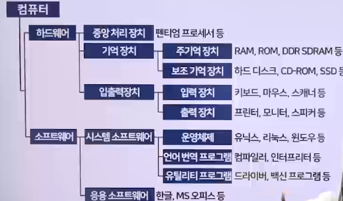
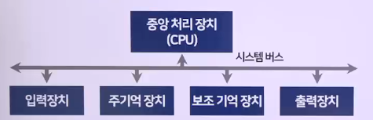
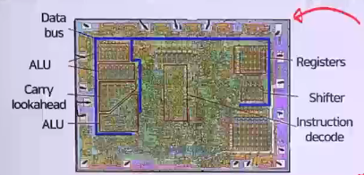
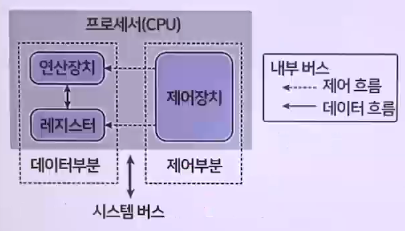
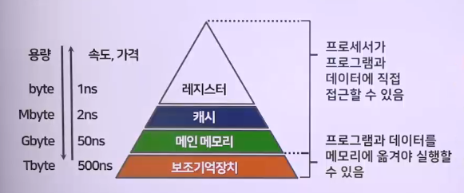
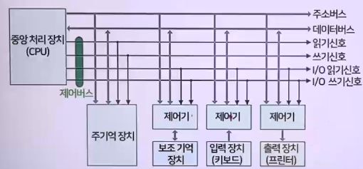
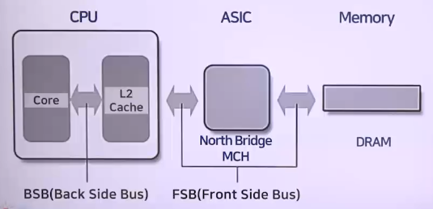
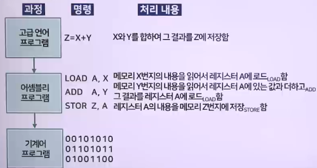
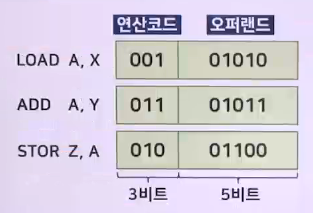
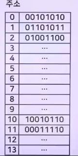

# 컴퓨터의 일반구조 및 구성

## 컴퓨터(시스템)의 일반구조 구성

- 하드웨어(데이터를 처리하는 물리적인 기계장치) + 소프트웨어(어떤 작업을 지시하는 명령어 프로그램)
- 

## 하드웨어

### 컴퓨터 하드웨어의 구성

- 중앙 처리장치, 주기억 장치, 보조 기억장치, 입력 장치, 출력 장치, 시스템 버스
- 시스템 버스 상호 연결 => 각 구성 요소 연결
- 

### 중앙 처리 장치(Central Processing Unit, CPU)

- 컴퓨터의 특성을 결정, 프로그램 실행과 데이터 처리 담당
- 프로세서(processor), 마이크로프로세서(microprocessor)
- 산술 논리 연산 장치(Arithmetic and Logic Unit, ALU)
  - 산술 연산 논리 연산, 보수 연산, 시프트 연산을 수행
- 제어 장치(Control Unit, CU)
  - 프로그램의 명령어 해독
    - 필요한 제어신호 발생, 컴퓨터의 모든 장치를 제어
- 레지스터(register)
  - CPU 내부에 있는 데이터를 일시적 보관하는 임시기억 장치
    - 프로그램 실행 중에 사용, 고속으로 액세스 가능
- 
- 

### 주기억 장치(main memory)

- 반도체 칩으로 구성 => 고속으로 액세스가 가능, 고가
- 프로그램 실행 중에 일시적으로만 사용, 휘발성 메모리

### 보조 기억 장치(auxiliary storage unit)

- 하드 디스크나 SSD, CD-ROM, 비휘발성 메모리
- 저장 밀도가 높고, 저가이며, 속도가 느림
- 많은 양의 데이터나 프로그램을 저장하는 장치

### 메모리 계층 구조

- 

### 입출력 장치

1. 입력 장치(input device)
   - 데이터를 2진형태로 변환 => 컴퓨터 내부로 전달
   - 키보드, 마우스 등
2. 출력 장치(output device)
   - CPU가 처리한 2진 형태 데이터 => 복원변환, 출력
   - LCD 모니터, 프린터, 스피커 등
3. 입출력 장치(I/O device)
   - 입력 장치 + 출력 장치

### 시스템 버스(system bus)

- CPU와 기억 장치 및 입출력 장치 사 정보정보 교환 통로
  - 주소 버스, 데이터 버스, 제어 버스
- 컴퓨터 내부의 다양한 신호를 시스템 버스로 전달
  - 데이터 입출력
  - 프로세서 상태
  - 인터럽트 요구와 허가
  - 클럭신호 등

1. 데이터 버스(data bus)
   - 프로세서, 메인 메모리, 주변장치간 데이터를 전송
   - 전송할 수 있는 비트 수를 결정, 워드(word)
   - 메모리 버퍼 레지스터(MBR) 연결, 양방향
2. 제어 버스(control bus)
   - 프로세서가 시스템의 구성요소를 제어하는데 사용
   - 제어신호로 연산장치의 연산 종류, 메모리 R/W 동작결정
   - CPU(제어장치), 메모리, 주변장치간 양방향
3. 주소 버스(address bus)
   - 메모리에 데이터를 R/W할 때 위치정보(주소) 전송
   - 배선 수는 프로세서와 연결하는 메모리의 최대용량 결정
   - 메모리 주소 레지스터(MAR)와 연결, 단방향
4. 인터페이스회로나 제어기
   - 보조 기억 장치, I/O장치는 속도가 느리기 때문에 CPU와 연결
   - 
5. 버스의 대역폭(band width)
   - 한 번에 전달할 수 있는 데이터의 최대 크기
   - 대역폭: 데이터버스를 통해 단위 시간당 전송 데이터크기
     - 단위 : byte/sec
   - 버스대역폭 = 버스 클록주파수 \* 데이터버스의 폭
     - ex.
       - 버스의 클럭 주파수가 100MHz -> 10nsec
       - 데이터 버스의 폭이 32Bit(4byte)
       - 4byte/10\*(10\*\*(-9))sec = 400Mbyte/sec

### 하드웨어 사양 관련 용어

1. 클럭(Clock) : CPU의 속도와 관련된 단위
   - 클럭이 일정 간격으로 틱(tick)을 만들면 거기에 맞추어 CPU 안의 모든 구성 부품이 작업함
   - 틱
     - 펄스(pulse)
     - 클럭틱(clock tick)
2. 헤르츠(Hz)
   - 클럭틱이 발생하는 속도를 나타내는 단위
   - 1초에 클럭틱이 한 번이면 1Hz, 1,000번이면 1kHz(1,000Hz)
   - 3.4GHz : 1초에 클럭틱이 3,400,000,000(3.4\*(10\*\*9))번 발생
     - CPU가 1초에 약 34억 번의 연산(작업)
3. FSB(Front-Side Bus)와 BSB(Back Side Bus)
   - 전면 버스 : 시스템 버스, 메모리와 주변장치를 연결
     - 메모리는 시스템 버스(FSB)의 속도로 작동
   - 후면 버스 : CPU 내부 버스, CPU 내부 장치 연결
     - CPU는 CPU 내부 버스(BSB)의 속도로 작동
   - 두 버스의 속도 차이
     - 작업 지연, 캐시(cache)로 해결
   - 

### 컴퓨터 시스템의 수행 기능

- 프로그램 실행 : CPU가 주기억 장치에서 프로그램 코드를 읽어 실행
- 데이터 저장 : 프로그램 실행 결과를 주기억 장치에 저장
- 데이터 이동: HDD같은 보조 기억 장치에 저장되어 있는 명령어와 데이터 블록을 주기억 장치로 이동
- 데이터 입출력 : 사용자가 키보드나 마우스를 통해 입력하는 명령어나 데이터를 입력하거나 CPU가 처리한 결과를 모니터나 프린터로 출력
- 제어 : 프로그램에서 정해진 순서에 따라 실행되도록 각종 제어 신호를 발생

## 소프트웨어

- 소프트웨어
  - 컴퓨터를 구성하고 있는 하드웨어를 잘 동작시킬 수 있도록 제어하고, 지시하는 모든 종류의 프로그램을 의미
- 프로그램
  - 컴퓨터를 사용해 어떤 일을 처리하기 위해 순차적으로 구성된 명령들의 집합

### 시스템 소프트웨어(system software)

- 하드웨어를 관리, 응용 소프트웨어를 실행

1. 운영체제(OS)
   - 컴퓨터 자원(CPU, 메모리, I/O 장치, 네트워크 장치, 프로세스)을 제어/관리하는 역할
   - 종류
     - WindowOS, MAC os, LINUX, UNIX, IOS, 안드로이드 등
2. 장치 드라이버(Device Driver)
   - 컴퓨터의 주변장치 구동/제어에 필요한 프로그램
3. 언어 번역 프로그램
   - 고급 언어 프로그램 => 기계어로 변환하는 프로그램
   - 인터프리터(interpreter)
     - 소스 프로그램을 한 줄씩 기계어로 변역, 실행 => 실행 속도가 컴파일러보다 느림
     - Basic, javascript, HTML, SQL, Python 등
   - 컴파일러(compiler)
     - 전체 소스 프로그램을 한 번에 기계어로 직접 번역, 실행 => 실행 속도가 빠름
     - C, C++. C#, 자바 등
4. 링커(Linker)
   - 프로그램에 의해 생성된 목적 프로그램 + 라이브러리 루틴
     - 실행 가능한 하나의 프로그램 연결
   - 연결 편집기(Linkage Editoer)
5. 로더(Loader)
   - 저장 장치에 보관된 프로그램을 읽어 주기억 장치에 적재
     - 실행 가능한 상태로 만드는 프로그램
   - 할당, 연결, 재배치, 적재 기능을 수행

### 응용 소프트웨어

- 컴퓨터 시스템을 일반 사용자 계정자, 특정한 용도에 활용하기 위해 만든 프로그램
- 애플리케이션, 앱, 어플

|        용도        | 예                               |
| :----------------: | -------------------------------- |
|       사무용       | 한글 MS-office 제품군            |
|      그래픽용      | 포토샵, 페인트샵, 일러스트레이터 |
|    멀티미디어용    | WinAMP, COM Player, PwerDVD      |
|       게임용       | 스타크래프트 등                  |
| 통신 및 네트워크용 | IE, 크롬, 카카오톡               |

## 프로그램 처리 과정

- 고급 언어 => 어셈블리어 => 기계어 순으로 변환
- 기계어 구조 예
  - LOAD A, X
    - 메모리 10번지의 내용을 읽어 레지스터 A에 LOAD(저장)
  - ADD A, Y
    - 레지스터 A의 내용 + 메모리 11번지의 내용
      - 그 결과를 레지스터 A에 LOAD(저장)
  - STOR Z, A
    - 레지스터 A의 내용을 메모리 12번지에 저장
  - 

### 연산 코드와 오퍼랜드

- 연산 코드(opcode)
  - CPU가 수행할 연산을 지정하는 비트들
  - 비트 수 = 3, 지정할 수 있는 연산의 최대 수 : 2³ = 8개
- 오퍼랜드(operand)
  - 연산에 사용 될 데이터가 저장되어 있는 기억 장치 주소
  - 비트 수 = 5, 주소지정할 수 있는 기억 장소의 최대 수 2\*\*5 = 32개
- 

### 프로그램 데이터가 주기억 장치에 저장되어 있는 형태

- 명령어와 데이터는 지정된 기억 장소에 저장
- 워드(word) 단위로 저장
  - 워드는 CPU에 의해 한 번에 처리될 수 있는 비트그룹
    - 8, 16, 32, 64비트
- 
