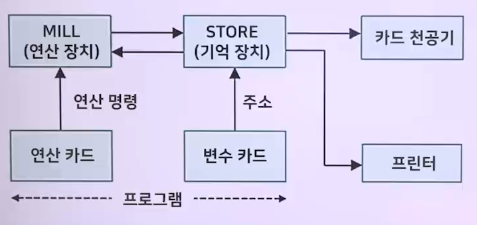
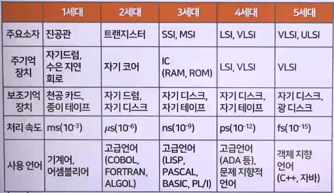
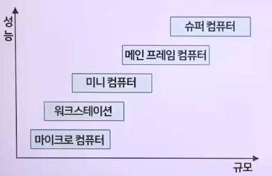
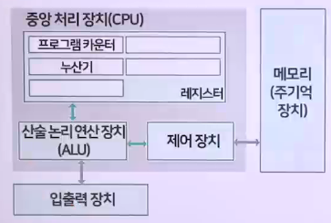
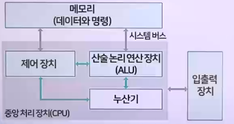
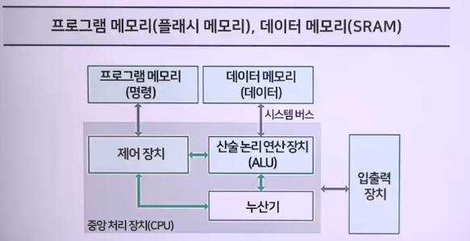

# 컴퓨터의 역사

## 컴퓨터의 발전 과정

### 초기의 계산 도구

- 주판 : 최초로 사용된 계산 도구
  - 기원전 3000년 경 고대 메소포타미아인들이 사용
- 기계식 계산기
  1. 파스칼 계산기(1642년)
     - 톱니바퀴를 이용한 수동 계산기
       - 기어로 연결된 파퀴판들로 덧셈과 뺄셈 수행
  2. 라이프니츠 계산기(1671년)
     - 곱셈/나눗셈 가능, 17세기 후반에 2진법을 창안
  3. 차분(difference engine)(1823년) : 영국 배비지
     - 삼각함수를 유효숫자 5자리까지 계산, 종이 표로 인쇄
     - 해석 기관(analytical engine)(1833년) : 영국 배비지
     - 방정식 순차적 연산 가능 기계식 계산기
     - 
  4. 천공 카드 시스템(Punch Card System, PCS)(1889년)
     - 미국의 홀러리스, 인구 조사 활용
- 전기 기계식 계산기
  1. MARK-1(1944년)
     - 하버드 대학의 에이킨 개발
     - 배비지의 해석 기관을 실현
     - 미해군의 탄도 계산
- 전자식 계산기
  1. 에니악
     - ENIAC, Electronic Numerical Integrator And Computer
     - 1946년, 에커트와 모클리, 진공관, 최초의 전자식 컴퓨터
  2. 에드삭
     - EDSAC, Electronic Delay Storage Automatic Calculator
     - 1949년, 윌키스, 10진수 + 프로그램 내장 방식 계산기
  3. 에드박
     - EDVAC, Electronic Discrete Variable Automatic Computer
     - 1951년, 폰 노이만, 2진수 + 프로그램 내장 방식 적용
  4. 유니박
     - UNIVAC, UNIVersal Automatic Computer
     - 1951년, 모클리와 에커트, 최초 상용 컴퓨터

## 컴퓨터의 세대별 분류

### 1세대 컴퓨터

- 진공관 사용 => 컴퓨터 크기 커짐, 열 발생량 증가, 전력 소모 증가
- 폰 노이만 제안, 프로그램 내장의 개념을 도입
- 수치 계산, 통계 등에 사용
- 컴퓨터 언어 : 기계어와 어셈블리어 사용
- 대표적인 컴퓨터 : ENIAC, UNIVAC, EDSAC, EDVAC

### 2세대 컴퓨터

- 대용량 보조 기억 장치(자기 드럼, 자기 디스크) 사용
- 운영체제의 개념 도입
- 다중 프로그래밍 기법 / 온라인 실시간 처리 방식 도입
- 과학 계산, 일반 사무용으로 사용
- TR 사용, 컴퓨터 고속화, 기억 용량 증가, 소형화
- SW 개발 주력한 시기, FORTAN, ALGOL, COBOL 등

### 3세대 컴퓨터

- IC개발: 캐시(cache) 기억 장치가 등장
- OMR, OCR, MICR 도입
- 시분할 처리 : 멀티프로그래밍을 지원
- 다중모드 시스템 등장
  - 일괄처리, 시분할처리, 실시간 처리, 다중 프로그램 제공
- TCP/IP 통신 표준화
- 경영 정보 시스템이 확립

### 4세대 컴퓨터

- 고밀도 직접회로(LSI)
- 초고밀도 집적회로(VLSI)
- 마이크로프로세서 개발
- 멀티미디어 실용화
- 인공지능(AI)의 개발
- 사무자동화(OA), 공장자동화(FA), 가정자동화(HA) 완료, 개인용 컴퓨터 등장

### 5세대 컴퓨터

- VLSI, ULS소자 : 초소형, 초고속 추구
- 경영 정보, 지식 정보, 인공지능, 신경망, 퍼지, 멀티미디어, 가상 현실을 목표
- GUI 환경 확장
- 다중 프로세서 : 병렬 처리/광 컴퓨터/ 신경망 컴퓨터 개발
- 인공지능의 연구 진행
- 비 폰 노이만 Non-Von Neumann 컴퓨터 구조 제안
- 객체 지향 프로그래밍 언어 사용

- 

### 직접 회로(Integrated Circuit, IC)의 분류

1. SSI(Small Scale IC) : TR < 수십개
   - 기본 게이트, 플립플롭
2. MSI(Medium Scale IC) : TR < 수백개
   - 디코더, 인코더, MUX, DeMUX, 카운터, 레지스터, 소형기억 장치
3. LSI(Large Scale IC) : TR < 수천개
   - 8비트 마이크로프로세서, 소규모 반도체 기억 장치 칩
4. VLSI(Very Large Scale IC) : TR < 수만~수십만개
   - 대용량 반도체 메모리, 1만 게이트 이상의 논리회로, 단일 칩 마이크로 프로세서
5. ULSI(Ultra Large Scale IC) : RT < 수백만개
   - Intel 486/팬티엄, 수백 Mbyte 기억 장치 칩

## 컴퓨터의 분류

### 데이터 형태에 따른 분류

- 아날로그 컴퓨터(analog computer)
  - 연속적인 변량을 사용하여 계산을 수행
  - 신속한 입력 => 즉각적인 반응 => 프로세스 제어 적합
  - 전압, 전류, 온도, 압력 등의 데이터를 처리
- 디지털 컴퓨터(digital computer)
  - (숫자, 문자) => 코드화, 필요한 정밀도 결과
  - 데이터를 분석, 결과 => 숫자, 문자 구분 가능
- 하이브리드 컴퓨터(hybrid computer)
  - 아날로그 + 디지털 신호 모두 처리 가능
  - A/D 변환기, D/A 변환기로 필요한 형태로 변환

### 사용 목적에 따른 분류

- 전용 컴퓨터
  - special purpose computer
  - 특수한 목적, 군사용, 기상 예보용, 천문학, 물리 분야 등
  - 고정 프로그램, 일정한 데이터만 취급
- 범용 컴퓨터
  - general purpose computer
  - 일반 목적용 컴퓨터
  - 과학 계산, 통계 데이터 처리, 생산 관리, 사무 관리 등
  - 유연성, 기억 용량 증대, 처리 속도의 신속화, I/O 다양화
    - 확장, 조정 가능

### 성능과 규모에 따른 분류

- 정성적 측면에서 분류 => 기억 용량, 처리 능력, 가격 측면
- 

1. 마이크로 컴퓨터(microcomputer)
   - 최근 가장 널리 사용되고 있는 범용 컴퓨터
   - 마이크로프로세서를 CPU로 사용하는 컴퓨터를 의미
     - 워크스테이션, 개인용 컴퓨터(PC)
   - (1970년 후) 개인용 컴퓨터 등장
   - (1980년) 마이크로프로세서 성능 향상
     - 응용 범위 확산
2. 워크스테이션(workstation)
   - 전문직 우수한 성능을 요구
3. 미니 컴퓨터(minicomputer)
   - (성능/규모) 마이크로컴퓨터 ~ 메인 프레임 컴퓨터 중간
   - 대용량 기억장치 + 고속 주변 장치
     - 다수 사용자, 동시 사용
4. 메인 프레임 컴퓨터(main frame computer)
   - 대형 컴퓨터 => 다수의 사용자가 공유 사용
   - 단말기(terminal)를 통해 접근
   - 은행, 보험, 병원 업무 등
5. 슈퍼 컴퓨터(super computer)
   - 고속연산처리(CPU), 대용량 주기억 장치, 강력한 병렬처리
   - 기상예측, 석유탐사, 원자력 개발

## 폰 노이만, 비 폰 노이만, 하버드 구조

### 폰 노이만 구조(Von Neumann Architecture)

- 폰 노이만(John von Neumann)에 의해 고안된 컴퓨터 구조
  - 헝가리 출신의 미국 수학자(1903~1957년)
- 메모리, CPU 간의 연결장치로 구성되는 구조
- 폰 노이만 구조의 프로그램 처리 과정
  1. PC를 이용해 메모리에서 실행할 명령어를 인출
  2. 제어 장치(CU)는 이 명령어를 해독
  3. 데이터를 메모리에서 인출 => 레지스터에 저장
  4. ALU는 명령 실행, 레지스터나 메모리에 결과를 저장
  - 

#### 폰 노이만 구조의 특징

- 프로그램, 데이터가 모두 하나의 기억장소(메모리)에 있음
- 프로그램 내장 방식 / 축적 프로그램 방식 (Stored Program)
  - 폰 노이만 구조의 프로그램 처리 과정
- CPU와 기억장소가 서로 분리됨
  - 연산의 입력 및 결과가 CPU와 기억장소 간에 전달됨
- SIMD (Single Instruction Multiple Data)
- 데이터 버스와 주소 버스를 모두 갖는 구조
- 현대 컴퓨터 대부분에서 이 방법을 사용
  - 하나의 메모리에만 접근하기 때문에 단순함

#### 폰 노이만 병목 현상(Von-Neumann Bottleneck)

- 데이터를 메모리 인출, 저장 반복적 과정 순차적 진행
- 메모리, 시스템 버스에 병목 현상 발생
  - 데이터 경로의 병목 현상, 기억 장소의 지연 현상
  - 

### 비 폰 노이만 구조

- 데이터 처리 고속화/고도화 => 프로그램 일부 하드웨어화
  - 병렬 처리, 추론 기구를 채택한 컴퓨터
- 신경망, 유전 알고리즘, 양자 컴퓨터 병렬 컴퓨터

### 하버드 구조(Harvard Architecture)

- 프로그램과 데이터가 각각 다르게 분리되어 취급
- 프로그램 명령어와 데이터가 다른 비트 수 기반
  - 프로그램 메모리, 데이터 메모리에서 취급
- 하버드 구조는 비싸고 공간도 많이 차지하며 설계가 복잡하다.
- 
