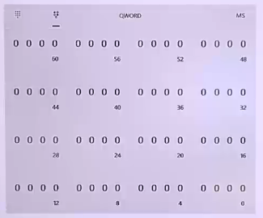
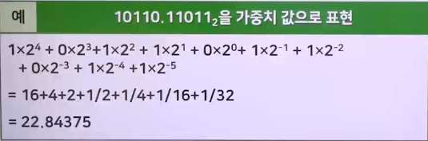
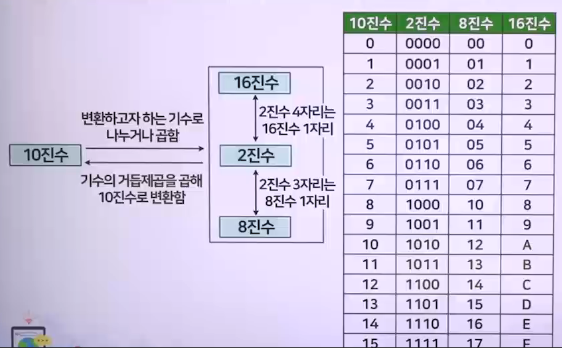
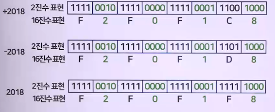

# 자료표현 1 (데이터 표현의 진법과 진법 변환)

## 디지털 정보의 단위

1. 비트(Bit, Binary Digit)
   - 정보의 최소 단위
   - bit는 binary digit의 약자
   - 두 가지 상태(0 또는 1)를 표시하는 2진수 1자리입
2. 니블(Nibble)
   - 4비트로 나타낼 수 있는 정보단위
   - 4개의 비트가 모여 1개의 니블을 구성함
3. 바이트(Byte)
   - **문자**를 표현하는 최소 단위
   - 8개의 비트가 모여 1바이트를 구성함
   - 주소 지정의 단위로 사용됨
4. 워드(Word)
   - 컴퓨터가 한 번에 처리할 수 있는 명령 단위
   - Word : 2Byte (16bit CPU)
   - Double-Word : 4Byte (32bit CPU), 4Byte (64bit CPU)
   - Quad-Word : 4Byte (32bit CPU), 8Byte (64bit CPU)
   - 
   - 
5. SI 단위와 IEC 단위 비교
   - 

## 진법

### 10진법

> 10진수 시스템에서 0~9까지의 10개의 숫자로 표현

- 기수는 10
- 가중치(weight) 구조
- 

### 2진법

> 2진수 시스템에서 0과 1의 2개의 숫자로 표현

- 가중치(weight) 구조
- 디지털 시스템에서는 2진수 사용
- 

### 8진법

> 0~7까지의 숫자로 표현

- 가중치(weight) 구조
- 데이터 통신의 IPv4 표현에서 응용
- 

### 16진법

> 0~9, A~F까지의 숫자, 문자로 표현

- 가중치(weight) 구조
- 컴퓨터 구조, 어셈블리어 => 자릿수를 더 짧게 표현 가능
- 

## 진법의 변환

### 2진수를 10진수로 변환한 예

- 

### 8 진수를 10진수로 변환한 예

- 

### 10진수를 2진수로 변환하는 방법

- 

### 10진수를 8진수로 변환하는 방법

- 

### 10진수를 16진수로 변환하는 방법

- 

### 2 - 8 - 10 - 16진수 상호 변환

- 

## 10진 정수 표현

1. 언팩 10진 형식
   - 1바이트를 존(zone) 부분과 디지트(digit) 부분 구성
     - 존 부분 : 항상 F(1111) 추가
     - 디지트 부분 : 10진수 값이 8421 BCD 코드 형식 표시
   - 부호 표시 : 가장 오른쪽(하위)바이트의 존 부분에 부호 표시
     - 양수(+) : 1100(C), 음수(-) : 1101(D)
     - 부호가 없을 때 : 1111(F)
     - 
     - 
2. 팩 10진 형식
   - 언팩 10진 형식, 연산 전에 팩 10진 형식으로 변환시켜 연산
     - 연산 결과 출력할 때 다시 언팩 10진수로 변환
   - 1바이트에 2개의 디지트를 각각 8421 BCD 코드 표시
   - 부호 표시 : 가장 오른 쪽(하위) 바이트 하위 4비트 부호 표시
     - ASCII 코드 : 양수(+)는 1010(A), 음수(-)는 1011(B)
     - EBCDIC(확장 이진화 10진화 코드)
       - 양수(+)는 1100(C), 음수(-)는 1101(D)
     - 
     - 

## 실수 표현

### 컴퓨터 과학적 표기방식 - 2진 부동 소수점 표현

1. 표준 : IEEE 754표준
2. 실수의 부동 소수점 표현
   - 
3. 표현 내 필수 요소 : 부호, 가수, 지수
4. 단정도(single precicion) / 배정도(double precision)
   - 정밀도(precision) = 유효자리수(Significant Digit)
5. IEEE 754 (1985, 2008, 2019)
   - 실수 표기 방식, 실수 연산에 관한 규정
   - 오버/언더플로우의 처리, 반올림에 관한 규정 등을 포함
   - 대단히 방대한 표준

### 정규화(normalization) : 과학적 표기방법

1. 2진수의 정규화
   - 
2. 바이어스(bias) : 지수의 양수, 음수를 나타내기 위한 방법
   - (IEEE 754) 바이어스 127(단정도) 또는 1023(배정도) 사용
   - 표현 지수 = 바이어스 + 2진 지수 값
   - 
3. 단정도(single precision, 단정밀도) 표현법
   - 
   1. 비트 수
      - 부호 1비트, 지수부 8비트, 가수부 23비트 = 32비트
   2. 수치표현
      - 가수 부분 정규화
      - 가수 부분 첫째 비트 : 항상 1 (1.xxx)
        - 2진수 소수부 표현이 항상 1
      - 
4. 배정도(double precision) / 배정밀도(double precision)
   - 
   1. 비트 수
      - 부호부 1비트, 지수부 11비트, 가수부 52비트 = 64비트
   2. 수치 표현
      - 가수 부분
        - 1.ddd...d 부분이 52비트
      - 가수 부분의 유효자리수가 2진수 53자리(부호 포함)
        - 10진수 유효자리수 : 2의 53제곱 = 10의 15.95제곱으로 약 16자리가 됨
   3. 배정밀도의 장점 및 단점
      - 가수 부분 자리수가 많으므로, 반올림 오차를 줄일 수 있음
      - 정밀도에 비해 2배 이상의 메모리 및 계산 시간 필요
   - 1/256을 단정도 부동소수점 방식 예
     - 
5. 컴퓨터에서의 부동소수점수의 표현 범위
   - 
