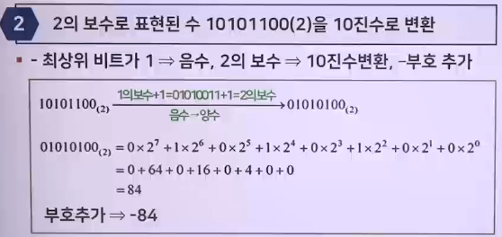
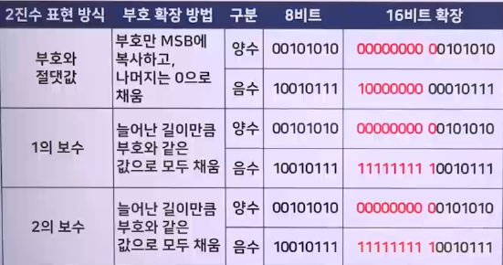

# 자료표현 2 (데이터의 부호 표현)

## 보수의 개념과 음수

### 표현 범위 내의 2진수의 표현

1. 최상위비트(MSB)를 부호비트로 사용
   - 양수(+) : 0, 음수(-) : 1
2. 2진수 음수를 표시하는 방법
   - 부호와 절댓값(sign-magnitude)
     - 부호비트만 양수와 음수를 나타내고 나머지 비트들은 같음
     - 
   - 1의 보수(1's complement)
   - 2의 보수(2's complement)

### 2진수의 1의 보수와 2의 보수

> 음수를 표현하는데 매우 유용하게 사용됨

1. 2진수의 1의 보수(one's complement)
   - 2진수의 1의 보수는 각 비트를 변화하면 됨
     - 모든 1을 0으로, 모든 0을 1로 바꾸면 됨
   - 디지털 회로를 이용한 방법
     - 
2. 2진수의 2의 보수(two's complement)
   - 디지털 시스템에서는 음수 표현을 위해 2의 보수 사용
   - 1의 보수에 1을 더함
   - 
   - 디지털 회로를 이용한 방법
     - LSB부터 시작하여 첫 번째 1인 비트 변경없이 씀
     - 나머지 비트들은 1의 보수로 변경
     - 

### 부호표시 수

1. 부호 비트(Sign bit)
   - 2진수의 가장 좌측 비트가 0이면 양수, 1이면 음수
     - 
2. 부호 표시 수의 표현
   1. 부호-크기 형식
      - MSB : 부호 비트, 나머지 비트 : 크기 비트
      - 크기 비트들은 양수나 음수에 관계없이 크기만을 표시 (보수화되지 않은 참 2진수)
      - 
   2. 1의 보수 형식
      - 양수 표현 : 부호-크기 시스템과 같은 방법으로 표현
      - 음수 표현 : 대응되는 양수의 1의 보수로 취함
      - 
   3. 2의 보수 형식
      - 양수 표현 : 부호-크기/1의보수 형식과 같은 방법
      - 음수 표현 : 대응되는 양수의 2의 보수로 취함
      - 
3. 부호표시 수를 10진 값으로 변환하는 방법
   - 
   - 
   - 

### 부호표시 수의 표현 범위

- n비트로 표현할 수 있는 수의 조합 = 2ⁿ
- n비트로 표현할 수 있는 값의 범위
  - 
  - (컴퓨터시스템)부호표시 수를 표현하기 위해 2의 보수 사용
- 
- 

### 2의 보수를 10진수로 변환 예

- 
- 

## 부호의 확장

### 2진수 표현 방법에 따른 부호 확장

> 부호 확장이란, 늘어난 비트 수만큼 부호를 늘려주는 방법

- 

## 부호표시수의 산술연산

### 덧셈

- 가수(addend)와 피가수(augend), 합(sum)
  - 결과 : 합(sum), 캐리(carry) => 최종 캐리는 버림

1. 4가지 경우의 덧셈 수행과정 (8bit 기준)
   - 
   - 
2. 오버플로우(overflow) 조건
   - 결과의 부호 비트가 더해지는 수의 부호 비트와 다를 경우
   - 두 수가 모두 양수, 음수일 때만 발생
   - 

### 뺄셈

- 피감수(minuend)와 피가수(subtrahend), 차(difference)
- (피감수) - (감수) = (피감수) + (-감수)
- 발생된 캐리는 버림
  - 

### 곱셈

- 피승수(multiplicand)와 승수(multiplier), 곱(product)
- 직접 덧셈 방법 : 피승수를 승수의 횟수만큼 더하는 과정
  - 8(피승수) \* 3(승수) = 8 + 8 + 8
  - 75 \* 100 = 75 + 75 + 75 + ... + 75(75를 100번 더함)
  - 
- 부분 곱 방법 (단계별)
  1. 피승수와 승수의 부호가 동일여부 결정
  2. 음수는 참 형태로 변환
  3. 승수의 LSB부터 시작하여 부분곱을 만들고, 부분곱을 한 비트씩 좌측으로 이동
  4. 각 부분곱을 그 이전에 생긴 부분 곱들의 합에 더해 최종 곱을 구함
  5. 단계1부호 비트가 음수인 경우, 최종 곱의 2의 보수. 단계1부호 비트가 양수인 경우, 참형(원래숫자)으로 그대로 둠. 부호비트를 최종 곱의 결과에 부가
  - 

### 나눗셈

- 피제수(dividend)와 제수(divisor), 몫(quotient)
- 직접 덧셈 방법 : 몫은 (피제수 - 제수)를 뺄 수 있는 횟수
- 부분 곱 방법 (단계별)
  1. 단계
     - 피제수와 제수의 부호가 동일여부 결정
  2. 단계
     - 첫 번째 나머지 : 2의 보수 덧셈
     - 첫 번째 몫 : 캐리는 몫 1
     - 부분 나머지가 양수 : 단계 3으로 진행
     - 0또는 음수 : 나눗셈을 완료
  3. 단계
     - 승수의 LSB부터 시작하여 부분 곱을 만듦
     - 부분 곱을 한 비트씩 좌측으로 이동
  - 
  - 
