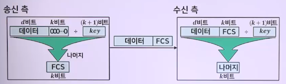

# 자료표현3(데이터 표현의 디지털 코드와 오류검출 코드)

## BCD 코드

> Binary Coded Decimal Code, 2진화 10진 코드, 8421 코드

- 10진수 0(0000)부터 9(1001)까지를 2진화한 코드
- 표기는 2진수이지만 의미는 10진수
- 1010~1111까지 6개는 사용하지 않음
- 키패드 입력, 디지털 판독 시 표현 방법

### 가중치 방식 코드 : 자리마다 가중치(자릿값)

- 

### 비가중치 방식 코드 : 자리마다 가중치 없음

- 

### 8421코드

1. 표현범위
   - 
2. 무효코드
   - 4비트로 표현되는 16개의 숫자 중 0부터 9까지만 표현되므로 무효코드는 사용하지 않는 코드
   - 1010, 1011, 1100, 1101, 1110, 1111
   - 10진수->BCD 코드 변환
     - 
     - 
3. 8421코드의 연산
   - 1단계
     - 2진 덧셈 규칙으로 두 BCD 수를 덧셈
   - 2단계
     - 4-비트 합 <= 9 => BCD 수 적용
   - 3단계
     - 4-비트 합 > 9 -> 합 + 6(0110)
     - 6을 더한 결과 캐리가 생기면, 한자리 올려서 다음 4-비트 그룹에 더함
     - 
4. 3초과 코드
   1. BCD + 3(0011)
      - 3초과 코드, 모든 비트가 동시에 0이 되는 경우가 없으므로, 단선 등에 의한 신호 두절을 구별할때 유용함
   2. 무효코드
      - 0000, 0001, 0010, 1101, 1110, 1111
   3. 자기보수의 성질
      - 
   4. 10진수의 3초과 코드 변환
      - 
   5. 3초과코드의 연산
      - 1단계
        - 2진수 덧셈과 같은 방법으로 더함
      - 2단계
        - 계산 결과의 4비트 군에 자리 올림이 없으면 6초과 값이 되므로, 3초과 값을 만들기 위해 결과에서 0011(3)을 뺌
      - 3단계
        - 계산 결과 4비트 군에 자리 올림이 발생하면 2진수 값이 되므로, 3초과 값을 만들기 위해 결과에 0011(3)을 더해줌
      - 
5. 그레이 코드
   - 가중치 없는 비산술용 코드
   - 연속되는 코드들 간에 하나의 비트만 변화 => 코드 생성
   - 용도 : 고속 I/O 장치와 ADC에서 오류를 줄이기 위해 이용
   - 
   - 2진 코드와 그레이 코드의 상호 변환 방법
     - 

## 영문-숫자 코드(Alphanumeric code)

### ASCII(American Standard Code for Information Interchange)

> 컴퓨터나 디지털시스템에서 사용되는 코드

1. 7비트 표현방식 : 128개의 문자 조합(코드값 0~127)
   - 영어 대소문자(52) + 숫자(10) + 특수문자(33) + 제어문자(33) = 128가지
   - 95개 인쇄 가능 문자(32~126) + 33개 제어문자(0~31, 127) = 128가지
2. EBCDIC(Extended Binary Coded Decimal Interchange Code)
   - 8비트 표현, 256개의 문자 조합(코드값 0~255)
   - 오류 검출 방식으로 사용
   - 비영어권에서 문자 표현 확대를 위해 사용

### ASCII의 기능에 따른 문자의 구분

- 그래픽 문자 : 0 ~ 9, a ~ z, A ~ Z, 특수문자 등
- 비 그래픽 문자 또는 제어 문자
  - 화면 제어, 장치제어문자 : 32개(00 ~ 1F)

### 주요 제어 문자별 특성

- SOH, STX, ETX, EOT, ETB
- ENQ, ACK, NAK
- DLE, SYN
- 전송 제어 문자
  - SOH (Start of Heading) (1) : 정보 메세지 헤더의 첫번째 글자로 사용됨
  - STX (Start of Text) (2) : 본문의 개시 및 정보 메세지 헤더의 종료를 표시
  - ETX (End of Text) (3) : 본문의 종료를 표시한다
  - EOT (End of Transmission) (4) : 전송의 종료를 표시하며, 데이타 링크를 초기화
  - ENQ (Enquiry) (5) : 상대국에 데이타링크의 설정 및 응답 요구
  - ACK (Acknowledge) (6) : 수신한 정보 메세지에 대한 긍정 응답
  - DLE (Data Link Escape) (16) : 뒤따르는 연속된 글자들의 의미를 바꾸기 위해 사용,
    주로 보조적 전송제어기능을 제공
  - NAK (Negative Acknowledge) (21) : 수신한 정보 메세지에 대한 부정 응답
  - SYN (Synchronous Idle) (22) : 문자를 전송하지 않는 상태에서 동기를 취하거나,
    또는 동기를 유지하기 위하여 사용
  - ETB (End of Transmission Block) (23) : 전송 블럭의 종료를 표시
- 포멧 제어 문자

  - B S (Backspace) (8) : 프린터 헤드나 커서를 한 위치 왼쪽으로(역방향) 이동
  - H T (Horizontal Tabularion) (9) : 프린터 헤드나 커서를 정해진 수 만큼 수평 위치로 전진
    . 수평탭
  - V T (Vertical Tabulation) (11) : 프린터 헤드나 커서를 수평 위치는 변경시키지 않고,
    미리 정해진 수의 줄 만큼 전진
    . 수직탭
  - L F (Line Feed) (10) : 프린터 헤드나 커서를 다음 줄의 같은 글자 위치로 전진
  - F F (Form Feed) (12) : 프린터 헤드나 커서를 다음 페이지의 같은 위치로 이동
  - C R (Carriage Return) (13) : 프린트 헤드나 커서를 같은 줄의 맨 처음 위치에 이동

- 장치 제어 문자

  - DC1 (Device Control 1) (17) : 단말장치에 접속되어 있는 보조장치의 물리적 기능을 제어
  - DC2 (Device Control 2) (18)
  - DC3 (Device Control 3) (19) : 단말장치의 화면내용을 보조 프린터에 인쇄
  - DC4 (Device Control 4) (20) : 단말장치의 키보드가 잠김(lock)되어 이용자가 데이타를 입력 할 수 없도록 하는 데 사용

  > 사실상, 장치 제어 문자의 구현은 장치 제조업자에 달려 있음. DC1은 단말장치에 연결된 카세트 레코드의 ON에 사용하고, DC2 카세트 레코드를 OFF 하는데 사용하는 등

- 정보 분리 문자

  - FS (File Separator) (28) : 화일의 경계를 할당
  - GS (Group Separator) (29) : 레코드 그룹의 경계를 할당
  - RS (Record Separator) (30) : 레코드의 경계를 할당
  - US (Unit Separator) (31) : 장치의 경계를 할당

- 특수 제어 문자
  - NUL (Null) (0) : 전송되는 문자와 문자 사이에 시간공백을 주도록 함
  - BEL (Bell) (7) : 경고
  - SI (Shift In) (15) : 도형문자 사용 시작을 표시하는 제어문자 로, SO 와 짝을 이루어 사용
  - SO (Shift Out) (14) : 도형문자 사용 종료를 표시하는 제어문자 로, SI와 짝을 이루어 사용
  - CAN (Cancel) (24) : 선행 데이타가 틀리는 경우를 가르키며, 이를 무시함
  - EM (End of Medium) (25) : 기록부분의 완료를 가르킴
  - SUB (Substitute Character) (26) : 무효 또는 잘못된 문자를 치환하는 것에 사용
  - ESC (Escape) (27) : 제어기능을 추가하는 경우에 사용
  - SP (Space) (32) : 동작위치를 동일행에서 1 문자만큼 앞으로 진행
  - DEL (Delete) (127) : 주로 종이 테이프 위의 불필요한 부호를 삭제

## 패리티 비트(Parity Bit) 오류검출코드

### 패리티 검사(Parity Check)

> 정보 비트 수가 적고, 오류 발생 확률이 낮은 경우 주로 사용하는 오류검출 방식

- 특징
  - 오류검출 가능, 오류정정 불가능
  - 어느 비트에 오류가 발생하였는지 알 수 없고, 짝수 개의 오류가 발생 시 오류 검출이 불가능
  - 구현이 간단하며, 비동기 통신에 많이 이용

### 패리티 검사 비트(Parity Check Bit)

- 패리티 검사를 위해 추가되는 비트들
- 메시지 비트(정보 비트)들의 선형결합으로 만들어짐
- 짝수패리티(even parity) : 데이터 1의 개수를 짝수 개로 맞춤
- 홀수패리티(odd parity) : 데이터 1의 개수를 홀수 개로 맞춤
- 

## 순환 중복 검사(CRC. Cyclic Redundancy Check)

### 순환 중복 검사의 특징

- 높은 신뢰도 확보, 오류 검출을 위한 오버헤드가 적고, 랜덤 오류나 버스트 오류를 포함한 오류 검출률 좋음
- 컴퓨터 단말기 간, 디지털 시스템과 디지털 저장장치(CD, DVD 등) 간에 통신과정
- 1~2개의 비트 오류를 검출하는 방법

### CRC 발생기 및 검출기

- 

### CRC 계산에 사용되는 모듈로-2 연산

- 사칙 연산에서 캐리는 고려하지 않음
- (+, -) 연산과 결과가 같으며 XOR 연산과도 같음
  - 
- 연산 예시
  - 
  - 

### 생성다항식

- 

## 해밍 코드(Hamming code)

### 해밍 코드 특징

- 단말기 간 오류를 검출, 정정할 수 있는 코드
- 추가적인 비트 필요하지만 오류비트 위치까지 알 수 있음
  - 디지털TV(실시간) 데이터 전송시 오류 정정에 유리
- 짝수 패리티 비트를 사용

### 패리티 비트와 데이터 비트의 관계

- 

### 패리티 비트의 위치와 데이터 비트의 위치

- 

### 패리티 비트의 생성과정

- 

### 오류 검출하여 정정하는 과정

- 
