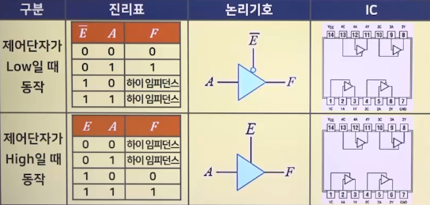

# 디지털 논리회로의 논리게이트

## 기본 논리게이트의 개념과 종류

### TTL과 CMOS 논리 레벨 정의역역

- 

### NOT 게이트

- 

### Buffer 게이트

- 
- 3상태(tri-state) 버퍼 : 출력 레벨(High, Low, 하이 Hi-Z)
  - 

### AND 게이트

- 2입력
  - 
- 3입력
  - 

### OR 게이트

- 2입력
  - 
- 3입력
  - 

## 범용 논리게이트의 개념과 종류

### NAND 게이트

- 2입력
  - 
- 3입력
  - 

### NOR 게이트

- 2입력
  - 
- 3입력
  - 

### XOR 게이트

- 2입력
  - 
- 3입력
  - 

### XNOR 게이트

- 2입력
  - 
- 3입력
  - 

## NAND게이트와 NOR게이트의 활용

### NOT 게이트

- 

### AND 게이트

- 

### OR 게이트

- 

### XOR 게이트

- 
