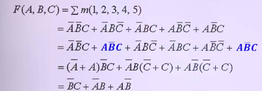

# 디지털 논리회로의 불대수와 조합논리회로

## 불대수(Boolean Algebra)의 법칙

### 불대수식의 개념

> 불대수식 : 기본 불대수식은 AND, OR, NOT을 이용하여 표현

- AND식(곱셈의 형식), OR식(덧셈의 형식), NOT식
- 완전한 논리식 => 입력 항목들의 상태에 따른 출력을 결정
- 

### 불대수식의 기본 법칙

1. 항등/누승/보간/이중 부정 법칙
   - 
   - 
2. 교환 법칙(commutative law)
   - 
3. 결합 법칙(associate law)
   - 
4. 분배 법칙(distributive law)
   - 
5. 드모르간의 정리(De Morgan's theorem)
   - 
   - 
6. 흡수 법칙(absorptive law)
   - 

## 불대수식의 표현 형태

### 곱의 합과 최소항

1. 곱의 합(SOP, Sum Of Product)
   - 
2. 최소항(minterm) : AND항
   - 
   - 

### 합의 곱과 최대항

1. 합의 곱(POS, Product Of Sum)
   - 
2. 최대항(maxterm) : OR항
   - 
   - 

## 논리식의 간소화

### 간소화의 목적

- 지연시간 감소
- 동작주파수 증가
- 소비전력 감소
- 소형화
- 비용(cost) 감소

### 간소화 방법

- 불 대수 법칙 이용 : 기본 법칙 이용
  - 
- 카르노 맵 이용 : 변수 개수 4개 이하
  - 2변수
    - 
    - 
  - 3변수
    - 
    - 
    - 
  - 4변수
    - 
    - 
    - 
    - 
    - 
- 도표법 이용 : 퀸-맥클러스키
- 무관항이 있는 경우
  - 입력 값이 0이든 1이든 상관 없음
    - 입력이 결과에 영향을 미치지 않는 최소항
  - 
- XOR과 XNOR의 카르노 맵
  - 
  - 

## 조합 논리 회로(combinational logic circuit)의 개요

### 개념 및 설계과정

1. 현재 입력 값으로 결정되는 회로
   - 
2. 조합논리회로의 설계과정
   - 

## 조합 논리 회로의 종류

### 반가산기(Half-Adder. HA)

- 
- 

### 전가산기(Full-Adder. FA)

- 
- 진리표
  - 
- 논리회로
  - 
- 논리기호
  - 
- 논리식
  - 

### 반감산기(Half-Subtractor. HS)

- 진리표와 원리
  - 
- 논리식
  - 
- 논리회로와 논리기호
  - 

### 전감산기(Full-Subtractor. FS)

- 진리표와 원리
  - 
- 논리회로와 논리기호
  - 
- 논리식의 유도
  - 
