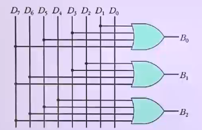
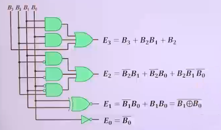

# 조합논리회로의 응용회로

## 비교기(comparator)

- 2진 비교기는 두 2진수의 값의 크기를 비교하는 회로
- 진리표화 논리회로
  - 

## 디코더와 인코더

### 디코더(decoder). 복호기

1. 개념
   - 입력선(n비트 2진 코드)
     - 출력(최대 2\*\*n개), AND게이트 구성
2. 진리표와 논리식
   - 
3. 논리회로
   - 
4. 실제 디코더 회로 => NAND게이트 구성, enable제어
   - 진리표와 논리식
     - 
   - 논리회로
     - 
5. 3\*8 디코더
   - 3개의 입력에 따라서 8개의 출력 중 하나가 선택
     - 
   - 논리회로
     - 
6. 4\*16 디코더 => 2개의 3\*8 디코더로 구성
   - D=0, 상위 enable, 하위 disable
   - D=1, 하위 enable, 상위 disable
   - 

### 인코더(encoder). 부호기

1. 디코더 반대 기능
   - (입력) 2\*\*n개 중 1비트
   - (출력) n 비트 2진 정보
2. 진리표와 논리식
   - 
3. 논리회로
   - 
4. 8\*3 인코더
   - (입력) 8(=2\*\*3)
   - (출력) 3개
     - 입력의 신호에 따라 3개의 2진 조합 출력
   - 
   - 논리회로
     - 

## 멀티플렉서와 디멀티플렉서

### 멀티플렉서(multiplexer. MUX). 데이터 선택기

1. 개념
   - 여러 개의 입력선들 중에서 하나 선택
     - 출력선에 연결
     - 선택선들의 값에 따라서 특별한 입력선이 선택
   - 디멀티플렉서(demultiplexer, DEMUX)
     - Mux의 반대 기능
   - 
2. 2\*1 MUX: 2(=2\*\*1)개의 입력, 선택선(S) 1개
   - 
   - 논리회로
     - 
3. 4\*1 MUX : 4(=2\*\*2)개의 입력, 선택선(S) 2개
   - 
   - 논리회로
     - 
4. 4\*1 MUX 응용(논리 연산 가능한 HW 모듈)
   - (입력 A, B) AND, OR, XOR, NOT 논리 연산 가능한 HW 모듈
     - 
     - 
5. 4\*1 MUX 응용(조합논리회로 구현)
   - 
     - 
     - 
   - 
     - 
     - 

### 디멀티플렉서(demultiplexer. DEMUX). 데이터 분배기

1. (입력선, 1개) 데이터입력 -> (선택선 n개) 2\*\*n개 중 하나 출력
2. 1\*4 DeMux : 선택선(S1, S0)
   - 출력(D3, D2, D1, D0) 중 하나를 선택해 입력(l)을 연결
   - 4\*1 DeMux 응용(조합논리회로 구현)
     - 
     - 회로도
       - 

## 그레이코드 변환기. 패리티비트 발생기/검사기

### 2진 코드 -> 그레이 코드 변환기

- 코드변환 진리표
  - 
- 논리식 유도
  - 
- 회로도
  - 

### 그레이 코드 -> 2진 코드 변환기

- 코드변환 진리표
  - 
- 논리식 유도
  - 
- 회로도
  - 

### BCD 코드 -> 3초과 코드 변환기

- 코드변환 진리표
  - 
- 논리식 유도
  - 
- 회로도
  - 

### 패리티 발생기와 검사기

1. 패리티 발생기
   - 진리표
     - 
   - 논리식의 유도
     - 
   - 논리회로
     - 
2. 패리티 검사기 -> (Y = 0 정상), (Y = 1 오류 발생)
   - 진리표
     - 
   - 논리식의 유도
     - 
   - 회로도
     - 
3. 데이터 전송 시스템에서 패리티 발생/검출 회로
   - 
