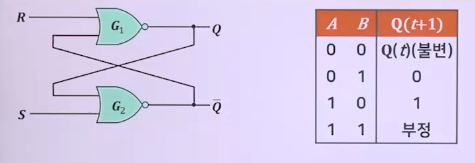

# 순서논리회로의 개념과 설계

## 순서 논리 회로(sequential logic circuit)의 개념

### 개념과 특징

1. 조합 논리 회로(combinational logic circuit)
   - 이전 입력 값에 관계없이 현재 입력 값에 따라 출력이 결정
2. 순서 논리 회로(sequential logic circuit)
   - 현재의 입력 값과 이전 출력 상태에 따라 출력 값이 결정
   - 
3. 순서 논리 회로의 출력은 외부에서 들어온 입력과 이전 출력 상태에 따라 결정
   - 동작은 클럭 펄스가 들어올 때마다 반복해서 일어남
4. 기억 기능
   - 플립플롭, 카운터, 레지스터 등

### 클럭 펄스

- 플립플롭은 클럭 펄스(CP)라는 제어 입력을 가지며, 출력은 클럭 펄스에 동기되어 변함 -> 트리거(trigger)
- 

### 펄스 전이 검출기

- 플립플롭 동작 파형 -> 엣지 트리거(edge trigger)
- 클럭 펄스(구형파)로 엣지 트리거 생성
- 

### 플립플롭의 특징

- 1비트의 정보를 기억할 수 있는 기억 소자
- 제어 입력 -> 클럭 펄스(CP), 다음 클럭펄스(CP) 입력 시 까지 -> 현재 상태를 유지
- 플립플롭은 SRAM의 구성 요소로도 사용
- 

#### 플립플롭의 종류

- SR 플립플롭, JK 플립플롭, D 플립플롭, T 플립플롭
- 

## 플립플롭

### SR 래치(Latch)

1. NOR게이트로 구성
   - 
2. NAND게이트로 구성
   - 

### SR 플립플롭

- CP에 의해서만 동작하는 SR 래치
- CP의 엣지 트리거 신호가 입력된 경우
  - 
  - 
  - 

### D 플립플롭

- SR 플립플롭에서 (S=R=1, 부정)을 제거하는 한 가지 방법
- 입력신호 D가 CP에 동기 -> 그대로 출력에 전달
- 데이터(Data)를 전달하는 것과 지연(Delay)하는 역할
- 동작
  - 
- 구조
  - 
- D 플립플롭의 특성표 및 특성 방정식
  - 

### JK 플립플롭

- SR 플립플롭에서(S=R=1, 부정) 불안정한 상태 개선
  - S=1, R=1에서도 동작하도록 개선한 회로
- JK 플립플롭의 J는 S(set)에, K는 R(reset)에 대응하는 입력
- J=1, K=1인 경우 이전 출력의 보수 상태로 변화(Toggle)
- JK 플립플롭은 플립플롭 중에서 가장 많이 사용
- 구조
  - 
- 동작과정
  - 

### T 플립플롭

- JK 플립플롭의 J와 K 입력을 묶음 -> 입력신호 T로 동작
- 입력 T=0 -> J=0, K=0인 JK 플립플롭, 불변
- 입력 T=1 -> J=1, K=1인 JK 플립플롭, Toggle
- 구조
  - 

### 주종형 JK 플립플롭(Master-Slave JK filp-flop)

- Racing problem
  - JK 플립플롭은 J = K = 1인 경우,
    - 클럭 펄스가 길어지면 출력이 계속 반전되는 현상
  - 해결 방법
    - 엣지 트리거 이용, 주종형 JK 플립플롭 사용
- 동작원리
  - 

### 비동기 입력

1. 동기 입력
   - 대부분의 플립플롭은 클럭에 의해서 상태 변화
2. 비동기입력
   - 클럭펄스와 관계없이 변화
     - 
     - 

## 순서 논리 회로의 설계

### 여기표(excitation table)

- 개념
  1. 플립플롭의 특성표
     - 현재 상태(Q(t))와 입력값이 주어졌을 때,
       - 다음 상태(Q(t+1))가 어떻게 변하는가를 나타내는 표
  2. 플립플롭의 여기표
     - 현재 상태에서 다음 상태로 변했을 때
       - 플립플롭의 입력조건 어떤 상태인가를 나타내는 표
     - 순서논리회로를 설계할 때 자주 사용
     - SR 플립플롭의 여기표
       - 
     - JK 플립플롭의 여기표
       - 
     - D 플립플롭의 여기표
       - 
     - T 플립플롭의 여기표
       - 

### 순서 논리 회로의 설계 과정

1. 설계 사양 => 상태도와 상태표 작성
   - 
2. 플립플롭의 수와 종류 결정
   - 상태의 변화(4가지) -> 플립플롭이 2개 필요
   - JK 플립플롭을 이용
3. 플립플롭 입력, 출력 및 각 상태에 문자 기호 부여
   - 각 플립플롭에 문자 A와 B를 할당
     - 
4. 상태표를 이용해 회로의 상태 여기표 작성
   - 
5. 간소화 방법 => 출력 함수와 플립플롭의 입력 함수 유도
   - 
6. 순서 논리 회로도 작성
   - 
