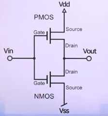

# 순서논리회로의 응용회로와 직접회로

## 카운터 회로

### 카운터의 개념

- 2 이상의 플립플롭으로 구성
- 매 입력 펄스마다, 미리 정해진 순서대로, 상태가 변화
- 용도 : 계수(計數), 타이머, 주파수 분주기, 주파수 계수기
  - 발생 횟수를 세거나, 동작 순서를 제어(순서제어)하기 위한 타이밍 신호 생성에 적합
- 상태수 : 플립플롭 개수, 연결 방법으로 결정

### 클럭 인가 방식에 따른 카운터 구분

1. 비동기식 카운터(리플 카운터)
   - 클럭 펄스에 모든 플립플롭이 동기화되지 않음
   - 단점 : 각 플립플롭을 통과할 때마다 지연시간
     - 고속 동작에는 부적합
   - 장점 : 동작 및 논리회로 구성이 단순하고, 구현 용이
   - 
2. 동기식 카운터(병렬카운터)
   - 클럭 펄스에 모든 플립플롭이 동시에(병렬로) 동기화되어 동작함
   - 

### 카운터 구분(시프트 카운터 유형: 1의 위치가 순환 형태)

1. 링 카운터
   - 최종단 플립플롭 출력(Q)을 처음 단 플립플롭 입력으로 단순 피드백 결합됨
   - 각 순서의 상태(n)에서 하나의 플립플롭
   - 한 플립플롭만 논리 1, 나머지 플립플롭은 논리 0
   - 각 상태마다 각각의 출력 => 디코딩 게이트 불필요
   - 
2. 존슨 카운터(순환 시프트레지스터 카운터)
   - 최종단 플립플롭 출력()을 처음 단 플립플롭 입력으로 단순 피드백 결합됨
   - 상태의 수 : 서로 다른 상태 2n
   - 단수에 상관없이 매우 간단하게 구현
   - 

### 기타 카운터 구분

1. Module-n 카운터
   - n개의 상태를 갖는 카운터
     - 최대 n개까지 계수(計數) 가능
2. BCD 카운터
   - 펄스, 사건 등을 계수하고, 그 결과를 10진 숫자 형태로 출력

## 레지스터 회로

- 기본적 시프트 레지스터 동작 => D 플립플롭 회로 구성
  - D 플립플롭에 한 비트씩 저장
- 기능
  - 데이터 저장, 이동 => 시프트 레지스터
  - 

### 저장용량

- 각단(stage, 플립플롭)은 하나으 ㅣ비트를 저장
  - n비트 레지스터는 플립플롭 n개로 구성
  - n비트의 2진 정보를 저장 가능
- 단의 수 => 레지스터의 저장 용량을 결정

### 용도

- 여러 비트를 일시적으로 저장
- 시프트 레지스터
  - 데이터 이동
  - 2의 보수, 곱셈, 나눗셈

### 시프트 레지스터의 종류

- 화살표 : 데이터의 이동 방향
- 제어신호 : 데이터의 입/출력 동작을 제어

 
 

1. 직렬입력-직렬출력(Serial Input-Serial Output, SISO)
   - 모뎀(Modem)
     - 
2. 직렬입력-병렬출력(Serial Input-Parallel Outpu, SIPO)
   - UART(Universal Asynchronous Receiver Transmitter)
   - 범용 비동기 송수신기
   - 
3. 병렬입력-직렬출력(Parallel Input-Serial Output, PISO)
   - 
4. 병렬입력-병렬출력(Parallel Input-Parallel Output, PIPO)
   - 범용 입/출력 장치, 프린터
   - 

### 4비트 레지스터 데이터(1010) 직렬로 레지스터 입력과정

1. 레지스터 0으로 초기화 => 플립플롭 Q(t)=0
   - 4비트 데이터
     - 
   - 
2. 첫 번째 데이터 비트 LSB()입력
   - CLK1 : 동기식 방식으로 모든 FF에 클럭 입력
     - 
   - 
3. 두 번째 데이터 비트 LSB(D₁ = 1) 입력
   - CLK2 : 동기식 방식으로 모든 FF에 클럭 입력
     - 
   - 
4. 세 번째 데이터 비트 LSB(D₂ = 0) 입력
   - CLK3 : 동기식 방식으로 모든 FF에 클럭 입력
     - 
   - 
   - 
5. 네 번째 데이터 비트 LSB(D₃ = 1) 입력
   - CLK4 : 동기식 방식으로 모든 FF에 클럭 입력
     - 
   - 
   - 

- 

### 4비트 레지스터 데이터(1010) 직렬로 레지스터 출력과정

1. CLK4 후 => 레지스터(1010) 저장
   - 
2. CLK5 후 => Q₃ 출력 :D₁(1)
   - 
   - 
3. CLK6 후 => Q₃ 출력 :D₂(0)
   - 
4. CLK7 후 => Q₃ 출력 :D₃(1)
   - 
   - 
5. CLK8후 => 레지스터 clear
   - 
   - 

### 병렬 로드를 가지는 양방향 시프트 레지스터

- 제어선의 레벨에 따라 이동
  - 

1. 오른쪽으로 시프트 하기 위한 단자 조건
   - 
2. 왼쪽으로 시프트 하기 위한 단자 조건
   - 

## 직접 회로(Integrated Circuit. IC)

> 작은 실리콘 칩에 저항, 커패시터, 다이오드 TR 등 전자 부품을 여러 공정을 거쳐 내부적으로 상호 연결한 것

- 칩(chip)
  - 실리콘 반도체로 세라믹 또는 플라스틱 기판에 부착해 외부 핀에 연결
  - 

### 디지털 논리군

1. TTL(Transistor-Transistor Logic)
   - 가장 많이 사용하는 표준
   - 고속/저전력/저전력 schottky/고성능 쇼트키 TTL 등
   - 공급 전원 +5V, 0과 1의 두 논리 레벨은 각각 0V, +3.5V
   - 기본 회로는 NAND 게이트
2. ECL(Emitter-Coupled Logic)
   - 슈퍼 컴퓨터 신호 처리기 같은 고속 회로에 사용
   - 1~2ns의 전달 지연 시간
   - 기본 회로는 NOR 게이트
3. MOS(Metal-Oxide Semiconductor)
   - 부품의 밀도가 높은 집적 회로에서 주로 사용되는 것으로 금속 산화물 반도체
   - 단상 트랜지스터인 NMOS가 사용
   - 
4. CMOS(Complementary Metal-Oxide Semiconductor)
   - NMOS와 PMOS를 서로 연결하여 제작
     - 회로의 밀도 높고, 제조 공정 단순, 전력 소비 낮아 경제적
   - 4000B 시리즈, HC 시리즈, HCT 시리즈
     - 

### 디지털 논리군의 전기적 특성

1. 전파지연시간(gate propagation delay)
   - 신호가 입력~출력까지의 시간, 게이트의 동작 속도
2. 전력소모(power dissipation)
   - 게이트가 동작할 때 소모되는 전력량
3. 잡음여유도(noise margin)
   - 최대로 허용된 잡음 마진
4. 팬-아웃(fan-out)
   - 하나의 게이트의 출력으로부터 다른 여러 개의 입력들로 공급되는 전류
   - 정상적인 동작으로 하나의 출력이 최대 몇 개의 입력으로 연결가능 여부

### 집적 회로의 분류

- 

### 디지털 시스템의 장점

1. 디지털 시스템의 소형화 및 경량화
2. 생산 가격의 저렴화
3. 소비 전력의 감소
4. 동작 속도의 고속화
5. 디지털 시스템의 신뢰도 향상
