# 프로세서의 구성과 동작 및 ALU

## 컴퓨터 기본 구조와 프로세서

### 컴퓨터의 3가지 핵심 장치

- 프로세서(Processor, CPU), 메모리, 입출력 장치
  - 폰노이만 컴퓨터의 기본 구조
  - 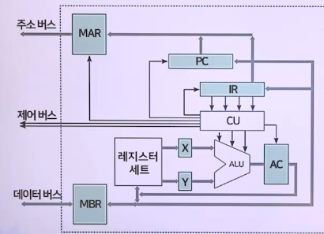
- 버스(Bus) : 장치 간 주소, 데이터, 제어 신호 전송
  - 내부 버스(internal bus) : 프로세서 내부의 장치 연결
  - 시스템 버스(system bus) : 핵심 장치 및 주변 장치 연결
  - 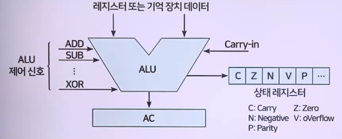

### 프로세서 3가지 필수 구성 요소

1. 산술 논리 연산 장치(Arithmetic Logic Unit, ALU)
   - 산술 및 논리 연산 등 기본 연산을 수행
2. 제어 장치(Control Unit, CU)
   - 메모리에서 명령어를 가져와 해독하고 실행에 필요한 장치들을 제어하는 신호를 발생
3. 레지스터 세트(register set, register file) => 메모리
   - 프로세서 내 존재, 용량은 작고, 매우 빠른 메모리
     - ALU 연산 관련 데이터 일시 저장, 특정 제어 정보 저장
   - 목적에 따라 특수 레지스터와 범용 레지스터로 분류

### 프로세서 기본 구조

#### ALU : 덧셈, 뺄셈 등 연산 수행, 그 결과를 AC에 저장

- 

#### 프로세서 병령 분류

- 레지스터-메모리 명령
  - 메모리 워드를 레지스터로 가져올(LOAD) 때
  - 레지스터의 데이터를 메모리에 다시 저장할 때
- 레지스터-레지스터 명령
  - 레지스터에서 오퍼핸드 2개를 ALU의 입력 레지스터(X,Y)로 가져와 덧셈 또는 논리 AND 같은 몇 가지 연산을 수행
  - 그 결과를 레지스터 중 하나에 다시 저장

## 프로세서 명령 실행

### 마이크로명령(microinstruction) 실행 단계

- 한 클럭 펄스에 의해 하드웨어의 작동을 지시, 제어하기 위한 명령
  - 1단계 : 다음 실행할 명령어, 메모리에서 읽어 IR로 가져옴
  - 2단계 : PC는 그 다음에 읽어올 명령어의 주소로 변경
  - 3단계 : CU는 가져온 명령어를 decode, 유형 결정
  - 4단계 : 명령어가 메모리에 있는 데이터를 사용하는 경우 그 위치(주소)를 결정
  - 5단계 : 필요한 경우 데이터를 메모리->레지스터로 가져옴
  - 6단계 : 명령어를 실행
  - 7단계 : 1단계로 이동하여 다음 명령어 실행을 시작

### 주 사이클(main cycle)

> 인출(fetch)-해독(decode)-실행(execute) 사이클로 구성

- 해독기(microprogrammed control) 사용
  - 고가 고성능 컴퓨터는 저가 컴퓨터보다 많은 명령어
  - 저가 컴퓨터에서도 고성능 컴퓨터의 복잡한 명령어 실행
  - 복잡한 HW 설계 => 복잡한 SW 설계로 대체
  - 제어 기억 장치(control memory), 빠른 읽기 전용 메모리

## 산술 논리 연산 장치

> 산술 논리 연산 장치 : 산술 연산과 논리 연산

- 정수 연산을 처리
- 부동 소수 연산 : FPU(Floating-Point Unit)
  - 최근에는 ALU가 부동 소수 연산까지 처리
- 산술 연산 : 덧셈, 뺄셈, 곱셈, 나눗셈, 증가, 감소, 보수
- 논리 연산 : AND, OR, NOT, XOR, 시프트(shift)
- 

### 산술 연산 산술연산 방법

#### 가산기 기반 : 가감승제

- 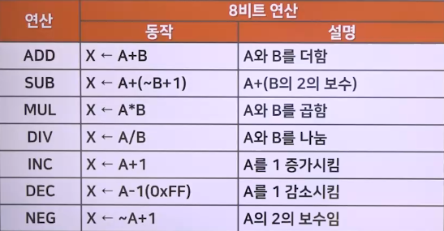

#### 곱셈의 연산

1. 일반적인 곱셈의 예
   - 음수적용 => 양수로 바꿔서 계산을 한 후에 결과의 부호를 조사해서 양수 또는 음수로 변환
   - 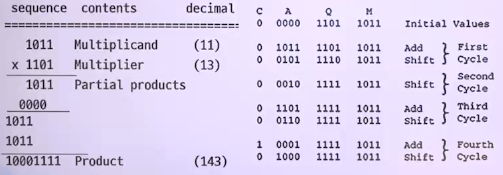
2. Booth알고리즘(부호있는 2진곱셈)
   - 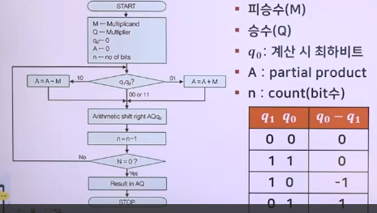

#### Booth Algorithm 곱셈연산의 예

1. (-7) \* ( +3) : 피승수(M:-7), 승수(Q:3)
   - Q == 0011, M = 1001, -M = 0111
   - 결과 : AQ = 11101011 = -21
   - 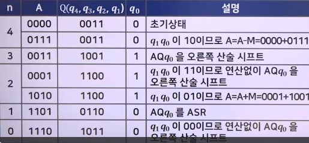
2. 5 \* (-4)
   - Q == 1100, M = 0101, -M = 1011
   - AQ = 11101100 = -20
   - 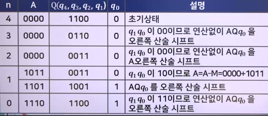

## 논리 연산과 시프트 연산

### 논리연산의 종류

- 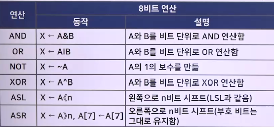
- 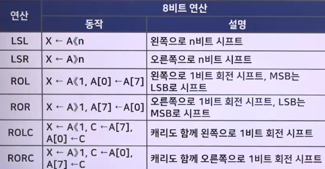

#### 논리연산의 예

1. AND, OR, XOR 연산
   - 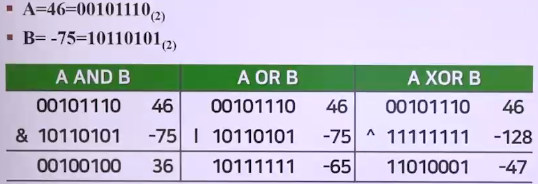
2. Mask 연산
   - 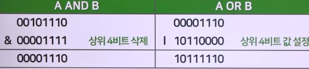
3. Shift 연산
   - 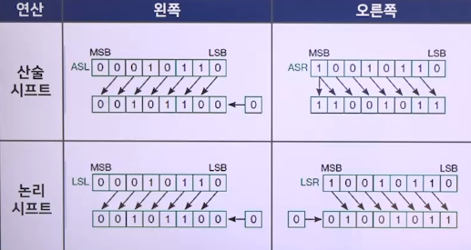
   - 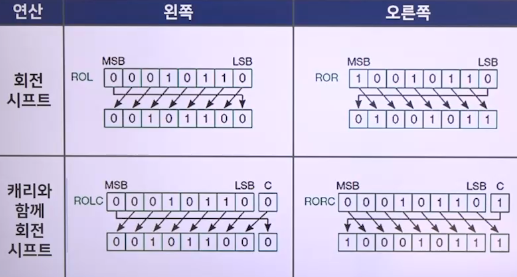

## 레지스터

### 레지스터 동작 개념과 특징

- CPU가 사용하는 데이터와 명령얼르 신속하게 읽어 오고 저장, 전송하는데 사용
- 메모리 계층의 최상위, 시스템에서 가장 빠른 메모리
- 매우 단순한 마이크로프로세서는 누산기(AC) 레지스터 개로만 구성 가능
- 범용(AC), 명령어(PC, IR), 데이터(MDR, MBR), 주소(MAR, SP, BR, IX), 입출력레지스터
- 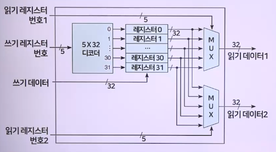

### 레지스터의 구분

1. 누산기(Accumulator register, AC) - 범용 레지스터
   - 연산의 중심 역학
   - ALU 내부 위치, ALU의 산술/논리연산과정에 사용
   - 제어장치는 주기억장치에서 인출된 데이터값을 산술/논리 연산을 위해 AC에 저장
   - 연산할 초기 데이터, 중간 결과 및 최종 연산 결과 저장
   - 최종결과는 목적지 레지스터, MBR을 이용하여 주기억장치로 전송
2. 데이터 레지스터(Data Register, 범용 레지스터)
   - CPU 내의 데이터를 일시적으로 저장하기 위한 레지스터
   - 고정/부동 소수로 구분
     - 따로 저장 가능
   - 어떤 프로세서는 상수 0 또는 1을 저장 가능
   - 레지스터의 비트 수
     - CPU 1회 연산에 처리 가능한 데이터 비트 수(워드)
3. 프로그램 카운터(PC) => 명령어 관련
   - 명령 포인터 레지스터
   - 실행을 위해 인출(fetch)할 다음 명령의 주소를 저장
   - 명령어가 인출되면 PC 값 단위 길이(명령 크기)만큼 증가
   - 항상 가져올 다음 명령의 주소 유지
4. 명령 레지스터(Instruction Register, IR) => 명령어 관련
   - 주기억 장치에서 인출(가장 최근에 인출한, 현재 실행 중)
     - 명령어 임시 저장
   - 제어 장치는 IR에서 명령어를 읽고 해독
     - 명령 수행하기 위해 컴퓨터의 각 장치에 제어신호 전송
5. 메모리 버퍼 레지스터(Memory Buffer Register, MBR, MDR)
   - 메모리에서 데이터를 읽거나 메모리에 저장될 명령의 데이터를 일시적 저장
     - 명령어 내용 : 명령 레지스터로 전송
     - 데이터 내용 : 누산기, I/O 레지스터로 전송
6. 메모리 주소 레지스터(Memory Address Register, Mar)
   - CPU가 읽고 쓰기 위한 데이터의 메모리 주소 저장
   - 메모리에 데이터를 R/W시 필요한 메모리 위치 주소
     - MAR로 전송
   - 포인터
7. 스택 제어 레지스터(Stack Control Register, Stack Pointer)
   - 스택
     - 메모리 블록 세트
     - 메모리의 한 블록 데이터는 후입 선출(LIFO)로 검색
   - 스택 관리(스택에 데이터가 채워진 마지막 위치 가리킴)
     - 크기는 2 또는 4바이트
8. 입출력 주소 레지스터(I/O Address Register, I/O AR)
   - 특정 I/O 장치의 주소를 지정하는 데 사용
9. 입출력 버퍼 레지스터(I/O Buffer Register, I/O BR)
   - I/O 모듈과 프로세서 간에 데이터를 교환하는 데 사용
10. 플래그 레지스터(Flag Register, FR)
    - CPU가 작동하는 동안 특정 조건의 발생을 표시
    - 1바이트 또는 2바이트인 특수 목적 레지스터
    - 산술/비교 결과 상태 표시
    - 상태 레지스터(Status Register, SR), 프로그램 상태 워드(Program Status Word, PSW)

### 인텔 x86계열 CPU의 레지스터의 종류와 크기

- 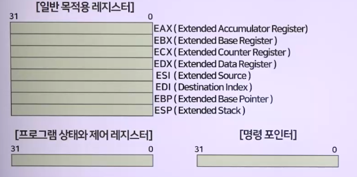
- 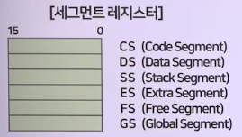

### 레지스터 전송 명령(LOAD, STORE, MOVE)

- 데이터 전송 명령어
  - 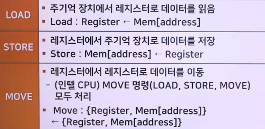
  - 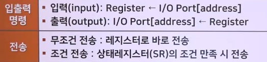
- 데이터의 교환 및 변환
  - 
- 데이터의 교환
  - 컴퓨터 내의 저장 순서
  - 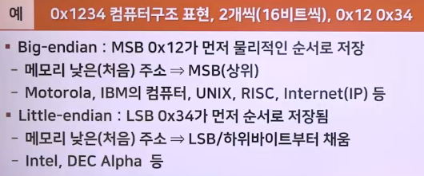
  - 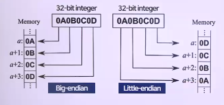
  - 
- 데이터 변환
  - 크기 작은 레지스터에 저장된 정수 => 큰 레지스터로 이동
  - 부호확장
    - 8비트 -> 16비트 -> 32비트, 32비트 -> 64비트 등
    - 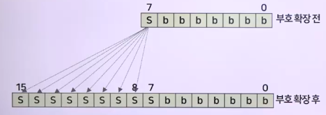
