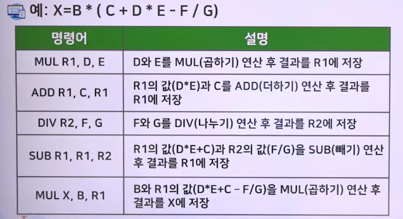

# 컴퓨터 명령어의 형식과 종류

## 명령어 형식

### 명령어 구성

- 
- 데이터 전달 명령어, 데이터 처리 명령어(단항/이항 연산), 프로그램 제어 명령어
  - 

### 오퍼랜드 수에 따른 주소 방식

- 명령어 형식 -> opcode, operand, 기어장치 주소
  - 

### 0-주소 명령어

> 연산에 필요한 오퍼랜드 및 결과의 저장 장소가 묵시적으로 지정된 경우

- 스택(stack)을 갖는 구조(PUSH, POP)

 
 

- 스택 구조 컴퓨터에서 수식 계산 : 역 표현(reverse polish)
  1. 우선순위 필요 없이 연산자와 연산 대상만으로 수식
  2. 역폴란드 표기법(Reverse Polish Notation, RPN)
     - 컴퓨터 프로그램 내부에서 주로 사용, 사용자 사용 불편
     - 
     - 
     - 

### 1-주소 명령어

> 누산기(AC) : 연산 대상이 되는 2개 중 하나만 표현하고 나머지 하나는 묵시적으로 지정

- 기억 장치 내의 데이터와 AC 내의 데이터로 연산
- 연산 결과는 AC에 저장
- ADD X
  - AC <- AC + M[X]
  - M[X] : 주소에서 표시된 장소에 있는 데이터
- 오퍼랜드 필드의 모든 비트가 주소 지정에 사용
  - 보다 넓은 영역의 주소 지정
- 명령워드: 16비트
  - Opcode[5비트], 오퍼랜드(addr)[11비트]의 CPU
    - 
  - 
  - 

### 2-주소 명령어

- 연산에 필요한 두 오퍼랜드 중 하나가 결과 값 저장
  - 
- 
- 
- 

### 3-주소 명령어

- 연산에 오퍼랜드 2개, 결과 값의 저장 장소가 모두 다름
- 
- 

 

- Z=(B+C) \* A (0-주소, 1-주소, 2-주소, 3-주소 명령 사용)
  - 니모닉(Mnemonic)
    - ADD : 덧셈, MUL : 곱셈
    - MOV : 데이터 이동(레지스터와 기억 장치 간)
    - LOAD : 기억 장치에서 데이터를 읽어 누산기에 저장
    - STORE : AC의 내용을 기억 장치에 저장
- 

### 명령어 주소 개수에 따른 장단점

1. 주소 개수가 많은 경우
   - 저장할 오퍼랜드의 수가 많아져 명령어가 더 복잡해짐
   - 레지스터의 수가 많아져 연산 속도가 빨라짐
   - 프로그램이 짧아져 프로그램 당 명령어 수가 감소함
2. 주소 개수가 적은 경우
   - 오퍼랜드의 수가 적고 간단해 명령어 인출과 실행 속도가 높아짐
   - 프로그램의 길이가 증가함

## 명령어 형식 설계 기준 명령어 형식

1. 첫 번째 설계 기준 ; 명령어 길이
   - 메모리 공간 차지 비율 감소
   - 명령어 길이 최소화
     - 명령어 해독, 실행 시간에 비중을 둠
   - 짧은 명령어는 더 빠른 프로세서를 의미
     - 최신 프로세서는 동시에 여러 개의 명령을 실행하므로 클럭 주기당 명령얼르 여러 개 가져오는 것이 중요
2. 두 번째 설계 기준 : 명령어 형식의 공간
   - 2ⁿ 개를 연산하는 시스템에서 모든 명령어가 n비트보다 큼
   - 명령어 세트에 추가할 수 있도록 opcode를 위한 공간을 남겨두지 않음
3. 세 번째 설계 기준 : 주소 필드의 비트 수

## 명령어의 종류

> ISA(Instruction Set Architecture) 컴퓨터의 명령어(6개의 그룸)

### 데이터 이동 명령

- 가장 기본이 되는 작업
  - 원본과 동일한 새로운 객체를 만드는 복사
- 원래 위치에 그대로 두고 다른 장소에 복사본 생성

#### 데이터를 복사하는 이유

1. 변수에 값 할당
   - A=B는 메모리 주소 B의 값(데이터)을 A 장소로 복사
2. 데이터의 효율적인 액세스 및 사용
   - 메모리와 레지스터 간에 데이터를 이동하여 프로그램 실행을 효율적으로 수행하기 위함
     - LOAD 명령 : 메모리에서 레지스터로 이동
     - STORE 명령 : 레지스터에서 메모리로 이동
     - MOVE 명령 : 하나의 레지스터에서 다른 레지스터로 이동
   - 단, 메모리 간 이동은 일반적으로 사용하지 않음

### 2항 연산

- 오퍼랜드 2개를 결합하여 결과 생성
- 산술 연산(가감승제) 및 논리 연산
  - AND, OR, XOR, NOR, NAND
  - AND 연산
    - 워드에서 특정 비트를 추출하는 용도로 사용
    - 
  - OR 연산
    - 마스크 연산, 사용하여 원하는 위치에 값 교체
    - 
  - XOR 연산
    - 대칭적, 어떤 값을 1로 하면 반대(대칭) 값 생성
      - 의사 난수 생성에 사용

### 단항 연산

- 2항 연산보다 명령이 짧지만, 명령에 다른 정보를 지정해야 할 때가 많음
  1. 시프트(shift)
     - 비트를 왼쪽이나 오른쪽으로 이동하는 작업
     - 워드의 끝부분에서 비트 손실 발생
  2. 회전(rotation)
     - 한쪽 끝에서 밀린 비트가 다른 쪽 끝에서 다시 이동
     - 시프트와 회전의 차이
       - 
  3. 오른쪽 시프트는 흔히 부호와 함께 수행
     - 워드의 MSB 부호는 그대로 유지한 채 오른쪽으로 시프트
       - 음수인 경우 그대로 음수 유지
       - 
  4. 시프트의 중요한 용도
     - 2의 제곱수를 곱하는 것과 나누는 것
  5. 시프트는 특정 산술 연산의 속도를 높이는 데 사용
     - 
  6. INC(1증가), DEXX(1감소), ENG(2의 보수), NOT(비트 반전)

### 비교와 조건 분기 명령

- 
  1. 조건이 충족되면 특정 메모리 주소로 분기
     - 검사에 사용되는 일반적인 방법 : 특정 비트가 0인지 확인
  2. 상태 코드 비트 : 특정 조건 표시
     - 부호(S) 비트
       - 음수 여부 확인 부호 비트 검사 가능
     - 오버플로(V) 비트
       - 산술 연산 결과 데이터 표현 범위를 벗어났을 때 1로 설정
       - 오버플로 발생 : 오류 루틴 및 수정 조치
     - 캐리(C) 비트
       - 맨 왼쪽 비트에서 데이터가 넘칠 때 세트
       - 가장 왼쪽 비트의 캐리는 정상 연산 발생 가능
         - 다중 비트 연산 수행하려면 캐리 비트 점검
     - 0(Z) 비트
       - 루프 및 기타 여러 용도 유용
       - 레지스터에 1이 하나라도 들어 있는지 표시
         - OR 회로 사용
       - Z 비트는 ALU의 모든 출력 비트를 OR한 후 반전
         - 연산결과값이 0이면 1
     - 인터럽트(I) 비트
       - 인터럽트 가능(0), 불가능(1)
     - 슈퍼바이저(P)
       - CPU의 실행모드 슈퍼바이저(1), 사용자 모드(0)
     - 패리티(P) 비트
       - 연산결과 1의 개수 짝수(1)
  3. 두 수의 비교 => 동등(E) 비트
     - 두 워드나 문자 비교 : 동등비교, 크기 비교
     - 정렬(sorting)할 때 중요
     - 주소 3개 필요 : 데이터 항목(2개), 조건 분기 주소(1개)
     - XOR 사용

### 프로시저 호출(procedure call) 명령

> 특정 작업을 수행하는 명령 그룹 => 프로그램 내 어디서든 호출 가능

- 어셈블리 => 서브루틴(subroutine)
- C언어 => 함수(function)
- JAVA => 메서드(method)

 

- 프로시저가 작업 완료 시 호출 명령 바로 다음 명령 복귀
  - 복귀 주소 : 프로시저에 전송, 복귀 시 저장 주소
    - 메모리, 레지스터, 스택에 배치 가능
  - 여러 번 호출 가능
    - 프로시저 여러 개가 직간접적으로 다중 호출되어도 프로그램이 정상 순서로 수행되어야 함
  - 프로시저를 반복할 경우, 복귀 주소를 호출할 때마다 다른 위치에 두어야 함
  - 프로시저 호출 명령이 복귀 주소 => 스택에 저장
    - 프로시저가 끝나면 스택에서 반환 주소를 꺼내 PC에 저장
  - 프로시저가 자기 자신 호출 기능 : 재귀(recursion), 스택을 사용하면 재귀 기능 => 정상 동작
    - 복귀 주소는 이전 복귀 주소가 파손되지 않도록 자동 저장

### 루프 제어 명령

- 명령 그룹을 정해진 횟수만큼 실행해야 하는 경우
- 루프(loop)를 통해 매번 일정하게 증가 또는 감소시키는 카운터 소유
  - 루프를 반복할 때마다 종료 조건을 만족하는지 검사
  - 루프 밖에서 카운터를 초기화한 후 루프 코드 실행 시작
  - 루프의 마지막 명령에서 카운터 업데이트
  - 종료 조건을 아직 만족하지 않으면 루프의 첫 번째 명령으로 분기
  - 종료 조건이 만족되면 루프 종료, 루프를 벗어난 첫 번째 명령이 실행
- 종점 테스트(test-at-the-end 또는 post-test) 루프
  - 조건이 루프의 끝에서 이루어지므로 루프가 무조건 한 번 이상 실행
- 종료 검사를 사전에 수행하도록 루프 구성
  - 루프의 시작에서 검사, 처음부터 조건 만족 여부 여부 확인
- C언어의 for 처럼 정해진 횟수만큼 반복 루프 가능
- 모든 루프는 한 가지로 표현 가능
  - 용도에 맞는 형태로 사용

### 입출력 명령

> 다양한 입출력 장치 => 입출력 명령도 다양
> 개인용 컴퓨터 : 세 가지 입출력 방식 사용

- 프로그래밍에 의한 입출력
- 인터럽트 구동(interrupt-driven) 입출력
- DMA(Direct Memory Access) 입출력

 

1. 프로그래밍에 의한 입출력 => 가장 단순함
   - 임베디드 시스템, RTS 저사양 마이크로프로세서 사용
   - 주요 단점
     - 장치가 준비되기까지의 시간 동안 CPU 대기
       - 사용 대기(busy waiting)
       - CPU가 할 일이 하나밖에 없다면 문제되지 않음
       - 여러 개의 이벤트 동시 모니터링 시, 다른 입출력 방법이 적용
2. 인터럽트 구동(interrupt-driven) 입출력
   - 프로세서가 입출력 장치에 작업을 지시하고 완료되면 인터럽트를 생성하도록 명령
   - 장치 레지스터에 인터럽트 활성화 비트를 설정
     - 입출력이 완료되면 하드웨어가 신호를 제공하도록 요청
   - 프로그래밍 입출력보다 개선됨: 완벽하지 않음
     - 전송된 모든 문자에 인터럽트가 필요 => 처리 비용 상승
     - 인터럽트의 많은 부분을 제거하는 방법이 요구됨
3. DMA(Direct Memory Access)입출력
   - 버스에 직접 액세스하는 방법 => 시스템에 DMA 제어기 추가
   - DMA 칩은 내부에 레지스터 최소 4개 보유 => 프로세서에서 실행되는 소프트웨어로 로드 가능
   - 
   - 프로세서 입출력의 부담을 크게 덜어 줌
     - 그러나, 고속장치가 DMA 실행 시 메모리/장치 참조를 위한 사이클이 필수
     - 사이클 동안 CPU 대기
   - > 사이클 스틸링(cycle stealing)
     - 입출력 채널과 프로세서가 동시에 주기억장치 접근 시 문제
       - CPU를 간섭하지 않고 채널의 우선순위를 높게 지정
     - 채널의 우선순위를 높여주면 입출력 장비의 효율 증가
