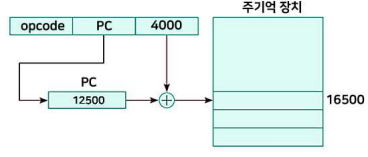
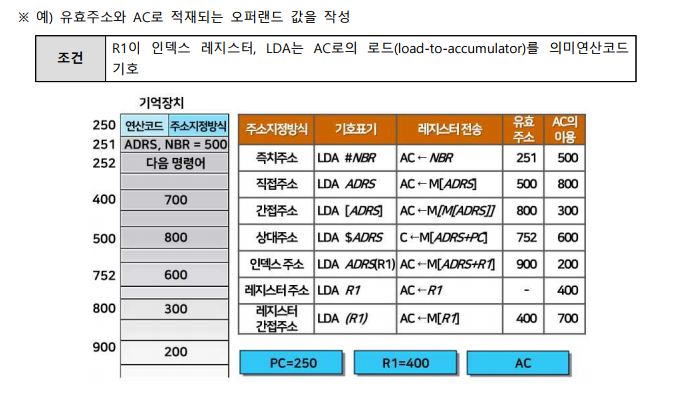

# 명령어 주소지정방식

## 묵시적 주소 지정(Implied Addressing mode) 방식

### 특징

- 의미 주소 지정
- 오퍼랜드의 소스나 목적지를 명시하지 않음
  - 주소필드가 필요 없는 방식
  - 메모리 참조 횟수 0회
- 암묵적으로 그 위치를 알 수 있는 주소 지정 방식
- 서브루틴에서 호출한 프로그램으로 복귀 시 RET 명령
  - 명령어 뒤에 목적지 주소가 없지만 어디로 복귀할지 자동으로 알 수 있음
- 
- 누산기를 소스나 목적지로 사용하는 경우도 생략 가능

### 형식 및 예시

- ADD ; TOS <- TOS + TOS-1
  - (스택) 스택의 맨 위 항목(TOP)과 그 아래 항목을 더해 스택의 맨 위에 저장
  - 오퍼랜드가 스택의 맨 위에 있다는 것을 묵시적 가정
- MUL X ; AC <- AC \* M[X]
  - AC의 내용과 M[X]의 내용을 곱해 AC에 저장
  - M[X]와 곱해지는 대상과 저장되는 위치는 모두 AC인 것을 묵시적으로 가정
- STORE X ; M[X] <- AC
  - AC의 내용을 M[X]에 저장
  - 저장되는 내용이 AC인 것을 묵시적으로 가정

## 즉시 주소 지정(Immediate Addressing Mode) 방식

### 특징

- 즉치 주소 지정
- 오퍼랜드를 지정하는 가장 간단한 방법
  - 명령어 자체에 오퍼랜드를 포함: 명령어 주소 부분이 값 자체 데이터
  - 즉시(즉치) 오퍼랜드 : 즉시 사용 가능
  - 장점 : 오퍼랜드 인출을 위한 메모리 참조가 필요 없음
    - CPU의 참조X, 속도 빠름, 메모리 참조 횟수 0회
  - 단점 : 상수만 가능, 상수 값의 크기가 필드 크기로 제한
  - 활용 : 작은 값의 정수를 지정하는 데 많이 사용
- 형식 및 예시
  - 레지스터 R1에 상수 4를 저장
  - 

## 직접 주소 지정(Direct Addressing Mode) 방식

### 특징

- 메모리에 위치한 오퍼랜드의 전체 주소 지정
  - 메모리 참조 횟수 : 1회
- 직접 주소 지정도 즉시 주소 지정처럼 사용 제한
  - 명령어는 항상 정ㅈ확히 동일한 메모리 위치 엑세스
  - 값이 변할 수는 있지만 위치는 변할 수 없음
  - 컴파일할 때 알려진 주소의 전역 변수에 엑세스만 사용
  - 

### 형식 및 예시

- LDA 600 ; AC <- M[600], M[600]을 AC로 적재
- 

## 간접 주소 지정(Indirect Addressing Mode) 방식

### 특징

- 메모리 참조 횟수
  - 2회 이상 일어나는 경우
- 데이터를 가져오는데 많은 시간 소요
- CPU와 주기억 장치간의 속도 차가 많은 CPU의 경우
  - 오퍼랜드를 인출하는 데 오래 걸리므로 전체 프로그램의 수행 시간은 길어짐
  - 현재는 간접 주소 지정을 지원하는 프로세서는 거의 없음
  - 

### 형식 및 예시

- LDA [600] ; AC <- M[M[600]]
- 

## 레지스터 주소 지정(Register Addressing Mode) 방식

### 특징

- 직접 주소 지정과 개념이 같고, 그 위치(메모리X, 레지스터)
  - 오퍼랜드 필드에 레지스터 번호 저장, 유효주소 X
- 가장 일반적인 주소 지정 방식
  - 레지스터는 액세스가 빠르고 주소가 짧기 때문
  - 컴파일러는 루프 인덱스처럼 가장 자주 액세스할 변수를 레지스터에 넣기 위해 많은 노력을 기울임
- 많은 프로세서에서 사용
- 레지스터의 수가 제한되어 있으므로 무한정 사용 불가
- (RISC) LOAD : R<-[M], STORE : [M]<-R 명령을 제외하고 대부분의 명령어에서 레지스터 주소 지정 방식만 사용
  - 한 오퍼랜드는 레지스터, 다른 한 오퍼랜드는 메모리 주소
  - 

### 형식 및 예시

- LDA R1 ; AC <- R1
- R1의 내용을 AC에 적재함

## 레지스터 간접 주소 지정(Register Indirect Addressing Mode) 방식

### 특징

- 직접 주소를 명령어에는 포함하지 않음
  - 메모리의 주소는 레지스터에 저장: 포인터(pointer)
  - 레지스터 간접 주소 지정의 가장 큰 장점
    - 명령어에 전체 메모리 주소가 없어도 메모리 참조 가능
  - 주소필드에 오퍼랜드가 저장된 기억장치 주소값을 갖고 레지스터를 지정하는 방식
    - 유효주소는 지정된 레지스터에 있는 주소
    - 

### 형식 및 예시

- LDA (R1) ; AC <- M[R1]
- 기억장치의 R1번지에 있는 값을 AC에 적재함

## 변위 주소 지정(Displacement Addressing Mode) 방식

### 특징

- 특정 레지스터에 저장된 주소 + 변위(offset: 오프셋)
  - 실제 오퍼랜드가 저장된 메모리 위치 지정
- 특정 레지스터가 무엇인지에 따라 여러 주소 지정 방식
  - 인덱스주소지정(인덱스), 상대주소지정(PC)
  - 

### 인덱스 주소 지정(Indexed Addressing mode)

- 레지스터(명시적 또는 암시적) + 일정한 변위(주소)
  - 유효주소 = 명령어 오퍼랜드(주소필드) + 인덱스 레지스터
- 특정 레지스터: 인덱스 레지스터
  - 인덱스 레지스터 : 인덱스 값을 저장하는 레지스터
- 배열을 인덱싱할 때 많이 사용
- 형식 및 예시
  - LDA ADRS(R2) ; AC <- M[ADRS + R2]
    - 기억장치의 ADRS + R2번지에 있는 값을 AC에 적재함
    - 

### 상대 주소 지정(Relative Addressing Mode)

- 특정 레지스터 : PC
- 현재 프로그램 코드가 실행되고 있는 위치
  - 앞, 뒤로 일정한 변위만큼 떨어진 곳의 데이터 지정
  - 유효주소 = 명령어 오퍼랜드(주소필드) + PC
- 분기 명령어 근처에 분기될 경우 사용
- 계산에 의한 주소방식
- 형식 및 예시
  - LDA $ADRS ; AC <- M[ADRS + PC]
    - 기억장치의 ADRS + PC번지에 있는 값을 AC에 적재함
    - 

### 베이스 주소 지정(Base Addressing Mode)

1. (인텔 프로세서) 세그먼트 레지스터가 6개 있음
   - SS(Stack Segment): 스택데이터가 저장 위치에 대한 포인터
   - CS(Code Segment): 프로그램 코드가 저장 시작 위치 포인터
   - DS(Data Segment): 데이터 영역에 대한 시작 포인터
   - ES, FS, GS: 엑스트라 세그먼트(extra segment) 포인터
     - 엑스트라 세그먼트는 데이터 세그먼트의 확장 영역
2. 이 중 하나를 베이스 레지스터 지정
   - (레지스터 + 변위), 실제 오퍼랜드가 있는 위치를 찾음
3. 예시
   - 데이터 세그먼트를 베이스로 사용
     - 오프셋 200만큼 떨어진 주소 25600에서 오퍼랜드 위치함
     - 

#### 주소지정 방식 정리

- 
- 
- 
