# 프로세서의 제어장치(CU)와 명령어 사이클

## 제어장치의 기능과 종류

### 제어장치의 기능

- 컴퓨터의 기본 구성
  - 제어 장치 : 컴퓨터의 모든 동작을 제어하는 CPU의 핵심
- 컴퓨터의 기본 구성
  - ALU, I/O 장치에 프로세서가 전송한 명령어 수행
  - 주기억장치의 명령어를 읽어 CPU의 IR로 가져옴
  - IR의 opcode를 해독하여 제어 신호를 발생
  - 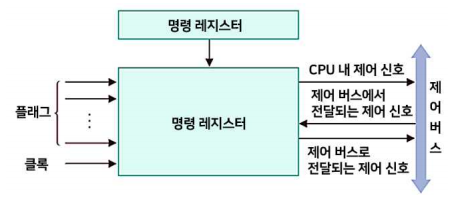
- 제어 장치의 기본 기능
  - CPU에 접속된 장치들에 대한 데이터 이동 순서 조정
  - 명령어 해독
  - CPU 내 데이터 흐름 제어
  - 외부 명령을 받아 일련의 제어 신호 생성
  - CPU에 포함된 ALU, 데이터 버퍼, 레지스터를 제어
  - 명령어(인출->해독->실행) 순서에 맞춰 처리
  - 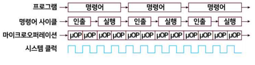

### 제어장치의 종류

1. 하드와이어 제어 장치(Hardwired Control)
   - 논리 회로로 만들어진 하드웨어로 명령어 실행 제어에 필요한 제어 신호 발생
   - 
     - 물리적 회로 구조로 신호 생성 방법을 수정할 수 없음
   - 명령어의 opcode에 제어 신호를 생성하는 기본 데이터 포함
   - 명령 디코더에서 명령(작업) 코드가 해독
     - 명령어 opcode에 정의된 여러 필드를 해독하는 많은 해독기 세트로 구성
   - 제어 하드웨어는 상태 기계(state machine)처럼 클럭 사이클이 진행됨에 따라 상태가 변함
     - 상태변화(명령 레지스터, 상태 코드, 외부 입력 따라)
   - 프로그래밍 가능한 논리 배열(PLA)과 유사한 방식 구성
     - 논리식으로 설계한 고정된 논리회로에 의해 제어신호생성
     - 마이크로 프로그램 제어 장치보다 빠름(마이크로 프로그램 제어)
     - 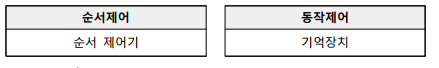
     - 고속으로 작동
   - (제어 신호) 명령어 실행 사이클 전 구간, 끊임없이 생성
   - 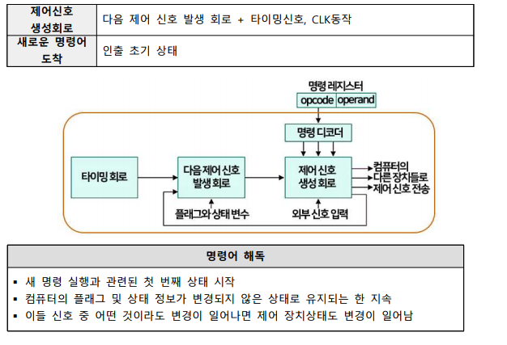
   - 제어 신호 발생 회로에 대해 각각의 새 입력이 생성
     - 외부 신호가 나타날 때(ex. 인터럽트) 외부 신호에 대한 반응(ex. 인터럽트 처리)과 관련된 상태가 됨
     - 컴퓨터의 플래그와 상태 변수 값은 명령어 실행 주기에 적합한 상태를 선택하는 데 사용
   - 사이클의 마지막 상태: 프로그램의 다음 명령을 가져오기 시작하는 제어 상태
     - PC의 내용을 MAR로 보내고
     - 컴퓨터의 IR에 대한 명령어를 읽음
     - 프로그램 실행 종료 명령 -> 운영체제 상태로 돌아감
2. 마이크로 프로그램 제어 장치(micro-programmed control)
   - 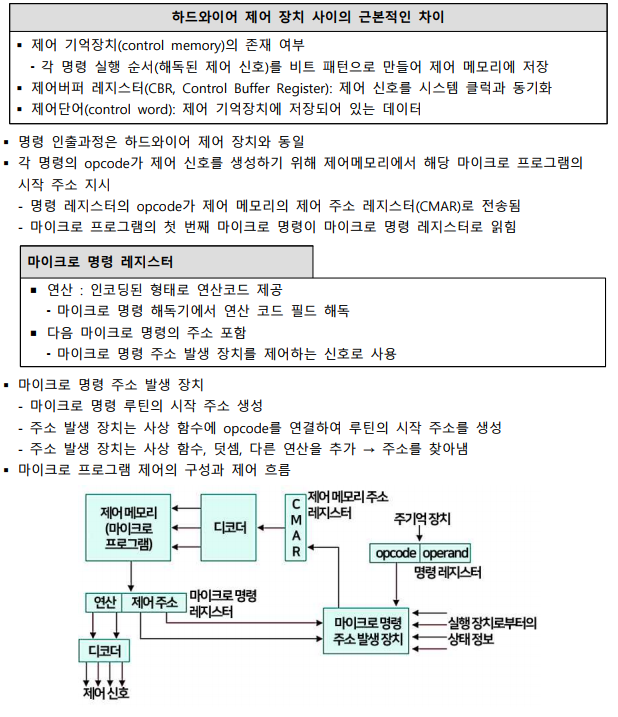

### 마이크로 프로그램 제어 장치의 종류

1. 수평적 마이크로 프로그램
   - 제어 신호가 제어 신호당 1비트로 해독된 2진 형식 표현
   - 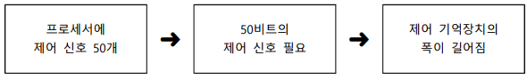
   - 한 번에 2개 이상의 제어 신호를 활성화할 수 있음
   - 특징
     - 제어 워드(제어신호필드, 다음 주소 선택 필드)가 더 길다.
     - 병렬 처리 응용에 사용
       - 더 높은 수준의 병렬 처리 가능 : 병렬성이 n이면 한 번에 n개의 제어 신호 활성화
     - 추가 하드웨어(디코더)가 필요치 않음
       - 수직적 마이크로 프로그래밍보다 빠름
   - 수평적 마이크로 명령어 구조의 예
     - 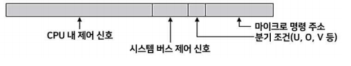
2. 수직적 마이크로 프로그램
   - 제어 신호가 인코딩된 2진 형식으로 표시
   - N개 제어 신호가 필요할 경우 -> [log2N] 비트 필요
   - 특징
     - 복호화(디코더) -> 제어 워드 폭이 짧아짐
     - 유연하므로 새로운 제어 신호를 추가하기 용이
       - 제어 신호를 서로 동시에 사용하지 않는 그룹으로 구분, 그룹별로 부호화
     - 낮은 수준의 병렬화 허용
     - 제어 신호를 생성하는 추가적인 하드웨어 필요
       - 수평적 마이크로 프로그래밍보다 느림
   - 수평적 마이크로 명령어의 구조 예
     - 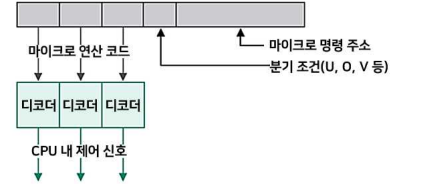

### 하드와이어 제어와 마이크로 프로그램 제어 비교

- 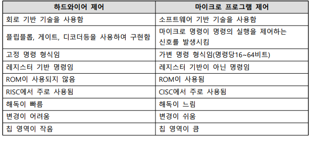

## 명령어 사이클의 개념

### 명령어 사이클

- 명령어 인출 -> 명령어 해독 -. 명령어 실행
- 명령어 사이클 : 데이터 경로(data-path) 사이클
  - 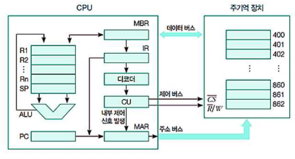
- 인터럽트 사이클
  - 매 명령어 사이클이 끝나고 인터럽트 유무를 점검
  - 인터럽트가 있으면 인터럽트 처리 루틴 실행

### 명령어 사이클 실행 흐름

1. 하나의 기계어 명령
   - 일련의 마이크로 명령으로 구성된 명령어 사이클을 이루어 실행
2. 각 명령어 사이클은 여러 개의 작은 단위로 구성
   - 명령어 인출, 명령어 해독, 명령어 실행, 인터럽트로 구별
3. 제어 장치를 설계 -> 더 작은 단위의 마이크로 연산 분할
   - 각 명령은 더 짧은 하위 사이클
     - 명령어 인출, 명령어 해독, 명령어 실행, 인터럽트로 구성된 명령 주기 동안 실행
   - 하위 사이클은 하나 이상의 마이크로 연산을 가짐
   - 마이크로 연산은 프로세서의 가장 작은 동작
   - 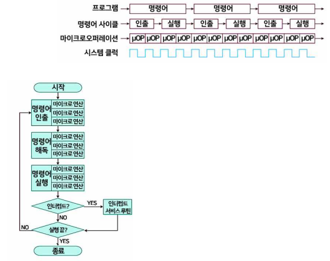

### 명령어 인출 사이클(Instruction fetch)

1. 다음에 실행할 명령어를 주기억장치에서 읽어 오는 과정
   - 명령어 인출 사이클은 모든 명령어 실행의 첫 번째 단계
   - 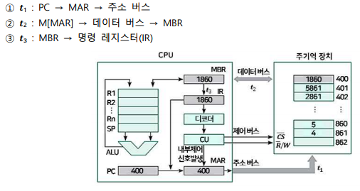
2. 프로세서의 레지스터 변화 과정
   - 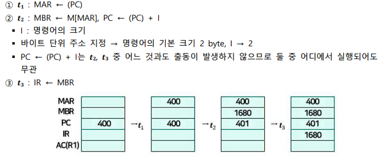

- 마이크로 연산을 그룹으로 묶을 때의 규칙
  - 연산의 순서 준수
    - (MAR <- (PC))는 반드시 MAR의 주소를 사용하기 때문에
    - (MBR <- 주기억 장치)앞에 와야 함
  - 충돌을 피해야 함
    - 동시에 동일한 레지스터에서 읽고 쓰려고 해서는 안 됨
      - 마이크로 연산 (MBR <- 주기억 장치)와 (IR <- MBR)은 동시에 실행되지 않아야 함
  - 마이크로 연산 중 하나가 덧셈 연산 수행
    - ALU의 기능과 프로세서 구조에 따라 덧셈 마이크로 연산을 ALU가 수행할 수 있음
      - 회로의 중복 사용하지 않기 위해 덧셈연산 수행할 수 있음

### 명령어 해독 사이클(Instruction decode)

- 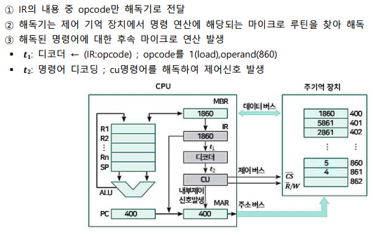

### 명령어 실행 사이클(Instruction execute)

#### 실행과정

1. 명령어 실행 사이클
   - 해독된 명령어 실행 사이클
2. 데이터를 읽어서 레지스터 R1에 저장, 명령어 실행 사이클
   - IR : operand -> MAR -> 주소 버스
   - M[MAR] -> MBR -> 데이터 버스
   - MBR -> R1

#### 명령어 실행 사이클의 마이크로 명령 실행 과정

- 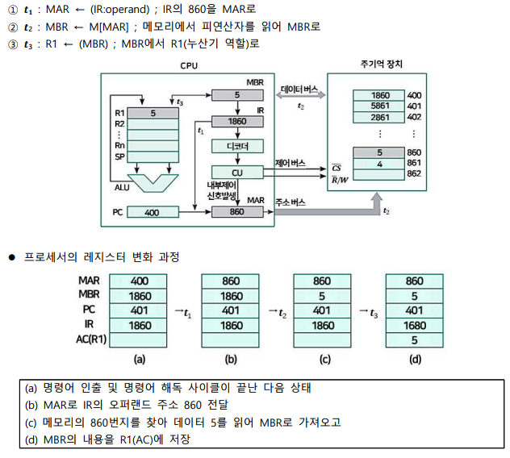

### 다양한 명령어 실행 사이클

- 레지스터 R1의 데이터와 메모리 X번지의 데이터를 ALU에서 더해 다시 R1에 저장
- 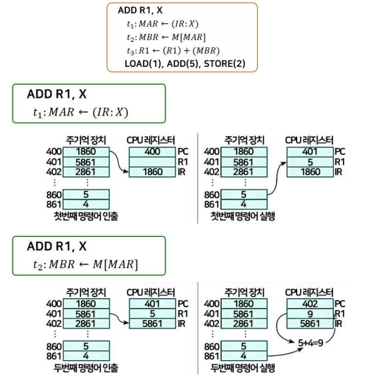
- 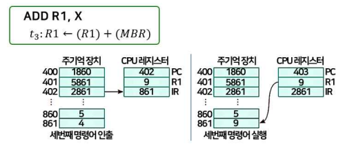

### 명령어 사이클

- 항상 명령어 인출, 명령어 해독, 명령어 실행 사이클 순서로 실행
- 인터럽트 사이클은 항상 명령어 실행이 끝난 후 인터럽트가 있으면 실행하고, 그렇지 않으면 다음 명령어 인출사이클로 진행
- 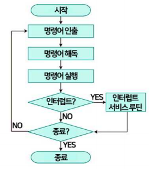
