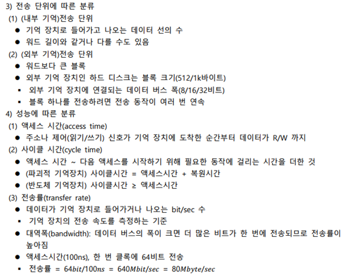
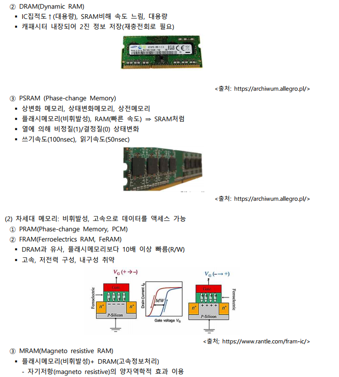
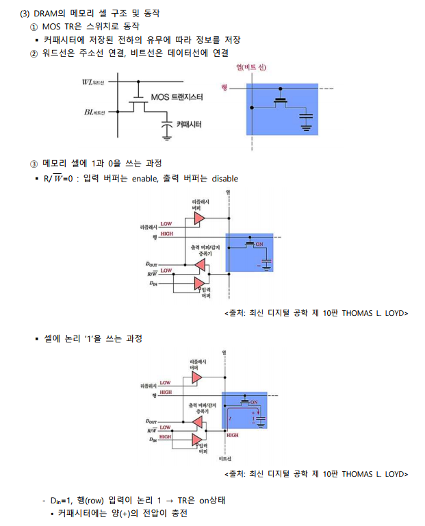
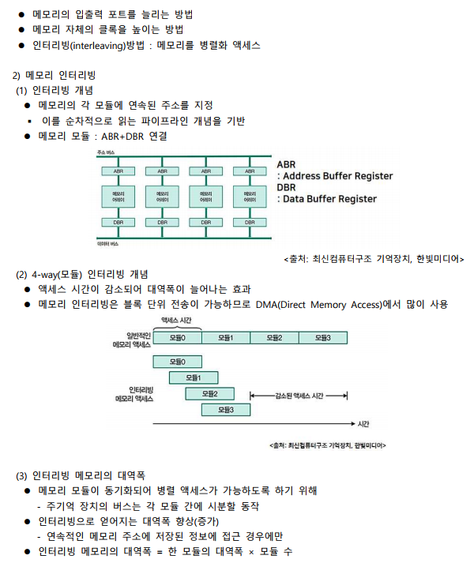
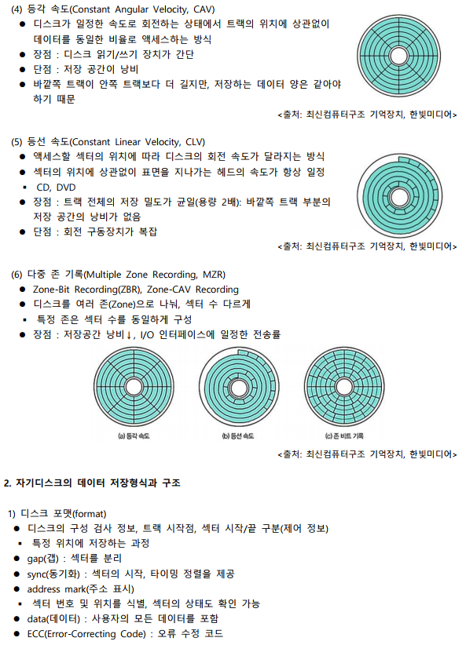

# 컴퓨터 기억장치의 개요와 주기억장치

# RAM과 주기억장치의 모듈 설계

---

# 캐시 기억장치의 개념과 캐시 정책

# 캐시 기억장치의 사상방식

---

# 가상기억장치의 개념과 페이지 매핑방식

# 가상기억장치의 세그먼테이션 매핑방식과 혼용 매핑방식

---

# 기억장치의 페이지 정책

# 최신 기억장치 기술

---

# 보조기억장치의 개념과 디스크 스케줄링

# RAID(Redundant Array of Independent Disks)

---

# 시스템 버스와 입출력장치 인터페이스

# 인터럽트의 개념과 동작 원리

---

# 정리

## 컴퓨터 기억장치의 개요와 주기억장치 ROM

- 기억장치(주 기억장치)는 위치에 따라 내외부로 구분할 수 있고, 용량에 따라 워드로 표현한다.
- 주기억장치의 동작은 레지스터 2개(MAR, MBR), 제어 신호 3개(R/W, CS)에 의해 읽기와 쓰기를 한다.
- ROM은 저장된 데이터를 READ 가능하고, 별도의 장치 없이는 변경 불가한 기억장치로 mask ROM, PROM, EPROM, EEPROM, Flash 메모리 등이 있다.

## RAM과 주기억장치의 모듈 설계

- RAM은 데이터 저장방식에 따라 플립플롭을 사용한 SRAM과 커패시터를 사용한 DRAM으로 구분된다.
- 기억장치의 워드 용량 확장은 여러 개의 칩들을 직렬 접속하여 기억장치 모듈을 구성할 수 있다.

## 캐시 기억장치의 개념과 캐시 정책

- 캐시 기억장치는 CPU와 주기억 장치의 속도 차이, CPU 대기 시간을 줄이기 위한 CPU와 주기억 장치 사이의 고속 반도체 기억장치이다.
- 캐시 설계의 설계 요소는 캐시용량, 사상방식, 교체알고리즘, 쓰기정책, 라인크기, 캐시 수이다.
- 캐시의 라인 크기는 블록 크기에 따라 지역성에 따라 히트율이 증가할 수 있다.

## 캐시 기억장치의 사상방식

- 직접사상은 주기억 장치의 블록들이 지정된 하나의 캐시 라인이 적재되는 것으로 연관 검색은 없고, 캐시 효율은 낮으며, 교체 기법은 불필요하다.
- 완전-연과 사상은 주기억 장치 블록이 캐시의 어떤 라인으로든 적재 가능하고, 직접사상보다는 복잡하고, 연관 검색을 하여 캐시효율은 높으며, 교체기법은 필요하다.
- 세트-연관 사상은 직접 사상과 완전-연관 사상의 조합으로 연관검색을 하여, 캐시효율은 보통이며, 교체기법은 필요하다.

## 가상기억장치의 개념과 페잊이 매핑방식

- 가상 기억 장치(virtual memory)는 대용량 보조 기억 장치를 주기억 장치처럼 사용하는 물리메모리의 크기와 상관없이 프로세스에 커다란 메모리 공간을 제공하는 기술이다.
- 페이징 매핑방식은 곶어 분할 방식을 이용한 가상 메모리 관리 기법으로 물리 주소 공간을 같은 크기로 나누어 사용하고, 페이지 테이블(페이지 매핑테이블)을 이용하여 블록으로 변환하여 페이지를 프레임에 배치한다.

## 가상기억장치의 세그먼테이션 매핑방식과 혼용 매핑방식

- 세그먼테이션 테이블(Segmentation Table)은 세그먼테이션의 크기와 물리적 메모리상의 시작주소를 나타낸다.
- 세그먼테이션-페이지 혼용 매핑 방식은 가상주소를 물리주소로 변환 시마다 접근권한 검사를 하는 기법으로 매핑테이블에 메모리의 접근 권한 정보가 추가되어 페이지 테이블의 크기가 증가하는 문제를 해결하였다.

## 기억장치의 페이지 정책

- 페이지 호출기법 및 정책은 프로세스가 필요로 하는 데이터를 언제 메모리로 가져올지 결정하는 것으로, 요구 페이지 호출기법과 예상 페이징 호출 기법이 있다.
- 페이지 교체 알고리즘의 성능 평가 기준은 알고리즘별 평균 대기시간, 전체 작업에 걸리는 시간, 유지비용 등과 메모리 접근 패턴을 사용하여 페이지 부재 횟수와 페이지 성공 횟수를 비교하여 평가한다.

## 최신 기억장치 기술

- SDRAM(Synchronous DRAM)은 DRAM의 액세스 속도를 향상시키기 위해 개발된 반도체기억 장치로, 시스템 클럭 신호에 맞춰 데이터를 전송하는 동기식 DRAM이다.
- 메모리의 인터리빙은 상위 인터리빙과 하위 인터리빙, 혼합 인터리빙 방법이 있다.

## 보조기억장치의 개념과 디스크 스케줄링

- 자기 기억 장치의 쓰기동작은 헤드에 전류를 흘려 자기장이 만들어지면 트랙이 헤드와 반대 극성으로 자화되는 방식으로 데이터를 읽어오며, 읽기동작은 트랙을 이동시켜 헤드를 통과하는 자기장의 변화에 따라 데이터를 쓴다.
- 디스크의 스케줄링(disk scheduling)은 탐색 시간을 최적화하여 디스크 헤드 이동을 최소화하고, 트랙의 이동을 최소화하여 탐색 시간을 줄이는 목적이 있다.

## RAID(Redundant Array of Independent Disks)

- RAID는 크기가 작은 여러개의 디스크들을 서로 연결하여 하나의 큰 용량을 가진 디스크를 만드는 것으로 스트라이핑(striping: 분산), 미러링(mirroring: 중복), 패리티(parity: 무결성)와 같은 기술이 적용된다.
- RAID0는 스트라이핑 방법으로 같은 규격의 디스크를 병렬 연결하여 여러 개의 데이터를 여러 디스크에 동시에 저장한다.

## 시스템 버스와 입출력장치 인터페이스

- CPU칩의 개념과 시스템버스는 통신에 필요한 I/O들로 구성되어 있으며, 주소관련, 데이터관련, 제어관련 CPU핀으로 구분된다.
- 인터럽트 I/O는 프로그램 I/O의 CPU 시간 낭비를 해결하기 위해 인터럽트 매커니즘과 인터럽트 기능 및 특수 명령을 이용한다.
- DMA(Direct Memory Access)는 주변 장치가 메모리 버스를 사용하여 직접 통신하도록 허용하여 CPU가 개입하지 않고 데이터를 전송하게 한다.

## 인터럽트의 개념과 동작 원리

- 인터럽트는 프로그램 실행 중에 예기치 않은 상황이 발생할 경우 현재 실행 중인 작업을 즉시 중단하고 발생한 상황을 우선 처리한 후 원래 작업으로 복귀하여 계속 처리하는 것을 의미한다.
- 컴퓨터 시스템에서 인터럽트 처리 방법은 소프트웨어를 이용한 방법(폴링), 하드웨어를 이용한 방법(데이지 체인), 다중 인터럽트 요청선을 이용한 방법, 인터럽트 제어기를 이용한 방법으로 구분한다.
