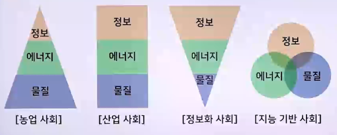
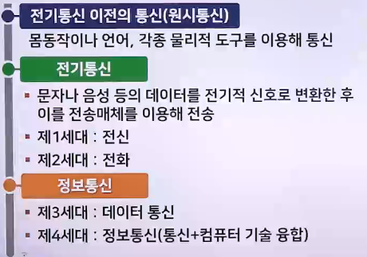
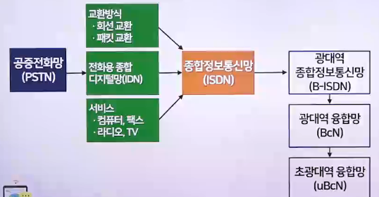

# 컴퓨터 네트워크의 개념과 발전과정

## 인류사회의 변천과 컴퓨터 네트워크

### 인류사회의 변천 과정

1. 제1의 물결(농업혁명)
   - 기원전 약 1천년 전
     - 정착 생활로 국가 공동체 형성
2. 제2의 물결(산업혁명)
   - 18세기 말~19세기 초
     - 영국의 공업화에 의한 산업혁명, 대량생산/대량소비/대량분배 등
   - 빠른 속도의 과학 기술 발전
3. 제3의 물결(정보산업혁명)
   - 1980년대
     - 개인용 컴퓨터의 발명과 인터넷의 등장
   - 정보산업혁명
4. 제4의 물결(유비쿼터스 혁명)
   - 현재 시점(21세기)
     - 유비쿼터스(Ubiquitous)혁명 + 지능형 환경

### 공간 혁명의 역사

- 도시혁명 : 시간제약을 극복하려고 물리 공간 축소
- 산업혁명 : 물리공간을 분화하고 공간의 생산성을 확대
- 정보혁명 : 시간 제약을 극복하려고 물리 공간을 컴퓨터에 넣음
- 유비쿼터스 혁명 : 전자, 물리 공간을 통합하려고 컴퓨터를 물리 공간에 넣음

> 정보-에너지-물질 관계

## 컴퓨터 네트워크 기술의 개념

### 정보통신 기술(ICT)

> 정보 처리 기술(IT) + 통신 기술(CT)

- 여러 단말장치를 통신망에 접속하여 데이터를 전송하고 처리하며 교환하는 통신 체계
- 좁은 의미로 데이터 통신
- 통신 기술 : 멀리 떨어진 정보원과 정보 목적지 사이에서 정보를 전송하고 처리하는 기술
- 정보처리 기술 : 데이터를 의미 있는 정보로 변환하거나 발전하여 데이터를 지능 또는 지식으로 변환하기 위해 컴퓨터를 이용하여 처리하는 것
- 정보처리 기술 절차
  1. 데이터 발생(1단계)
  2. 데이터 수집(2단계)
  3. 데이터 분석(3단계)
  4. 데이터 처리(4단계)
  5. 데이터 저장 및 활용(5단계)
- 데이터
  - 현실세계를 단순히 관찰, 측정하여 수집하거나 생산한 사실이나 측정치
- 정보
  - 데이터를 가공하거나 변환하여 얻은 결과물
  - 유효하게 해석하거나 데이터의 상호관계 등 의사결정을 하는 데 도움이 되는 가치 있는 데이터
  - 지식(지능)
    - 지식은 교육과 학습 등을 통해 사람이 재활용할 수 있는 정보와 기술 등
  - 컴퓨터
    - 방대한 양의 데이터를 신속하고 정확하게 처리하고 분석하여 사용자에게 유용한 결과를 제공
    - 데이터 처리 시스템

## 컴퓨터 네트워크 기술의 탄생과 발전과정

### 통신(정보전송) 기술의 탄생과 발전과정

### 전기통신 시대

1. 제1세대 : 전신
   - 최초의 전기통신이자 제1세대 통신
   - 1837년 미국의 모스가 발명한 방식
     - 사무엘 모스(1791~1872)
       - 미국의 발명가이면서 화가
       - 1844년 미국의 전신 실용화를 추진
       - 워싱턴-볼티모어 간(60km)의 전신회선 설치, 통신에 성공
       - 1825년에 부인의 장례식에도 참가할 수 없었던 사건이 개인에게 큰 영향을 끼침
       - 1832년 모스 부호를 착안
2. 제2세대 : 전화
   - 1876년 미국의 그레이엄 벨이 최초로 발명
   - 그 뒤 1878년 에디슨이 탄소식 전화기 개발
     - 알렉산더 그레이엄 벨(1847-1922)
       - 영국 태생의 미국 과학자/발명가
       - 1871년 음성의 메커니즘에 흥미를 느끼다가 전기통신을 연구
       - 1873년 보스턴 대학교 음성생리학 교수 임용
       - 음성에 관한 연구와 더불어 전기를 통한 소리 전달에 대해 연구
       - 1876년 음성 전달 기능이 있는 전화기를 발명, 특허 등록
       - 1877년 특허를 바탕으로 벨 전화 회사 설립
       - 1880년 전화를 발명한 공로로 프랑스 정부로부터 볼타상 수여

### 정보통신 시대

1. 제3세대: 데이터 통신
   - 컴퓨터를 이용한 통신 체계와 비슷
     - 1946년 : 세계 최초의 전자계산기인 에니악 개발 완성
     - 1950년 : 사무 처리에 전자계산기 도입
     - 1958년 : 세계 최초의 정보통신 시스템인 SAGE(통신 시스템의 모체로, 미국에서 군사적 목적으로 사용한 반자동 방공망 시스템)개발
     - 1961년 : 좌석 예약 시스템인 SABRE망(세계 최초의 사용 통신 시스템으로 미국 민간항공회사에서 개발)구축
2. 제4세대 : 정보 통신
   - 컴퓨터로 통신을 공유하는 형태
   - 자원 등을 공유하고 통신회선을 효율적으로 이용하여 비용을 절감하려는 목적에서 시작
     - 1971년 : 세계 최초의 패킷 교환망인 ARPA 통신망 개발. 인터넷의 근간이 됨
     - 1975년 : 상업용 패킷 교환망인 TELENET, TYMNET 통신망 시스템 개발
     - 1980년 : 디지털 기술을 이용한 VAN, ISDN
     - 1990년 : 위성통신을 이용한 데이터 통신과 이동통신, 인터넷 보급과 웹 등장
     - 2000년 : 인터넷, 웹 이동통신(스마트폰 등 포함) 확산

### 종합정보통신망(ISDN)

- 모든 서비스를 단일 통신망으로 통합
- 이를 시작으로 광대역 융합망, 초광대역 융합망 등으로 발전
  - 

### 유비쿼터스 컴퓨팅

- 유비쿼터스 컴퓨팅 : 수많은 지능형 컴퓨터를 유무선 네트워크와 연결하여 필요한 정보를 언제, 어디서나, 즉시 제공받는 환경이나 세계를 뜻함
- 사물인터넷 : 모든 사물, 기기가 지능적으로 정보를 수집하고 다른 사물 또는 사람이 사용하는 기기와 무선 또는 유선통신을 통해 정보를 주고 받는 것
  - 기존의 유비쿼터스나 사물통신과 비슷함
    - 사물통신 : 통신장비와 사람과의 통신을 주목적으로 함
    - 사물인터넷 : 사물끼리도 통신함
- 사물인터넷의 구현 기술
  - 센싱기술 : 유형의 사물과 주위 환경으로부터 정보를 얻는 기술
  - 유무선 통신 기술 : 고속처리와 병렬 처리를 할 수 있는 유무선 통신 및 네트워크 인프라 기술
  - 서비스 인터페이스 기술 : 각종 서비스 분야에 적합하게 정보를 가공하고 처리하는 기술
  - 보안기술 : 사물인터넷에 대한 해킹 및 정보 유출을 방지하기 위한 기술
- 사물인터넷의 발전 방향
  - 인간과 ICT의 융합
    - 인간과 정보통신 기술의 융합을 통해 인간의 사물인터넷화가 이루어질 것으로 보는 관점
  - 사물과 ICT의 융합
    - 사물과 정보통신 기술의 융합을 통해 사물의 인터넷화가 이루어질 것으로 보는 관점
  - 공간과 ICT의 융합
    - 공간과 정보통신 기술의 융합을 통해 공간의 사물인터넷화가 이루어질 것으로 보는 관점
