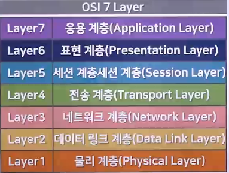
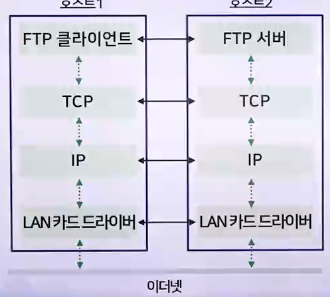
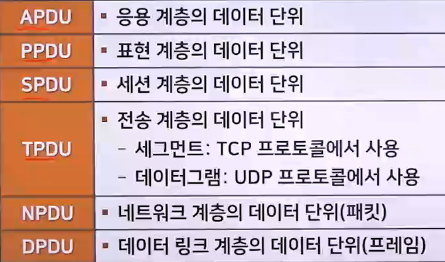
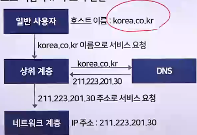

# 네트워크 기초 용어와 기능

## 네트워크 기초 용어

- 네트워크 : 전송매체로 서로 연결된 시스템의 모음으로 프로토콜을 사용하여 데이터를 교환하는 시스템의 집합을 통칭
- 시스템 : 내부 규칙에 따라 능동적으로 동작하는 대상
  - ex. 컴퓨터, 자동차, 커피 자판기, 마이크로프로세서, 운영체제, 프로세스 등
- 인터페이스 : 시스템과 전송매체의 연결 지점에 대한 규격
  - ex. RS-232C, USB등
- 전송매체 : 시스템끼리 데이터를 전달하기 위한 물리적인 전송 수단
- 프로토콜 : 전송매체를 통해 데이터를 교환할 때 임의의 통신 규칙
- 인터넷 : 전 세계의 네트워크가 유기적으로 연결되어 동작하는 통합 네트워크(공통 기능 : IP(Internet Protocol))
- 표준화 : 서로 다른 시스템이 상호 연동해 동작하기 위한 통일된 연동 형식

## 시스템 기초 용어

### 시스템의 구분

- 노드 : 인터넷에 연결된 시스템의 가장 일반적인 용어
- 호스트 : 컴퓨팅 기능이 있는 시스템
- 클라이언트 : 서비스를 요청하는 시스템
- 서버 : 서비스를 제공하는 시스템

## 네트워크의 개념과 기능

> 네트워크란, 모뎀이나 LAN, 케이블, 무선매체 등 통신설비를 갖춘 컴퓨터로 서로 연결하는 조직이나 체계, 통신망을 의미한다

- 통신설비들로 두 대 이상의 컴퓨터를 서로 연결한 것
- 컴퓨터 두 대로 연결했든, 그 이상으로 연결했든 간에 필요에 따라 여러 대를 서로 연결한 것이 바로 네트워크이다.

### 네트워크의 기능

- 계층 모델
  - ISO의 OSI(Open System Interconnection) 7계층 모델 통신 기술
  - 
- OSI 7계층 모델의 계층별 기능
  1. 물리 계층 : 물리적으로 데이터를 전송하는 역할을 수행
  2. 데이터 링크 계층 : 물리적 전송 오류를 해결(오류 감지 / 재전송 기능)
  3. 네트워크 계층 : 올바른 전송 경로를 선택(혼잡 제어 포함)
  4. 전송 계층 : 송수신 프로세스 사이의 연결 기능을 지원
  5. 세션 계층 : 대화 개념을 지원하는 상위의 논리적 연결을 지원
  6. 표현 계층 : 데이터의 표현 방법 (압축 : 전송되는 데이터의 양, 암호화 : 전송되는 데이터의 의미)
  7. 응용 계층 : 다양한 응용 환경을 지원
- 프로토콜과 인터페이스
  - 프로토콜 : 서로 다른 호스트에 위치한 동일 계층끼리의 통신 규칙
  - 인터페이스 : 같은 호스트에 위치한 상하위 계층 사이의 규칙
  - 서비스 : 하위 계층이 상위 계층에 제공하는 인터페이스
- 인터넷 계층 구조
  - 네트워크 계층 : IP 프로토콜 (주소)
  - 전송 계층 : TCP, UDP 프로토콜 (전송제어)
  - FTP 서비스의 예
    - 

### 인터네트워킹

> 하나 이상의 망을 상호 연결하는 것

- 단순히 물리적으로 망을 연결한다는 의미 이외에도 망을 논리적으로 연결한다는 것을 의미
- 진정한 의미의 인터네트워킹 : 사용자로 하여금 인터네트워킹의 존재를 인식하지 않고 마치 하나의 망을 사용하는 것처럼 느끼게 해주는 것
  - 이를 위해서는 물리적인 연결 위에 논리적으로 망을 연결해주는 기법들이 필요
- 게이트웨이
  - 인터네트워킹 기능을 수행하는 시스템
    - 리피터 : 물리 계층을 지원(신호 증폭)
    - 브리지 : 물리 계층과 데이터 링크 계층을 지원
    - 라우터 : 물리 계층, 데이터 링크 계층, 네트워크 계층을 지원
- 데이터 단위
  - 

## 네트워크 주소의 표현

### 주소와 이름

1. IP 주소
   - IPv4 프로토콜에서 사용
   - 32비트 크기의 주소 체계
   - IPv6에서는 128비트 주소 체계로 확장
     - ex. 211.223.201.30 등
     - 
2. 라우팅
   - 인터넷 상에서 패킷의 이동 경로 선택
   - 효율적인 경로 탐색
3. 호스트 이름
   - 네트워크 상의 한 노드를 유일하게 구별하는 수단
   - 호스트 이름(Host Name)
     - 영문자 형식
     - 사람이 기억하기 쉽고 친숙한 가변길이의 명칭
     - 대소문자 구분 안함
   - 호스트 주소(Host Address) : 숫자 형식
     - 기계장치가 네트워크 상에서 호스트를 쉽게 찾도록 통상적으로 고정길이의 기계적 주소
   - 호스트 이름과 IP 주소의 변환
     - 
     - <호스트>.<단체 이름>.<단체 종류>.<국가 도메인> 등
