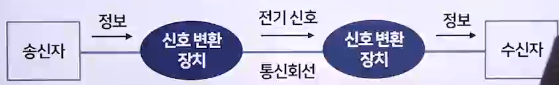
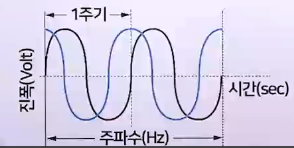
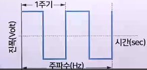
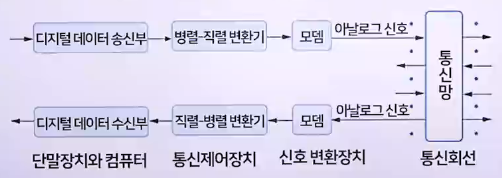

# 정보전송 시스템 개요

## 정보통신 시스템의 구성

| 구성 | 정보전송 시스템 (데이터 전송계)                                               | 정보처리 시스템 (데이터 처리계)                              |
| ---- | -------------------------------------------------------------------------------- | --------------------------------------------------------------- |
| 역할 | 데이터를 전송하는 역할                                                           | 데이터를 가공 및 처리하여 보관하는 역할                         |
| 구성 | - 단말장치   - 정보전송 회선 (신호 변환장치와 통신회선) - 통신 제어장치 | - 컴퓨터 (중앙처리장치, 기억장치, 입출력 장치) - 주변기기 |

### 정보통신 시스템의 기능별 분류

- 정보전송 시스템 : 정보전달(데이터 전송계)
  - 단말장치 : 정보의 입력과 수신
  - 신호변환 장치 : 변조, 복조
  - 통신회선 : 변환된 신호의 이동 통로나 통신망
  - 통신 제어장치 : 컴퓨터와 모뎀 사이에 위치하여 송수신되는 데이터를 처리하기 좋은 형식으로 변환
- 정보처리 시스템 : 정보가공, 처리, 보관(데이터 처리계)
  - 중앙처리장치 : 컴퓨터에서 입력되는 데이터를 가공, 처리, 축적, 수정, 변경, 추가
  - 기억장치와 입출력 장치 : 컴퓨터에서 데이터를 저장하는 저장장치와 입출력 장치로 구성

### 정보통신 시스템의 구조별 분류

- 정보전송 시스템
  - 정보전송 하드웨어, 정보전송 소프트웨어
- 정보처리 시스템
  - 정보처리 하드웨어, 정보처리 소프트웨어

### 정보통신 시스템의 유형별 분류

- 정보전송 시스템 : 오프라인, 온라인
  - 오프라인 처리
    - 자료 등을 USB나 외장 하느 디스크에 저장하여 통신회선 없이 사람이 직접 전달하는 형태
  - 온라인 처리
    - 자료 등을 통신회선을 통하여 한 장소에서 다른 장소로 전달하는 형태
- 정보처리 시스템 : 즉시 처리, 배치 처리
  - 즉시 처리(실시간 처리)
    - 자료를 처리하는 시점이 발생하는 즉시 처리하는 형태
  - 배치 처리
    - 자료를 처리하는 시점이 발생하는 즉시 처리하는 것이 아닌, 모아두었다가 어느 시점에서 처리하는 형태

## 정보전송 시스템의 하드웨어

### 단말장치

1. 디지털 데이터를 입/출력 하는 데 사용하는 장치
   - 키보드, 모니터, 프린터 등 컴퓨터와 연결되는 모든 주변 장치
   - 단말기 또는 단말, 터미널
   - 컴퓨터 네트워크에서는 컴퓨터 또는 스마트폰이나 태블릿 자체를 단말장치로 사용하기도 함
2. 단말장치 구성과 기능
   - 입출력 제어부 : 외부에서 정보를 받아 변환 후 외부로 출력하는 것
   - 송수신 제어부 : 데이터 송수신, 제어 문자 검사, 필요 동작 수행
   - 오류 제어부 : 오류를 검출하고 복구
   - 공통 제어부 : 단말 장치를 종합적으로 제어
3. 단말장치의 종류와 기능
   - 데이터를 입출력하는 단순한 기능에서 벗어나 점차 지능화
   - 특수 용도에 맞게 발전
   - 스마트폰이나 애플폰의 발전에 따라 정보 단말기도 소형화
   - 휴대형 정보 단말기의 기술 특성인 고용량 전지, 대용량 메모리 IC, 저전력 RF부품 기술 등이 발전

### 신호 변환 장치

- 송신자의 정보를 전기적 신호로 변환한 후 전송매체(통신회선)를 거쳐 전송
- 전기적 신호는 수신자의 신호 변환장치를 이용해 원래의 정보로 변환
- DCE는 신호변환 외 전송 신호의 동기 제어 송수신 확인, 전송 조작 절차의 제어 등을 담당
- 
- 아날로그 신호
  - 비슷하다(Anlogous)에서 파생
  - 연속적으로 변하는 신호
  - 전압 값이 여러 개
  - 자연스러움
  - 음성, 음악, 텔리비전 영상, 그림, 사진 등
  - 
- 디지털 신호
  - 손가락(Digit)에서 유래
  - 이산적인 신호
  - 정해진 전압 값(유한 개)
  - 인공적
  - 단말장치, 컴퓨터, 팩스, 텔렉스
  - 
- 신호 변환장치를 이용한 정보전송 과정
  - 변조와 복조 기능을 수행하는 장치
  - 디지털 데이터는 아날로그 형태인 전기적 신호로 바꾼 후 전송
  - 신호 변환장치를 이용한 정보전송 과정
    - 변조 과정을 거친 후 송신됨
    - 그 후 복조 과정을 거쳐 수신부에 디지털 신호로 입력
    - 

### 신호 변환 장치의 종류

1. 모뎀
   - Modulator와 DEModulator의 함성어
   - 단말장치에서 발생한 디지털 신호를 아날로그 신호로 변환(변조)하여 통신회선으로 전송시키는 역할
   - 통신회선에서 수신한 아날로그 신호를 디지털 신호로 변환(복조)하는 역할
   - 송신부
     - 데이터 부호화기, 변조기, 스크램블러, 주파수 체배기
   - 수신부
     - 등화기, 대역 제한 여파기(BPF), 자동 이득 조절기(AGC), 복조기, 데이터 복호화기, 스크램블러의 역기능인 디스크램블러 등
2. 디지털 서비스 유닛
   - 디지털망에 상요하는 회선 종단 장치(DCE)
   - 디지털 회선을 이용해 디지털 데이터나 신호를 먼 곳까지 안전하게 전송할 수 있도록 단극성 신호를 양극성 신호로 변환

### 통신회선

- 데이터를 전송하는 통로
- 통신기기 사이(단말장치와 단말장치, 단말장치와 컴퓨터, 컴퓨터와 컴퓨터)를 연결하는 역할
- 데이터 전송선로 또는 정보전송 매체
- 데이터 전송선로는 유선과 무선으로 구분
- 전송선로는 전송속도에 영향을 줌

### 통신회선 종류

- 유선선로
  - 꼬임선
    - 구리선 두 가닥을 서로 균일하게 꼬아서 여러 다발로 묶어 보호용 피복선을 입힌 케이블
    - 전자기 간섭 현상을 줄이려고 전선을 꼬아서 사용
  - 동축 케이블
    - 내부에 있는 단열 구리선과 외부 도체로 구성
    - 내부 도체와 외부 도체 사이에는 절연물질이 있으며, 외부 도체는 피복으로 보호
    - 유선 TV 전송, 근거리 통신망, CATV 등 고주파 신호의 광대역 전송과 장거리 전화 전송에 주로 사용
  - 광섬유 케이블
    - 지름의 굵기가 0.1mm 정도인 석영(유리섬유)을 케이블 안에 여러 가닥 넣어서 레이저광의 전반사 현상을 이용해 데이터를 전송하는 원통형 선로
      - 장점
        - 꼬임선, 동축 케이블에 비해 대역폭이 넓어 고속으로 전송 가능
        - 감쇄 영향도 상대적으로 아주 낮음
        - 외부 전자기장에 영향을 받지 않아 오류 발생률도 매우 낮음
        - 케이블이 작고 가벼우며 유연함
      - 단점
        - 가격이 비쌈
        - 탭을 이용하여 분기선을 만들기가 어려움
        - 연결할 부위를 일직선으로 만들어야 해서 정교한 납땜 기술 필요
- 무선선로
  - 지구의 대기 등에서 전자기파를 이용하여 데이터를 전송하는 비유도체
  - 주파수의 범위와 방향성에 따라 마이크로파와 라디오파로 분류
  1. 마이크로파
     - 방향성이 있음(주파수 범위는 2~40GHz)
     - 강으로 분리된 지역에 유선선로를 설치할 때 발생하는 어려움과 높은 비용이 드는 문제를 해결
  2. 라디오파
     - 방향성이 없음(주파수 범위는 30kHz~1GHz)
     - 주로 방송용으로 이용
  3. 위성 마이크로파
     - 지상에서 약 35,860km 상공에 위성을 띄워 놓고 지상의 여러 송수신국을 서로 연결
     - 지상 송신국은 안테나 빔을 이용해 송신한 신호의 주파수 대역을 증폭(아날로그 전송) 혹은 재생(디지털 전송)하여 다른 주파수로 바꾼 후 지상 수신국으로 송신
  4. 정지궤도 위성
     - 적도 상공에서 마치 고정된 것처럼 관측되는 통신위성
     - 통신위성이 지구의 인력과 원심력의 균형 때문에 등속 타원 운동을 하고, 그 주기도 지구의 자전 주기와 일치하기 때문에 고정된 것처럼 보임
  5. 이동통신
     - 계속 움직이는 대상에서 일반 전화로 통신할 때나 이들 이동체 상호 간에 일어나는 무선통신을 의미
     - 이동국, 기지국, 교환국으로 구성
       - 이동국
         - 모든 이동체에 설치된 통신 단말기
       - 기지국
         - 이동국과 교환국을 연결하는 기능
         - 안테나, 송수신기, 제어 부분 등으로 구성
       - 교환국
         - 이동통신망과 일반 공중망을 연결하는 기능
         - 가입자의 위치를 검출하거나 가입자 상호 간의 정보를 교환하는 데 사용

### 통신 제어장치

- 주로 단말장치/컴퓨터와 모뎀 사이에 위치
- 컴퓨터의 중앙처리장치와 데이터 전송회선 사이에서 이들을 전기적으로 연결
- 전송문자의 조립 및 분해, 코드 변환, 회선의 제어, 에러 제어 등의 기능을 수행
- 네트워크 제어 장치(NCU) 라고도 함
- 다중화 : 여러 대의 장비에서 보내는 전송문자를 한 선로로 송신하기 위해 조립하는 작업
- 역다중화 : 한 선로에서 보내는 전송문자를 여러 대의 장비에서 수신하기 위해 분해하는 작업
- 전위 처리기(FEP) : 컴퓨터의 앞쪽에 위치하여 통신기능을 보강하는 역할인 주 프로세서에 결함
- 후 처리장치(BEP) : 주 컴퓨터에 부가해서 이용함으로써 주 컴퓨터의 부하를 줄이는 컴퓨터 역할
- 통신 제어 처리 장치(CCP)
  - 프로그래밍을 사용하여 통신 제어장치를 개선
  - 프로그램 가능한 또는 프로그램 제어 방식의 통신 제어장치
  - 메시지 제어에 관한 부분까지도 처리하기 때문에 주 컴퓨터 중앙처리장치(CPU)의 부담 감소
  - 장점
    - 단말의 증설이나 회선의 고속화 등 확장성, 기능의 변경이나 추가가 용이하여 유연성이 큼

### 인터페이스와 접속 규격

- 인터페이스
  - 데이터 단말장치(DTE)와 데이터 통신장치(DCE) 간의 접속 관계를 표시
  - 연결기 커넷터와 케이블로 구성
  - 연결기의 신호선 핀 배치에 따라 종류가 다름
- RS-232
  - 가장 대표적인 인터페이스 표준화
  - DTE와 DCE 간의 물리적 연결과 신호 수준을 정의
  - 25핀과 9핀 연결기를 모두 지원
  - RS-232D는 RS-232C를 수정하여 표준화한 것
- 접속 규격
  - DTE-DCE 인터페이스 규격은 ITU-T 권고에 정의되어 있음
  - V 시리즈 : DTE와 아날로그 통신회선 간의 접속 규정을 정의
  - X 시리즈 : DTE와 디지털 교환망 간의 접속 규정을 정의
  - I 시리즈 : DTE와 종합정보통신망(ISDN)간의 접속 규정을 정의

## 정보전송 시스템의 소프트웨어

### 소프트웨어 개요

> 컴퓨터 하드웨어의 전체 동작을 지시하고 제어하는 모든 프로그램

- 물리적인 장치인 하드웨어가 원활히 동작할 수 있도록 돕는 컴퓨터 프로그램의 조합
- 하드웨어를 지시하고 통제하여 결과를 얻도록 하는 명령의 집합
- 시스템 소프트웨어와 응용 소프트웨어로 분류
  - 시스템 소프트웨어
    - 사용자가 컴퓨터를 쉽게 사용할 수 있도록 편리한 환경을 제공해주는 프로그램 집단
    - 운영체제, 컴파일러, 어셈블러, 인터프리터 등
  - 응용 소프트웨어
    - 회계, 인사, 행정 등 사용자가 컴퓨터를 다양한 분야에 활용하기 위해 개발한 프로그램
    - 통계 패키지 프로그램, 워드프로세서, 자료 계산 프로그램, 그래픽 관련 프로그램, 게임 프로그램, 과학용 프로그램 등

### 통신(정보전송) 소프트웨어

> 컴퓨터 상호 간에 접속하여 정보를 교환할 수 있게 하는 소프트웨어 프로그램의 총칭

- 사용자 요구에 따라 다양하게 구성할 수 있음
- 월드 와이드 웹 브라우저 소프트웨어, 단말 대행 소프트웨어 등
- 통신(정보전송) 소프트웨어의 기능
  - 데이터 송수신
  - 통신 하드웨어의 제어
  - 이용자 접속의 제어
