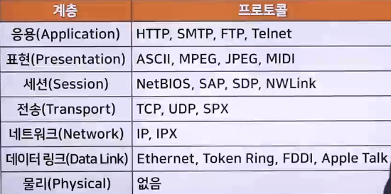

# 통신 프로토콜의 개념과 설정 명령어

## 통신 프로토콜의 개념

### 프로토콜(Protocol)이란?

> 컴퓨터나 원거리 통신 장비 사이에서 메시지를 주고 받는 양식과 규칙의 체계

- 통신 규약 및 약속

#### 프로토콜의 기본 요소

- 구문(Syntax) : 전송하고자 하는 데이터의 형식(Format), 부호화(Coding), 신호 레벨(Signal Level) 등을 규정
- 의미(Semantics) : 두 기기 간의 효율적이고 정확한 정보 전송을 위한 협조 사항과 오류 관리를 위한 제어 정보를 규정
- 시간(Timing) : 두 기기 간의 통신 속도, 메시지의 순서 제어 등을 규정

### 프로토콜의 구성

1. 물리적 측면
   - 자료 전송에 쓰이는 전송매체, 접속용 단자 및 전송 신호, 회선 규격 등
     - 물리 계층
     - 데이터링크 계층
     - 네트워크 계층
2. 논리적 측면
   - 프레임(Frame, 자료의 표현 형식 단위) 구성, 프레임 안에 있는 각 항목의 뜻과 기능, 자료 전송의 절차 등
     - 전송 계층
     - 세션 계층
     - 표현 계층
     - 응용 계층
   - 폐쇄적인 프로토콜
     - 자사 장치들끼리 통신하기 위한 독자적인 통신 규약
     - 자세한 규격이 공개되어 있지 않아서 크래킹 위협에 상대적으로 안전(IBM의 SNA, SDLC 프로토콜)
   - 공개된 범용 프로토콜
     - 여러 장치들에 쓰이는 널리 알려진 규격
     - 규격이 널리 공개되어 있기 때문에 컴퓨터와 네트워크 크래킹에 취약한 편(인터넷의 TCP/IP)

### 프로토콜 종류

- 

1. FTP : port(20, 21)
   - 파일 전송 프로토콜(File Transfer Protocol)
   - 컴퓨터 사이의 원활한 파일 전송을 위해 사용되는 프로토콜
   - port(20) : 데이터 전송용
   - port(21) : 제어용
   - 보안성 문제로 TLS와 결합한 FTPS와 SSH와 결합한 SFTP가 있음
2. TFTP : port(69)
   - 파일 전송 프로토콜
   - FTP보다는 단순한 방식이어서 데이터 전송 과정에서 데이터가 손실될 수 있는 등 불한정
   - FTP처럼 복잡한 프로토콜을 사용하지 않기에 구현이 간단
   - 임베디드 시스템에서 운영 체제 업로드로 주로 사용
3. Telnet : port(23)
   - 원격지 컴퓨터 시스템에 로그인할 수 있도록 도와주는 프로토콜
4. HTTP : port(80)
   - 하이퍼 테스트 전송 프로토콜(Hyper Text Transfer Protocol)
   - 인터넷에서 하이퍼 텍스트 문서를 교환하기 위해 사용되는 프로토콜
5. SNMP : port(161)
   - 네트워크 관리 시스템 프로토콜 (Simple Network Management Protocol)
   - 네트워크 관련 자원들을 효율적으로 감시하고 제어하는 기능 수행
6. SMTP : port(25)
   - 전자 우편 전송(송신) 프로토콜 (Simple Mail Transfer Protocol)
   - TCP/IP 호스트의 우편함에 아스키(ASCII) 문자 메시지를 전송
   - 사용자의 컴퓨터에서 작성된 메일을 받아서 다른 사람의 계정이 있는 곳으로 전송해 주는 전자 우편 송신 프로토콜
7. POP3 : port(110)
   - 전자 우편 전송(수신) 프로토콜(Post Office Protocol)
   - 전송 받은 메일을 저장하고 있다가 사용자가 메일 서버에 접속하면 이를 보내주는 역할을 하는 전자 우편 수신 프로토콜
8. DHCP : port(67, 68)
   - Dynamic Host Configuration Protocol
   - 클라이언트가 동적인 IP 주소를 할당 받아 인터넷을 사용할 수 있게 해주는 프로토콜
   - 고유한 IP 주소를 가져야 다른 네트워크나 인터넷에 접속할 수 있는데, DHCP는 고유한 IP주소 없이 접속할 때 자동으로 새로운 IP주소를 할당
   - port(67) : BOOTP 서버
   - port(68) : BOOTP 클라이언트
9. ICMP : port(1)
   - 운영체제에서 오류메시지를 전송 받는데 주로 사용
10. NETBIOS : port(139)
    - 컴퓨터 어플리케이션들이 근거리 통신망을 통해 통신할 수 있게 하는 기능 수행

### 프로토콜(Protocol)의 기능

1. 단편화(Fragmentation)와 재합성(Assembly)
   - 단편화 : 송신 측에서는 긴 데이터 블록을 손쉽게 전송할 수 있도록 크기가 똑같은 작은 블록으로 나누어 전송
   - 재합성 : 수신 측에서 쪼개진 작은 데이터 블록을 재합성하여 원래의 메시지로 복원하는 기능
2. 캡슐화(Encapsulation)
   - 각 프로토콜에 적합한 데이터 블록을 만들려고 데이터에 정보를 추가하는 것
   - 플래그, 주소, 제어 정보, 오류 검출 부호 등을 부착하는 기능
3. 연결 제어(Connection Control)
   - 비연결 데이터 전송(데이터그램)과 연결 위주 데이터 전송(가상회선)을 위한 통신로를 개설/유지/종결하는 기능
4. 흐름 제어(Flow Control)
   - 데이터양이나 통신 속도 등이 수신 측의 처리 능력을 초과하지 않도록 조정하는 기능
5. 오류 제어(Error Control)
   - 데이터 전송 중 발생할 수 있는 오류나 착오 등을 검출하고 정정하는 기능
6. 순서 결정(Sequencing)
   - 연결 위주의 데이터를 전송할 때 송신 측이 보내는 데이터 단위 순서대로 수신 측에 전달하는 기능
7. 주소 설정(Addressing)
   - 발생지, 목적지 등의 주소를 명기하여 데이터를 정확하게 전달하는 기능
8. 동기화(Synchronization)
   - 두 통신 객체의 상태(시작, 종류, 검사 등)를 일치시키는 기능
9. 다중화(Multiplexing)
   - 하나의 통신로를 여러 개로 나누거나 회선 여러 개를 하나의 통신로로 변환시켜 다수의 가입자가 동시에 사용할 수 있도록 하는 기능
10. 전송 서비스(Transmission Service)
    - 통신 객체를 사용하기 쉽도록 별도로 추가 서비스(패리티 검사, 보안도, 서비스 등급, 우선순위 등)를 제공하는 기능

## 데이터 전송 규칙

- 컴퓨터 한 대는 네트워크라고 할 수 없음
- 컴퓨터가 두 대 이상 연결되어 있으면 컴퓨터 네트워크가 되고 컴퓨터간에 데이터를 주고받을 수 있음
- 웹 사이트에 접속하는 것은 물론 네트워크나 인터넷에서 데이터를 주고 받는 데에는 규칙이 필요

### 패킷

> 컴퓨터 간에 데이터를 주고받을 때 네트워크를 통해 전송되는 데이터 전송단위(작은 조각)

- 용량이 큰 데이터를 전송할 때는 작게 나누어서 보내는 것이 규칙
- 분할된 패킷을 수신지로 전송할 때 네트워크 상황에 따라 전송한 순서대로 도착하지 않을 수도 있음
- 때문에 수신지에서는 분할된 패킷을 원래대로 재결합하는 작업 수행
- 패킷이 전송될 때 네트워크가 지연되면 패킷이 늦게 도착하거나 손실될 수도 있음
- 패킷 재조립 예시
  1. 패킷은 순서 없이 랜덤으로 수신지에 도착
  2. 그러나 송신 측에서 각 패킷에 순서대로 번호를 붙여서 전송하고 수신 측에서는 번호에 맞춰 재조립을 수행함으로써 각 패킷이 원래 위치에 자리잡을 수 있음
  3. 마지막 패킷이 도착한 후 전체의 패킷을 번호 순서로 정렬하면 송신 측에서 보낸 원래의 데이터가 됨
- 패킷 전송 과정
  - 패킷 : 헤더, 페이로드(payload), 제어 요소 등을 포함하는 데이터 세그먼트
  - 헤더 : 데이터의 형태와 데이터의 송수신지, 일련번호 등으로 구성
  - 페이로드 : 실제 전송 데이터를 포함하는 부분

## 유무선 네트워크 설정 및 명령어

### 유선 네트워크 설정(이더넷 네트워크)

> 다수의 컴퓨터를 네트워크로 연결하면 파일이나 프린터 등을 공유해서 사용하거나 인터넷으로 연겨랗여 다양한 작업이 가능

- 인터넷 연결 상태
  - 설정>네트워크 및 인터넷에서 확인
  - '연결 속성 변경'을 클릭하면 네트워크 프로필 변경 가능
    - 공용 : 프린터 및 파일 공유에 사용할 수 없게 할 때 선택
    - 개인 : 사용자의 컴퓨터를 검색하고 프린터 및 파일 공유에 사용할 수 있게 할 때 선택
  - 사용 가능한 네트워크 표시 또는 이더넷 메뉴를 이용하여 네트워크 연결을 확인할 수도 있음

### 무선 네트워크 설정

1. 필요한 하드웨어를 확인한 뒤 컴퓨터에 무선 LAN 카드(NIC)를 설치하거나 연결
2. 무선 네트워크를 사용하여 컴퓨터를 연결
3. 무선 네트워크는 라우터(게이트웨이)가 연결된 컴퓨터에서 네트워크 설정을 확인
4. '네트워크에 연결되어 있지 않습니다.' 라는 메시지가 나타나면 '사용 가능한 네트워크 표시'를 클릭
5. 보안 적용된 네트워크 중 연결할 네트워크를 선택한 뒤 연결을 클릭하면 연결된 네트워크를 확인할 수 있음

### 네트워크 명령어

- hostname
  - 컴퓨터 이름 확인
- net user
  - 컴퓨터 사용 계정 확인
- ping
  - Packet Internet Groper
  - 네트워크에 있는 호스트들의 상태를 점검
  - 사용법 : ping IP주소, ping IP주소 -t
- ipconfig
  - 현재 로컬 컴퓨터의 설정된 네트워크 값 정보를 확인할 수 있는 명령어
  - 컴퓨터가 네트워크에 제대로 연결되었는지 확인할 수 있으며 문제가 있을 때는 응답이 없거나 왕복 시간이 오래 걸림
  - ipconfig : 기본 네트워크 환경값 확인
  - ipconfig /all : 모든 정보 확인
- Tracert
  - 접속하려는 호스트까지의 경로 추적
  - 목적지의 경로에 있는 라우터를 지날 때마다 특정 메시지를 보내고 이에 따른 응답을 확인
  - 라우터 정보 및 지연시간 검사
  - 사용법
    - Tracert IP주소
    - Tracert 사이트주소
