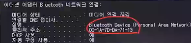

# 네트워크의 구성

## 네트워크 구성 요소

### PC(컴퓨터나 서버)

- 웹 브라우저를 통해 웹 서핑을 하거나 이메일을 주고받으면서 네트워크를 사용
- 카카오톡으로 챗을 하거나 SNS에 다양한 사진을 업로드
- 웹 브라우저나 카카오톡, 인스타그램은 모두 애플리케이션의 종류
- 이 밖에도 다양한 애플리케이션이 있으며 네트워크를 사이에 두고 다양한 데이터를 송수신

### 접속장치

- 네트워크 접속 장치는 애플리케이션의 데이터를 정상적으로 전송하기 위한 장치
- 네트워크 접속 장치에는 다양한 종류가 있지만 가장 기본적인 것으로 스위치와 라우터가 있음
  - 스위치
    - 한 네트워크 내부에서 데이터 전송을 수행하는 장치
    - 컴퓨터를 스위치에 연결하는 것은 네트워크에 연결하는 것과 같은 의미
  - 라우터
    - 서로 다른 네트워크를 구분 짓고 연결하는 장치
    - 대부분의 집은 네트워크가 하나뿐이지만 기업의 사내 네트워크에는 많은 네트워크가 존재
      - 이러한 네트워크를 연결하는 것이 바로 라우터

### 전송매체

- 컴퓨터와 네트워크 접속 장치는 전송매체에 의해 서로 연결
- 전송매체는 크게 유선/무선 전송매체로 구분
  - 유선 전송매체
    - 일반적으로 케이블을 말함
  - 무선 전송매체
    - 전파를 말함
    - 네트워크 통신에 이용되는 전파는 규격에 따라 전파의 파장이나 주파수가 지정되어 있음

## 네트워크의 형태

### 근거리 네트워크(LAN. Local Area Network)

- 범위가 건물 안이나 특정 지역인 네트워크로, 유선 케이블, 적외선 링크, 무선 송수신기 등을 이용하여 통신
- 근거리 네트워크는 일반적으로 전송 거리가 약 50m 정도의 거리임
- LAN은 작은 범위의 네트워크망으로 Ethernet, Token Ring, FDDI 형태로 구축
- 한 건물 또는 인접한 건물군 내에 있는 네트워크는 하나의 LAN으로 간주
- 집이나 빌딩 안에 있는 사무실 등 지리적으로 제한된 곳에서 컴퓨터와 프린터, 스캐너 등을 연결할 수 있는 네트워크가 바로 LAN임
- 상황에 따라서는 서로 다른 LAN을 함께 연결하는 것이 도움이 되기도 함
  - 예시
    - 같은 학과에 속해 있는 연구실 2개는 각각의 LAN을 사용
    - 두 연구실 간에 데이터 통신이 필요할 때는 두 LAN 간에 하나의 링크를 만들어야 함
    - 이것이 어떻게 가능한지 이해하려면 네트워크의 데이터 전송 원리와 서로 다른 네트워크 유형의 데이터 공유 방법을 알아야 함

#### LAN의 주요 목적

- 자원 공유
  - 원격지의 자원을 공유
  - 복수의 사용자에게 독점적 사용권을 부여
  - 사용자는 불편 없이 모든 자원을 사용 가능
- 분산 처리
  - 독립된 각 장비에서 계산과 작업을 처리
  - 전체 시스템의 능력은 연결된 모든 컴퓨터의 능력에 따라 결정
- 분산 제어
  - 분산된 지역의 독립적인 장치 간의 통신을 통하여 프로세스를 제어
  - 높은 데이터 전송 속도와 신뢰도 유지
- 정보 교환
  - Video 및 Voice 신호 전달
  - Text 데이터를 전달

#### LAN 통신의 장점

- 전송되는 패킷 손실 및 지연이 적음
- 사용자 간에 쉽고 빠르게 자료(문서, 동영상 등)를 공유할 수 있음
- 신뢰성이 높고 구축 비용이 적음
- 오류 발생률이 낮음

#### LAN 통신의 단점

- 전송 거리가 짧아서 거리에 제약이 있음
- UTP 및 광케이블로 구축되지만, 네트워크에 노드가 많아지면 충돌이 발생하여 성능이 떨어짐

### 광역 네트워크(WAN. Wide Area Network)

> 두 개 이상의 근거리 네트워크를 넓은 지역에 걸쳐 연결하는 것

- A 기업의 본사는 서울에, 공장은 지방에 있는 경우, 기업은 본사와 생산 공장 간에 데이터와 프로그램 등을 공유하기 위해 기존 전화선에 라우터를 연결하여 광역 네트워크를 구성하기도 함
- 또한, 근거리 네트워크에 포함되지 않은 멀리 떨어진 컴퓨터 사이에서도 광역 네트워크를 이용해 서로 통신할 수 있음

### 인트라넷(Intranet)

> 인터넷에서 사용하는 회선과 여러 기반 기술을 이용하여 구축하는 사설 네트워크

- ex. 각 지방에 분산된 대학 캠퍼스들을 네트워크로 연결하려고 한다면
  - 전용 회선을 이용하여 네트워크로 연결하게되면 비용이 많이 발생
  - 인터넷을 이용해 쉽게 해결 가능
    - 각 캠퍼스에서 가장 가까운 ISP(Internet Service Provider)까지만 연결하면 되기 때문
    - 아무리 멀리 떨어져 있어도 각 지방의 캠퍼스들을 ISP까지만 연결하면 인터넷을 이용하여 저렴한 비용으로 사설 네트워크를 구축할 수 있음

## 네트워크 접속 장치

> 네트워크(근거리 네트워크, 광역 네트워크) 구성에서 가장 기본이 되는 하드웨어

- 물리적으로 떨어져 있는 다양한 형태의 근거리 네트워크를 연결하면 좀 더 복잡하고 큰 광역 네트워크를 형성할 수 있음
  - 이들을 연결하려면 다양한 접속장치가 필요
- 컴퓨터나 네트워크 장치는 NIC(네트워크 인터페이스 카드)를 사용하여 네트워크에 연결할 수 있음
- 또한 허브, 중계기, 스위치, 게이트웨이, 라우터 등을 사용하여 네트워킹 문제를 해결할 수 있음

### LAN 카드(NIC. Network Interface Card)

> LAN 카드 : 두 대 이상의 컴퓨터로 네트워크를 구성하려고 외부 네트워크와 빠른 속도로 데이터를 송수신 할 수 있게 컴퓨터 내에 설치하는 확장 카드

- 네트워크에 연결하는 물리적 장치에는 반드시 하나 이상의 LAN 카드가 있어야 함
- 전송매체에 접속하는 역할과 데이터의 입출력 및 송수신, 프로토콜의 처리 기능 등을 담당
- LAN 카드는 마더보드의 확장 슬롯에 설치하며, 네트워크 케이블을 연결하는 외부 포트를 포함하고 있음
- LAN 카드에는 주민등록번호처럼 고유의 식별코드가 있음
  - MAC 주소
    - Media Access Control address
    - LAN 카드에 할당된 48비트의 물리적 주소
    - 사용자의 컴퓨터와 물리적 네트워크 사이의 인터페이스 역할 수행
  - LAN 카드의 MAC 주소
    - cmd-> ipconfig /all로 확인 가능

#### LAN 카드 물리적 주소 예시

- 
- 물리적 주소(MAC 주소)
  - 앞의 24비트는 LAN 칩셋 제조사를 의미하는 고유 코드
  - 뒤의 24비트는 제품의 일련번호와 같이 부여되는 것이므로 전 세계에서 유일한 내 컴퓨터만의 LAN 카드 고유 번호
- 실제로 네트워크 통신을 할 때 하드웨어가 사용하는 주소는 LAN 카드에 할당된 MAC 주소

### 허브

> 허브 : 여러 개의 입력 및 출력 포트가 있는 특수한 형테의 네트워크 장치

- 네트워크에 연결할 컴퓨터가 두 대 뿐일 때는 허브를 사용하지 않고 두 컴퓨터의 네트워크 카드를 케이블로 직접 연결하면 됨
- 연결할 컴퓨터가 세 대 이상이라면 허브를 사용해야 편리하게 연결할 수 있음
- 한 포트에서 수신된 신호는 허브의 다른 모든 포트로 즉시 재전송되며 모든 입력과 출력이 서로 연결되어 있어 여러 개의 노드가 똑같은 중계기를 공유할 수 있음
- 허브를 사용하면 네트워크에 연결된 컴퓨터끼리 통신할 수 있음
  - 각 컴퓨터는 이더넷 케이블(UTP)을 사용하여 허브의 각 포트에 연결되고, 한 컴퓨터에서 다른 컴퓨터로 전송되는 데이터는 허브를 통과

#### 더미 허브

- 데이터를 네트워크의 다른 컴퓨터로 전송하는 것
- 단순히 컴퓨터와 컴퓨터 간의 네트워크를 중계하는 역할을 수행
- 수신되는 데이터의 의도한 대상을 식별할 수 없기 때문에 데이터를 보내는 컴퓨터를 비롯하여 연결된 모든 컴퓨터에 데이터를 보냄
- 네트워크의 전체 대역폭을 노드 수만큼 분할하여 사용하기 때문에 허브에 연결된 노드 수가 증가하면 네트워크의 속도가 떨어짐
- 허브에 연결된 컴퓨터의 수가 어느 정도 이상이면 전체 네트워크의 전송속도가 급격히 떨어짐
- 이를 "네트워크 트래픽"이라고 하며 이런 이유로 더미 허브는 연결하는 노드 수가 적은 소규모 네트워크(10여 대 이하)를 구축하는 데 사용됨
- 장점 : 네트워크 접속 장치 중에서 가장 간단하고 저렴
- 단점 : 데이터를 주고받을 수는 있으나 동시에 수행하지는 못하므로 스위치보다 느린 것이 단점

#### 스위칭 허브

- 전체 대역폭을 각 컴퓨터 노드 수만큼 나눠서 사용하는 문제점을 해결한 접속장치
- 단순히 전송하는 기능을 넘어 수신지 주소로 스위칭하는 기능이 있음
- 노드들을 각각 점대점으로 접속시키기 때문에 네트워크 효율이 훨씬 높음
  - ex. 100Mbps 대역폭을 제공하는 이더넷에 5포트 허브로 컴퓨터 5대를 연결하면, 각 컴퓨터는 100Mbps 대역폭을 보장받음

#### 스태커블 허브

- 스택 접속 포트가 갖춰진 허브로, 허브와 허브 사이를 연결하여 용량을 확장할 수 있음
- 중규모 이상의 네트워크를 구성할 때 이 허브를 여러 층으로 쌓아서 구성
- 일반 포트를 이용하여
  - 여러 대의 더비 허브를 연결하면 컴퓨터 사이에 데이터 전송속도의 차이가 발생할 수 있음
  - 스태커블 허브를 사용하면 여러 대의 허브가 하나의 허브처럼 동작하기 때문에 전송속도의 차이가 적음

#### 인텔리전트 허브

- 신호의 조절과 변경 등 다양한 지능형 기능을 포함한 허브

### 스위치

> 컴퓨터에 할당되는 대역폭을 극대화하는 장치

- 허브와 달리 근거리 네트워크(LAN)가 제공하는 대역폭을 컴퓨터로 모두 전송
  - ex. 고속 이더넷 스위치는 연결된 컴퓨터의 수에 상관없이 보편적으로 100Mbps 대역폭을 제공하며 1G 또는 10G 대역폭을 제공하기도 함

### 브리지

> 두 개 이상의 근거리 네트워크를 연결하여 하나의 네트워크로 만들어 주는 장치

- 수신지 주소에 따라 특정 네트워크 트래픽만 통과시킬 수 있도록 설계된 특수한 형태의 네트워크 스위치
- 근거리 네트워크에서 하나의 장치가 데이터를 송신할 때 다른 장치도 데이터를 송신하면 충돌이 발생함
  - 네트워크에 노드 수가 늘어나면 충돌이 발생할 확률이 높고 통신 속도도 떨어짐
    - ㄴ 브리지를 이용하면 이러한 문제를 해결할 수 있음
- 스위치와 비슷한 역할을 하지만, 전체 네트워크의 트래픽을 줄이기 위해 네트워크를 세그먼트 단위로 분할한다는 점이 스위치와 다름

### 게이트웨이

> 종류가 다른 두 개 이상의 네트워크를 상호 접속하여 정보를 주고받을 수 있는 장치

- 접속할 수 있는 네트워크
  - 근거리 네트워크망(LAN)
  - 공중 데이터망(PDN)
  - 공중전화 교환망(PSDN)
- 브리지와 달리 서로 다른 프로토콜 네트워크 간에도 프로토콜을 변환하여 정보를 주고받을 수 있음

### 중계기

> 접속 시스템의 수를 증가시키거나 네트워크 전송 거리를 연장하려고 사용하는 장치

- 네트워크에서 신호를 수신하여 증폭한 후 다음 구간으로 재전송하는 역할 수행
- 네트워크에서 데이터를 전송할 때 케이블에 따라 전송 거리에 제약이 있을 수 있음
  - 흔히 사용하는 UTP 케이블은 보통 100m 정도까지만 가능
  - 전송 거리가 100m 이상일 때는 중계기를 이용하여 신호를 재전송해야 함

### 라우터

> 서로 다른 네트워크 간에 통신하는 데 사용하는 장치

- 구조가 다른 망을 연결할 수 있음
- 근거리 네트워크(LAN)과 대도시 네트워크(MAN), 광역 네트워크(WAN)를 연결하는 데 이용
- IP 주소를 바탕으로 데이터가 수신지까지 갈 수 있는 경로를 검사하여 효율적인 경로를 선택하는 라우팅 기능도 수행
- 라우팅은 라우터에 있는 라우팅 테이블이 결정함
  - 라우팅 테이블
    - 인터넷상에서 수신지의 주소를 토대로 경로상의 다음 주소를 결정하여 그 경로로 데이터를 보냄
    - 라우터 간의 정보 교환을 동적으로 변경할 수 있음
- 라우터의 특징
  - 오류 패킷의 폐기 기능과 혼잡 제어 기능을 수행
  - 논리 주소에 따라 네트워크 트래픽의 방향을 지정
  - 둘 이상의 네트워크를 연결하는 데 사용
  - 웹 페이지 요청을 수신지로 전송하는 데 결정적인 역할을 수행
