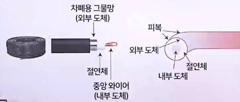
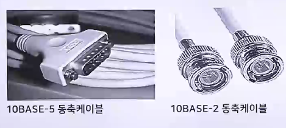
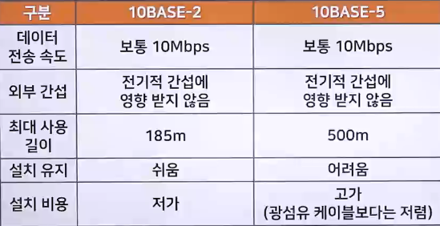
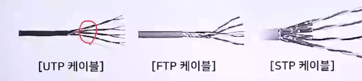
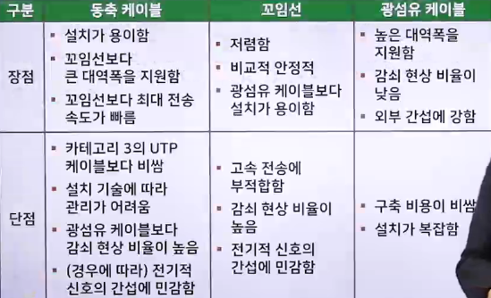

# 네트워크의 접속 형태와 전송 매체

## 네트워크 접속 형태

### 네트워크 접속 형태 개요

> 전송매체와 프로토콜이 결정되면 다양한 형태로 컴퓨터를 구성할 수 있음

- 네트워크의 구성을 "네트워크 토폴로지"라고도 함
  - 네트워크에 연결되어 있는 노드와 링크가 물리적 또는 논리적으로 배치되어 있는 방식을 말함
- 노드는 네트워크에 연결된 주소가 있는 통신장치를 말함
  - 컴퓨터, 프린터, 복합기 등이 하나의 노드가 될 수 있음
- 링크 하나에 2개 이상의 노드가 연결되며, 2개 이상의 링크가 접속 형태를 구성
- 네트워크의 접속 형태는 네트워크에 연결된 여러 노드의 물리적인 배열이 아닌 상호 연결 방법을 보여줌

#### 네트워크 접속 형태

- 성형
  - 가장 일반적인 네트워크 구성 형태
  - 허브가 네트워크 중앙에 위치하여 다른 모든 노드를 연결
  - 모든 노드가 중앙의 허브에 연결되어 통신하므로 통신망의 처리능력과 신뢰성은 허브가 좌우
  - 성형 접속 형태의 네트워크에서 하나의 케이블은 허브 같은 중앙의 네트워크 장치하고만 연결함
  - 배선 문제는 단지 해당 노드에만 영향을 줄 뿐 네트워크 전체에는 영향을 미치지 않음
  - 장점
    - 성형 접속 형태에서 각 장치는 다른 장치와 연결하는 링크 한 개와 I/O 포트 한 개만 필요하므로 설치비용이 저렴
    - 중앙 집중적인 구조라 유지보수나 확장이 용이
    - 링크 하나가 끊어져 작동하지 않을 때 해당 링크만 영향을 받고 다른 링크들은 영향을 받지 않음(안전성)
    - 결함을 쉽게 식별하고 분리할 수 있기 때문에 허브는 링크에서 발생한 문제를 점검하여 결함이 발견된 링크를 우회하는 역할을 수행
  - 단점
    - 중앙에 있는 전송제어장치에 장애가 있으면 네트워크 전체가 동작할 수 없고, 통신량이 많으면 전송이 지연
    - 각 노드가 중앙 허브와 연결되어 있어야 하기 때문에 일부 다른 접속 형태(트리형, 링형, 버스형)보다 많은 케이블을 연결해야 함
- 버스형
  - 모든 네트워크 노드와 주변장치가 파이프 등의 일자형 케이블(버스)에 연결되어 있는 형태
  - 하나의 긴 케이블이 네트워크의 모든 장치를 연결하는 중추 네트워크 역할을 수행
  - 모든 노드는 하나의 케이블에 연결되어 있고, 케이블의 시작과 끝에는 터미네이터라는 장치를 붙여서 신호가 케이블로 되돌아오는 것을 막음
  - 장점
    - 설치가 간단하고 케이블 비용이 적게 듦
    - 장비를 추가하기 쉬움
    - 고장이 나도 전체 네트워크에 영향을 미치지 않음
    - 중추 케이블을 가장 효과적으로 설치할 수 있고, 다양한 길이의 유도선으로 노트를 연결할 수 있기에 성형이나 트리형 접속 형태보다 사용하는 케이블양이 적음
  - 단점
    - 장비 수가 많아지면 네트워크 성능이 저하
    - 중앙 케이블이 고장나면 네트워크 전체가 동작하지 않음
    - 버스 케이블에 결함이나 파손이 생기면 모든 전송을 중단하고, 끊어진 한쪽 지역에 있는 장치 간에 전송도 할 수 없음
      - 손상된 지역은 양방향으로 잡음이 일어나기 때문
    - 재구성이나 결합/분리가 어려움
    - 베이스밴드 전송 방식에서는 케이블 거리가 멀어지면 신호가 점점 약해지기 때문에 중계기를 사용해야 함
    - 한 노드에서 데이터를 전송할 때 다른 노드에서 이미 데이터를 전송하고 있으면 충돌이 발생하므로 나중에 다시 전송해야 함
- 트리형
  - 성형의 변형으로, 중앙에 있는 전송제어장치에 모든 장비를 연결한 것이 아니라 트리 형태의 노드에 전송제어장치를 두어 노드들을 연결하는 형태
  - 상위 계층의 노드가 하위 노드들을 직접 제어하는 계층적인 네트워크에 적함
  - 장점
    - 제어가 간단하여 관리나 네트워크 확장이 용이
    - 중앙에 있는 하나의 전송제어장치에 더 많은 장비를 연결할 수 있어 각 장비 간의 데이터 전송 거리를 늘릴 수 있음
    - 여러 컴퓨터를 분리하거나 우선순위를 부여할 수 있음
  - 단점
    - 중앙에 트래픽이 집중되어 병목현상이 발생할 수 있음
    - 중앙의 전송제어장치가 다운되면 전체 네트워크에 장애가 발생
- 링형
  - 노드가 링에 순차적으로 연결된 형태로, 모든 컴퓨터를 하나의 링으로 연결
  - 각 노드들은 인접한 노드 두 개 하고만 연결되며, 전체 네트워크는 하나의 원을 형성
    - 단순 링형(Single Ring) : 원의 한 방향으로만 데이터를 전송할 수 있음
    - 이중 링형(Double Ring) : 양방향으로 데이터를 전송할 수 있음
  - 장점
    - 구조가 단순하여 설치와 재구성이 용이
    - 장애가 발생해도 복구시간이 빠름
    - 각 장치는 바로 이웃하는 장치에만 연결되어 있고, 장치를 추가하거나 삭제할 때는 단지 연결선 두 개만 움직이면 됨
    - 보통 신호는 항상 순환되므로 한 장치가 특정한 시간 내에 신호를 받지 못하면 경보를 낼 수 있으며 이 경보는 네트워크 운영자에게 문제의 발생 사실과 발생 위치를 알려줌
    - 성형보다 케이블 비용을 많이 줄일 수 있음
  - 단점
    - 링을 제어하는 절차가 복잡
    - 새로운 장비를 연결하려면 링을 절단한 후 장비를 추가
    - 단순 링형에서는 링에 결함(네트워크 내 한 장치가 사용 불가능한 경우)이 생기면 전체 네트워크를 사용할 수 없음
- 그물형
  - 중앙에 제어하는 노드 없이 모듣ㄴ 노드가 상호 간에 전용의 점대점 형태로 연결되는 형태
  - 전용은 연결된 두 장치 간에 통신만 담당하는 링크가 있음을 의미
  - 그물형에서는 n(n-1)/2개의 물리적 채널 필요
  - 네트워크가 복잡하고 많은 통신회선이 필요하기 때문에 비용이 많이 듦
  - 신뢰성이 높아 중요한 네트워크에 주로 사용함
  - 장점
    - 전용 링크를 사용하면 각 연결회선이 원하는 자료를 전송할 수 있어 많은 장치를 공유하는 링크에서 발생하는 통신량 문제를 해결할 수 있음
    - 한 링크가 고장나더라도 전체 시스템에는 큰 문제가 발생하지 않음
      - 일부 통신회선에 장애가 발생하면 다른 경로를 통하여 데이터를 전송
    - 모든 메시지는 전용선으로 보내기 때문에 원하는 수신자만 받을 수 있음(비밀 유지와 보안에 유리)
    - 결함의 식별과 분리가 비교적 쉽고, 전송에 문제가 있다고 생각되는 링크는 관리자가 우회하도록 설정할 수 있음
      - 관리자는 문제가 발생한 곳을 쉽게 찾아 그 원인을 바로 해결할 수 있음
  - 단점
    - 노드를 다른 모든 노드와 연결해야 하므로 설치와 재구성이 어려움
    - 실제 필요한 전선의 용적이 벽 속이나 천장, 바닥 아래 등 전선을 수용할 공간보다 커질 수 있음
    - 네트워크가 복잡하고 많은 통신회선이 필요하기 때문에 각 링크와 연결되는 하드웨어(I/O 포트와 전선)에 엄청난 비용이 들 수 있음
- 혼합형
  - 소규모 네트워크가 아니라면 순수한 버스형이나 링형, 성형접속 형태를 실제로 만나기는 어려움
  - 노드 수가 상대적으로 큰 실제 네트워크에서는 효율을 높이고 결함 허용 능력을 증대시키기 위해 혼합형 접속 형태를 사용
  - 네트워크 서브넷이 서로 연결되어 규모가 큰 접속 형태가 되도록 여러 접속 형태를 결합할 수 있음

## 유선 네트워크 전송 매체

### 동축 케이블(Coaxial Cable)

- 케이블 TV 시스템에서 사용하는 케이블 방식과 유사
- 동축 케이블은 꼬임선보다 주파수가 높고 데이터 전송이 빠름
- 외부 신호와 전자파를 차단하는 능력이 뛰어남
- 주로 유선방송, CATV, 근거리 네트워크 등에 사용
- 동축 케이블은 두 개의 전도체로 구성
  - 하나는 케이블 가운데 있는 와이어
  - 다른 하나는 와이어를 감싸는 차폐용 그물망
  - 절연체는 이들 중간에 들어 있음
  - 
- 10BASE-5 규격의 굵은(Thick) 케이블, 10BASE-2 규격의 얇은(Thin) 케이블로 나뉨
  - 
- 

### 꼬임선(Twisted Pair) : 이중 나선 케이블

> 꼬임선은 플라스틱으로 덮인 두 가닥의 절연된 구리선을 나선형으로 꼬아서 만듦

- 한 쌍이 하나의 통신회선 역할을 하며, 여러 개의 쌍이 묶여 하나의 케이블을 형성하고 보호용 외피로 이를 감싸 완성
- 구리선을 꼬는 이유
  - 두 선 사이의 전기적 간섭을 최소화하기 위해서
- 접속 형태 중 성형 구성에 많이 사용함
- 동축 케이블이나 광섬유 케이블에 비해 설치하기 쉬움
- 꼬임선은 만들기 쉽고 비용이 저렴하여 다양한 전송매체에 사용
- 꼬임선은 외부 신호의 간섭을 최소화하기 위해 금속망으로 전선을 감싸는 차폐 보호망을 사용
- 사용 여부에 따라 UTP 케이블과 FTP 케이블, STP 케이블로 분류함
  - 

#### UTP (힌주/주/흰초/파/흰파/초/흰갈/갈)

- 전자기 간섭을 줄이기 위해 케이블을 나선형으로 꼬아놓은 형태로, 별도의 피복은 없음
- UTP는 네트워크 케이블의 90% 이상을 점유하고 있는데, 데이터 보호망이 없어 가격이 저렴하고 제작이 쉽기 때문
- 가장 많이 사용하는 카테고리 등급 5는 최대 100Mbps의 속도로 데이터를 전송할 수 있음

#### FTP

- 전자기 간섭을 줄이기 위해 전체 케이블에 피복을 씌운 형태

#### STP

- FTP에서 전자기 간섭을 막기 위해 전체 케이블에 피복을 씌웠다면, STP는 추가로 은박지 등 금속형 물질로 한 번 더 싼 형태
- 케이블 겉면의 외부 피복, 즉 알루미늄 은박이 4가닥의 선을 감싸고 있음
- 이 차폐재는 접지 역할까지 하기 때문에 외부의 노이즈를 차단할 수 있고, 전기적 신호 간섭에 좋은 성능을 보임
- 꼬임선은 피복의 정도에 따라 전자기 간섭의 효과가 달라지며, STP-FTP-UTP 순으로 간섭의 영향을 덜 받음

### 광섬유 케이블(Optical Fiber Cable)

> 머리카락보다 가늘어 휘어지는 전송매체

- 꼬임선처럼 구리선에 전기를 통하게 하여 데이터를 전송하는 것이 아니라 빛을 이용하여 데이터를 전송하기 때문에 휘는 범위에 한계가 있음

### 유선 네트워크 전송 매체 정리

- 

## 무선 네트워크 전송 매체

### 라디오파(Radio Wave)

- 빛의 속도(30만km/s)로 데이터를 전송할 수 있으며, 진공 상태나 대기를 통과할 수 있어 데이터 전송에 유용하게 사용
- 방향성이 없는 무선파를 사용하므로 마이크로파처럼 파라볼라 안테나를 사용할 필요도 없음
- AM(진폭 변조)
  - 신호의 강약을 조절하여 데이터를 보내는 방법
  - FM 방송은 100MHz 정도의 주파수를 사용하며, 그 파장은 약 3m 정도
- FM(주파수 변조)
  - 주파수를 변조하여 데이터를 보내는 방법
  - AM 방송은 750kHz의 주파수를 사용하며, 파장이 대략 400m인 라디오파를 사용
- 이동통신은 800MHz ~ 1.5GHz의 극초단파를 사용

### 마이크로파(Microwave)

> 극초단파(UHF), 센티미터파(SHF), 밀리미터파(EHF)를 포함하는 주파수가 매우 높은 전파

- 통신과 레이더 등 광범위한 용도에 사용
- 마이크로파처럼 파장이 짧으면 광파와 성질이 유사하여 직진, 흡수, 방사의 성질이 있음
- 300MHz ~ 300GHz의 무선 주파수대역을 포함하지만, 실제로는 1~40GHz 대역폭을 주로 사용
- 300MHz ~ 3GHz의 주파수 대역을 사용하는 지상 마이크로파(Terrestrial Microwave) 통신은 동축 케이블 등 유선통신 선로를 설치하기 힘든 지역에서 주로 사용
- 유선 전송매체 설치가 불가능한 지역에 파라볼라 안테나를 설치하여 전파를 전송
