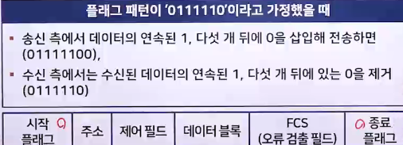

# 네트워크 통신 방식

## LAN 통신 방식

### 통신방식 개요

- 서버 : 다른 컴퓨터에 데이터 전송 서비스를 제공하는 컴퓨터
- 클라이언트 : 서버에서 보내주는 데이터 서비스를 수신하는 컴퓨터
- 클라이언트/서버 시스템 : 서버는 클라이언트(사용자)한테 요청 받아 서비스를 제공함. 이렇게 구성된 시스템을 '클라이언트/서버 시스템'이라고 부름

### LAN 통신 방식

- 유니캐스트
  - 가장 많이 사용하는 통신 방식으로 수신지 주소(MAC 주소)를 적어 특정 컴퓨터에만 전송
  - 네트워크에서 가장 많이 사용
  - 서버와 클라이언트 간의 1:1 통신 방식
  - 
  - 자신의 MAC 주소와 수신지 MAC 주소가 동일하다면 전송된 데이터를 수신
  - 자신의 LAN 카드 MAC 주소가 수신지 주소가 아니라고 판단되면 해당 프레임은 버림
- 브로드캐스트
  - 영역 안에 있는 모든 컴퓨터에 한 번에 다 전송
  - 로컬 LAN(라우터로 구분된 공간)에 있는 모든 네트워크 단말기에 데이터를 보내는 방식
  - 서버와 클라이언트 간에 1:모두 로 통신하는 데이터 전송 서비스
  - 
  - 다른 라우터를 찾거나, 라우터끼리 데이터를 교환하거나, 서버가 서비스를 제공핳려고 모든 클라이언트에게 알릴 때 등 여러 상황에서 사용할 수 있음
    - 그러나, 불특정 다수에게 전송되는 서비스라 수신을 원치 않는 클라이언트도 수신하게 되므로 네트워크 성능 저하를 가져올 수 있음
- 멀티캐스트
  - 유니캐스트와 브로드캐스트의 장점을 결합하여 특정 그룹 컴퓨터에만 한 번에 데이터를 전송하며 그룹 이외의 컴퓨터에는 영향을 주지 않음
  - 브로드캐스트는 데이터를 무조건 CPU로 전송하기 때문에 컴퓨터 자체의 성능을 떨어뜨림
  - 이 문제를 가장 쉽게 해결할 수 있는 방법이 바로 멀티캐스트
  - 멀티캐스트는 전송하려는 특정 그룹에게만 한 번에 전송할 수 있음
    - 때문에 유니캐스트처럼 반복해서 보낼 필요가 없고, 브로드캐스트처럼 전송 받을 필요가 없는 컴퓨터에 보내지 않아도 됨
  - 현재 많이 사용하는 애플리케이션에서는 이런 기능이 필요하므로 멀티캐스트가 인기를 끌고 있음

## 전송 방향에 따른 통신 방식

> 통신 : 떨어져 있는 두 지점 간에 정보를 전송하는 것

- 두 장치 간에 데이터를 전송 할 때는 데이터 전송 방향에 따라 단방향(simplex) 통신과 양방향(duplex) 통신으로 나눔
- 양방향 통신은 정보를 주고받는 시점에 따라 다시 반이중(half-duplex) 통신과 전이중(full-duplex) 통신으로 나눔
- 

### 단방향(Simplex) 통신

> 송신 측과 수신 측이 미리 고정되어 있음

- 통신 채널을 통해 접속된 단말기 두 대 사이에서 데이터가 한쪽 방향으로만 전송되는 통신 방식
- 단방향 통신에서 전기적으로 신호를 보내려면 송신 측과 수신 측을 연결하는 회로를 구성해야 함
  - 비록 단방향 전송일지라도 전송로는 두 개가 필요
- 대표적인 단방향 통신에는 예전에 많이 사용하던 무선호출기나 라디오, 아날로그 TV 방송, 모니터, 키보드 등이 있음

### 양방향(Duplex) 통신

- 통신 채널을 통해 접속된 두 대의 단말기 사이에서 데이터의 송수신이 모두 가능한 방식
- 반이중 통신과 전이중 통신으로 구분
  - 반이중 통신 : 데이터의 송수신을 한 번씩 번갈아 가면서 할 수 있음
  - 전이중 통신 : 데이터의 송수신을 동시에 할 수 있음

 

1. 반이중(Half-Duplex) 통신
   - 통신 채널에 접속된 두 대의 단말기 중 어느 한쪽이 데이터를 송신하면 상대방은 수신만 할 수 있는 통신 방식
   - 송신 측과 수신 측이 정해져 있지 않음
   - 양쪽 단말기의 상호 협력에 따라 송수신 방향이 바뀜
     - ex. 휴대용 무전기와 모뎀을 이용한 데이터 통신 등
2. 전이중(Full-Duplex) 통신
   - 통신 채널에 접속된 단말기 두 대가 동시에 데이터를 송수신할 수 있는 통신 방식
   - 전이중 통신은 통신 채널 두 개를 이용하여 한 번에 데이터를 송수신할 수 있음
     - ex. 전화

## 직렬 전송과 병렬 전송

### 개요

- 장치 사이에 데이터를 전송할 때 몇 가지 고려해야 할 사항이 있음
  - 여러 데이터를 한꺼번에 전송할 것인가?
  - 아니면 한 번에 하나씩만 전송할 것인가?
  - 데이터를 하나씩 전송한다면 어떤 방식을 사용할 것인가 등 고려
- 데이터 전송은 2진 데이터를 전압이나 전류의 변화로 표현한 신호에 실어 보내는 것을 말함
- 데이터 비트를 전송하는 방법에 따라 직렬 전송과 병렬 전송으로 나눔

### 직렬 전송

> 하나의 정보를 나태내는 각 데이터 비트를 직렬로 나열한 후 하나의 통신회선을 사용하여 순차적으로 1비트씩 송신하는 방식

- 하나의 통신회선을 사용하기 때문에
  - 송신 측에서는 데이터를 1비트씩 송신
  - 수신 측에서는 수신되는 비트를 일정한 단위로 모아서 사용
- 병렬 전송에 비해 데이터 전송속도가 느림
- 원거리 데이터 전송에서는 통신회선이 한 개만 필요하므로 경제적

 

1. 동기식 전송
   - 두 시스템 간에 컴퓨터의 속도 차이(클럭 오차)가 있기 때문에 송신 비트 시간 간격(TS)과 수신 비트 시간 간격(TR)이 정확하게 일치하지 않음
   - 따라서 적절한 방법으로 송신 측에서 전송한 데이터의 각 비트를 수신 측에서 정확하게 수신할 수 있도록 해야 함
     - 이를 동기화(Synchronization) 라고 함
   - 동기식 전송
     - 미리 정해진 수만큼 문자열을 한 묶음으로 만들어 일시에 전송하는 방법
     - 비트와 데이터 간에 간격 없이 차례대로 비트를 전송하기 때문에 데이터는 끊어지지 않는 0과 1의 문자열로 전송
   - 수신 측은 차례대로 문자열을 수신한 후 문자나 바이트로 분리해서 의미 있는 데이터로 재구성
   - 동기식 전송의 대표적인 예: 일정한 시간 간격으로 정보를 전송하는 파일 업로드와 파일 다운로드가 있음
   - 비트 단위로 동기화시키는 비트 지향 동기화 기법과, 문자 단위로 동기화시키는 문자 지향 동기화 기법이 있음
2. 비트 지향 동기화 기법
   - 데이터의 시작과 끝을 알리는 시작 플래그(Start Flag)로 시작해서 종료 플래그(Stop Flag)로 끝남
   - 플래그 등의 패턴을 구별하려고 '0' 비트를 삽입함(Stuffing)
   - 
3. 문자 지향 동기화 기법
   - 모든 데이터의 단위를 문자 단위로 처리함으로써 동기화에 필요한 데이터까지 문자로 표현
   - 문자 지향 동기화 기법에서 사용하는 동기 문자에는 SYN, 문장의 시작을 알리는 STX(Start-of-TeXt), 문장의 끝을 알리는 ETX(End-of-TeXt) 등이 있음
   - 
4. 비동기식 전송
   - 긴 데이터 비트열을 연속으로 전송하는 대신 한 번에 한 문자씩 전송함으로써 수신기가 새로운 문자의 시작점에서 재동기하도록 하는 것
   - 비동기 전송에서는 문자 단위로 재동기하려고 맨 앞에는 한 문자의 시작을 알리는 시작비트(Start Bit)를 두고, 맨 뒤에는 한 문자의 종료를 표시하는 정지 비트(Stop Bit)를 둠
   - 보통 시작 비트는 1비트를, 정지 비트는 1~2비트 정도를 사용
   - 전송하는 문자는 시작 비트 바로 뒤에 옴
     - 문자의 종류에 따라 5~8비트의 길이를 가짐
   - 문자 비트열 뒤에는 패리티 비트(Parity Bit)가 뒤따르며, 2진수 1의 개수는 패리티 비트를 포함해 홀수 또는 짝수의 값을 가짐
   - 
   - 비동기식 전송은 하나의 문자를 전송한 후 휴지 상태(Idle)에 들어가는데, 이 시간이 바로 동기화되는 시간임
   - 문자를 전송하지 않을 때 송수신 측은 휴지 상태에 있는데, 송신기는 다음 문자를 보낼 준비가 될 때까지 정지 비트를 계속 전송(11111111)
   - 문자들을 연속적으로 보낸다면 문자 간의 시간 간격은 일정하고, 길이는 정지 비트와 같음
   - 비동기식 전송은 전송하려는 정보가 불규칙하게 발생할 때 주로 사용
     - 사용자가 메신저에 키보드로 입력한 정보를 전송하는 경우를 예로 들 수 있음

### 병렬 전송

> 부호를 구성하는 비트 수와 같은 양의 통신회선을 사용하여 여러 데이터 비트를 동시에 병렬로 전송하는 방식

- 비트 n개를 전송하려고 회선 n개를 사용
- 송신 측과 수신 측 단말기 간에 여러 개의 통신회선을 사용하기 때문에 여러 비트의 데이터를 한 번에 송신
- 병렬 전송은 거리에 비례해서 선로비용이 많이 들기 때문에 전송속도가 빨라야 하는 짧은 거리의 데이터 전송에 주로 사용
