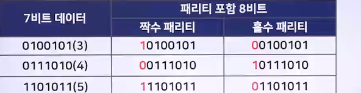
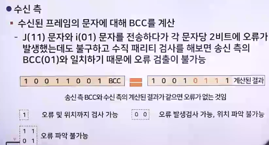

# 통신 오류 검출

## 통신 오류 검출 개요

- 수신 측으로 전송한 데이터는 송신 측의 데이터와 동일해야 하지만, 다양한 원인 때문에 데이터 오류가 발생할 수 있음
- 따라서 신뢰할 수 있는 네트워크 통신을 하려면 오류를 검출/수정해야 함
- 오류의 종류에는 단일 비트 오류, 다중 비트 오류, 집단 오류가 있음
- 

### 단일-비트 오류(Single-bit Error)

- 데이터 단위 중 하나의 비트만 변경하는 오류
- 

### 다중-비트 오류(Multiple-bit Error)

- 데이터 단위 중 두 개 이상의 비연속적인 비트를 변경하는 오류
- 

### 집단 오류(Burst Error)

- 데이터 단위 중 두 개 또는 그 이상의 연속적인 비트를 변경하는 오류
- 송신 측이 보내려는 데이터 외에 별도로 잉여(중복)분의 데이터를 추가해서 전송하면 수신 측은 이 잉여 데이터를 검사하여 오류를 검출할 수 있음
- 
- 오류를 검출하는 방식
  - 패리티 비트 검사(parity bit check)
  - 블록 합 검사(block sum check)
  - 순환 중복 검사(Cyclic Redundancy Check)

## 패리티 비트 검사

> 패리티 비트 검사(Parity Bit Check) : 전송하는 데이터마다 패리티 비트를 하나씩 추가하여 홀수 또는 짝수 검사 방법으로 오류를 검출

- 추가로 전송되는 1비트를 '패리티 비트'라고 함
- 패리티 비트의 값은 데이터 코드 내에 있는 1의 수를 계산함으로써 결정
- 

### 홀수 패리티 방식(Odd Parity)

- 전체 비트에서 1의 개수가 홀수가 되도록 피리티 비트를 정하는 것
- 데이터 비트에서 1의 개수가 짝수면 패리티 비트를 1로 정하여 전송되는 전체 데이터에 있는 1의 개수는 홀수가 됨

### 짝수 패리티 방식(Even Parity)

- 전체 비트에서 1의 개수가 짝수가 되도록 패리티 비트를 정하는 것
- 데이터 비트에서 1의 개수가 홀수면 패리티 비트를 1로 정하여 전송되는 전체 데이터에 있는 1의 개수는 짝수가 됨

### 패리티 방식 예시

- 

#### 인코딩(Encoding) 예제

- 7비트 데이터가 0100111인 경우
  - 짝수 패리티 방식을 사용하면 0100111에서 1이 4개이므로 짝수
  - 여기에 패리티 비트 0을 추가해도 전송되는 전체 데이터에 있는 1의 개수는 짝수(00100111)

#### 디코딩(Decoding) 예제

- 짝수 패리티 검사 원리
  - 00100111에서 패리티 비트는 0이므로 1의 개수가 짝수인지 확인
  - 짝수 패리티 방식은 패리티 비트를 포함해서 각각 XOR 연산을 한 후 결과가 0(1의 개수가 짝수)이면 오류가 없는 것이고, 1(1의 개수가 홀수)이면 오류가 검출된 것
  - 0 XOR 0 XOR 1 XOR 0 XOR 0 XOR 1 XOR 1 XOR 1 = 0
- 홀수 패리티 검사 오류 검출 예
  - 

## 블록 합 검사(Block Sum Check)

> 블록 합 검사 : 문자를 블록으로 전송하면 오류 확률이 높아지는데, 오류 검출 능력을 향상시키려고 문자 블록에 수평 패리티와 수직 패리티를 2차원적으로 검사하는 방법

- 행 단위 패리티에 열 단위의 오류 검사를 수행할 수 있는 열 패리티 문자를 추가하여 이중으로 오류 검출 작업을 수행

> 추가된 열 패리티 문자를 '블록검사 문자(BCC, Block Check Character)'라고 함

- 블록 합 검사를 사용하면 한 데이터에서 짝수 개의 오류가 발생하더라도 오류를 검출할 수 있음

- 
- 
- 
- 

## 순환 중복 검사

> 순환 중복 검사(CRC, Cyclic Redundancy Check) : 정확하게 오류를 검출하기 위해 다항식 코드를 사용하는 방법

- 오류가 없을 때는 계속 발생하지 않다가 오류가 발생하면 그 주위에 집중적으로 오류를 발생시키는 집단 오류를 검출하는 능력이 탁월하고, 구현이 단순함

- 다항식(Polynomial)
  - CRC 발생기는 0과 1의 스트링 보다는 대수 다항식으로 표현하며, 하나의 다항식은 하나의 제수(Divisor)를 표현
  - 
  - 다항식을 이용한 순환 중복 검사의 오류 검출 과정
    - 송신 측이 데이터를 전송하기 전에 송수신 측은 동일한 생성 다항식을 결정
    - 송신 측에서는 K비트의 전송 데이터를 생성 다항식으로 나눈 n비트의 나머지 값을 구하고, K비트의 전송 데이터에 n비트의 나머지 값을 추가하여 K+n 비트의 데이터를 수신 측으로 전송
    - 수신 측에서는 수신된 K+n비트의 데이터를 생성 다항식으로 나누고 나눈 나머지가 0이면 오류가 없는 것이고, 0이 아니면 오류가 발생한 것

### CRC 검사 과정

- 

### 예제

- 

1. 1단계
   - 
2. 2단계
   - 
3. 3단계
   - 
4. 4단계
   - 
5. 5단계
   - 

 

