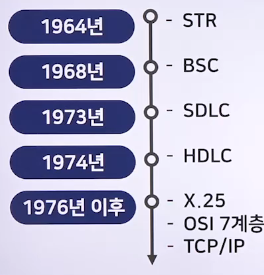

# OSI 7계층 프로토콜(1)

## 통신 프로토콜의 개요

### 통신 프로토콜의 개념

> 통신 프로토콜 : 통신을 원하는 두 객체 간에 무엇을, 어떻게, 언제 통신할 것인지 서로 약속해 놓은 규정

- 정보통신에서 통신을 통제하는 규칙들을 규정

### 통신 프로토콜의 발전과 표준화 배경

- 1960년대부터 사용
- 처음에는 IBM에서 제정한 프로토콜인 BSC와 SDLC를 많이 사용
- 1976년 국제전신전화자문위원회(CCITT)는 프로토콜을 하나로 통합하여 사용할 것을 권고
- 국제표준화기구에서 OSI 참조 모델을 제정하여 발표
- 지금은 인터넷 기술이 발전하면서 TCP/IP를 많이 사용
- 
- BSC
  - Binary Synchronous Control
  - 프레임에 전송 제어 문자를 삽입하여 전송을 제어하는 문자 위주의 프로토콜
- SDLC
  - Synchronous Data Link Control
  - IBM사에서 개발한 비트 방식의 프로토콜
- HDLC
  - High - Level Data Link Control
  - 비트(Bit) 위주의 프로토콜로, 각 프레임에 데이터 흐름을 제어하고 오류를 검출할 수 있는 비트 열을 삽입하여 전송
- X.25
  - 공중 데이터 네트워크(패킷교환망)에 대한 최초의 표준
- OSI 7계층
  - 네트워크 프로토콜이 통신하는 구조를 7개의 계층으로 분리하여 각 계층간 상호 작동하는 방식을 정해 놓은 것
- TCP/IP
  - Transmission Control Protocol/Internet Protocol
  - 컴퓨터 사이의 통신 표준 빛 네트워크의 라우팅 및 상호연결에 대한 자세한 규칙을 지정하는 프로토콜

## OSI 7계층 프로토콜과 참조모델

### OSI 7계층 프로토콜 개념

> X.200으로 알려진 국제 네트워크 표준 규약

- 국제표준화기구(ISO) 위원회에서 제정하여 6년간의 개발 끝에 1983년 완성
- 네트워크 구조를 표준화하는 개방형 시스템 사이의 상호 접속과 관련된 규정을 정의
- OSI 7계층의 구성
  - 
- OSI 7계층 상호 간의 데이터 전달 원리
  1. 최상위 계층(7계층: 응용 계층)에서 발생한 데이터를 하위 계층으로 차례로 전달
  2. 처음의 데이터에 각 계층에서 전달받은 헤더정보를 추가하여 전달
  3. 최하위 계층(1계층: 물리 계층)에 도달
  4. 각 계층의 헤더에 해당되는 부분을 벗긴 후 최상위 계층으로 전달

### OSI 7계층 프로토콜과 참조 모델

> OSI 7계층 역할 : 최상위 계층(7계층: 응용 계층)에서 발생한 데이터를 하위 계층으로 차례로 전달

## 물리 계층

> OSI 참조 모델 중 최하위 계층에 해당하는 1계층

- 상위 계층에서 내려온 비트열 데이터를 상대편에 전송할 수 있도록 통신기기 사이에 있는 물리적 매체를 이용해 연결을 확립하는 역할
- 물리계층은 DTE와 DCE간의 실제적인 연결을 설정하고, 유지 및 해지를 위한 기능적, 전기적, 절차적, 기계적 특성을 제공
  - DTE : Data Terminal Equipment : 데이터 단말장치
  - DCE : Data Circuit terminating Equipment : 데이터 회선종단장치

### 물리 계층의 주요 기능

- 기능적 특성
  - 각 핀에서 사용되는 신호의 기능을 정의하며, 일반적으로 데이터 신호, 제어신호, 타이밍 신호, 접지신호 등으로 규정
- 전기적 특성
  - 신호의 전위 규격과 전위 변화의 타이밍(timing)에 관한 것
  - 이러한 특성은 데이터 전송속도와 전송거리를 결정
- 절차적 특성
  - 기능적 특성에 의하여 데이터를 교환하기 위한 절차(동작의 순서)를 규정
- 기계적 특성
  - 상호접속을 위한 커넥터의 물리적 규격을 정의
  - 커넥터의 형태, 핀 수에 대한 규정으로는 EIA, ISO 표준 등이 있음

### 물리 계층

> 물리적 연결에서 비트 단위의 데이터열을 전송하기 위해 신호와 부호화, 전송 방식 등을 결정

- 송신 측의 물리 계층
  - 상위 계층에서 0과 1로 구성된 비트열의 데이터를 받아 그것을 전기 신호로 변환한 후 전송매체를 이용해 수신 측으로 전달
- 수신 측의 물리 계층
  - 이 전기 신호를 0과 1로 구성된 비트열로 복원하여 상위 계층에 전달
- 전송 방식으로 반이중 또는 전이중 방식을, 전송 모드로 동기 또는 비동기 모드를 선택할 수 있음
- 물리 계층을 표준화한 대표적 예
  - RS-232C, RS-422, RS-485가 있음
- 물리 계층의 표준은 ISO, CCITT에서 결정, 규격은 각 국가에서 설정
  - 한국-KS, 미국-EAI, 일본-JIS
- CCITT 표준안에는 V 시리즈와 X 시리즈가 있음
  - V시리즈 : 기존 전화망을 이용하여 아날로그 데이터를 전송하는 방법
  - X시리즈 : 디지털 데이터망을 이용하여 디지털 데이터를 전송하는 방법

## 데이터링크 계층

> OST 참조 모델에서 하위 계층인 2계층

- 두 시스템 사이에서 오류 없이 정보 데이터를 정송하려고 상위 계층(네트워크 계층)에서 받은 비트열의 데이터로 프레임을 구성하여 하위 계층(물리 계층)으로 전달
- 대표 기능
  - 노드-대-노드 전달, 주소 지정, 전송 제어, 흐름 제어, 오류 제어, 동기화 등
- 데이터 링크 계층은 데이터 동기를 제고하여 비트들을 식별하는 기능을 제공
- 채널상으로 데이터를 전송, 노드 대 노드는 전달을 책임
- 노드-대-노드 전달과 주소 지정
  - 이웃 노드 간의 데이터 링크를 설정하는 기능
  - 전송할 데이터 앞에는 헤더, 뒤에는 트레일러를 추가하여 하위 계층 (물리 계층)으로 전달
  - 헤더와 트레일러에는 발신지 주소와 목적지 주소 등 정보가 들어 있음
  - 수신 측의 데이터 링크 계층에서는 이 헤더와 트레일러를 삭제, 수신 측의 네트워크 계층으로 전달

### 전송 제어

> 데이터 송수신 시 데이터를 올바르게 전송하는 일련의 절차를 제어

- 전송 제어 절차 사용 시 이점
  - 문자나 비트에 관계 없이 전송할 수 있음
  - 연속적으로 전송하고 일괄적으로 응답할 수 있어 전송 능력을 향상시킬 수 있음
  - 전이중 방식으로 통신할 때는 역방향으로도 응답할 수 있어 전송 능력을 향상시킬 수 있음
  - 오류 검출이 가능

#### 전송 제어 방식은 전용회선과 교환회선에서 서로 다름

- 

#### 교환회선의 전송 제어 절차

1. 회선 접속
   - 정보를 전송하기 전 단계로, 회전 접속이 필요
   - 모뎀이나 DSU 등의 상태를 데이터 전송이 가능한 단계까지 많듦
2. 데이터 링크 확립
   - 데이터의 송수신이 가능하도록 경로를 구성하는 단계
   - 데이터 링크를 확인하는 방법에는 폴링과 선택이 있음
     - 폴링
       - 단말기에서 컴퓨터로 데이터를 전송하는데 사용
     - 선택
       - 컴퓨터가 특정 단말기를 지정하여 데이터를 전송하는 데 사용
       - 데이터 앞에 특정 단말기를 지정하는 제어 문자를 포함하여 전송
3. 정보전송
   - 데이터 링크가 확립되면 정보를 전송하기 시작
   - 전송로에서 발생한 오류를 검출한 뒤 그것을 정정하도록 제어하며 정보를 전송
4. 데이터 링크 해제
   - 데이터 전송이 종료되면 그 내용을 수신 측에 통보
   - 전송의 끝을 알려주는 EOT를 문자로 보내며, 국 간의 논리적 연결을 절단하여 해제
5. 회선 절단
   - 연결된 회선을 절단

### 흐름 제어

> 흐름 제어 : 회선 양쪽 시스템이 처리 속도가 다를 때 데이터양이나 통신 속도가 수신 측이 처리할 수 있는 능력을 넘어서지 않도록 조정하는 기능

- 데이터 통신망의 데드락을 회피하기 위해서 흐름 제어가 필요
- 흐름 제어 방식에는 정지 대기 방식과 슬라이딩 윈도우 방식이 있음

#### 정지 대기 방식

> 데이터를 전송할 때 송신 측에서는 한 번에 프레임 1개만 전송할 수 있으며, 수신 측에서는 다음 프레임을 맞게 전송하였는지 결정하여 송신 측에 통보

- 흐름 제어 방식 중 가장 간단
- 프레임을 몇 개의 큰 단위로 전송할 때 효율적
- 오류를 복구할 때는 정지 대기 방식과 하나의 메커니즘으로 구현

#### 슬라이딩 윈도우 방식

> 데이터를 전송할 때 송신 측에서 한 번에 윈도우 크기만큼 프레임을 연속해서 전송할 수 있음

- 수신 측에서는 적절한 간격으로 이 윈도우 크기의 개수만큼 크기를 조절하여 송신 측에 통보
- 흐름 제어 방식 중에서 가장 대표적
- 오류를 복구할 때는 연속적 ARQ 방식과 하나의 매커니즘으로 구현

### 오류 제어

- 오류는 통신회선의 순간적인 절단 현상, 통신회선의 잡음과 감쇄, 혼선, 군 지연, 찌그러짐, 펄스성 잡음, 에코 현상, 장치의 기계적/구조적 원인, 전원 중단 등 전기적 원인 때문에 발생
- 물리 계층에서는 데이터를 주고받기만 할 뿐 오류 여부는 검사하지 못함
- 오류를 검출하여 수정/처리하는 기능은 데이터 링크 계층에서 담당

#### 오류 무시

- 영문 텍스트나 숫자가 포함되지 않은 간단한 문자 전송
- 그다지 중요하지 않은 데이터를 취급하는 데이터 통신에서 사용

#### 반향 검사

- 루프 방식이라고도 함
- 전송한 데이터와 수신한 데이터를 서로 비교하여 판단하는 방식
- 컴퓨터와 단말기 사이에 주로 이용
  - 궤환 전송 방식
    - 수신 측이 수신한 데이터를 송신 측에서 다시 전송받아 원래 데이터와 비교
  - 연속 전송 방식
    - 송신 측에서 두 번 이상 연속해서 전송하여 수신 측에서 이 데이터를 상호 비교

#### 검출 후 재전송(ARQ)

- 오류가 발생하면 수신 측은 송신 측에 오류가 발생한 사실을 알리고 오류가 발생한 프레임을 재전송할 것을 요구
  - 수신 측
    - 역채널을 통해 데이터를 잘 받았으면 ACK, 오류가 있으면 NAK 정보를 전송
    - -> 오류를 검출하는 방식으로는 패리티 검사, 블록 합 검사, 순환 중복 검사 등이 있음
  - 송신 측
    - 전송 중인 프레임을 기억해야 하므로 버퍼가 필요하며 버퍼의 크기는 프레임의 크기와 개수로 결정

#### 전진 오류 수정(FEC)

- 수신 측에서 오류가 있음을 발견하면 해당 오류를 검출할 뿐만 아니라 오류 수정도 가능한 방식
  - 장점 : 연속적인 데이터 전송이 가능하며 역채널을 사용하지 않음
  - 단점 : 잉여 비트에 의한 전송 채널 대역이 낭비되며, 기기와 코드 방식이 복잡함
- FEC 코드의 종류는 크게 블록 코드와 콘볼루션 코드로 구분됨

#### ARQ 방식의 종류

1. 정지 대기 ARQ
   - 형태가 가장 단순한 ARQ
   - 송신 측에서 하나의 블록을전송하면 수신 측은 오류가 발생하였는지 점검한 후 ACK나 NAK를 보내올 때까지 대기
   - 수신 측에서 응답을 받아야 전송할 수 있는 방식이므로 다른 방식보다 전송 효율이 떨어짐
2. 연속적 ARQ
   - 정지 대기 ARQ 방식에서 생기는 단점을 줄이기 위해 데이터 블록을 연속해서 보내는 방식
   - Go-Back N ARQ와 선택적 ARQ 방식이 있음
     - Go-Back N ARQ
       - 송신 측에서는 프레임을 연속해서 송신, 수신 측에서는 오류 발생시 송신 측에 NAK와 함께 오류 프레임 번호 통보
       - 송신 측에서는 수신한 NAK에서 오류가 발생한 프레임 번호를 확인, 그 후 해당 프레임부터 나머지 프레임까지 계속 송진
     - 선택적 ARQ
       - Go-Back N ARQ 방식의 단점을 개선
       - 송신 측에서는 프레임을 연속해서 송신, 수신 측에서는 오류 발생시 송신 측에 NAK와 함께 오류 프레임 번호 통보
       - 송신 측에서는 수신한 NAK에서 오류가 발생한 프레임 번호를 확인한 후 해당 프레임만 다시 전송
       - 실제로는 Go-Back N ARQ 방식을 더 많이 사용
3. 적응적 ARQ
   - 전송 효율을 최대한 높이려고 데이터 블록의 길이를 동적으로 변경시켜 전송하는 방식
     - 수신 측 : 수신한 데이터 블록을 감지하고 오류 발생률을 판단하여 송신 측에 통보
     - 송신 측 : 통신회선의 오류 발생률이 낮으면 긴 프레임을, 높으면 짧은 프레임을 전송
     - 통신 프로토콜에서는 잘 활용하지 않음

#### 오류 검출 방식

- 패리티 비트 검사
  - 전송되는 문자마다 패리티 비트를 하나씩 추가해 짝수나 홀수 여부를 검사하는 방법
- 블록 합 검사
  - 짝수 개 비트 오류를 검출할 수 없는 패리티 비트 검사를 개선한 방법
- 순환 중복 검사
  - 집단 오류를 검출하기 위해 다항식 코드를 사용하여 오류를 검사하는 방식
- 해밍 부호 검사
  - 1비트의 오류를 검출하여 자동으로 정정해 주는 코드

### 데이터 링크 프로토콜 종류

- 문자 지향 방식
  - 데이터를 문자 단위로 전송
  - Kermit과 BSC가 있음
- 비트 지향 방식
  - 데이터를 비트 단위로 전송
  - ISO의 HDLC와 MLP, CCITT의 X.25 LAPB, LAPD, LAPF 등이 있음

#### BSC

- IBM에서 개발
- 컴퓨터와 단말기 사이에서 일정한 전송 제어 문자를 사용하여 오류 없이 전송해 주는 프로토콜
- 주로 동기식 방식을 사용하지만 비동기식 전송 방식도 사용가능
- 문자코드에 의존적이며 사용할 수 있는 코드가 제한적
- 오류 검출이 어렵고 전송 효율이 나쁨

#### HDLC

- IBM의 SDLC 프로토콜을 토대로 OSI에서 개발
- 고속전송 가능하고, 신뢰성ㅇ ㅣ높음
- X.25나 ISDN의 D채널 방식 등에 이용됨
- HDLC는 가장 대표적인 데이터 링크 프로토콜
- HDLC의 구성요소
  - 국 : 개방 시스템에서 HDLC 절차를 실행하는 부분데이터를 제어하는 명령을 전송하고 응답
  - 프레임 : HDLC의 국 상호 간에 주고받는 정보의 기본 단위
    - 
  - 플래그 : 8비트이며 시작 플래그와 종료 플래그가 있음, 프레임의 동기화를 맞추기 위해 사용
  - 주소 : 1개 이상의 8비트로, 전송할 목적지 주소를 가리킴
  - 제어 : 프레임의 종류를 나타내며, 8비트 또는 16비트로 구성
  - 실제 데이터 : 가변 길이의 전송 데이터가 실리는 부분
  - 프레임 검사 순서 : 16비트 또는 32비트로 구성되며 오류 검출 등에 사용

#### HDLC의 동작 절차

1. 데이터 전송 모드의 종류
   - NRM(정상 응답 모드)
   - ARM(비동기 응답 모드)
   - ABM(비동기 균형 모드)
2. HDLC 국의 구분
   - 일차국(명령 프레임을 송출하는 국)
   - 이차국(응답 프레임을 송출하는 국)
   - 복합국(명령/응답 프레임을 전송할 수 있는 국)
3. HDLC의 전송 제어 절차
   - 뷸균형 링크, 균형 링크
