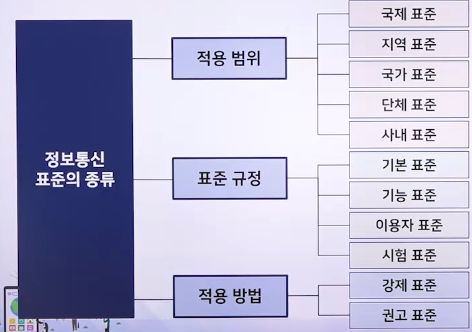
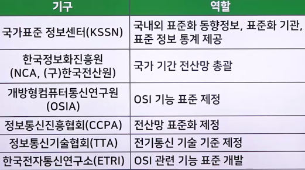

# OSI 7계층 프로토콜(2)

## 네트워크 계층

### 네트워크 계층 개념

> OSI 참조 모델에서 하위 계층인 3계층을 뜻함

- 통신 노드에서 다양한 경로 설정, 메시지 등을 라우팅, 망 노드 간에 트래픽 제어 역할 수행
- 상위 계층(전송 계층)에서 전달 받은 데이터를 패킷으로 구성하여 하위 계층(데이터 링크 계층)으로 전달
- 대표 프로토콜
  - CCITT의 X.25
  - 그 외 CCITT의 X.21, Q.931, 연결형 ISO8473 등 존재

### 네트워크 계층 기능

1. 경로 배정과 중계
   - 통신망 내부에서 경로를 배정하고 중계함
2. 상호 통신망 연결
   - 다양한 통신망이 연결되어 있어도 통신망 계층의 기능을 ㄹ함
3. 통신망 접속
   - 통신망의 연결을 설정하고 종료함
4. 흐름 제어
   - 네트워크 노드 사이에서 트래픽을 제어함
5. 순서 제어
   - 송신 측에서 데이터를 보낸 순서대로 수신 측에서 받지 못할 때 순서를 제어함

## 전송 계층과 세션 계층

### 전송 계층

> OSI 참조 모델에서 하위 계층인 4계층

- 송수신 측의 응용 프로세스 사이에서 데이터를 확실히 송수신해 주는 역할
- 기능
  - 목적지의 주소 지정
  - 메시지 우선권
  - 다중화
  - 보안
  - 계정
  - 오류 발생 시 링크 회복
  - 흐름 제어
  - 송수신 시 무결성 보장
- 대표 프로토콜
  - ISO8072DAD가 있음

#### 전송 계층 역할

1. 등급0 (CLASS 0)
   - 최소한의 기능만 있는 간단한 프로토콜, 오류 통지
2. 등급1 (CLASS 1)
   - 장애 시 기본 오류 회복
3. 등급2 (CLASS 2)
   - 다중화 기능 부가
4. 등급3 (CLASS 3)
   - 등급 1에 다중화 기능 추가
5. 등급4 (CLASS 4)
   - 데이터 분실, 오류, 장애 시 오류를 검출하고 회복하여 다중화함

### 세션 계층

> OSI 참조 모델에서 상위 계층인 5계층

- 송신 측과 수신 측 사이에서 토큰을 사용하여 프로세스를 서로 연결/유지/해제하는 역할 수행
- 프로세스 간에 데이터를 전송하는 방식 중하나인 전이중과 반이중 방식을 결정, 동기 관리 수행
- 대표 프로토콜
  - ISO8327, CCITT의 X.225, CCITT의 T.62(텔레텍스 서비스) 등이 있음

#### 세션 계층의 기능

1. 세션 연결의 설정과 종료
   - 세션 연결을 설정, 종료, 관리하는 절차를 규정
2. 반이중
   - 데이터를 한 방향씩 교대로 교환하며, 데이터를 송신할 권리는 데이터 토큰 소유자에게 있음
3. 동기
   - 세션을 연결하는 동안 동기를 다시 제공함
4. 예외 보고
   - 세션을 연결하는 동안 예외 보고를 제공함

## 표현계층과 응용계층

### 표현 계층

> OSI 참조 모델에서 상위 계층인 6계층

- 송신 측과 수신 측 사이에서 서로 다른 부호 체계 간 변환과 표준화된 데이터 형식을 규정
- 데이터 형식, 명령 해석, 코드 변환, 암호화, 텍스트 압축 등의 기능
- 대표 프로토콜
  - ISO8824, CCITT의 X.409 표준에서 ASN.1 등이 있음

### 응용 계층

> 응용 계층은 OSI 참조 모델의 최상위 계층인 7계층

- 사용자에게 직접 제공하는 서비스로, 제반적인 응용 작업 등의 서비스를 제공
- 전자우편, 파일 전송과 접근 및 관리, 가상 터미널 자원 공유와 데이터베이스, 네트워크 관리 등의 기능
- 전송과 암호화를 효율적으로 수행하기 압축, 암호화 규칙에 따라 구문 변환 사용

## 프로토콜 표준화와 표준화 기구

### 계층형 프로토콜의 도입 배경

- 초기에는 회사마다 독자적인 프로토콜을 개발해서 사용
- 타사 제품과 호환이 어려움
- 해당 문제점을 해결하기 위해 계층형 프로토콜 도입

### 계층형 구조의 개념

- 프로토콜의 계층화
  - 미래의 변화에 유연하게 대처할 수 있도록 통신을 제어하는 기능을 여러 계층에 나누어 두고 각 층마다 독립적으로 프로토콜을 적용하는 것
- 자원의 가상화
  - 각 자원에 가상 시스템과 가상 접근 기능을 정의해 두고, 가상자원접근 프로토콜을 설정하는 것

#### 구성요소의 모델화

- 응용 객체
  - 상호 간의 정보를 교환하며, 사무 처리 등을 수행할 수 있는 주체
  - 응용 프로그램, 단말장치의 운용자 등이 해당
- 개방형 시스템
  - 응용 프로세서 간에 통신이 가능하도록 통신 기능을 제공하는 장치
  - 호스트 컴퓨터, 단말장치, 통신 제어장치, 단말 제어장치 등
- 물리 매체
  - 정보와 신호를 교환해 주는 전기적 매체
  - 통신회선, 채널 등
- 접속
  - 응용 객체 사이를 논리적으로 연결해 주는 통신회선

### 계층형 구조의 구성요소

1. 계층
   - 개방형 시스템과 여러 부시스템이 논리적으로 구성되어 있는 것
     - 개방형 시스템 : 표준을 기본으로 서로 다른 시스템 사이에서도 통신이 가능하도록 해 주는 것
     - 부시스템 : 순서를 각각 부여
2. 프로토콜
   - 자신과 동일한 계층에서 주고받는 통신
     - N-프로토콜 : N-객체 사이에서 일어나는 통신을 뜻함
3. 인터페이스
   - 상위 계층과 하위 계층 사이를 연결해 주는 기능
4. 객체
   - 시스템에서 각 계층의 일을 수행하는 기능 모듈의 실체
5. N-기능
   - 객체가 수행하는 행동
6. N-서비스
   - 자신의 상위 계층(N+1)에 제공하는 서비스
7. N-서비스 접근점(SAP)
   - (N+1) 계층이 N 계층의 서비스를 제공받는 접점
8. 연결
   - (N+1) 객체와 N 객체 사이의 결합관계
   - (N+1) 객체와 N-SAP를 연결하는 통신로

### 프로토콜

#### 프로토콜의 특성

- 통신 방법으로는 직접통신과 간접통신이 방법이 있음
- 프로토콜은 단일 구조 또는 계층적 구조로 구성 가능
- 멀티포인트 또는 간접 통신의 경우에는 양측 통신 시스템 간의 통신을 하나의 단위로 처리하기에는 너무 복잡하기 때문에 계층 구조의 프로토콜이 유리
- 프로토콜은 대칭적이거나 비대칭적일 수 있으며, 반드시 표준이 아닐 수도 있음

#### 프로토콜의 기능

- 단편화
- 재합성
- 캡슐화
- 순서결정
- 연결 제어
- 흐름 제어
- 오류 제어
- 주서 설정
- 동기화
- 다중화
- 전송 서비스

### 표준화

#### 표준화의 개요

- 표준
  - 정보통신망과 정보통신 서비스를 제공하거나 이용하는 주체끼리 합의된 규약의 집합
  - 공통성, 호환성, 통일성과 같은 요건을 갖춰야 함
- 표준화
  - 표준이 되는 규약의 집합을 정립하는 활동과 조직적인 행위 등을 말함
- 기본 표준
  - ISO 등 국제 표준화 기구가 제정ㅈ한 표준
- 기능 표준
  - 기본 표준에 명확하게 규정되어 있지 않은 변수 값이나 기능 선택사항 등을 구체적으로 명시한 표준

#### 정보통신 표준의 종류

- 

#### 표준화 기구

1. ISO(국제 표준화 기구)
   - 1947년 설립
   - 전 세계적으로 통용되는 규격을 개발하여 표준으로 제공
   - ISO 회원은 각국의 표준화 사업을 대표하는 기관으로 하나의 나라당 하나의 기관만 인정
   - 회원국마다 표준 제정 단체 하나와 주요 기업이 참가
2. IEC(국제전기표준회의)
   - 1906년에 설립
   - 전력/전자/전기통신과 원자력 에너지와 관련된 분야를 표준화하는데 공헌함
   - 데이터 통신 부분에서는 통신기기의 안정성, 데이터 통신 전자부품의 특성, 시험방법, 품질, 안정성 등을 검토함
3. ITU-T(국제전기통신연합-전기통신표준영역)
   - 1993년 7월 1일부터 CCITT(국제전신전화자문위원회)의 명칭을 ITU-T로 바꿈
   - 본래 CCITT는 서로 다른 국가 간에 원활하게 전기통신을 체결하려고 ITC(국제 전기통신 협약)로 제정한 ITU(국제전기통신연합) 내에 설치된 자문위원회 중 하나로, 1956년에 발족
   - ITU에는 현재 약 180여 개국이 가입해 있음
   - 각국의 주관청은 ITU-T의 구성원이 될 수 있음
4. ANSI(미국국립표준협회)
   - 1918년에 민간이 창설한 비영리 국가 규격 제정기관
   - 미국의 표준 제정은 물론 ISO 등 국제 표준화 활동에서 미국을 대표함
5. EIA(전자산업협회)
   - 미국의 전자기기 제조업 분야의 대부분을 대표하는 무역 통산 단체
   - 1924년 RMA가 설림
   - 주로 하드웨어에 관한 규격을 개발함
   - RS-232C 인터페이스 규격, RS-449 인터페이스 규격이 대표적인 예
6. IEEE(전기전자공학자협회)
   - 1980년에 대학과 기업이 함께 발족한 단체
   - 데이터 통신 부분에서 LAN 표준 등을 규정하는 조직으로 많은 주목을 받고 있음
7. CEN/CENELEC(유럽표준화위원회/유럽전자표준화위원회)
   - 유럽공동체(EU) 가맹국과 그 주변 국가를 회원으로 하는 기관
   - 유럽 국가의 표준화를 목적으로 함
8. ECMA(유럽전자계산기공업회)
   - 유럽의 데이터 통신을 포함한 데이터 처리 표준을 개발
9. AFNOR(프랑스 표준협회)
   - 1976년에 발족하였으며, 프랑스의 국내 규격 작성과 제정을 담당하는 기관
   - 프랑스를 대표하여 ISO에 참가함
10. BSI(영국표준협회)
    - 영국의 국가 규격 제정과 촉진을 목적으로 설립
    - 영국을 대표하여 ISO에 참가함
11. DIN(독일표준협회)
    - 1919년 독일기술자협회가 설립
    - 1975년 독일표준협회로 개칭
12. JISCC(일본공업표준협회)
    - 1949년에 공포/시행된 공업 표준화법으로 설립한 국가 규격 심의기관
    - ISO와 IEC에 일본을 대표하여 참가함

#### 국내 표준화 기구의 종류

- 
