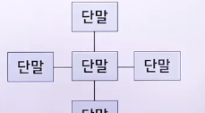

# 근거리 네트워크(1)

## 정보통신망의 이해

### 정보통신망의 개념

> 정보통신망 : 정보통신 시스템에서 정보(텍스트, 이미지, 음성 등)를 효율적으로 전송하기 위해 통신장비(컴퓨터 시스템, 단말기, 다중화기 등)를 상호 유기적으로 결합한 것

- 하나의 회선에 여러 시스템을 연결하거나 몇 개의 회선을 공유하는 방식으로 구성
- 통신 비용을 절감하고 정보를 효율적으로 전송하는게 주요 목적

### 정보통신망의 구성요소

- 단말장치
  - 데이터 전송계 맨 아래쪽에서 디지털 데이터의 입출력을 수행
  - 사용 용도에 따라 전화기, 전신기, 텔레비전, 컴퓨터 등이 있음
- 통신회선
  - 데이터를 전송하는 통로로, 통신기기끼리 서로 연결해 줌
    - 유선 선로
      - 전자기파가 물리적으로 둘러싸인 경로를 따라 전달됨
      - 전화선, 동축 케이블, 광섬유 케이블 등이 있음
    - 무선 선로
      - 안테나를 이용해 정보를 송수신함
      - 마이크로파, 인공위성 등이 있음
- 교환기
  - 단말 장치 사이에서 가장 효율적인 경로를 설정해 주는 역할을 함
  - 가입자의 호(Call)를 감지하여 원하는 가입자와 연결시키고, 통화를 완료하면 다시 복귀시킴
    - 비교환회선 방식 : 단말 장치끼리 직통회선으로 연결
    - 교환회선 방식 : 교환기를 거쳐 연결

### 정보통신망의 분류

- 네트워크 범위와 연결 방식에 따른 분류
  1. 근거리 통신망-LAN
     - 공중 통신망을 이용하지 않는 통신망
     - 동일 건물이나 지역에 설치된 컴퓨터와 단말기를 유기적으로 결합하는 형태
     - 통신에 적합한 지역(1~20km)에서만 사용할 수 있는 제한된 통신망
     - 데이터 전솟옥도(1~20Mbps)가 매우 빠른 통신매체로 구성되며 오류 발생률이 낮음
  2. 광역 통신망-WAN
     - 원격지 사이를 연결하는 통신망
     - 연결 범위가 보통 10km 이상
     - 인공위성을 이용한 패킷 동신을 제외하면 각 노드의 연결이 점-대-점 접속 방식임
  3. 도시망-MAN
     - 텍스트, 음성, 비디오 등 다양한 형태의 데이터를 지원하는 고속의 통신망
     - 도시 하나 정도의 영역에 분산된 LAN이나 컴퓨터, WAN을 연결하여 통신
  4. 부가가치망-VAN
     - 단순한 전송 기능 이상의 부가가치를 부여하는 데이터 통신망
     - 광범위하고 복합적인 서비스를 제공한다는 특징이 있음
- 구성 형태에 따른 분류
  - 노드 : 네트워크에 연결된 컴퓨터
  - 토폴로지 : 노드 간의 연결방법
  - 
  1. 트리형
     - 통신회선망이 트리 형태로 연결
     - 데이터 분산처리 시스템에 효율적이며, 단방향 전송에 적합
     - CATV 망 등에서 많이 사용
     - 
  2. 버스형
     - 하나의 통신회선에 각 노드가 분기해서 접속한 형태
     - 
  3. 성형
     - 하나의 중앙 노드를 중심으로 단말 노드가 점-대-점으로 연결된 형태
     - 중앙 집중 제어형이므로 보수와 관리가 용이
     - 각 노드마다 전송 속도를 다르게 설정 가능하고, 전송 제어 기능이 간단
     - 중앙 노드에 장애가 발생하면 전체 시스템에 영향을 미치는 단점이 있음
     - 케이블 양이 많아 설치 비용이 큼
     - 통신망의 신뢰성을 높여야 안정적으로 운영 가능
     - 
  4. 링형
     - 전송매체가 원형을 이루며, 노드가 그 원형에 순차적으로 연결되어 있는 형태
     - 총 회선의 길이를 짧게 구성할 수 있지만 노드의 추가 및 삭제가 복잡함
     - 
  5. 망형
     - 가장 기본적인 통신회선망 형태로, 통상적인 정보통신 네트워크에서 이용
     - 사용하던 회선에 오류가 발생하면 다른 회선 경로를 이용하면 되므로 분산된 자원을 공유하기 쉬움
     - 하나의 노드가 여러 대의 노드와 데이터를 주고받기 편리
     - 회선이 많이 필요하며 망 구성이 복잡
     - 대규모 트래픽이 발생할 경우를 대비해 주요 간선 부분에 설치
     - 
- 교환 방식에 따른 분류
  1. 회선 교환
     - 사용자가 직접 상대방을 호출하고 연결하는 방식
     - ex. 전화 교환망
  2. 축적 교환
     - 교환기를 이용하여 정보를 메시지나 패킷 단위로 저장하고 전송하는 방식
     - 메시지 교환 방식과 패킷 교환 방식이 있음
  3. 메시지 교환 방식
     - 정보를 전송하는 단위가 메시지
     - 길이가 매번 변함
  4. 패킷 교환 방식
     - 정보를 전송하는 단위가 패킷
     - 길이가 고정되고 규격화되어 있음
     - 전송 오류가 있으면 재전송을 통해 오류 없이 전송될 수 있도록 함
     - 전송속도가 다른 이기종 단말기 간의 통신이 가능
     - 패킷 단위로 통신 경로를 선택하기 때문에 우회 전송 가능
     - 회선 효율이 높음

#### 정보통신망의 발전 과정

1. 정보통신망
   - 미 국방성의 알파넷에서 처음 시작
   - 1969년 개발 계획이 구체화
   - 그 다음 해인 1970년대 초에 가동
   - 연구용 알파넷과 군에서 통신을 지원하는게 목적인 밀넷으로 발전
2. 단독 시스템
   - 각 시스템 사이 연결이 없는 형태
3. 복합 시스템
   - 처리 능력이 비슷한 컴퓨터 여러 대를 통신회선을 이용하여 결합한 시스템
   - 컴퓨터 하나로는 처리할 수 없거나 한 컴퓨터로 집중할 필요가 없을 때 사용
4. 계층화 시스템
   - 한 가운데에 대형 호스트 컴퓨터를 두고, 중소형 호스트 컴퓨터를 그 하위 계층에 놓는 시스템
   - 분산처리 시스템도 계층화 시스템의 대표적인 예로 볼 수 있음
5. 정보통신망의 통합화
   - 텍스트, 음성, 이미지 등의 정보를 구별하지 않고 통합해서 다루는 새로운 정보통신망
   - 디지털화된 하나의 공용회선으로 여러 멀티미디어 데이터를 이용할 수 있음
6. 인터네트워킹
   - 근거리 통신망(LAN) 간 또는 근거리통신망과 광역 통신망(WAN) 간에 상호 접속하여 형성된 광역화된 네트워크 집합

## 근거리 통신망의 개요

### 근거리 통신망의 정의

> 근거리 통신망 : 가까운 거리에 있는 각종 기기들을 연결하여 빠른 속도로 정보 교환을 할 수 있도록 만든 통신망

- 컴퓨터와 그 주변 장치, 전화기, 팩시밀리, TV 수상기 등 통신 기능이 있는 기기는 모두 연결 가능
- 통신에 적합한 지역에서만 제한적으로 사용 가능(1~20km)
- 데이터 전송속도가 매우 빠른 통신매체로 구성(1~20Mbps)
- 비교적 오류 발생률이 낮음

#### 근거리 통신망의 효과

- 자원 공유 용이
- 부하공유를 통한 효율 증가
- 부분 고장이 타 시스템에 주는 영향 최소화로 신뢰성 개선
- 통제관리 용이

#### 근거리 통신망의 특징

- 컴퓨터와 통신장비 사이에 물리적인 연결 경로가 짧고, 경로를 설정할 필요성도 없으므로 고속으로 통신 가능
- 전송 특성이 좋은 매체를 사용하며, 오류 발생률이 매우 낮아 신뢰성 있는 정보 전송이 가능
- 가까운 거리에서 단일 기관이 소유한 영역에 설치하므로 행정처리 등의 제약을 받지 않으므로 다양한 통신망 구성도 가능
- 하나의 통신망을 이용하여 텍스트, 음성, 이미지를 모두 전송하여 정보를 종합적으로 처리 가능

### 근거리 통신망의 발전과정

- 1970년대 초 : 제록스의 PARC에서 시작한 연구 이후에 이더넷으로 발전
- 1970년대 말 : LAN 제품이 본격적으로 등장
- 1982년 : IEEE에서는 LAN 표준화 작업을 추진
- 1985년 : IEEE의 표준화위원회에서 LAN 표준을 제정
- LAN 프로토콜 중에서 Token Ring 방식과 CSMA/CD(Ethernet) 방식이 서로 경쟁하다 확장성을 원인으로 CSMA/CD(Ethernet)로 통일됨
  - 

## 근거리 통신망의 구성요소

### LAN 구성 요소

- 하드웨어
  - 컴퓨터
  - 통신회선
  - 접속 케이블
  - 신호 변환장치
  - 네트워크 인터페이스 카드
- 통신 소프트웨어
  - 동일한 LAN에 있는 노드끼리 서로 통신을 하려면 모든 노드가 프로토콜이 똑같은 통신 소프트웨어를 사용해야 함
    - 네트워크 운영체제
      - LAN 통신 기능을 제공하는 운영체제
      - 일반 운영체제가 수행하는 기능 외에 LAN에서 필요로 하는 다중 작업, 다중 사용자를 지원하는 구조로 되어 있음

### LAN의 하드웨어

1. 컴퓨터(서버와 클라이언트)
   - 서버와 클라이언트 기능을 담당
   - 서버 기능을 하는 컴퓨터는 네트워크 중심에 위치하여 정보를 공유하거나 저장하고 보안을 책임짐
   - 클라이언트 기능을 하는 컴퓨터는 서버의 자원을 공유하며, 서버를 이용하여 정보를 교환
2. 네트워크 인터페이스 카드
   - LAN에서 서버와 각 클라이언트에 위치하며, 전송매체에 접속시켜주는 역할
   - 데이터를 입출력/송수신/젖아하며, 프로토콜을 처리하는 기능 담당
   - NIU, LAN 보드, 네트워크 어댑터라고도 함
   - PC 슬롯 형태에 따라 PCI, ISA, EISA, PCMCIA 등으로 분류
     - bps : LAN 카드의 속도를 표시하는 기본 단위
3. 신호 변환장치
   - LAN 카드에서 출력된 데이터를 전송매체에 적합한 형태로 변환해 주는 장비
   - 현재는 거의 상요하지 않음
4. 전송매체
   - 꼬임선, 동축 케이블, 광섬유 케이블 등
   - 최근에는 케이블이 필요 없는 무선 LAN을 많이 사용
5. 네트워크 접속 장치(IWU)
   - 인터네트워크를 구성하는 각 서브 네트워크끼리 상호 연결하는 장치
   - 허브, 리피터, 브리지, 라우터, 게이트웨이, 디지털 서비스 장치, 채널 서비스 장치 등이 있으며 프로토콜에 따라 각각 다르게 사용
6. 허브
   - 한 가운데 있는 제어장치를 중심으로, DTE가 있는 지점 간에 트리 구조로 연결하는 장비
   - LAN 끼리 연결하는 경우에도 사용
   - 초기의 허브는 신호를 증폭하고 재생하며 각 노드를 집중화 시켜주는 역할
   - 최근에는 SNMPS를 이용해 망을 관리할 수 있는 수준인 지능형 허브로 발전
     - 대표적인 예가 트래픽 병목현상을 제거한 스위칭 허브
7. 리피터
   - 단말기 사이의 거리가 멀어질수록 감쇄하는 신호를 재생시키는 장비
   - 서로 분리된 동일한 LAN에서 네트워크의 거리를 연장하거나 접속한 세그먼트 사이를 연결하여 세그먼트의 수를 증가시킴
   - OSI 7계층 중 1계층인 물리 계층에 해당
8. 브리지
   - LAN과 LAN을 연결하는 장비
   - OSI 7계층 중 2계층인 데이터 링크 계층에 해당
   - 다른 종류의 케이블을 연결하며 혼잡한 네트워크 상에서 수송량을 분리하는 역할
   - 리피터와 달리 서로 다른 유형의 LAN 끼리도 연결할 수 있음
   - 현재는 라우터가 브리지의 기능을 대신하므로 거의 사용하지 않음
9. 라우터
   - 임의의 외부 네트워크와 내부 네트워크를 연결해 주는 장비
   - 구조가 다른 망끼리도 연결할 수 있어 근거리 통신망과 광역통신망을 연결하는 데 주로 사용
   - 데이터가 전송될 수 있는 여러 경로 중 가장 적절한 전송 경로를 선택하는 역할
   - OSI 7계층 중에서 3계층인 네트워크 계층에 해당
   - 전용회선을 이용해 LAN에 연결된 컴퓨터가 동시에 인터넷을 사용할 수 있게 해주는 역할
   - 기능
     - 효율적인 경로를 선택하는 라우팅 기능, 망 내의 혼잡 상태를 제어하는 기능, 오류 패킷을 폐기하는 기능도 수행
     - 둘 이상의 서로 다른 네트워크에 접속하여 이들 간에 데이터를 주고받을 수 있게 중계 기능
     - IP 라우팅 기능 뿐 아니라 LAN용 프로토콜인 브리징 기능도 함께 수행
       - 서로 다른 네트워크를 연결하는 기능을 하므로 다양한 프로토콜에서 전송하는 패킷을 모두 받아들일 수 있어야 함
10. 트랜시버
    - 동축 케이블을 백본 네트워크로 사용하는 네트워크에서 서브 네트워크를 구성하기 위해 AUI 포트에 접속하는 네트워크 장비
    - UTP 케이블(RJ-45 랜선)과 BNC 케이블(동축 케이블, 100m 이상)을 연결해 주는 장비
    - 이더넷 네트워크에서는 트랜시버를 MAU라고 함
11. 디지털 서비스 장치(DSU)
    - 디지털망에 사용하는 회선 종단 장치
    - 전화망 같은 아날로그망에서 사용하는 모뎀과 비슷한 역할 수행
    - 신호 전송 시 디지털망을 사용할 때 신호의 레벨을 높이는 기능 수행
12. 채널 서비스 장치(CSU)
    - T1 장비를 이용해 접속
    - 1.544Mbps를 속도별로 나누어 쓸 수 있고, 나눈 각 전송 속도를 채널이라고 함
    - CSU는 각 채널끼리 연결하는 장비
    - 최고 T1(1.544Mbps)이나 E1(2.048Mbps)을 지원
13. 게이트웨이
    - 프로토콜 구조가 전혀 다른 통신망을 상호 연결하는 데 사용
    - OSI 7계층의 모든 계층을 포함하는 인터네트워킹 장비
    - 프로토콜 구조가 다른 통신망을 연결하려고 주소 구조 변환과 메시지 형식 변환 등의 기능을 수행
