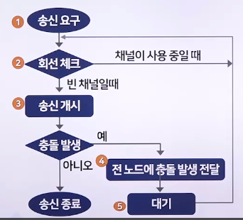

# 근거리 네트워크(2)

## 근거리 통신망의 분류

### LAN의 분류

- LAN은 네트워크를 구성하는 기하학적인 형태
- 하나의 채널에 여러 단말기가 접근하는 방식과 채널에 데이터를 싣는 방식에 따라 분류
  - 네트워크 형태(토폴로지)
    - 성형, 링형, 버스형, 트리형
  - 접근 방식
    - CSMA/CD, 토큰 링, 토큰 버스
  - 전송 방식
    - 베이스밴드 LAN, 브로드밴드 LAN

### 접근 방식에 따른 분류

- 다중 충돌 접근 기법(CSMA/CD)
  - 유선에서 사용하며 채널을 사용하기 전에 다른 이용자가 해당 채널을 사용하는지 점검하는 것으로 채널 상태를 확인해 패킷 충돌을 피하는 방식
    - 1976년 : 미국 제록스에서 이더넷을 처음 개발한 후 제록스, 인텔, DEC가 공동으로 발표한 규격
    - 1982년 : IEEE802.3 위원회에서 부분 수정, CSMA/CD로 발표
    - 
  - 다중 충돌 접근 기법은 버스형에서 많이 사용하며, 이 방식을 채택한 대표적인 제품으로는 제록스의 이더넷이 있음
  - 채널로 전송된 프레임을 모든 노드에서 수신할 수 있으며, 통신 제어 기능이 단순하여 적은 비용으로도 네트워크화 할 수 있음
  - 노드 수가 많고 각 노드에서 전송하는 데이터 량이 많을 경우, 패킷 충돌이 많아져 데이터 손실이 발생
- 토큰 링
  - 1969년 뉴홀 링에서 링 제어 기법을 적용하여 각 네트워크에 사용하던 방식(뉴홀 링 이라고도 함)
  - IBM에서 1982년 3월 토큰 링 규격을 정리, IEEE802 위원회에 제출
    - IEEE802.5 위원회에서 표준으로 채택
  - 논리적으로는 링 형태이지만, 물리적으로는 모든 노드를 MSAU 장치에 연결하여 하나의 네트워크를 구성하는 구조
  - 성형에서 많이 사용, 전송매체로는 동축 케이블, 광섬유 케이블 등이 있으며, 전송속도는 4~16Mbps
  - 전송 권한마다 정해진 대기 시간이 있어 과부하가 걸려도 CSMA/CD보다 성능이 크게 떨어지지 않음
  - 토큰 링 운용 방식이 복잡하고, 전송 데이터가 없는데도 토큰이 전송로에서 회전하여 낭비요소가 있음
  - 대표 제품으로는 3270 터미널, 8775 디스플레이 터미널, 3275 FEP 프라임 컴퓨터, 아폴로, IBM 제품 등이 있음
  - 토큰 링 : 토큰 패싱
    - 채널을 통제해 충돌이 발생하지 않도록 고유 채널을 사용하는 권한을 균등하게 부여하여 토큰을 확보했을 경우에 데이터를 전송할 수 있게 하는 방식
    - 토큰 패싱 방식에서는 전송 데이터가 없는데도 토큰이 전송로를 회전하여 낭비되는 요소가 발생
- 토큰 버스
  - 토큰 링 방식과 CSMA/CD 방식을 결합한 형태
  - LAN 액세스 제어 방법에서 통신회선에 대한 제어 신호가 논리적으로 형성된 공통선상에서 번호를 할당함에 따라 각 노드 간을 옮겨가면서 데이터를 전송하는 방식
  - 낮은 가격으로도 구성할 수 있고 설치가 쉬운 편이며, 토큰 회전 시간을 예측할 수 있어 실시간으로 처리할 수 있음
  - 노드를 추가하거나 삭제하고 오류를 처리하는 과정이 복잡
  - 통신량이 적을 떄는 토큰을 전달하는 오버헤드가 상대적으로 커져 평균 대기 시간이 길어짐
  - 토큰 버스를 이용하는 대표적인 제품으로는 데이터포인트의 ARCNet이 있음

### 전송 방식에 따른 분류

- 베이스밴드 방식
  - 0과 1로 출력되는 직류 신호를 변조하지 않고 디지털 형태 그대로 전송하는 방식
  - 전송매체에 채널을 하나만 형성하여 전송
  - 장거리 전송에는 적합하지 않고, 컴퓨터와 단말기 사이의 통신과 근거리 통신 등에 사용
  - CSMA/CD와 토큰 링에서 채택
- 브로드밴드 방식
  - 디지털 정보를 아날로그 신호로 변환하여 전송하는 방식
  - 전송매체에 채널을 여러 개 형성하여 전송
  - 모뎀의 기능인 디지털 변조를 사용해 송신 측에서는 직류 신호를 교류 신호로 변환하여 전송
  - 수신 측에서는 교류 신호를 직류 신호로 변환하여 데이터를 전송
  - 토큰 버스에서 채택

## 근거리 통신망의 프로토콜과 표준안

### LAN 프로토콜

> LAN 프로토콜은 OSI 7계층 중 1,2 계층은 반드시 필요, 3계층은 상황에 따라 일부만 필요

- 1계층(물리 계층)
  - 구성
    - 물리 신호 제어(PLS)
    - 접속장치 인터페이스(AUI)
    - 물리 매체 접속(PMA)
    - 케이블
    - 커넥터
  - PLS는 물리 매체에 비트를 연속해서 송신
  - PMA는 비트의 흐름을 물리 매체에 맞춰서 변조
- 2계층(데이터 링크 계층)
  - 논리 연결 제어(LLC)
    - 매체 접근 제어로 확보한 채널 송신권을 사용하여 흐름 제어, 순서화, ACK, NAK, 연결 관리 절차 등의 역할을 담당
  - 매체 접근 제어(MAC)
    - 공유된 매체의 접속을 규제하고, 모든 노드에 패킷을 전송할 기회를 제공하는 역할을 함
- 3계층(네트워크 계층)
  - 장치가 LAN에 접근할 때는 네트워크에 접근하는 것처럼 보이므로 일부 기능을 사용하기도 함

### LAN 표준안

- IEEE802시리즈
  - 1985년 IEEE802 시리즈를 발표하여 LAN에 접속하는 방법과 프로토콜 표준을 정의
- IEEE802위원회
  - 1980년 2월 IEEE802위원회를 설립
  - 1980년 2월 27~29일에 미국 샌프란시스코에서 1차 회의를 시작
- NCITS(구 ANSI X3)
  - 국제정보기술표준화위원회(NCITS)
  - 법률상의 정보 기술 표준을 작성하고 유지하기 위한 포럼
  - ANSI X3에서 X3는 1961년 정보처리 시스템의 표준화를 촉진하려고 만든 조직
  - 1980년대 초 메인 프레임인 컴퓨터끼리나 컴퓨터와 주변장치 간의 상호 접속용 고속 인터페이스를 표준화하여 LAN까지 발전시킴
  - 표준화 활동으로는 멀티미디어 컴퓨터 장치, 정보 시스템 간의 상호 통신을 축적한 미디어, 프로그램 등이 있음
- ATM 포럼
  - 1991년 설립
  - 새로운 멀티미디어 네트워크를 표준화

## 근거리 통신망의 발전 동향

### 유선 LAN

- 1980년대
  - 개발된 속도가 10Mbps인 이더넷과 16Mbps인 토큰 링이 시초
- 1990년대
  - 최고 속도가 100Mbps인 고속 이더넷과 FDDI가 출현
- 1998년대
  - 622Mbps로 전송하는 ATM LAN과 기가 단위로 전송하는 기가비트 이더넷이 등장
- 가격이 싸고, 표준화가 이루어지고 시장성을 확보한 제품은 이더넷, 고속 이더넷, 기가비트 이더넷, ATM LAN 등이 있음

 

1. 이더넷
   - 대역폭이 10Mbps인 백본 네트워크
   - 데이터 전송 방식은 CSMA/CD를 사용
   - 표준안은 IEEE802.3 위원회에 명시
   - 1960년대 말 하와이대학교에서 구현한 알로하넷인 광역통신망에서 유래
   - 세그먼트 1개나 여러 개로 구성되며, 각 국은 탭이 부착되어 있는 송수신기 케이블로 이더넷에 연결
   - 네트워크의 거리를 연장할 때, 감쇄되는 신호를 재생시키는 장치인 리피터가 필요
2. 고속 이더넷
   - 대역폭이 100Mbps인 백본 네트워크
   - 데이터 전송 방식은 CSMA/CD를 채택
   - 표준안은 IEEE802.3에 명시
   - 성능은 이더넷보다 10배 더 좋음
   - 정식 명칭은 100Base-TX, 100Base-T4, 100BaseFX
   - 형태에 따라 사용하는 전송매체가 다름
3. 기가비트 이더넷
   - 대역폭이 1Gbps(1000Mbps)인 백본 네트워크
   - 데이터 전송 방식은 CSMA/CD를 채택
   - 표준안은 IEEE802.3z, IEEE802.3ab에 명시
   - 성능은 이더넷보다 100배 더 좋음
   - 정식 명칭은 1000Base-X 1000Base-T
   - 형태에 따라 사용하는 전송매체가 다름
4. 10기가비트 이더넷
   - 기가비트 이더넷보다 성능이 10배 빠른 백본 네트워크
   - 폭증하는 인터넷 트래픽 문제를 해결
   - LAN 뿐만 아니라 MAN이나 WAN까지도 통합하고 응용 가능
   - 향후 차세대 LAN과 WAN을 통합한 기술인 인터넷 백본망 기술 중의 하나가 될 것
   - 표준화는 IEEE802.3ae에서 명시
5. FDDI
   - 미국국립표준협회에서 1987년에 표준화한 LAN
   - 전송속도가 100Mbps이며 링 2개로 구성
   - 전송매체로 광섬유 케이블을 사용하므로, 버스형 LAN 구조를 만들지 못함
   - 광섬유 케이블에서는 탭처럼 간단한 장치를 사용하여 신호를 추출할 수 없기 때문에 멀티 토큰 방식을 채택
   - 이중 링 구조라 신뢰성이 높음
6. FDDI-II
   - FDDI의 기본 서비스인 패킷 데이터 전송에 회선 교환 트래픽 기능이 추가
   - FDDI와도 호환되고, 100Mbps 대역을 능동적으로 할당하는 다중화 방식을 사용
   - 음성과 영상 같은 데이터를 실시간으로 서비스 가능
7. FFOL
   - FDDI와 FDDI-II의 무든 기능, 새로운 멀티미디어와 광대역 종합정보통신망 서비스 제공
   - 고속 데이터 전송, 양질의 오디오와 화상 신호 전송, 그래픽 응용, LAN 상호 간의 연결 등 다양한 트래픽 특성이 있는 서비스를 지원
8. ATM LAN
   - 비동기 전송 모드의 약어
   - 한 가닥의 전송로를 여러 대의 단말이 공용으로 사용하기 위해 어떤 단말이 데이터를 송출 중일 때 다른 복수의 단말이 동시에 데이터를 송출할 수 있도록 제어하는 방식
   - 회선 교환 방식과 패킷 교환 방식의 장점을 결합한 것
   - ATM은 모든 정보를 고정 길이의 셀 형태로 보냄
   - 고속 병렬 처리가 가능하며, 정보가 발생했을 때만 셀을 보내는 동적 할당을 사용하여 전송망의 사용 효율을 증대함
   - ATM의 품질 기준에 따른 서비스 종류
     - CBR, t-VBR, nrt-VBR, ABR, UBR로 구분

### 무선 LAN

> 무선 LAN : 전파나 적외선 등을 이용해 대기를 통신 채널로 사용하는 근거리 네트워크

- 무선 네트워크를 하이파이 오디오처럼 편리하게 쓰게 한다는 뜻에서 와이파이(Wi-Fi)라고 함
- 1980년대 말
  - 미국의 프록심과 심벌 등 무선기기 회사에서 처음으로 사업화하였으나, 다양한 방식이 난립하여 일반화되지는 못함
- 1999년 9월
  - 미국무선랜협회인 WECA가 표준으로 제정한 IEEE802.11b와 호환되는 제품에 와이파이 인증을 부여한 후 급속하게 확산
- 우리나라에는 2000년에 도입
  - 대학교와 기업을 중심으로 활성화됨

#### 무선 LAN의 특징과 제한점

- 초기 무선 LAN은 전파가 도달하는 거리가 10m에 불과
- 2000년대 들어와서는 50~200m까지 대폭 늘어남
- 전송속도가 4~11Mbps로 대용량의 멀티미디어 정보를 주고받을 수 있음
- 사용료가 저렴하여 장시간 사용할 수 있으며, 이동성과 보안성까지 갖춤
- 일시적으로 네트워크를 설치하는 데 매우 유용

#### 무선 LAN의 표준화

> 1990년에 설립한 IEEE802.11은 무선 LAN을 연구하는 그룹으로 무선 LAN의 물리 계층과 MAC층에서 표준안을 제정

- OSI 7계층과 비교했을 때 LLC층 이상의 상위 계층에서는 무선 LAN과 유선 LAN 프로토콜이 동일함
  - 물리 계층과 MAC 층이 다름

#### 무선 LAN 접속 기술

1. CSMA/CA
   - 무선에서 사용되는 다중 충돌 접근 기법
   - 충돌을 회피하기 위해 간단한 신호를 보내 충돌 여부를 확인하는 전송 방식
   - 충돌 검출을 하지 않으며, 프레임이 전송되면 모두 전송
   - 802.11 MAC 프로토콜을 사용
2. 무선 메시 네트워크
   - 각각의 노드가 네트워크에 대해 데이터를 릴레이하는 네트워크 토폴로지
   - 모든 메시 노드들은 네트워크 내의 데이터 분산에 협업
   - 무선과 유선망에 모두 적용이 가능
   - 네트워크의 효율성을 극대화할 수 있는 망
3. WPAN
   - 사물인터넷 시대를 실현하는 네트워크 요소 기술
   - 저전력/소형/저가격의 특징을 보장하는 다양한 응용 프레임워크, 네트워킹과 데이터 전송 방식에 관한 기술
   - 상호 연동이 가능한 기술 표준이 필요
   - IEEE802.15 워킹그룹을 중심으로 표준화가 활발히 진행
   - 블루투스, 지그비 UWB 등은 WPAN 기술에 해당
4. UWB
   - 다양한 분야에 응용 가능
     - 차량용 레이저
     - 지질학 탐사와 건설
     - 의료현장에서 장애물 너머의 이미지 투시 등
   - 3.1~10.6GHz까지 주파수 대역으로 사용하는 무선통신 분야는 최대 480Mbps 이상의 전송속도를 제공
   - 10m 이내 근거리 고속 무선 네트워크를 구현하는 것이 목적
5. WBAN
   - u-헬스케어에 기반을 둔 의료 영역에서 다양한 분야까지 응용할 수 있음
   - IT, BT, NT 등으로 구성되는 융합 기술
6. BAN
   - 인체 내/외부나 지근거리에서 구축되는 통신망
   - 와이어드 BAN,, 인체통신, 무선 BAN으로 구분
   - 무선 BAN은 위치에 따라 구분
     - Implant 무선 BAN
     - On-body 무선 BAN
     - 웨어러블(또는 Out-body) 무선 BAN
   - 용도에 따라
     - 심전도, 근전도 등 사람의 생체 신호를 측정하여 무선으로 데이터를 전송하는 메디컬 무선 BAN, 비메디컬 무선 WBAN으로 구분

## 광역 통신망 프로토콜과 서비스

### 광역 통신망의 개요

> 도시와 도시 간, 국가와 국가 간 등 원격지 사이를 연결하는 통신망

- 범위는 보통 10km 이상
  - 인공위성을 이용한 패킷 통신은 제외
- 광역통신망에서 각 노드를 연결할 때는 LAN과 달리 점-대-점 접속 방식 사용

### 광역 통신망 교환 방식

- 회선 교환 방식
  - 사용자가 전화망을 이용해 상대방을 호출하여 연결
  - 노드와 노드 간에 물리적으로 전용 통신로를 설정하여 데이터를 교환
  - 긴 메시지를 전송하는 데 적합하므로 팩스 화상통신, 파일 전송 등에도 사용
    - ex. 공중 교환 전화망(PSTN)
  - 3단계를 거침
    1. 회선 설립단계
    2. 데이터 전송 단계
    3. 회선 해제
    - 공간분할 회선 교환
      - 기존에 사용하던 기계식이나 전자식 교환기와 통신회선을 그대로 이용하는 방식
    - 시분할 회선 교환
      - 다중 변환 장치인 스위치나 통신로를 시간으로 분할하여 공동으로 사용하는 방식
- 축적 교환 방식
  - 교환기를 이용하여 정보를 메시지나 패킷 단위로 저장하고 전송
  - 실시간 전송에 적합하지 않음
  - 메시지 교환 방식, 패킷 교환 방식, 셀 교환 방식으로 나뉨
    - 메시지 교환 방식에서는 메시지 길이가 매번 변함
    - 패킷 교환, 셀 교환 방식에서는 메시지 길이가 고정되고 규격화
- 가상회선 방식
  - 사용자가 호를 요청하면 노드 사이를 연결하는 전용 통신로인 가상회선을 만들어 송신 노드와 수신 노드 간에 데이터를 전달
  - 가상회선이 만들어지면 해당 호를 종료하기 전까지 선택한 경로를 따라 패킷이 전송되며, 전송이 끝난 후 가상회선은 종료됨
  - 데이터를 전송하면 반드시 목적지에 도착시키기 때문에 연결 지향 서비스라고 함
- 데이터그램 방식
  - 일련의 데이터를 패킷 단위로 분할하여 송신 노드와 수신 노드 간에 데이터를 전달
  - 패킷의 도착 순서가 바뀔 수 있기 때문에 도착한 패킷을 순서대로 배열하는 조립 과정이 필요
  - 각 패킷이 스위치를 거치며 매번 최선의 경로를 선택하기 때문임
  - 패킷을 전송하기 전에 가상회선을 먼저 만들지 않아도 되므로 비연결 지향 서비스라고 함

### 광역 통신망 서비스

1. 공중 전화망(PSTN)
   - 전화를 발명한 벨 시대부터 계속 발전해온 회선 교환망의 집합체
   - 1837년에 모스가 발명한 전자 신호를 정보 전달에 이용한 것이 시작
2. 패킷 교환 공중 데이터 통신망(PSDN)
   - 불특정 다수 사이에서 교환 접속을 하려고 데이터 전송 서비스를 제공하는 전용망
   - 데이터를 패킷 단위로 송수신해 패킷 교환망이라고도 함
3. X.25
   - ITU-T에서 제정한 표준안
   - 패킷 교환망에서 패킷형 단말과 패킷 교환기 간의 인터페이스를 규정하는 프로토콜
   - X.75는 X.25의 프로토콜과 비슷한 인터페이스 프로토콜로, X.25 패킷 교환망 간의 상호 연결을 규정
4. 협대역 종합정보통신망(N-ISDN 또는 ISDN)
   - 여러 서비스를 통합한 디지털 통신망
   - 전화 서비스를 제공하는 전화 교환망에 디지털 기능을 추가하여 음성이나 비음성(인터넷, 팩스, PC 통신) 등 다양한 형태의 정보를 한 회선으로 서비스하는 방식
   - 음성이나 비음성 서비스를 받으려면 별도의 회선을 설치해야 하는 문제점을 해결하고자 등장
