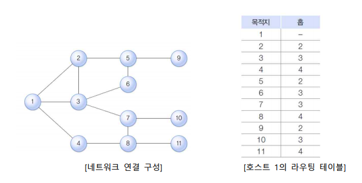
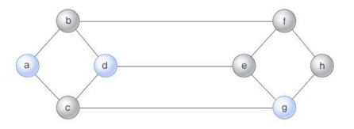
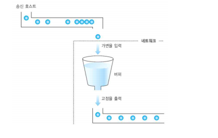
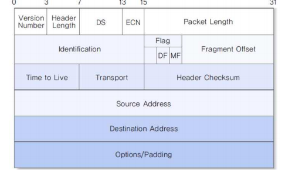
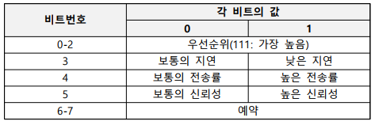
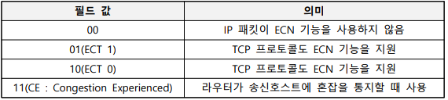
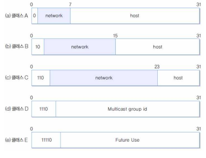
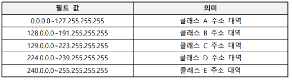
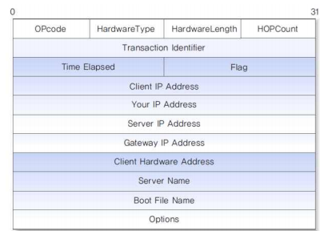
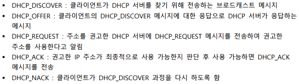

# IP 프로토콜

## 라우팅 프로토콜

### 네트워크 계층의 기능

#### 네트워크

- 라우팅
  - 라우팅 테이블: 네트워크 구성 형태에 관한 정보를 관리
  - 라우팅: 송수신 호스트 사이의 패킷 전달 경로를 선택하는 과정
- 혼잡 제어
  - 혼잡: 네트워크에 패킷 수가 과도하게 증가되는 현상
  - 혼잡 제어: 혼잡의 발생을 예방하거나 제거하는 기능
- 캡슐화
  - 상위 전송 계층에서 송신을 요구한 데이터는 최종적으로 MAC 계층의 프레임 구조에 정의된 형식으로 캡슐화되어 물리적으로 전송
- 패킷 분할: 데이터를 여러 패킷으로 나누는 과정
- 패킷 병합: 목적지에서 분할된 패킷을 다시 모으는 과정

#### 연결형 서비스와 비연결형 서비스

- 연결형 서비스
  - 데이터 전송 전에 데이터의 전송 경로를 미리 결정
  - 상대적으로 신뢰성이 높음
  - TCP : 전송 계층의 기능을 지원하는 연결형 프로토콜
- 비연결형 서비스
  - 데이터의 전송 경로를 사전에 결정하지 않고 패킷 단위로 결정
  - 패킷의 전달 순서
    - 패킷이 서로 다른 경로로 전송되므로 도착 순서가 일정하지 않음
    - 상위 계층에서 순서를 재조정해야 함
  - 패킷 분실 가능성
    - 패킷의 100% 도착을 보장하지 않음
    - 상위 계층에서 패킷 분실 오류를 복구해야 함
  - 인터넷 환경의 예
    - IP : 네트워크 계층의 기능을 지원하는 비연결형 프로토콜
    - UDP : 전송 계층의 기능을 지원하는 비연결형 프로토콜

### 라우팅 (Routing)

#### 라우팅 개념

- 패킷의 전송 경로를 지정
- 전송 경로 결정시 고려 사항
  - 공평 원칙: 다른 패킷의 우선 처리를 위해 다른 패킷이 손해를 보면 안됨
  - 효율 원칙: 전체 네트워크의 효율성에 대해 고려해야 함
- 정적/동적 라우팅
  - 정적 라우팅
    - 패킷 전송이 이루어지기 전에 경로 정보를 라우터가 미리 저장하여 중개
    - 단점: 경로 정보의 갱신이 어려우므로, 네트워크 변화/네트워크 혼잡도 대처 부족
  - 동적 라우팅
    - 라우터의 경로 정보가 네트워크 상황에 따라 적절히 조절됨
    - 단점 : 경로 정보의 수집과 관리로 인한 성능 저하
- HELLO/ECHO 패킷
  - HELLO : 주변 라우터에 HELLO 패킷을 보내어 주변 경로 정보를 파악하는 용도
  - ECHO : 라우터 사이의 전송 지연 시간을 측정하는 용도
- 라우팅 테이블
  - 패킷 전송 과정에서 라우터들이 경로를 쉽게 찾도록 하는 가장 기본적인 도구
  - 필수 정보: 목적지 호스트, 다음 홉
    - 목적지 호스트: 패킷의 최종 목적지가 되는 호스트 주소
    - 다음 홉: 목적지 호스트까지 패킷을 전달하기 위한 인접 경로
    - 
- 라우팅 정보의 처리
  - 소스 라우팅
    - 패킷을 전송하는 호스트가 목적지 호스트까지 전달 경로를 스스로 결정하는 방식
    - 경로 정보를 전송 패킷에 기록함
    - 데이터그램 방식과 가상 회선 방식에서 모두 이용함
  - 분산 라우팅
    - 라우팅 정보가 분산되는 방식, 패킷의 전송 경로에 위치한 각 라우터가 경로 선택에 참여함
    - 네트워크에 존재하는 호스트의 수가 많아질수록 다른 방식보다 효과적일 수 있음
  - 중앙 라우팅
    - RCC라는 특별한 호스트를 사용해 전송 경로에 관한 모든 정보를 관리하는 방식
    - RCC로부터 목적지 호스트까지 도착하기 위한 경로 정보를 미리 얻음
    - 장점: 경로 정보를 특정 호스트가 관리하기 때문에 경로 정보를 관리하는 부담이 줄어듦
    - 단점: RCC에 과중한 트래픽을 주어 전체 효율이 떨어짐
  - 계층 라우팅
    - 분산 라우팅 기능과 중앙 라우팅 기능을 적절히 조합하는 방식
    - 네트워크 규모가 계속 커지는 환경에 효과적

#### 간단한 라우팅 프로토콜

- 네트워크 거리 기준
  - 라우터의 개수, 홉 Hop의 수로 판단
- 최단 경로 라우팅
  - 패킷이 목적지에 도달할 때까지 라우터 수가 최소화될 수 있도록 경로 선택
  - 장점: 간단한 형식으로 적용가능
  - 
- 플러딩
  - 라우터가 자신에게 입력된 패킷을 출력 가능한 모든 경로로 중개하는 방식
  - 패킷이 무한히 만들어질 수 있으므로 생존 시간으로 제한
  - 특별한 목적으로만 사용

#### 거리 벡터 라우팅 프로토콜

- 라우터가 자신과 연결된 이웃 라우터와 라우팅 정보를 교환하는 방식
- 필수 정보
  - 링크 벡터: 이웃 네트워크에 대한 연결 정보
  - 거리 벡터: 개별 네트워크까지의 거리 정보
  - 다음 홉 벡터: 개별 네트워크로 가기 위한 다음 홉 정보
- RIP(Routing Information Protocol) 프로토콜
  - 거리 벡터 방식의 내부 라우팅 프로토콜 중에서 가장 간단하게 구현된 것
  - 소규모 네트워크 환경에 적합
  - 현재 가장 많이 사용하는 라우팅 프로토콜
  - 라우팅 테이블 적용
    - 새로운 네트워크의 목적지 주소이면 라우팅 테이블에 적용
    - 거리 벡터 정보가 기존 정보와 비교하여 목적지까지 도착하는 지연이 더 적으면 대체
    - 라우터로부터 거리 벡터 정보가 들어왔을 때, 라우팅 테이블에 해당 라우터를 다음 홉으로 하는 등록 정보가 있으면 새로운 정보로 수정

#### 링크 상태 라우팅 프로토콜

- 개별 라우터가 이웃 라우터까지의 거리 정보를 구한 후, 이를 네트워크에 연결된 모든 라우터에 통보
- 거리 벡터 방식과 반대
- 거리 벡터 라우팅 프로토콜의 단점을 보완하기 위한 방식
- 플러딩 기법
  - 임의의 라우터가 이웃한 모든 라우터에 정보를 전달하고, 다시 이들 라우터가 주변의 모든 라우터에 정보를 전달하는 방식으로 동작
  - ex. OSPF(Open Shortest Path First)

#### 외부 라우팅 프로토콜

- 내부 라우팅 프로토콜
  - RIP : 거리 벡터 방식을 사용
  - OSPF : 링크 상태 방식을 사용
- 외부 라우팅 프로토콜
  - 경로 벡터 프로토콜: 단순히 연결 가능한지에 대한 정보만 제공
  - BGP : TCP 프로토콜을 사용

### 혼잡 제어 기능

#### 혼잡 제어

- 혼잡 : 네트워크 성능 감소 현상이 급격하게 악화되는 현상
- 혼잡 제어
  - 혼잡 문제를 해결하기 위한 방안
  - 흐름 제어: 송신, 수신 호스트 사이의 논리적인 점대점 전송 속도를 다룸
  - 혼잡 제어: 서브넷에서 네트워크의 전송 능력 문제를 다룸
- 혼잡의 원인
  - 초기 혼잡 과정에서 타임 아웃 시간이 작으면 혼잡도가 급격히 증가
  - 타임아웃 증가
    - 패킷 도착 순서가 다른 상황에서 패킷을 분실 처리할 경우
    - 의도적으로 피기배킹을 사용하면 응답 시간이 느려질 경우
    - 패킷 생존 시간을 작게 하면 패킷이 강제로 제거될 경우
- 라우팅 알고리즘
  - 혼잡이 발생하지 않는 경로를 배정하도록 설계
  - 혼잡이 발생하는 경로를 선택하면 혼잡이 주변으로 확대됨
- 트래픽 성형
  - 혼잡은 트래픽이 특정 시간에 집중되는 버스트 현상이 원인
  - 트래픽 성형: 송신 호스트가 전송하는 패킷의 발생 빈도가 네트워크에서 예측할 수 있는 전송률로 이루어지게 하는 기능
- 리키 버킷(Leaky Bucket) 알고리즘
  - 
- 혼잡 제거
  - 특정 지역의 혼잡이 다른 지역으로 확대되지 않도록 하는 것이 중요
  - 자원 예약 방식
    - 혼잡 제거를 위해 호스트와 서브넷이 가상 회선 연결 과정에서 협상을 함
    - 네트워크에서 수용 불가능한 정도로 트래픽이 발생하는 일을 사전에 예방함
    - 단점: 전송 대역을 해당 사용자가 이용하지 않더라도 다른 사용자가 이용하지 못함
  - ECN(Explciit Congestion Notification) 패킷
    - 라우터는 트래픽의 양을 모니터해 출력 선로의 사용 정도가 한계치를 초과하면 주의 표시를 함
    - 주의 표시한 방향의 경로는 혼잡이 발생할 가능성이 높기 때문에 특별 관리함

### IP 프로토콜

#### 주요 특징

- 비연결형 서비스를 제공
- 패킷을 분할/병합하는 기능을 수행
- 데이터 체크섬은 제공하지 않고, 헤더 체크섬만 제공
- Best Effort 원칙에 따른 전송 기능을 제공

#### IP 헤더 구조

- 
- DS/ECN
  - Service Type 필드
    - 우선순위, 지연, 전송률, 신뢰성 등의 값을 지정할 수 있음
    - IP 프로토콜이 사용자에게 제공하는 서비스의 품질에 관련된 내용을 표현
    - Service Type 필드는 6비트의 DS 필드와 2비트의 ECN 필드로 새로 정의됨
  - Service Type
    - 
  - DS(Differentiated Services)
    - 사전에 서비스 제공자와 서비스 이용자 사이에 서비스 등급에 대해 합의
    - 동일한 DS 값을 갖는 트래픽들은 동일한 서비스 등급으로 처리됨
  - ECN(Explicit Congestion Notification)
    - ECT 0과 ECT 1은 동일한 의미
    - ECN 기능을 위하여 TCP 프로토콜의 헤더에 ECE 필드와 CWR 필드가 추가
    - ECN 필드 값의 의미
    - 
  - 패킷 분할
    - Identification(식별자 혹은 구분자)
      - IP 헤더의 두 번째 워드에는 패킷 분할과 관련된 정보가 포함
      - Identification은 송신 호스트가 지정하는 패킷 구분자 기능을 수행함
    - DF(Don't Fragment)
      - 패킷이 분할되지 않도록 함
    - MF(More Fragment)
      - MF필드 값을 1로 지정하여 분할 패킷이 뒤에 계속됨을 표시
      - 마지막 패킷은 MF 비트를 0으로 지정하여 분할 패킷이 더 없음을 표시
    - Fragment Offset(분할 오프셋)
      - 저장되는 값은 분할된 패킷의 내용이 원래의 분할 전 데이터에서 위치하는 상대 주소 값
      - 값은 8바이트의 배수
  - 주소 관련 필드
    - Source Address : 송신 호스트의 IP 주소
    - Destination Address : 수신 호스트의 IP
    - Network(네트워크) : 네트워크 주소
    - Host(호스트) : 네트워크 주소가 결정되면 하위의 호스트 주소를 의미하는 host 비트 값을 개별 네트워크의 관리자가 할당
  - IP 주소 체계
    - 
  - IP 주소 값에 따른 주소 체계
    - 
  - 기타 필드
    - Version Number(버전 번호) : IP 프로토콜의 버전 번호
    - Header Length(헤더 길이) : IP 프로토콜 헤더 길이를 32비트 워드 단위로 표시
    - Packet Length(패킷 길이) : IP 헤더를 포함하여 패킷의 전체 길이
    - Time To Live(생존 시간) : 패킷의 생존 시간, 라우터를 거칠 때마다 1씩 감소되며 0이 되면 네트워크에서 강제로 제거
    - Transport(전송 프로토콜)
      - IP 프로토콜에 데이터 전송을 요구한 전송계층의 프로토콜
    - Header Checksum(헤더 체크섬)
      - 전송 과정에서 발생할 수 있는 헤더 오류를 검출하는 기능
    - Options(옵션)
      - 네트워크 관리나 보안처럼 특수 용도로 이용할 수 있음
    - Padding(패딩)
      - IP 헤더의 크기는 16비트 워드의 크기가 4의 배수가 되도록 설계

#### DHCP 프로토콜

- IP 주소를 여러 컴퓨터가 공유해서 사용
- DHCP 메시지
  - 
- DHCP 프로토콜의 주요 메시지
  - 
