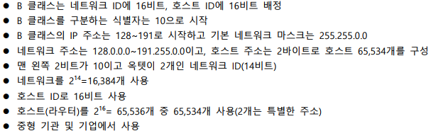

# IPv4의 개념과 체계

## IPv4의 개념

- 

### IPv4

- IP 주소는 2진수 32비트를 구분하기 쉽게 10진수로 표시하여 사용
- 사람이 읽기 쉽게 8비트 단위로 나누어 표시하며 8비트를 10진수로 변환한 것이 IPv4
- IP 주소는 10진수로 표시하지만 실제로 IP 주소는 2진수로 되어 있음
  - ex.
    - 
- IP 주소는 8비트 크기의 필드 4개를 모아서 구성한 32비트(4바이트) 논리 주소
  - 
- 숫자로 표현된 IP 주소는 기억하기 어렵다는 것이 단점인데 이는 도메인 이름이라는 별칭을 사용함으로써 해결
  - 도메인 이름은 숫자로 된 IP 주소를 쉽게 기억하기 위한 것일 뿐, 인터넷에서 컴퓨터를 찾으려면 숫자로 된 IP 주소가 있어야 하며 사용자가 입력한 도메인 이름에 해당하는 IP 주소를 찾아주는 DNS 서버가 필요
- 집 주소가 시, 동, 번지로 구분되는 것처럼 IP 주소도 네트워크 ID와 호스트 ID로 구분
  - 네트워크 ID(주소)는 네트워크 자체를 나타내는 주소로 다른 네트워크와 구분하는 역할을 함
  - 호스트 ID(주소)는 해당 네트워크에 속한 호스트(컴퓨터)의 주소를 나타냄
- 네트워크 ID는 전체 네트워크가 좀 더 작은 네트워크로 분할된, 각 호스트가 속한 네트워크를 대표
  - 네트워크 ID는 8비트, 16비트, 24비트 크기로 분류
  - 호스트 ID는 네트워크 주소로 표현하는 네트워크 내부에서 각 호스트의 주소를 표현하는 역할 수행
  - 전체 32비트에서 네트워크 주소를 제외한 나머지에 해당
  - 네트워크 ID는 어떤 네트워크인지를 나타내고 호스트 ID는 해당 네트워크의 어느 컴퓨터인지를 나타내며, 이 두 가지 정보가 합쳐져서 IP 주소가 됨
  - 네트워크 주소 : 클래스 타입 / 네트워크 ID / 호스트 ID

### IPv4의 클래스 구조

- IP 주소는 비트로 구분하지만 네트워크 ID를 크게 만들거나 호스트 ID를 작게 만들어서 네트워크의 크기를 조정할 수 있음
- 네트워크의 크기는 클래스 개념으로 구분
- IP 주소는 네트워크의 규모에 따라 A,B,C,D,E 클래스로 구분
  - D클래스 : IP 멀티 캐스팅용
  - E클래스 : 연구 및 특수 용도로 사용
  - A클래스 : 대규모 네트워크 주소
  - B클래스 : 중형 네트워크 주소
  - C클래스 : 소규모 네트워크 주소 사용
- 예시
  - 

#### 클래스 구조

- A 클래스
  - A 클래스는 네트워크 ID로 8비트, 호스트 ID로 24비트 사용
  - 네트워크 주소의 가장 왼쪽 비트가 0으로 고정(A 클래스를 구분하는 식별자)
    - 첫 번째 바이트의 첫 비트가 0이기 때문에 맨 처음 숫자는 0~127로 시작
    - 범위 : 0.0.0.0 ~ 127.255.255.255
      - 0.0.0.0은 사용하지 않는 주소
      - 127.x.x.x는 시스템 루프백 주소(가상으로 할당한 인터넷 주소)라 사용하지 않음
  - 실제로 사용하는 주소는 1~126으로, 1.0.0.0~126.255.255.255
  - A 클래스의 기본 네트워크 마스크는 255.0.0.0, 4바이트 구성, 네트워크 주소를 구분하는 역할 수행
  - A 클래스 네트워크는 네트워크 126개로 구성하고 총 24비트를 호스트 주소로 배정
    - 
  - 대형 기관 및 기업에서 사용
- B 클래스
  - 
- C 클래스
  - 
- IP 주소 범위
  - 
- D 클래스
  - 멀티캐스트(데이터 수신 대상이 네트워크에 연결된 일부 컴퓨터) 용도로 사용하는 D 클래스의 IP 주소는 224~239로 시작
  - 인터넷과 연결하지 않고 개별적으로 구성한 네트워크는 A,B,C 클래스의 어떤 IP 주소를 사용해도 되지만 인터넷에 연결하려면 할당받은 공인 IP 주소 사용
- E 클래스
  - 연구 및 특수 용도로 사용되는 E 클래스의 IP 주소는 240~255로 시작
  - 255.255.255.255는 전체 컴퓨터에 대한 브로드캐스트(데이터 수신 대상이 네트워크에 연결된 전체 컴퓨터) 주소로 사용

#### 네트워크 주소와 브로드캐스트 주소

- 네트워크 주소와 브로드캐스트 주소는 컴퓨터나 라우터가 자신의 IP로 사용할 수 없는 주소
- 예시(C 클래스의 사설 IP 주소)
  - 
- 네트워크 주소는 전체 네트워크에서 작은 네트워크를 식별할 때 사용
- 호스트 ID가 10진수로 0이면 그 네트워크 전체를 대표하는 주소

#### 서브넷의 구조

- A 클래스 네트워크는 호스트 ID가 24비트이고 IP 주소를 16,777,214개 사용
  - 이 많은 컴퓨터가 브로드캐스트 패킷을 전송한다면 모든 컴퓨터에 패킷이 전송되어 네트워크가 혼잡
    - A 클래스의 대규모 네트워크를 좀 더 작은 네트워크로 분할하여 브로드캐스트로 전송되는 패킷의 범위를 좁힐 수 있음(서브넷팅)
- 예시
  - 

#### 서브넷 마스크

- IP 주소를 서브넷팅하는 경우 어디까지 네트워크 ID이고 어디부터 호스트 ID인지 판단하기 어려울 때 사용
- 서브넷 마스크는 네트워크 ID와 호스트 ID를 식별하기 위한 32비트의 값으로 A 클래스는 255.0.0.0, B 클래스는 255.255.0.0, C 클래스는 255.255.255.0
- 클래스별 서브넷 마스크
  - 

### IP 프로토콜

- 

### 데이터그램의 구조

- IP 계층의 패킷을 데이터그램이라고 함
- 데이터그램은 가변 길이이며 헤더와 데이터 부분으로 구성

## 라우터의 이해

### 라우터 개요

- 스위치만 있는 네트워크에서는 모든 컴퓨터와 스위치가 동일한 네트워크에 속함
- 허브도 스위치와 마찬가지로 네트워크 분할 불가능
- 라우터는 네트워크 분할 가능
- 네트워크로 분할한 뒤 다른 네트워크에 있는 컴퓨터로 데이터를 전송하려면 라우터의 IP주소(192.168.35.1)를 설정해야 함
  - 이는 네트워크의 출입구를 설정하는 것으로 기본 게이트웨이라고 함
  - 기본 게이트웨이는 ipconfig 명령으로 확인 가능

### 라우팅 테이블

- 현재 네트워크에서 다른 네트워크로 데이터를 전송할 때는 라우팅의 경로 정보를 바탕으로 최적의 경로로 데이터를 전송
- 각 라우터의 라우팅 테이블에 경로 정보가 등록되어 있어 라우팅이 가능
- 라우팅 테이블 등록 방법
  - 자동으로 등록하는 방법
    - 대규모 네트워크에 적합
    - 대규모 네트워크에서는 정보를 하나하나 라우터에 등록하기가 어렵고, 등록된 내용이 변경되면 수동으로 수정해야 하기 때문에 자동으로 등록
    - 자동으로 등록하는 방법은 라우터 간에 경로 정보를 서로 교환하여 라우팅 테이블 정보가 자동으로 변경
  - 수동으로 등록하는 방법
    - 소규모 네트워크에 적합
