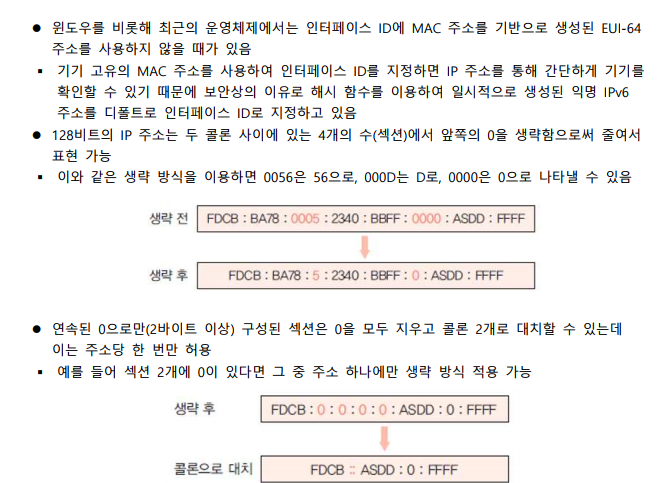
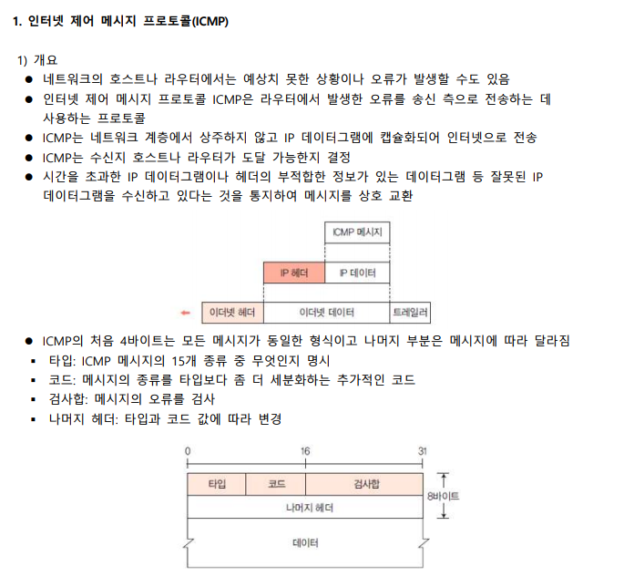
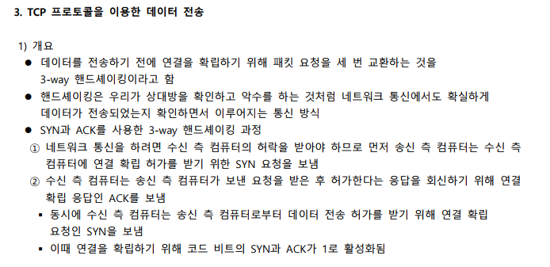
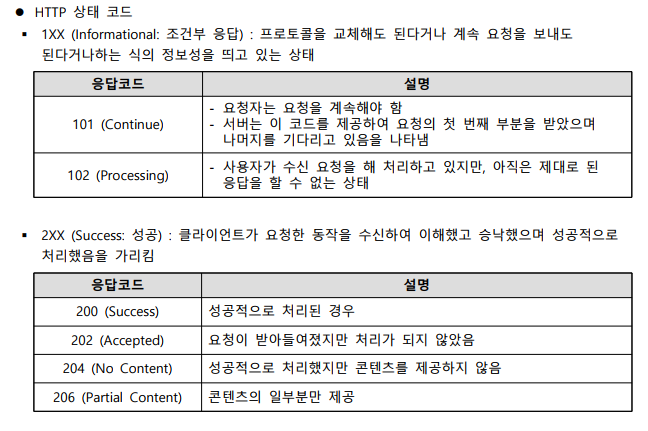
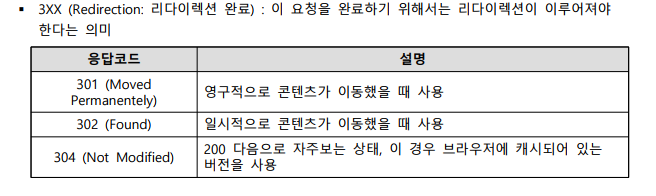
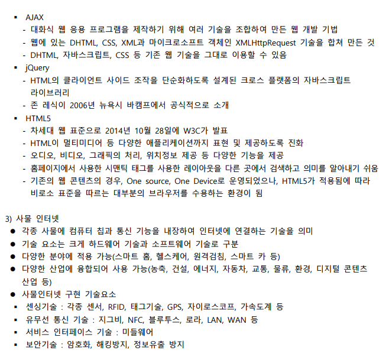
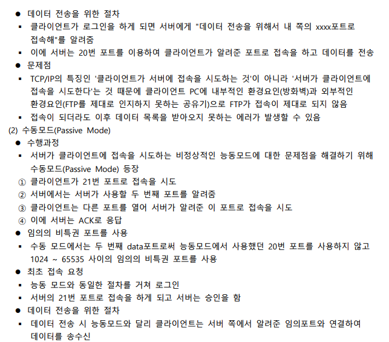
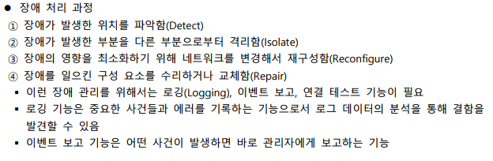
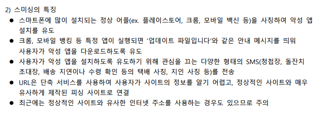

# IPv6의 개념과 체계

# IP, ARP 덤프 분석

---

# TCP 프로토콜

# 전송계층

---

# 인터넷 서비스의 이해

# FTP외 SMTP의 이해

---

# 네트워크 관리의 이해

# 네트워크 관리 프로토콜

---

# 네트워크 보안의 이해

- 접근 통제 : 화이트리스트/블랙리스트
  
  
  
  
  
  
  
  
  
  
  
  
  

# 네트워크 위협

---

# 4차 산업과 네트워크 기술

# 차세대 네트워크 프로토콜

---

# 정리

## IPv6의 개념과 체계

- IPv6: IPv6 주소의 길이는 128비트이며 새로운 기술이나 응용 분야에서 요구되는 프로토콜의 확장을 허용하도록 설계
- IPv6 주소 체계 : IPv6 주소에서 앞의 64비트는 네트워크 주소, IPv6 주소에서 뒤의 64비트는 네트워크에 연결된 통신 장비 등에 할당되는 인터페이스 주소
- IPv6 헤더 : IPv6의 각 패킷은 기본 헤더와 페이로드로 구성
- 응용 계층 게이트웨이 방식(응용 계층) : 변환(트랜잭션) 서비스를 위한 ALG(응용 수준 게이트웨이)
- 주소 변환 프로토콜(ARP) : 논리 주소인 IP 주소를 물리 주소인 MAC 주소로 매핑하는 것
- 역주소 변환 프로토콜(RARP) : 호스트 컴퓨터의 물리 주소를 알고 있을 때 IP 주소를 알아내는데 사용

## IP, ARP 덤프 분석

- 인터넷 제어 메시지 프로토콜(ICMP) : 인터넷 제어 메시지 프로토콜 ICMP는 라우터에서 발생한 오류를 송신 측으로 전송하는 데 사용하는 프로토콜
- ICMP 질의 메시지 : ICMP는 질의하거나 응답하여 정보를 구하는 데 사용하는 메시지
- ICMP 오류 메시지 : 목적지 도달 불가능, 송신지 억제, 재지정, 시간 초과, 매개변수 문제
- 인터넷 그룹 메시지 프로토콜(IGMP) : 인터넷에 연결한 컴퓨터가 멀티캐스트 그룹을 주위의 라우터에 알릴 수 있는 수단을 제공하는 프로토콜
- 멀티캐스팅 : 특정 그룹의 모든 호스트에 메시지를 전송하는 방식
- 멀티캐스트 라우팅 : 멀티캐스팅에 필요한 라우팅 알고리즘 멀티캐스트 그룹에 가입하거나 탈퇴할 때 사용하는 프로토콜

## TCP 프로토콜

- 전송계층 : 프로토콜(TCP, UDP)과 관련된 계층으로 오류 복구와 흐름 제어 등을 담당하며, 두 시스템 간에 신뢰성 있는 데이터를 전송
- 전송 계층의 데이터 헤더 : 포트 주소, 소켓 주소, 순서 번호
- TCP 프로토콜 : 연결 지향형 프로토콜인 TCP는 신뢰성 있는 바이트 스트림 서비스를 제공
- 포트 번호 : TCP가 상위 계층으로 데이터를 전송하거나 상위 계층에서 TCP로 데이터를 전송할 때 상호 간에 사용하는 데이터의 이동 통로
- TCP 세그먼트 : TCP를 이용하여 두 장치 간에 전달하는 데이터의 단위
- 핸드셰이킹 : 우리가 상대방을 확인하고 악수를 하는 것처럼 네트워크 통신에서도 확실하게 데이터가 전송되었는지 확인하면서 이루어지는 통신 방식

## 전송계층

- UDP 프로토콜 : 프로토콜 중 구조가 가장 간단하며 RFC 768 문서에 정의된 비연결 지향 프로토콜
- UDP 헤더 구조 : 송신지 포트 번호, 수신지 포트 번호, 전체 길이, 검사합, 데이터
- SPX : NetWare의 연결 지향 프로토콜이며 패킷 접수 통지, 흐름 제어 등 TCP와 유사한 기능 제공
- NCP : NetWare 클라이언트와 서버 간의 파일 공유 등 다양한 네트워크 기능을 담당
- RTP 프로토콜 : 실시간 멀티미디어 데이터의 전송을 지원하며 유니캐스팅뿐 아니라 멀티캐스팅도 지원
- 트랜슬레이터(Translator) : 입력된 각 RTP 데이터그램을 하나 이상의 출력용 RTP 데이터그램으로 만들어주는 장치
- OSI TP 프로토콜의 연결형 서비스 : 연결 설정(T-CONNECT), 연결 해제(T-DISCONNECT), 일반 데이터(T-DATA), 긴급 데이터(T-EXPEDITED-DATA)

## 인터넷 서비스의 이해

- URL(Uniform Resource Locator) : 웹 서버를 지칭하며 프로토콜, 연결하는 서버의 호스트 이름, 서버 내부의 파일 경로명으로 표현
- HTTP(HyperText Transfer Protocol) : 웹 문서를 전송하는 프로토콜이며 TCP 포트 80번
- 웹의 진화 과정 : 웹 1.0 -> 2.0 -> 3.0 -> 웹 4.0
- CGI 언어 : 서버와 외부 데이터, 응용 프로그램 간의 인터페이스
- 마크업 언어 : 웹 서버에 저장된 문자, 그림, 표, 음성, 동영상 등을 포함한 문서를 클라이언트가 내려받아 웹 브라우저에 표현할 때 사용
- 사물 인터넷 : 각종 사물에 컴퓨터 칩과 통신 기능을 내장하여 인터넷에 연결하는 기술을 의미

## FTP와 SMTP의 이해

- 파일 전송 서비스(FTP) : TCP/IP 프로토콜을 가지고 서버와 클라이언트 사이의 파일 전송을 위한 프로토콜
- FTP는 데이터(파일)를 전송함에 있어, 수동 모드(Passive Mode)와 능동 모드(Active Mode) 두 가지를 지원
- 익명(Anonymous) FTP : FTP를 설치하게 되면 default로 Anonymous FTP가 실행되는데 보안 절차를 거치지 않고 익명으로 사용하는 사용자에게 FTP 서버 접근을 허용하는 경우 여러가지 보안 문제점이 발생
- FTP Bounce Attack : FTP 서버가 클라이언트가 지시한 곳으로 자료를 전송할 때 그 목적지가 '어떤 곳'인지를 검사하지 않는 FTP 프로토콜 구조의 허점을 이용한 공격 방법
- 메일 서비스(SMTP) : 전자우편 서비스를 사용할 수 있는 프로토콜

## 네트워크 관리의 이해

- 네트워크 관리 시스템(Network Management System) : 효율적으로 자원 사용을 극대화함과 동시에 서비스 품질의 측면에서 가용성과 신뢰성을 최상의 상태로 유지하고 응답 시간을 단축하는 시스템
- 네트워크 모니터링 : NMS를 이용하여 네트워크 자원들의 상태를 관찰하여 분석하는 것
- 네트워크 관리 기능 : OSI 표준에서는 효율적인 네트워크 관리를 위해 장ㅈ애 관리, 구성 관리, 성능 관리, 계정 관리, 보안 관리기능을 제안
- 네트워크 분석 도구 유형 1 : 네트워크의 특성 세그먼트에 접속해서 사용하는 유형
- 네트워크 분석 도구 유형 2 : 광범위한 네트워크도 지속적으로 분석하고 경제적으로 분석 시스템을 구축할 수 있기 때문에 가장 많이 사용하는 네트워크 분석 도구
- RMON(The Remote Network Monitoring) : SNMP의 확장 형태로, 네트워크 곳곳에 설치되어 있는 장비로부터 오가는 트래픽을 분석하고 감시

## 네트워크 관리 프로토콜

- 네트워크 관리 프로토콜 : TCP/IP 환경의 네트워크를 처음 사용할 당시에는 주로 ICMP를 이용하여 네트워크 장비 간의 연결 상태 등을 관리
- SNMP(Simple Network Management Protocol) : UDP/IP를 사용하여 이더넷 연결을 통해 네트워크 관리 작업을 수행하는 응용 계층 프로토콜
- CMIP(TCP) : CMIS는 네트워크를 관리하기 위해 각 네트워크 구성 요소로 제공하는 일반적인 서비스를 정의하며 CMIP는 이러한 CMIS 서비스를 구현하는 프로토콜
- 트러블 슈팅 : 트러블 슈팅을 하려면 층별로 장애의 원인을 조사하여 문제가 발생한 곳을 찾아내고 장애를 분리하는 것이 중요

## 네트워크 보안의 이해

- 네트워크 보안 : 하드웨어와 소프트웨어를 모두 사용해 코어 네트워크의 물리적 요소 및 가상 요소에서 네트워크 활용성과 데이터 무결성을 보호
- 네트워크 보안의 요구사항 : 기밀성, 무결성, 가용성, 인증, 부인 방지, 책임 추적성, 접근 통제
- 크래커(Cracker) : 불법적이고 악의적인 목적을 가진 해킹을 크래킹(Cracking)이라 부르며 크래킹 하는 사람을 크래커라고 부름
- 불법 공격의 유형 : 전송 차단, 가로채기, 변조, 위조
- 악성 프로그램 : 컴퓨터 바이러스, 웜, 트로이 목마, 백도어, 스파이웨어
- 루트킷 : 불법적인 해킹에 사용되는 기능들을 제공하는 프로그램들의 모음
- 방화벽 : 내부 네트워크와 외부 네트워크 사이에 있는 하드웨어와 소프트웨어로 구성
- ESM(통합 보안관리) : 방화벽, 침입탐지 시스템, 가상 사설망 등의 보안 솔루션을 하나로 모은 통합 보안관리 시스템

## 네트워크 위협

- 스미싱 : SMS에 포함된 URL을 클릭하면 악성 앱이 설치되고, 개인 정보나 금융 정보 등을 탈취하여 금전적인 피해를 입히거나 2차 공격 도구로 활용
- 랜섬웨어 : 시스템을 잠그거나 데이터를 암호화하여 사용할 수 없게 하고 이를 인질로 금전을 요구하는 악성 프로그램
- 랜섬웨어의 종류 : 워너크라이(WannaCry), 로키(Locky), 크립트XXX(CryptXXX), 케르베르(CERBER), 크립토락커(CryptoLocker), 테슬라크립트(TeslaCrypt)
- 무선 공유기의 보안 기술 : WEP(Wired Equivalent Privacy), WPA(Wi-Fi Protected Access), WPA2(Wi-Fi Protected Access2)
- IP스푸핑 : '스푸핑'은 외부 네트워크 공격자가 임의로 웹사이트를 구성하여 일반 사용자의 방문을 유도하고, 인터넷 프로토콜인 TCP/IP의 구조적인 결함을 이용하여 사용자 시스템 권한을 획득한 후 정보를 빼가는 해킹 수법
- IP 스니핑 : 스니핑(Sniffing)은 '코를 킁킁거리다' 또는 '냄새를 맡다'는 뜻으로 네트워크를 이용하여 전송하는 데이터를 엿듣는 일종의 도청 행위를 말함

## 4차 산업과 네트워크 기술

- 사물인터넷(IoT) : 각종 사물에 컴퓨터 침과 통신 기능을 내장하여 인터넷에 연결하는 기술
- 클라우드(Cloud) : 정보처리, 저장, 관리, 유통, 분석 등의 작업을 제3의 공간(웹하드)에서 수행하는 컴퓨팅 시스템
- 빅데이터(BigData) : 기존의 데이터베이스 관리 도구, 관리 시스템의 능력을 넘어 대량의 정형, 비정형 데이터 세트, 이를 포함한 데이터로부터 분석하여 의미있는 가치를 추출하고 결과를 분석하는 기술
- 빅데이터 분석과정 : 데이터 인식 - 수집 - 저장 - 처리 - 분석 - 표현
- 5세대 이동통신(5G) : 국제전기통신연합의 전파부문 이동통신작업반 회의에서 합의된 IMT-2020

## 차세대 네트워크 프로토콜

- 5G : 4G 대비 초고속, 저지연, 초연결을 제공하는 통신기술로 이를 활용하여 스마트시티, 자율주행차, 지능형 CCTV 등 다양한 서비스 제공 가능
- 5G 기술 진화 방향 : 초광대역 서비스(eMBB : enhanced Mobile Broadband), 고신뢰/초저지연 통신(URLLC: Ultra Reliable & Low Latency Communications), 대량연결(mMTC: massive Machine-Type Communications)
- 5G 기술 종류 : 빔포밍 기술, Massive MIMO, Network Slicing, NSA(Non-Standalone) 구조와 SA(StandAlone)
- 6G : 5G 성능 고도화, 네트워크 완전 지능화, 통신 커버리지 초월을 통해 가상과 현실을 시공간 제약 없이 연결하는 지능형 통신 인프라
- 지능형 초연결망 : 모든 사람/사물을 신경망과 같이 유기적으로 구축하여 혁신적 서비스창출을 지원하는 초연결 네트워크
- 지능형 초연결망 구성 기술 : SDN(Software-Defined Networking), NFV(Network Functions Virtualizaion), 네트워크 지능기술, 초저지연/시간확정형 네트워크 기술, 양자정보통신기술, 전달망 기술
