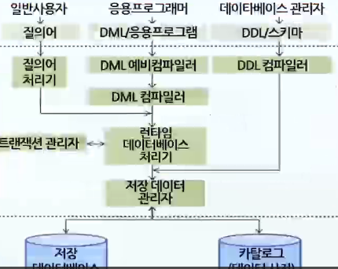

# 데이터베이스의 구조와 DBMS의 개요

## 데이터베이스의 발전 과정

- ~1960
  - 파일 시스템 구조
- 1960년대 : 계층형 DBMS 상용화
  - 계층형 DBMS(Hierarchical DBMS) : 트리 구조, 부모-자식관계
- 1970년대 : 네트워크형 DBMS 개발
  - 네트워크형 DBMS(Network DBMS) : 그래프 구조, 사이클 허용
- 1980년대 : 관계형 DBMS 출시
  - 관계형 DBMS : 테이블 구조로서 데이터베이스 대중화의 시작
- 1990년대 : 객체지향 DBMS 개발
  - 객체지향 DBMS : 객체지향 프로그래밍 개념을 데이터베이스에 적용
- 1990년대 중반 : 객체관계 DBMS 개발
  - 객체관계 DBMS : 관계형 데이터베이스와 객체지향 데이터베이스의 통합
- 1990년대 후반
  - WWW의 폭발적인 성장
  - 데이터베이스 시스템은 24 \* 7 가용성을 갖춤
  - 빅데이터, 데이터마이닝 중요성 부각

## 데이터베이스의 정의

- 데이터베이스
  - 어느 한 조직의 여러 응용 시스템들이 기업의 의사결정에 활용되며 공용할 수 있도록 통합, 저장된 운영 데이터의 집합
- 통합된 데이터(integrated data)
  - 원칙적으로 데이터베이스에서는 똑같은 데이터가 중복되지 않았음을 의미하며 실제로 효율성 때문에 일부 데이터의 중복 허용
  - 최소의 중복, 통제된 중복
- 저장된 데이터(stored data)
  - 컴퓨터가 접근할 수 있는 저장매체(자기테이프, 디스크)에 저장된 데이터 집합
- 운영 데이터(operational data)
  - 어떤 조직의 고유 기능을 수행하기 위해 반드시 유지해야 할 데이터
- 공용 데이터(shared data)
  - 그 조직에 있는 여러 응용 시스템들이 공동으로 소유하고 유지하며 이용하는 공용 데이터

## 데이터베이스의 일반성

- 실시간 접근(real time accessibility)
  - 데이터베이스는 임의적이고 비정형적인 질의에 대하여 실시간 처리로 응답 가능
- 계속적인 변화(continuous evolution)
  - 데이터베이스는 새로운 데이터의 삽입, 삭제, 갱신으로 항상 그 내용이 변할 뿐 아니라 이러한 변화 속에서 현재의 정확한 데이터를 유지함
- 동시공유(concurrent sharing)
  - 서로 다른 목적을 가진 여러 사용자가 같은 내용의 데이터 동시 접근 가능 (병행제어기법)
- 내용에 의한 참조(content reference)
  - 데이터 참조는 주소나 위치가 아닌 데이터의 내용
  - 즉, 데이터 값에 의한 참조

## 데이터베이스의 특징

### 자료 추상

- 파일 시스템과 자료의 복잡한 내용을 감추어 복잡한 자료를 쉽게 사용
  - 자료의 핵심 내용을 추출, 사물들에서 공통의 성질을 추출하는 것
  - 추상화 = 개념화, 일반화

### 자료 독립(Data Independency)

- 자료구조를 프로그램으로부터 독립
  - 프로그램을 변경하지 않고 자료구조 변경이 가능

### 자기 정의(Self Definition)

- 데이터베이스가 스스로의 내용을 정의하고 저장
  - 자료의 구성과 내용을 DB가 스스로 기억하고 관리하는 기능

## 데이터베이스의 구성 요소

### 개체(entity)

- 데이터베이스가 표현하려고 하는 유형
  - 무형의 정보 대상
  - 서로 구별될 수 있는 것
- 컴퓨터가 취급하는 파일 구성 측면에서는 레코드(record)에 해당
- 단독으로 존재 가능
- 하나 이사의 속성(attribute)으로 구성

### 속성(attribute)

- 개체의 특성이나 상태를 기술하는 것
- 데이터의 가장 작은 논리적 단위
- 단독으로 존재 불가능
- 파일 구조에서는 데이터 학목(item) 또는 필드(field)
- 도메인 : 하나의 속성이 취할 수 있는 같은 타입의 모든 값의 집합

### 관계(relationship)

- 개체 집합과 개체 집합 간에는 여러 가지 유형의 관계가 존재
- 속성 관계(attribute relationship)
  - 개체 내의 관계
  - 속성과 속성 사이의 관계
- 개체 관계(entity relationship)
  - 개체 간의 관계

> 용어 정리

- 개체 타입(구조)
  - 스킴
  - 스키마
  - 릴레이션의 **내포(Intension)**
- 개체 집합(값)
  - 릴레이션 **인스턴스**
  - 튜플의 집합
  - 개체 **어커런스(인스턴스)의** 집합
  - 릴레이션의 **외연(extention)**

## 데이터베이스의 구조

### 논리적 구조(logical organization)

- 사용자가 생각하는 데이터의 논리적 표현
- 논리적 구조에서 취급하는 데이터가 논리적 레코드(logical record)

### 물리적 구조(physical organization)

- 디스크나 테이프와 같은 저장장치 위에 물리적으로 저장되어 있는 데이터의 실제 구조
- 저장장치의 입장에서 본 데이터베이스의 구조로서 저장 데이터의 물리적 배치를 표현
- 물리적 구조에서 취급하는 데이터가 저장 레코드(stored record)

### 대응관계

- 하나의 데이터베이스를 표현하는 논리적 구조와 물리적 구조는 당연히 서로 대응관계를 가짐으로써 동등성을 유지

## 파일 시스템

### 특징

- 응용 프로그래머는 물리적 데이터 구조에 잘 알고 있어야만 데이터에 대한 접근 방법을 응용 프로그램 속에 효율적으로 구현이 가능
- 파일 시스템에서의 가장 큰 문제점
  - 데이터 종속성(data dependency)
    - 데이터의 저장방법이나 접근방법이 변경되면 관련된 응용 프로그램도 같이 변경
  - 데이터 중복성(data redundancy)
    - 한 시스템 내에 같은 내용의 데이터가 중복되어 저장/관리되는 것

### 데이터 중복의 문제점

- 일관성(consistency) 결여
  - 데이터 간에 불일치로 인해 데이터 일관성이 없게 되며 모순 발생
- 동일 수준 보안(security) 유지 어려움
  - 같은 데이터가 여러 곳에 중복되어 있는 경우에 모두 똑같은 수준의 보안을 유지한다는 것은 현실적으로 어려움
- 낮은 경제성(economics)
  - 데이터를 중복 저장하게 되면 저장 공간에 대한 추가 비용이 발생함
  - 데이터의 갱신 시 중복된 모든 데이터를 찾아내어 갱신작업을 수행함
  - 갱신비용이 추가로 발생되어 경제성이 저하
- 무결성(integrity) 유지 어려움
  - 데이터가 중복 저장되면 자연히 제어가 분산되게 되어 데이터의 정확성을 유지하기가 어려움

> 데이터 중복의 장점

- 읽기 전용 트랜잭션의 가용성 증가
- 사이트 간의 데이터 이동 최소화
- 사이트 고장 시 질의처리 원활

## DBMS(데이터베이스 관리 시스템 - Database management system)

- 정의 : 응용 프로그램과 데이터베이스의 중재자로서 모든 응용 프로그램들이 데이터베이스를 공용할 수 있도록 관리해주는 소프트웨어 시스템
- 특성
  - 파일 시스템에서 야기된 데이터의 종속성/중복성 문제를 해결하기 위해 사용
  - 선진 개발 방법론의 도입으로 프로그램의 단순화/개발 기간 단축
  - 자료 독립, 표준화로 유지보수 비용 감소
  - 데이터베이스에 대한 모든 접근 처리

### DBMS 필수 기능

- 정의 기능(definition facility)
  - 다양한 응용 프로그램과 데이터베이스가 서로 인터페이스를 할 수 있는 방법 제공
  - 데이터베이스의 구조를 정의, 저장, 레코드 형태에서 키(key)를 지정
- 조작 기능(manipulation facility)
  - 사용자와 데이터베이스 사이의 인터페이스를 위한 수단 제공
  - 체계적인 연산(검색, 갱신, 삽입, 삭제 등)을 지원하는 도구(언어)를 통해 구현
- 제어 기능(control facility)
  - DBMS는 공용 목적으로 관리되는 DB 내용에 대해 항상 정확성과 안전성 유지
  - 무결성(integrity) 유지
  - 보안(security) 유지, 권한(authority) 검사
  - 병행 제어(concurrency control)

### DBMS의 장단점

- 장점
  - 데이터를 통합해서 구성함으로써 중복을 사전에 통제(통제된 중복, 중복 최소화)
  - 데이터 공용(sharing) 가능
  - 데이터의 일관성(consistency) 및 무결성(integrity) 유지
  - DBMS가 정당한 사용자, 허용된 데이터와 연산 등을 확인 검사함으로써 모든 데이터에 대한 철저한 보안유지 가능
  - 표준화(standardization) 용이 및 전체 데이터 통합분석 가능
  - 백업과 회복 제공 : DBMS는 하드웨어와 소프트웨어의 고장으로부터 복구기능 제공
- 단점
  - 고성능의 H/W 구축으로 인한 시스템 운영비의 증대
  - 데이터베이스는 24시간 서비스, 복잡한 구조, 여러 사용자가 동시에 공용하기 때문에 장애가 일어났을 때 정확한 이유나 상태 파악이 어려움
  - 데이터베이스 시스템은 통합된 시스템이기 때문에 일부의 고장이 전체 시스템을 정지시켜 시스템 신뢰성과 가용성을 저해할 수 있음

### DBMS 구성요소

- DDL(데이터 정의어) 컴파일러
  - DDL로 명세된 스키마 정의를 내부 형태 즉, 메타 데이터를 처리하여 시스템 카탈로그에 젖아
- 질의(query) 처리기
  - 터미널을 통해 일반사용자가 요청한 고급 질의문을 파싱하고 분석한 뒤 컴파일하며 질의 최적화 수행
- DML(데이터 조작어) 예비 컴파일러
  - 응용 프로그래머가 호스트 프로그래밍 언어로 작성된 응용 프로그램 속에 삽입되어 있는 DML 명령문들을 추출
- DML 컴파일러
  - DML 예비 컴파일러가 넘겨준 DML 명령어를 파싱하고 컴파일하여 목적 코드 생성
- 런타임 데이터베이스 처리기
  - 목적코드를 실행하며 응용프로그램이 실행하는 동안 주기억장치에 상주하면서 응용프로그램의 실행 감독
- 트랜잭션 관리자
  - 데이터베이스를 접근하는 과정에서 무결성 제약 조건이 만족하는지, 사용자가 데이터를 접근할 수 있는 권한을 가지고 있는지 권한검사 수행
  - 여러 사용자의 요구를 동시에 처리할 수 있도록 트랜잭션의 병행제어나 장애 발생 시 회복작업 수행
- 저장 데이터 관리자
  - 디스크에 저장되어 있는 사용자 데이터베이스나 시스템 카탈로그 접근을 책임짐
  - 운영체제에게 입출력 권한을 넘겨주는 역할 수행
