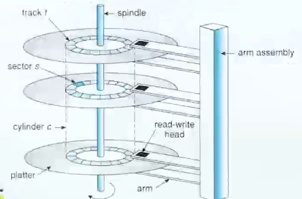
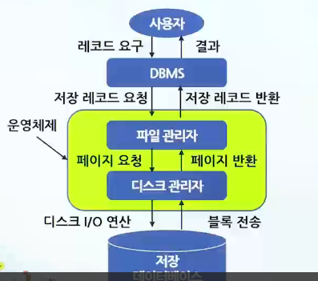

# 데이터베이스 저장 및 내부적 접근과정

## 물리적 저장 매체

### 플래시 메모리(Flash Memory)

- 메모리 칩 안에 정보를 유지시키는 데에 전력이 필요 없는 비회발성 메모리
- 읽기 속도가 쓰기 속도에 비해 빠르며 하드 디스크보다 충격에 강함

### SSD(Solid State Drive)

- 반도체를 이용하여 정보를 저장하는 장치
- 하드디스크 드라이브에 비하여 속도가 빠르고 기계적 지연이나 실패율, 발열/소음이 적으며, 소형화/경량화 할 수 있는 장점이 있음
- 단위 용량 당 가격이 하드디스크 드라이브보다 비싸며 수명이 짧은 것이 단점

## 디스크 접근 시간(access time)

### 저장 구조(sorage structure)

- 판독/기속 헤드(read/write head)
  - 디스크에 저장된 데이터를 실제로 판독하고 기록하는 물리적 장치
- 접근 시간(access time)
  - 헤드가 임의의 장소에서부터 원하는 트랙에 있는 레코드를 찾아 메인 메모리의 버퍼로 데이터를 전송하는 데 걸리는 시간
  - 탐색 시간 + 회전 지연 시간 + 데이터 전송 시간
    - 탐색 시간(seek time) : 판독/기록 헤드가 판독이나 기록할 데이터가 있는 트랙(실린더)까지 이동하는 데 걸리는 시간
    - 회전 지연 시간(rotational delay time) : 해당 트랙에서 원하는 레코드(섹터 또는 블록)가 회전하여 헤드 밑에까지 오기를 기다리는 시간
    - 데이터 전송 시간(transfer time) : 디스크 블록을 메모리로 전송하는 데 걸리는 시간으로 데이터 전송 시간은 전송 용량에 비례
  - 디스크 접근 시간은 메인 메모리 접근시간에 비해 매우느림
  - I/O 횟수가 DBMS의 성능을 결정하는 중요한 요소

## 데이터베이스 내부적 접근 과정

### 디스크 관리자의 기능

- 운영체제의 한 구성요소로서 모든 물리적 입출력(I/O) 연산에 대한 책임을 짐
- 페이지 관리(page management) 기능 수행
- 디스크 디렉터리(실린더0, 트랙0에 위치)는 디스크에 있는 모든 페이지 세트의 리스트와 각 페이지 세트의 첫 번째 페이지에 대한 포인터 저장

### 파일 관리자의 기능

- 저장 레코드 관리(stored record management)
- 저장 레코드는 레코드 ID로 식별 (RID: Record IDentifier)
- RID는 전체 디스크 내에서 유일하며 페이지 번호와 페이지 오프셋으로 구성
  - RID = (페이지번소 p, 오프셋)

## 클러스터링(Clustering)

> Clustering이란, 지정된 컬럼 값의 순서대로 실제 메모리에 테이블의 데이터를 저장시키는 액세스의 효율성을 높이기 위해 사용되는 물리적인 저장 기법이다.

- Cluster 키는 기본 키와는 독립적이다.
  - 보통 성능향상을 목적으로 한다.
- 클러스터 된 레코드에 대한 임의접근(Random Access)은 빨라진다.
- 전체 테이블 스캔(Full table Scan) 속도는 느려진다.

### Clustering 선정 및 적용

- 다량 범위 데이터에 대한 검색을 자주 하는 경우
- 넓은 분포도를 가지고 있어 인덱스 활용이 어려운 경우
- 수정이 자주 발생하지 않는 Column 또는 반복 Column이 분할되는 경우

### Clustering 장점

- ex. 연속해서 읽을 두 레코드가 같은 페이지에 있다면
  - 첫 번째 레코드를 접근할 때 이미 두 번째 레코드는 주기억장치의 버퍼에 있을 것임
  - 두 번째 레코드를 접근하기 위한 별도의 물리적 I/O가 필요 없음
- ex. 연속해서 읽을 두 레코드가 물리적으로 가까운 두 페이지에 저장되어 있다면
  - 두 번째 레코드를 접근하기 위해서 별도의 물리적 I/O가 필요하긴 하지만 이 I/O에 관련된 탐구시간(seek time)은 아주 작을 것임

## RAID의 개념

> RAID : 여러 개의 하드 디스크를 하나의 Virtual Disk로 구성하여 대용량 저장장치로 사용

- 여러 개의 하드 디스크에 데이터를 분할, 저장
  - 전송속도의 향상 및 시스템 가동 중 생길 수 있는 하드 디스크의 에러를 시스템 정지 없이 교체함으로써 데이터 자동복구 수행

### RAID의 목적

- 여러 개의 디스크 모듈을 하나의 대용량 디스크처럼 사용
- 여러 개의 디스크 모듈에 데이터를 나누어서 한꺼번에 쓰고 한꺼번에 읽는 식으로 I/O 속도 향상
- 여러 개의 디스크를 모아서 하나의 디스크로 만들어 그 중 하나 혹은 그 이상의 디스크에 장애가 발생하더라도 최소한 데이터가 사라지는 것은 방지

### RAID의 장점

- 높은 가용성(availability)과 데이터 보호(protection)
- 드라이브 접속성의 증대
- 저렴한 비용과 작은 체적으로 대용량 구현
- 데이터 분산에 의해 높은 효율성

## RAID의 레벨

### RAID 0 (Striping)

- 데이터의 빠른 입/출력이 가능하도록 여러 개의 하드 디스크에 분산되어 저장
  - ex. 하나의 디스크에 저장하는데 8분이 소요되는 데이터를 4개의 디스크에 동시 분산하여 저장하면, 2분 만에 모든 데이터의 저장 완료
- 장점 : 병렬로 동시에 처리하므로 성능이 매우 뛰어남
- 단점 : 단 하나의 디스크에서 장애가 발생하더라도 데이터 전부 손실 위험 존재

### RAID 1 (Mirroring)

- 단순히 한 드라이브에 기록되는 모든 데이터를 다른 드라이브에 복사하는 방식
- 하나의 드라이브가 고장 나더라도, 또 다른 드라이브를 통해 완벽한 복구가 가능
- 장애 복구 능력이 요구되는 경우에 사용하며, 모든 레벨에서 가장 높은 비용이 발생

### RAID 2 (Hamming for error correction)

- RAID 0처럼 스트라이핑 방식
- 에러 체크와 수정을 할 수 있도록 Hamming Code를 사용하고 있는 것이 특징
- RAID 4가 나오면서 거의 사용되지 않는 방식

### RAID 3

- Parallel transfer with parity, Dedicated Parity
- RAID 0, 1의 문제점을 보완하기 위한 방식
- RAID 0과 같은 스트라이핑(Striping) 구성에 추가로 에러 체크 및 수정을 위해서 패리티(Parity) 정보를 별도의 디스크에 따로 저장
- 데이터를 바이트(byte) 단위로 나눠 디스크에 동등하게 분산 기록

### RAID 4

- Independent data disks with shared parity blocks, Dedicated Parity
- 대형 스트라이프를 사용
- 데이터를 블록 단위로 나눠 기록하며 RAID3과 같은 방식
- 다량의 데이터 전송이 요하는 CAD나 이미지 작업에 적합

### RAID 5

- Independent data disks with distributed parity blocks
- 레벨 5는 현재 가장 널리 사용하고 있는 방식
- 기존 레벨 3과 4의 단점(패리티 드라이브의 병목현상)을 개선한 것
- 별도의 패리티 드라이브 대신 모든 드라이브에 패리티 정보를 나누어 기록하는 방식

### RAID 6

- P + Q redundancy scheme, Distributed Parity
- RAID 5와 같은 개념이지만 다른 드라이브들 간에 분포되어 있는 2차 패리티 정보를 넣음
- 2개의 하드 디스크에 문제가 생겨도 데이터를 복구할 수 있게 고안

### RAID 0+1

- High Data Transfer Performance
- RAID 0과 RAID 1의 장점만을 이용한 것으로 성능향상과 데이터의 안정성을 모두 보장

### RAID 1+0

- RAID 10으로 표기하기도 함
- RAID 1로 구성된 하드 디스크들을 최종적으로 RAID 0 방식으로 병렬구성(striping)해서 성능을 높임
- 미러링을 기본으로 하고 있으므로 장애 시 데이터 복구가 가능
- RAID -1은 RAID 0을 미러링하는 것이고, RAID 1+0은 RAID 1(미러링)을 RAID 0방식으로 저장하는 것으로 구조적인 차이가 있음

## 파일 설계

### 기본 요소

> 필드(field) > 레코드(record) > 파일(file) > 데이터베이스(database)

- 속성(attribute) => 필드(field)
- 튜플(tuple) => 레코드(record)
- 릴레이션(relation) => 파일(file)

### 데이터베이스의 거주 장소(Disk)

- 저장 공간의 방대성
- 비휘발성(non-volatile)
- 접근 시간(disk I/O)의 비효율성

### 처리과정

1. find the location of data(from disk)
2. read data and move it to budder(in main memory)
3. process it
4. write it back(to the disk)

### 블록킹의 필요성

- 디스크 접근 횟수를 줄이기 위함
  - 레코드 단위로 저장하면 I/O 횟수가 많아짐
- 파일 크기를 고려하여 트랙을 블록 단우ㅏㅣㅏ로 나눔
- 데이터 접근 최소 단위는 블록
- 블록킹 인수(blocking factor : bfr)
  - 한 블록에 저장되는 레코드들의 개수
  - 장점 : 디스크 I/O를 줄임
  - 단점 : 버퍼 크기만큼 main memory가 손실되며, 블록의 일부만 처리하더라도 블록 전체 전송

### 블록킹 인수 예제

- 레코드 크기(R) : 100 bytes
- 레코드 개수(r) : 10,000개
- 블록 크기(B) : 1,024 bytes
- 블록인 인수(bfr)를 계산하면, [B / R] = 1,024/100 = 100
- (필요한) 블록들의 개수(b) = [r / bfr] = 10,000/10 = 1,000
