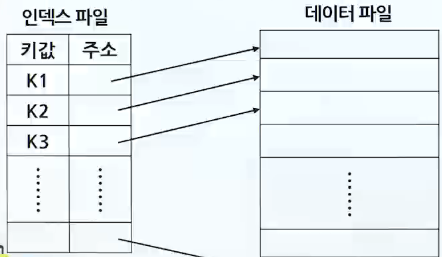
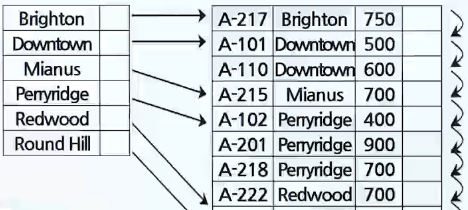
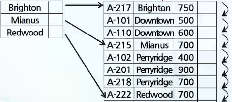
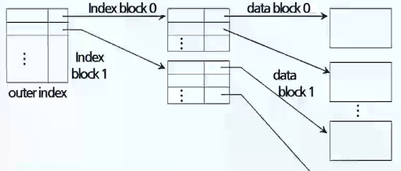
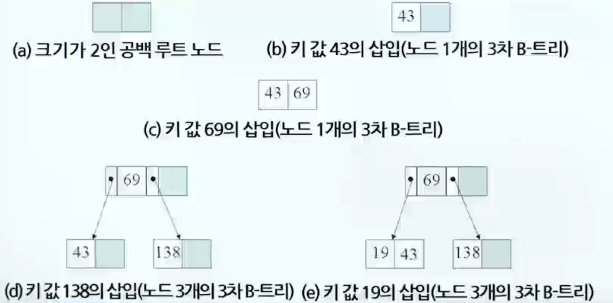
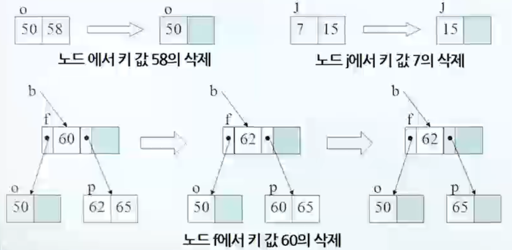
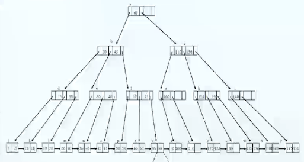
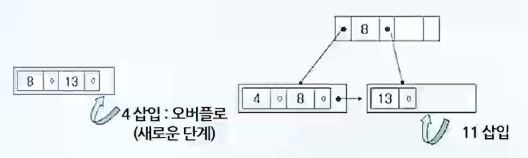
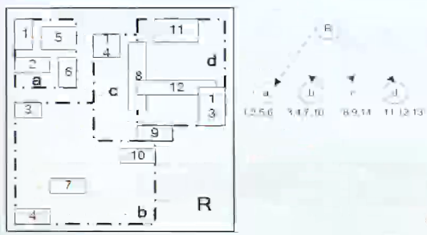

# 파일의 조직 방법

## 인덱스 종류 (밀집, 희소, 정적, 동적 인덱스)

### 파일 조직

- 파일 구분
  - 저장된 레코드들에 대한 접근방법에 따라 구분
    - 순차
    - 인덱스
    - 해싱

### 순차 방법

1. 엔트리 순차(entry-sequence) 파일
   - 각 레코드들이 도착하는 순서대로 수집, 저장
   - 분석, 분류과정을 거치지 않음
2. 키 순차(key-sequence) 파일
   - 저장장치에서 레코드 순서와 실제 파일의 순서 일치
   - 특정 필드(key)에 대해 순차적으로 저장

### 인덱스 방법

> 인덱스란 : 데이터 레코드를 접근하기 위해서 먼저 해당 인덱스를 찾아서 그 인덱스가 가리키는 주소를 따라가 원하는 레코드를 접근할 수 있도록 데이터를 저장하는 방법

- 인덱스 파일은 [키 값, 주소] 쌍으로 구성
  - 

### 밀집 인덱스(Dense index)

- 인덱스 레코드는 파일에 있는 모든 검색키 값에 대해 나타남
  - 

### 희소 인덱스(Sparse index)

- 인덱스 레코드는 검색키 값에 대해 단지 몇 개만 나타남
  - 

### 다단계 인덱스(multilevel index)

- 두 개 혹은 그 이상의 단계를 가지는 인덱스(ex. 사전)
  - 

### 정적 인덱스 파일(Static Indexed File)

- 데이터 파일에 레코드가 삽입되거나 삭제될 때 인덱스의 내용은 변하지만 인덱스의 구조 자체는 변경되지 않는 구조로서 ISAM 파일이 대표적
- 인덱스 영역 + 기본 데이터 영역 + 오버플로우 영역으로 구성
- 데이터 파일에서 새로 삽입할 레코드의 저장 공간이 없을 때에는 오버플로우(overflow area)를 사용
- 오버플로우 영역이 꽉 차거나 혹은 파일의 성능이 저하되면 주기적으로 재조직(reorganization) 필요
- 인덱스의 성능
  - 팬아웃(fanout)
    - 한 인덱스 블록 당 인덱스 엔트리들의 개수
  - 인덱스의 높이(height of index)
    - 팬아웃이 크면 인덱스의 높이가 낮아지므로 검색 시간이 짧아짐

### 동적 인덱스 파일(Dynamic Indexed File)

- 블록이 동적으로 분열(split) 및 합병(merge)
- VSAM 파일이 대표적
- 인덱스 세트와 순차세트로 구성
  - B+트리 인덱스

## B, B\*, B+ 트리의 삽입, 삭제 알고리즘

### B 트리

> Root로부터 Leaf 노드까지 모든 Path가 동일한 길이를 갖는 Balanced의 약자

- 인덱스를 조직하는 구조로 가장 많이 사용
- 각 노드는 적어도 반 이상(1/2)이 차 있어야함
  - 트리의 높이가 높아져 탐색속도가 늦어지는 것 방지
- 루트는 그 자체가 리프가 아닌 이상 적어도 두 개의 서브트리를 가짐
- 모든 리프는 같은 레벨
- 한 노드 안에 있는 키 값들은 오름차순 유지
- 탐색키의 중복저장이 허용되지 않음

> B트리의 삽입 예제

- 차수 3인 B트리, 키 값 43, 69, 138, 19 순으로 삽입/생성
  - 

> B트리의 삭제 예제

- 키 값 58, 7, 60, 20, 15 삭제
  - 

### B\* 트리

- 노드 분열의 빈도를 줄이기 위해 사용
- 각 노드가 최소한 2/3가 채워지도록 변경

### B+ 트리

> B 트리의 변형으로 인덱스 세트(index set)와 순차 세트(sequence set)로 구성

- 리프 노드는 파일 레코드들의 순차 세트를 나타내며 모두 순차적 포인터 링크로 연결
- 인덱스 부분에 있는 키 값은 리프 노드에 있는 키 값을 찾아 갈 수 있는 경로만 제공
- 순차적 접근 거리와 인덱스 접근 처리에 효율적
- 

> B+ 트리의 삽입 예제

- 차수 3인 B트리, 키 값 13, 8, 4, 11, 6 순으로 삽입/생성
  - 

## 비트맵 인덱스, R트리 인덱스

### 비트맵 인덱스

> 테이블이 매우 크고 비트맵 인덱스 컬럼이 낮은 분포도를 가질 때 사용

- 대량의 데이터를 가지는 의사결정시스템에 유용
- 인덱스 값을 비트맵(0,1)로 변환하여 저장
- 삽입이나 갱신이 많이 발생하지 않는 테이블에 적용
- 저장 공간의 절약(비트단위로 표현, 압축 알고리즘 활용) 및 수행속도 향상

### 비트맵 인덱스와 B트리 인덱스 비교

| 항목             | B-tree 인덱스                                                       | 비트맵 인덱스                                             |
| ---------------- | ------------------------------------------------------------------- | --------------------------------------------------------- |
| 인덱스 검색 속도 | 필요한 인덱스 값만 검색하며 소량의 데이터 검색에 유리               | 항상 전체 인덱스를 검색하며 대량의 데이터 검색에 유리     |
| 인덱스 크기      | 매우 큼                                                             | 매우 작음                                                 |
| 인덱스 갱신 비용 | 갱신 비용이 적음                                                    | 갱신 비용이 매우 큼(전체 인덱스 조정 필요)                |
| 분포도           | 큰 분포도(Cardinality)를 갖는 테이블 적합                           | 적은 분포도를 갖는 테이블에 적합                          |
| 사용분야         | OLTP(Online Transcational Processing - 온라인 트랜잭션 처리)에 유용 | DSS(Decicsion Support System - 의사결정지원시스템)에 유용 |

### R트리

1. R트리
   - > 비정형화된 데이터베이스의 응용 중에서 CAD와 지리 데이터 응용 등에서 필요한 공간 데이터를 다루기 위한 인덱스 기법
   - MBR(Minimum Bounding Region)을 계층 형태로 표현
   - R트리에 대한 탐색을 고려할 때는 포함관계와 겹침 관계의 개념이 매우 중요
   - 탐색은 포함과 겹침 관계가 모두 최소일 때 가장 효율적
2. R\*트리
   - 사각형의 면적을 최소화
   - 사각형들 간의 겹침을 최소화
   - 사각형의 둘레 길이의 합을 최소화
   - 기억장소의 이용률을 최적화
3. R+트리
   - R트리에서의 겹침 관계를 제거한 인덱스 구조

## 해싱함수 종류 및 충돌해결 방법

### 해싱(Hashing)

> 다른 레코드 참조 없이 목표 레코드 직접 접근(direct access)을 지원
>
> > 해싱 함수 : f(키 값) => 주소

1. 해싱을 이용한 파일 설계 시 고려사항
   - 버킷(bucket) 크기 : 하나의 주소를 가진 저장 구역에 저장할 수 있는 레코드의 수
   - 적재율 : 총 저장 용량에 대한 실제로 저장되는 레코드 수에 대한 비율
   - 해싱 함수 : 레코드 키 값으로부터 주소를 생성하는 방법
2. 충돌(collision)
   - 두 개의 상이한 레코드가 똑같은 버킷으로 해싱되는 것
     - 동거자(synonyms) : 같은 주소로 해싱되어 충돌된 키 값들

### 해싱(Hasing 함수)

1. 종류
   - 제산잔여 해싱
     - 주소 = 키 값 mod 제수
     - 몫은 제외하고 나머지만 주소로 사용
     - ex. 512 % 100 = 12
   - 중간 제곱 해싱
     - 키 값을 제곱하고 중간에서 n개(주소 공간)의 수를 취함
     - ex. 레코드 키 값 K = 512, 해시 테이블의 크기가 100일 때, 512제곱 = 262144
       - 중간 2자리 "21"이 최종 주소 값
   - 중첩 해싱
     - 키 값을 주소공간과 같은 자리 수를 가지는 몇 개의 부분으로 나눈 후 접어서 합을 구함
     - ex. 레코드 키 값 K = 123456-7890123, 해시 테이블 크기가 1000일 때, 123 + 654 + 789 + 210 + 3 = 1779
       - 1779 % 1000 = 779
   - 숫자 이동 변환
     - 키를 중앙을 중심으로 양분한 뒤 주소 길이만큼 겹치도록 안쪽으로 각각 shift한 후 주소 범위에 맞도록 조정
     - ex. 레코드 키 값 K = 123456-7890123, 해시 테이블 크기가 1000일 때, 123 + 456 + 789 + 012 + 3 = 1383
       - 1383 % 1000 = 383
   - 진수 변환
     - 키 값의 진수를 다른 진수로 변환한 후 초과하는 높은 자리 수를 절단하고 주소 범위에 맞도록 조정
     - ex. 키 값: 172, 이를 11진수로 변환할 때, 변환 주소 : 1 \* 11² + 7 \* 11¹ + 2\*(11의 0제곱)
       - =121 + 77 + 2 = 200

### 해싱 충돌해결 방법

1. 개방해싱(Open Hashing)
   - 주소 밖에 새로운 공간을 할당하여 문제 해결
   - 체이닝 : 충돌이 발생하면 각 데이터를 해당 주소에 있는 링크드 리스트에 삽입하여 문제를 해결하는 방법
2. 폐쇄해싱(Closed Hashing)
   - 처음에 주어진 해시 테이블의 공간 안에서 문제 해결
   1. 선형탐사(Linear Probing)
      - 오버플로 발생시, 홈 주소에서부터 차례로 조사해서 가장 가까운 빈 공간을 찾는 방법
   2. 제곱 탐사(Quadratic Probing)
      - 선형 탐사가 다음 주소를 찾기 위해 고정 폭만큼 이동하는 것에 비해 제곱 탐사는 이동 폭이 제곱수로 늘어나는 것이 다름
   3. 이중 해싱(Double Hashing)
      - 클러스터 방지를 위해, 2개의 해시 함수를 준비
        - 하나는 최초의 주소를 얻을 때
        - 또 다른 하나는 충돌이 일어났을 때 탐사 이동 폭을 얻기 위해 사용
   4. 재해싱(Rehashing)
      - 해시 테이블의 크기를 늘리고, 늘어난 해시 테이블의 크기에 맞추어 테이블 내의 모든 데이터를 다시 해싱하는 것
3. 확장성 해싱
   - 버킷 해싱의 충돌 문제에 대처하기 위해 제안된 기법
   - 2단계 구조 : 디렉터리와 버킷으로 구성
