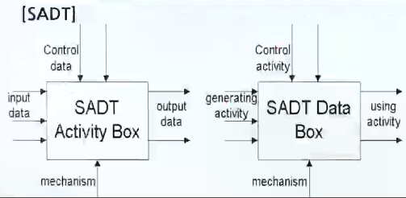

# 데이터베이스 설계

## 개념적, 논리적, 물리적 설계 개요

### 데이터베이스 생명주기(Life Cycle)

- 
- 요구조건 분석
  - 데이터베이스에 저장할 데이터의 범위를 정의하기 위해 사용자와 그 응용을 식별하고 그들이 필요로 하는 요구사항 분석
- 설계
  - 개념적인 설계에서 시작하여 논리적인 설계를 거쳐 목표 DBMS에 구현할 수 있는 물리적 설계까지 포함
- 구현
  - 설계된 데이터베이스 스키마의 정의, 데이터베이스 파일의 생성, 응용 소프트웨어를 목표 DBMS 환경에 맞도록 구현
- 운영
  - 데이터베이스 시스템과 응용 시스템을 실제로 운영하고 관리하여 사용자 요구에 따라 서비스 제공
- 감시 및 개선
  - 데이터베이스 시스템을 운영하는 과정에서 발생하는 새로운 요구조건이나 응용에 대처
- 부문별 시스템 활용도의 변동에 따라 저하될지 모르는 성능을 개선

### 데이터베이스 설계 단계

- 데이터베이스 설계 목표
  - 특정 사용자와 응용의 정보 내용 요구 만족
  - 자연스럽고 쉽게 이해할 수 있는 정보 구조 제공
  - 처리 요구 조건과 응답시간, 처리시간, 저장 공간 등과 같은 성능 관련 요소 지원
- 데이터베이스 설계 단계
  - > DB설계는 사용자의 요구 조건에서부터 데이터베이스 구조를 도출해 내는 과정
  1. 요구조건 분석(Requirement analysis)
  2. 개념적 설계(Conceptual design)
  3. 논리적 설계(Logical design)
  4. 물리적 설계(Physical design)
  5. 구현(Implementation)
- 데이터베이스 설계 작업 구분
  - 데이터 중심(Data-Driven Database Design) 설계
    - 데이터베이스의 내용과 구조에 치중한 설계
  - 처리 중심(Processing-Driven Database Design) 설계
    - 데이터 처리와 응용(트랜잭션)에 치중한 설계

### 요구조건 분석

- 요구조건 종류
  - 정적 정보 구조에 대한 요구 조건
    - 개체, 애트리뷰트, 관계성, 제약족너
  - 동적 데이터베이스 처리 요구 조건
    - 트랜잭션의 유형, 트랜잭션의 실행빈도
  - 범 기관적 제약조건
    - 기관의 경영목표, 정책, 규정 등
- 요구조건 분석과정
  1. DB 사용에 필요한 정보 수집
     - 사용자 그룹, 업무, 데이터 종류, 데이터 흐름 등
  2. 범 기관적 경영 목표와 제약 조건을 식별
  3. 공식 요구 조건 명세의 작성 및 검토
     - HIPO(Hierarchy Input Process Output)
       - Input-Process-Output으로 이루어진 모듈을 계층적으로 나타낸 도표
       - 시스템의 기능을 여러 개의 고유 모듈들로 분할하여 이들 간의 인터페이스를 계층 구조로 표현한 도형 또는 도면
       - 
     - DFD(Data Flow Diagram)
       - 데이터가 각 프로세스를 따라 흐르면서 변환되는 모습을 나타낸 그림
       - 시스템 분석과 설계에서 매우 유용하게 사용
       - 
     - SADT(Structured Analysis and Design Technique)
       - Softtech사에서 개발
       - 시스템 구조를 계층적으로 기술하고 대규모/복잡한 문제를 구조적으로 분석
       - 
  4. 최종 시스템 명세 확정

### 개념적 설계

- 개념적 스키마 모델링
  - 요구조건 분석의 결과로 나온 명세를 E-R-다이어그램과 같은 개념적 데이터 모델
  - 즉, DBMS에 독립적이고 고차원적인 표현 기법으로 기술하는 것
  - 추상화
    - 개념적 스키마를 유도하는 기본원리
  - 집단화
    - 여러 애트리뷰트를 그룹, 하나의 개체로 만드는 것
  - 일반화
    - 공통 성질을 가진 여러 부류의 개체들을 일반적이고 포괄적인 개체로 만드는 것
- 트랜잭션 모델링
  - 요구조건 분석 결과로 식별된 응용을 검토해서 구현해야 될 트랜잭션을 고차원 명세로 정의하는 것
  - 트랜잭션의 유형
    - 검색, 갱신, 삽입, 삭제

### 논리적 설계

> 개념적 설계 단계에서 생성된 독립적 개념 스키마를 목표 DBMS에 맞는 논리적 스키마로 변환하는 것

- 정규화 이론에 의한 DB 설계 최적화를 시행
- 트랜잭션 인터페이스 설계
  - 응용 프로그램의 인터페이스 설계
- 스키마의 평가 및 정제
  - 정량적 정보
    - 데이터의 양
    - 처리 빈도수
    - 처리 작업량
  - 성능 평가 기준
    - 논리적 레코드의 접근
    - 데이터의 전송량
    - 데이터베이스의 크기
- DBMS의 선정 기준(비용 중심)
  - 기본적인 기능과 추가적인 기능
  - 소프트웨어 구입비용
  - 유지비용(version up)
  - 하드웨어 구입비용
  - DB 생성과 변환 비용
  - 인건비 및 교육 훈련비용
  - 운영비용

### 물리적 설계

> 논리적 스키마로부터 효율적인 내부 스키마를 설계하는 것

- 트랜잭션의 상세 설계 병행
- 데이터베이스의 물리적 구조는 데이터베이스 시스템의 성능에 중대한 영향을 미침
- 물리적 데이터베이스의 기본적인 데이터 단위
  - 저장 레코드(stored record)
- 물리적 데이터베이스 구조
  - 데이터베이스에 포함될 여러 파일 타입에 대한 저장 레코드의 양식, 순서, 접근 경로, 저장 공간의 할당 등을 표현한 것
- 물리적 설계의 옵션 선택 시 고려사항
  - 응답 시간
    - 데이터베이스 트랜잭션을 실행시키기 위해 시스템에 입력시킨 때부터 다시 결과를 받을 때까지 걸리는 시간
  - 저장 공간의 효율화
    - 데이터베이스 파일과 접근 경로 구조 등을 저장하기 위한 최소한의 저장 공간을 사용하는 것
  - 트랜잭션 처리도(throughput)
    - 단위 시간에 DB시스템이 처리할 수 있는 평균 트랜잭션의 수

### 구현

1. 데이터베이스 생성
   - DBMS의 DDL로 기술된 명령문이 컴파일되고 실행
   - 데이터베이스 스키마와 빈 데이터베이스가 생성
   - 데이터가 데이터베이스에 적재
     - 필요 시 변환 루틴이나 유틸리티에 의해 적재
2. 저장공간 평가
   - 주기억장치 공간
   - 보조 기억장치 공간
3. 시간 평가
   - 질의 응답시간
     - 질의를 시작해서 질의 결과가 처음 디스플레이될 때까지 걸리는 시간
   - 트랜잭션 갱신 시간
     - 트랜잭션이 시작되어 완전히 끝날 때까지 걸리는 시간
   - 보고서 작성 시간
     - 검색 및 CPU와 I/O 서비스 시간

## 데이터베이스 설계 시 고려사항

### DB 설계 고려 사항

1. 무결성
   - 생신, 삽입, 삭제 등의 연산 수행 뒤에도 데이터 값은 항상 주어진 제약조건을 만족해야 하는 것
     - 개체 무결성
       - 기본키(Primary Key)는 유일한 값을 가져야 하며, Null 값을 가질 수 없음
     - 참조 무결성
       - 외래키(Foreign Key)는 참조하고 있는 기본키 값에 부합해야 하며, Null 값을 가질 수 있음
       - 외래키가 Null 값을 가진다는 의미는 아직 참조할 튜플을 결정하지 못한 것을 의미
     - 도메인 무결성
       - 속성의 값의 범위인 도메인을 만족해야 하는 것을 의미
2. 일관성
   - 질의에 대한 응답에 모순성 없이 일치하는 결과를 반환하는 특성
   - 실행 중의 일관성 위반은 허용하지만, 결과의 일관성은 반드시 지켜져야 함
3. 회복
   - 시스템에 장애가 발생했을 때 장애 발생 직전의 일관된 데이터베이스 상태로 복구하는 것
4. 보안
   - 의도적이거나 우연한 것을 불문하고 불법적으로 데이터의 변경이나 손실 또는 노출에 대한 보호 의미
     - 임의접근 제어기법
       - 사용자의 ID, 비밀번호 등을 이용하여 데이터베이스의 접근을 제어
     - 강제접근 제어기법
       - 객체 자체에 등급을 부여하여 해당 객체의 접근 권한이 있는 경우에만 접근을 허용
5. 효율성
   - 응답시간의 단축
   - 저장 공간의 최적화
   - 시스템의 생산성 향상
6. 데이터베이스의 확장
   - 시스템 운영에 영향을 주지 않으면서 새로운 데이터를 계속적으로 추가시켜 나갈 수 있는 기법

### 데이터베이스 설계 프로세스

