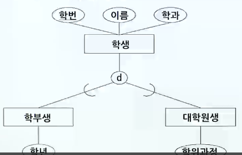

# 데이터 모델링

## 데이터 모델의 개념 및 ERD 표기법

### 데이터베이스와 현실 세계

- 개념적 모델링(Conceptual Modeling)
  - 인간의 이해를 위해 현실 세계에 대한 인식을 추상적 개념(abstract concept)으로 표현하는 과정
- 개념적 구조(Conceptual Structure)
  - 개념적 모델링으로부터 얻은 결과
- 데이터 모델링(Data Modeling)
  - 개념적 구조로부터 논리적 개념(Logical Concepts)을 이용하여 어떤 논리적 구조(Logical Structure)로 표현하는 것
- 데이터 구조화(Data Structuring)
  - 논리적 데이터 구조를 컴퓨터가 접근할 수 있는 물리적 데이터 구조로 변환시키는 작업
- 데이터 모델링 구조화
  - 

### 데이터베이스 설계 단계

1. 데이터베이스 요구사항 수집 및 분석
   - 사용자(잠재적 사용자 포함)의 요구사항을 수집 분석
2. 개념 디자인(Conceptual Design)
   - 현실 세계를 개념적 모델링을 통해 개념적으로 표현(ER 모델)
   - DBMS 독립적, Hardware 독립적
3. 논리 디자인(Logical Design)
   - 개념세계를 데이터 모델링을 통해 만들어진 논리적 구조
   - 특정 논리 스키마(관계, 계층, 네트워크 모델)로 묘사
   - DBMS 종속적, Hardware 독립적
4. 물리 디자인(Physical Design)
   - 컴퓨터가 접근할 수 있는 저장장치(디스크)에 데이터가 표현될 수 있도록 물리적 데이터 구조로 변환하는 과정
   - DBMS 종속적, Hardware 종속적

### 데이터 모델

- 데이터 모델은 논리적으로 표현된 데이터구조
- 이 구조에서 허용될 수 있는 연산
- 이 구조와 연산에서의 제약조건에 대한 명세를 기술한 것
- 구성요소
  - 데이터 구조(Structure)
    - 데이터베이스에 표현될 대상
    - 개체, 개체 타입(속성의 집합)과 이들 간의 관계(Relationship)를 명세
  - 연산(Operation)
    - 데이터베이스에 표현된 개체 인스턴스를 처리하는 작업에 대한 명세
  - 제약 조건(Constraint)
    - 데이터베이스에 허용될 수 있는 개체 인스턴스에 대한 논리적 제약을 명세
- 개체-관계 모델(E-R 모델)
  - 1976년 Peter Chem이 제안
  - 개체 타입(entity type)과 이들 간의 관계 타입(relationship type)을 이용해서 현실 세계를 개념적으로 표현하는 방법
  - 특정 유형의 DBMS 및 H/W에 무관하게 설계 가능
  - DB 요구사항을 graph 형태로 표현
  - ERD 심볼
    - 

## 개체 타입 특징(약한개체 타입, 속성의 유형)

### 개체 타입(Entity Type)

> 개체 이름과 애트리뷰트들로 정의

- 기본키
  - 애트리뷰트들 중 개체를 유일하게 식별하는 기능을 갖는 속성
- 약한 개체 타입(weak entity type)
  - 자기 자신의 애트리뷰트 만으로는 키를 명세할 수 없는 개체 타입
  - 약한 개체 타입에 속하는 개체들은 다른 개체 타입의 특정 개체와 관련됨으로써 식별
  - 약한 개체 타입은 그의 식별 관계에 대해서 항상 전체가 참여하는 제약을 가짐
  - 약한 개체 타입의 유일한 식별자
    - 부분키(partial key)
  - 약한 개체 타입 예제
    - 
- 강한 개체타입(strong entity type)
  - 자신의 애트리뷰트로 구성된 키를 가진 개체타입
- 속성(attribute) 유형
  1. 단순 속성
     - 더 이상 작은 구성요소로 분해할 수 없는 애트리뷰트
  2. 복합 속성
     - 몇 개의 기본적인 단순 애트리뷰트들로 분해할 수 있는 애트리뷰트
       - ex. 주소 애트리뷰트는 도, 시(군,읍), 동(면), 우편번호로 나눌 수 있음
  3. 단일값 속성
     - 특정 개체에 대해 하나의 값을 갖는 애트리뷰트
       - ex. 학생의 나이
  4. 다중값 속성
     - 어떤 개체에 대해 특정 애트리뷰트는 몇 개의 값을 가질 수 있음
       - ex. 학위, 취미, 전화번호
  5. 저장 속성
     - 실제 저장되어 데이터베이스에 존재하고 유도 속성의 근원이 되는 속성
       - ex. 학번, 이름, 주민등록번호
  6. 유도 속성
     - 다른 관련 속성이나 저장 속성 값으로부터 유도
     - DB 저장 불필요
       - ex. 주민등록번호(저장 속성)로부터 계산된 나이
- Null 애트리뷰트(Null attribute)
  - "해당되지 않는" 경우
    - ex. 병역 속성에서 여학생의 경우
  - 값이 존재하지만 값이 "누락"인 경우
    - ex. 주소 속성
  - 값이 존재하고 있는지 조차 알 수 없어 "모르는" 경우
    - ex. 집 전화번호
  - default 값으로 취급하고 있는 공백
    - 0과는 다른 의미를 가짐

## 관계 타입의 제약조건 및 연결함정

### 관계 타입

> 개체 타입과 개체 타입 간에 성립할 수 있는 관계를 총체적으로 정의한 것

- 설명 속성(Descriptive attribute)
  - 관계가 가질 수 있는 속성
- 제약조건
  - 일 대 일(1:1)
    - 개체 집합 X의 각 원소는 집합 Y의 원소 하나와 관련될 수 있음
    - 동시에 개체 집합 Y의 각 원소도 집합 X의 원소 하나와 관련될 수 있음
  - 일 대 다(1:n)
    - 개체 집합 X의 각 원소는 임의의 수의 Y원소와 관련될 수 있음
    - 하지만, 개체 집합 Y의 각 원소는 많아야 하나의 X원소와 관련될 수 있음
  - 다 대 일(n:1)
    - 개체 집합 X의 각 원소는 최대 하나의 Y원소와 관련될 수 있음
    - 하지만, 개체 집합 Y의 각 원소는 임의의 수의 X원소와 관련될 수 있음
  - 다 대 다(n:m)
    - 개체 집합 X의 각 원소는 임의의 수의 개체 집합 Y원소와 관련될 수 있음
    - 또, 개체 집합 Y의 각 원소도 임의의 수의 X원소와 관련될 수 있음
- 관계 타입의 특성
  - 
  - 전체 참여
    - 개체 집합 A와 B사이에 정의된 AB관계에서 개체 집합 B의 모든 개체가 이 AB관계에 반드시 참여해야 된다면 개체 집합 B의 AB관계 참여를 전체 잡여라 함
  - 부분 참여
    - 개체 집합 A와 B사이에 정의된 AB관계에서 개체 집합 B의 일부 개체만 참여하게 된다면 개체 집합 B의 AB관계 참여를 부분 참여라 함
- 연결 함정(Connection Trap)
  - 개체-관계(Entity-Relation) 모델링 수행 시 발생할 수 있는 무넺점
  - 정규화하는 과정에서 당초 가지고 있는 정보를 잃어버리거나 내용이 애매모호해지는 현상
  1. 부채꼴 함정(Fan Trap)
     - entity간의 관계모델 설계를 잘못하여 연계된 정보 Tracing이 불가능한 경우
     - 모델을 변환하여 해결함
  2. 균열 함정(Chasm Trap)
     - 관계성이 정의되어 있으나 일부 entity 간에는 관계가 존재하지 않는 경우
     - 관계성 집합을 추가하여 문제를 해결

## 확장 ER 모델의 개념

### 확장 ER 모델

- 등장배경
  - 데이터베이스에 대한 CAD, 지리정보시스템, 멀티미디어 데이터베이스와 같은 새로운 응용 대두
  - 기본 E-R 모델 개념을 확장할 필요성 대두
  - 최초에는 Entity, Relationship, Attribute와 같은 개념들로 구성되었으나 나중에 전문화와 일반화, 그리고 계승 개념을 추가하게 되었음
    - ㄴ 확장 ER 모델
- 서브클래스와 슈퍼클래스
  - 
  - 슈퍼클래스 : 학생
  - 서브클래스 : 학부생, 대학원생
    - 슈퍼클래스와 한 서브클래스 간의 관계는 isa 관계
  - ∈ : 슈퍼클래스 / 서브클래스 관계의 방향
  - d : 분할(Disjoint)을 의미
    - 서브클래스 개체들은 이중으로 중첩되지 않음
  - o : 중첩(Overlap)을 의미
    - 개체의 중복 허용

### 일반화와 세분화

1. 일반화(Generalization)
   - 여러 개체 타입의 상이한 점을 무시하고 공통점을 찾아서 하나의 상위 클래스로 만드는 것
   - 상향식 개념적 설계
   - 추상화
2. 세분화(Specialization)
   - 일반화와 반대로 일반적인 개념에서 좀 더 구체적인 하위개념을 구성하는 것
   - 하향식 개념적 설계
   - 세분화 대상이 되는 개체 타입
     - 세분화의 슈퍼클래스
   - 집합 내에 개체간의 차이점 강조
   - 전문화, 구체화

### 집단화와 연관화

1. 집단화(Aggregation)
   - 요소 객체들을 가지고 상위 레벨의 복합객체를 구축하는 추상화 개념
   - 집단화에서 기본 객체들과 그들의 집단 객체 사이의 관계는 is-a-part-of 관계
   - E-R 모델의 관계들 사이에 존재하는 관계를 표현할 수 없는 점을 해소
   - 집단화 단계
     - 
2. 연관화(Association)
   - 여러 개의 독립된 클래스로부터 객체들을 연관시켜 하나의 상위 레벨 객체로 추상화
   - 이 관계는 is-associated-with 관계

## 논리적 데이터 모델의 종류 및 특징

### 논리적 데이터 모델

1. 관계 데이터 모델
   - 데이터베이스
     - 테이블(릴레이션)의 집합으로 표현
   - 행, 열로 구성
   - 네트워크, 계층 모델에 비해 추상적
   - Oracle, SYBASE, INFORMIX, MS-SQL, DB2, INGRES 등
2. 네트워크 데이터 모델
   - 데이터베이스
     - 네트워크, 즉 그래프로 표현
   - 오너-멤버 관계로서 사이클(cycle) 허용
   - CODASYLE DB, DBTG, TOTAL 등
3. 계층 데이터 모델
   - 데이터베이스 - 트리(tree) 로 표현
   - 사이클(cycle)이 허용되지 않으며 레코드 타입들 간에는 상하위 레벨 관계가 성립
   - 부모 자식 관계(parent-child relationship)
   - IMS 등
