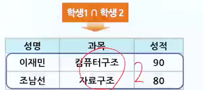
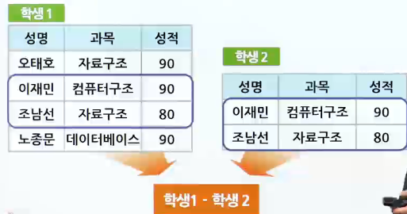

# 관계 대수의 특징 및 연산자

## 관계 대수의 특징 및 일반 집합 연산자 종류

### 관계 대수의 특징

> 관계 대수 : 릴레이션을 처리하기 위한 연산의 집합

- 각 연산의 피연산자가 모두 릴레이션이고, 연산 결과도 릴레이션
- 원하는 정보와 그 정보를 어떻게 유도하는가를 기술하는 절차적인 방법

#### 관계 대수의 구분

- 수학적 집합이론으로부터 나온 일반 집합 연산자
  - union, intersection, difference, cartesian product
- 관계 데이터베이스에 적용할 수 있도록 특별히 개발한 순수 관계 연산자
  - select, projection, join, division

### 일반 집합 연산자 종류

- 합집합 (union, ∪)
  - 합병 가능한 두 릴레이션 R과 S의 합집합 (R∪S)
  - 결과 릴레이션의 degree
    - R또는 S의 차수
  - 결과 릴레이션의 cardinality
    - 
  - 릴레이션의 결과에서 중복되는 튜플은 한 번만 표시
  - 
  - 
- 교집합 (intersect, ∩)
  - 합병 가능한 두 릴레이션 R과 S의 교집합 (R∩S)
  - 결과 릴레이션의 degree
    - R 또는 S의 차수
  - 결과 릴레이션의 cardinality
    - 
  - 릴레이션의 결과에서 중복되는 튜플은 한 번만 표시
  - 
  - 
- 차집합 (defference, -)
  - 합병 가능한 두 릴레이션 R과 S의 차집합 (R-S)
  - 결과 릴레이션의 degree
    - R 또는 S의 차수
  - 결과 릴레이션의 cardinality
    - 
    - 
    - 
- 카티션 프로덕트 (cartesian product, x)
  - 카티션 프로덕트에 관계된 릴레이션들은 합병 가능하지 않아도 됨 (R x S)
  - 결과 릴레이션의 degree
    - R의 차수 + S의 차수
  - 결과 릴레이션의 carinality
    - 
  - 
  - 
  - 

#### 합병 가능 (union-compatible)

- 두 릴레이션의 차수가 같고, 대응 애트리뷰트 별로 도메인이 같아야 함
- 애트리뷰트 이름도 서로 다를 수 있음
- 합병가능 연산자
  - 합집합, 교집합, 차집합

#### 교환과 결합

1. 교환법칙 성립
   - 합집합
   - 교집합
   - 조인(동등조인, 자연조인)
   - 카티션 프로덕트
2. 교환법칙 비성립
   - 차집합
   - 디비전
   - 조인(세미조인)
3. 결합법칙 성립
   - 합집합
   - 교집합
   - 조인(동등조인, 자연조인)
   - 카티션 프로덕트
4. 결합법칙 비성립
   - 차집합
   - 디비전
   - 조인(세미조인)

## 순수 관계 연산자의 종류 및 특징

### 순수 관계 연산자의 종류

- 셀렉트 (SELECT, σ - 시그마)
  - 릴레이션에서 주어진 조건을 만족하는 튜플들을 선택하는 연산
  - 릴레이션의 수평적 부분집합(horizontal subset)
  - SQL에서 SELECT 명령어의 WHERE 절에 해당
  - 하나의 릴레이션 만을 적용 대상으로 함
  - 셀렉트 결과 튜플의 수
    - 피연산자 릴레이션의 튜플의 수보다 작거나 같음
  - 
  - 선택도(selectivity)
    - 선택조건에 의해 선택된 튜플의 비율
      - 선택된 튜플 수/릴레이션의 전체 튜플 수
    - 선택조건의 선택도
      - 질의 최적화를 수행할 때 중요한 수행척도가 됨
    - 질의문에 여러 개의 연산자가 존재할 때
      - 선택도가 작은 것을 먼저 수행하고, 큰 것을 나중에 수행하면 질의를 아주 효율적으로 처리할 수 있음
  - 
- 프로젝트 (PROJECT, π - 파이)
  - 릴레이션의 애트리뷰트를 연산 대상으로 함
  - 릴레이션의 수직적 부분집합(vertical subset)
  - 프로젝트 연산 결과로 만들어진 릴레이션에 똑같은 튜플이 중복되면 시스템은 그 중 하나만 제외하고 나머지는 모두 제거
  - project 결과으 ㅣ차수(degree) 및 튜플 수
    - 원래 릴레이션보다 작거나 같음
  - 프로젝트 열 들
    - SQL 언어에서 SELECT 절의 열-이름 리스트
  - 
- 조인 (JOIN, ⋈ - 보타이)
  - 릴레이션 R의 애트리뷰트 A와 릴레이션 S의 애트리뷰트 B를 통한 조인
    - 
  - 결과 릴레이션의 차수
    - 릴레이션 R의 차수와 S의 차수를 합한 것
  - cartesian product와 selection을 하나로 결합한 이항 연산자
    - 
  - 두 개 이상의 릴레이션으로부터 상호 연관성을 구하기 위한 연산자
  - 자연 조인(natural join)은 릴레이션에서 중복되는 속성을 하나만 남기고 모두 제거
  - 일반적으로 조인 연산은 데이터베이스의 검색 성능을 저하시킴

#### 조인의 종류

1. 세타조인(θ-조인, theta-join)
   - 모든 비교 연산자를 θ로 표현할 수 있는 조인
   - 
2. 동일조인(equi-join)
   - 세타조인 θrk "="인 경우
   - 동일 애트리뷰트가 존재
   - 동일 조인의 결과 릴레이션에서는 중복되는 속성이 존재
   - 
   - 
3. 자연조인(natural join, ⋈N)
   - 동일 조인의 결과 릴레이션에서 중복되는 속성을 하나만 남기고 모두 제거
   - 
   - 

#### 디비전(DIVISION, ÷)

- (R ÷ S): S의 모든 튜플에 연관되어 있는 R의 튜플을 선택하는 것
- 나누어지는 릴레이션 R의 차수가 (m+n)이고 나누는 릴레이션 S의 차수가 n일 때
  - 디비전의 결과 릴레이션의 차수는 m
- 나누어지는 릴레이션 R은 나누는 릴레이션 S의 모든 애트리뷰트(Y)를 전부 공통으로 포함
- 

#### 개명연산 (RENAME, ρ)

- 관계 대수 연산의 결과로 만들어지는 릴레이션은 이름이 없기 때문에 별도로 참조하기가 어려움
- 한 번에 하나씩 실행하도록 나누어 표현하려 한다면 중간결과로 만들어진 릴레이션을 나타내는 이름 필요
  - 

### 기본 연산과 복합 연산

1. 기본 연산 (primitive operator)
   - 하나의 논리적 기능을 수행하는 것
   - 다른 연산자로 표현할 수 없는 기본 연산자
   - 종류
     - 합집합, 차집합, 카티션 프로덕트, 프로젝트, 셀렉트
2. 복합 연산(composite operator)
   - 다른 기본 연산자로 바꾸어 표현할 수 있는 연산자
   - 종류
     - 조인, 교집합, 디비전
   - 
3. 관계 대수 연산의 우선순위
   - 
