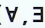

# 관계 대수의 확장 및 관계 해석

## 세미조인 및 외부조인 정의 및 사용방법

### 관계 대수의 확장 - 세미조인

- 
- 조인 애트리뷰트로 S를 프로덱트 한 결과를 R에 자연 조인시킨 것
- R과 S를 자연 조인한 결과에 R의 애트리뷰트로 프로젝트 한 것과 같음

> 세미조인의 의미 : S와의 자연조인에 참여할 수 있는 R의 튜플만 선택한 것

- 
- 
- 

### 관계 대수의 확장 - 외부조인

- 
- 조인 시 한 릴레이션에 있는 튜플이 조인할 상대 릴레이션에 대응되는 튜플이 없을 경우에 상대를 널(null) 튜플로 만들어 결과 릴레이션에 포함
- 두 릴레이션의 모든 튜플들이 결과 릴레이션에 나타남

#### 외부 조인의 종류

1. 좌측 외부조인
   - 오른쪽 릴레이션의 어떤 튜플과도 부합되지 않는 왼쪽 릴레이션 내의 모든 튜플을 취함
   - 튜플들의 오른쪽 릴레이션의 속성들을 널 값으로 채우고, 자연 조인의 결과에 이 튜플들 추가
   - 
   - 
2. 우측 외부조인
   - 좌측 외부조인과 대칭
3. 완전 외부조인
   - 좌측 + 우측 외부조인을 합친 결과
   - 
   - 
   - 

### 외부 합집합 (∪+)

- 합병 가능하지 않은 (부분적으로 합병 가능한) 두 릴레이션을 차수를 확장시켜 합집합으로 만든 것
- 
- 

### 관계 대수의 질의문 표현 예시

- 
- 

## 관계 대수와 관계 해석의 비교

### 관계 해석의 특징

- 원하는 정보가 무엇이라는 것(What)만 선언하는 비절차적임
- 관계 대수로 표현한 식은 관계 해석으로 표현할 수 있고 또 관계 해석으로 표현한 식은 관계대수로 표현가능
  - 일대일 대응관계가 성립
- 관계 해석은 원래 수학의 프레디킷 해석(predicatecalculus)에 기반을 두고 있으며 관계 데이터 모델의 창안자인 Codd가 특별히 관계 데이터베이스에 적용할 수 있도록 설계하여 제안
- 튜플 관계 해석과 도메인 관계 해석으로 구분

### 관계 대수와 관계 해석의 비교

- 

## 튜플관계 해석과 도메인 관계 해석

### 튜플 관계 해석

- 특징
  - 원하는 릴레이션을 튜플 해석식으로 정의
  - 연산 단위는 튜플이며 QUEL이 대표적인 DB접근 언어
  - 튜플 변수는 지정된 릴레이션의 튜플을 하나씩 그 값으로 취할 수 있는 변수
  - 정형식(WFF : Well-Formed Formula)이란?
    - 원자식
    - Boolea 연산자
      - 
    - 정량자가 결합된 식
      - 

#### 전체 정량자와 존재 정량자 사이의 변환 방법

1. 부정(NOT)을 사용하여 한 가지 유형의 정량자를 다른 유형으로 변환
2. AND와 OR를 서로 치환
3. 부정을 사용한 식은 부정을 없앰
4. 긍정의 식은 부정을 사용

- 
- 

#### 논리식

- 
- 

#### 튜플 해석식의 질의문 표현

- 
- 

### 도메인 관계 해석

- 특징
  - 사용자가 원하는 정보를 도메인 해석 식으로 표현하는 방법
  - 도메인 변수 사용
  - 도메인 변수
    - 언제 어느 때라도 지정된 애트리뷰트의 도메인의 한 원소만을 값으로 취하는 변수

#### 도메인 해석식의 질의문 표현

- 
